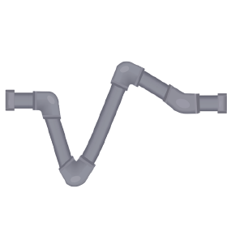

# SpikeInterface: a unified framework for spike sorting

Here the branch of the OLD API of spikeinterface when spikeinterface was a metapackage depending on

- [spikeextractors](https://github.com/SpikeInterface/spikeextractors): Data file I/O and probe handling. [](https://travis-ci.org/SpikeInterface/spikeextractors)
- [spiketoolkit](https://github.com/SpikeInterface/spiketoolkit): Toolkit for pre-processing, post-processing, validation, and automatic curation. [](https://travis-ci.org/SpikeInterface/spiketoolkit) 
- [spikesorters](https://github.com/SpikeInterface/spikesorters): Python wrappers to spike sorting algorithms. [](https://travis-ci.org/SpikeInterface/spikesorters) 
- [spikecomparison](https://github.com/SpikeInterface/spikecomparison): Comparison of spike sorting output (with and without ground-truth). [](https://travis-ci.org/SpikeInterface/spikecomparison) 
- [spikewidgets](https://github.com/SpikeInterface/spikewidgets): Data visualization widgets. [](https://travis-ci.org/SpikeInterface/spikewidgets) 

Now spikeinterface since v0.9.0 is a one unique package.

You can still use this branch for old API


```bash
git clone https://github.com/SpikeInterface/spikeinterface.git
cd spikeinterface
git checkout 0.1X_old_api
python setup.py install (or develop)
```

Then you can install the latest releases of the spikeinterface packages:

```bash
pip install --upgrade spikeextractors spiketoolkit spikesorters spikecomparison spikewidgets
```

You can also install the five packages from sources (e.g. for `spikeextractors`): 

```bash
git clone https://github.com/SpikeInterface/spikeextractors.git
cd spikeextractors
python setup.py install (or develop)
```
