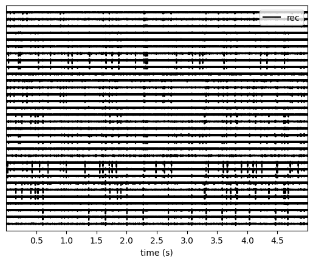
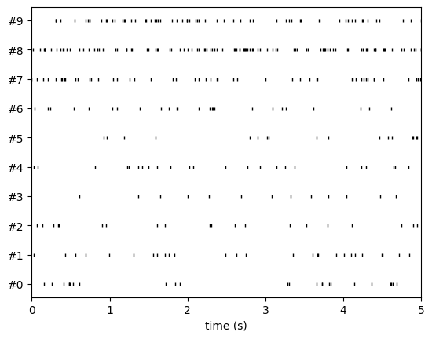
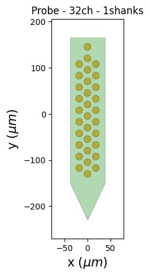
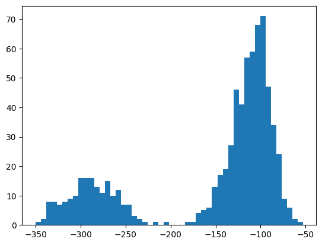
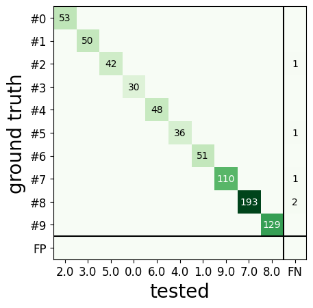
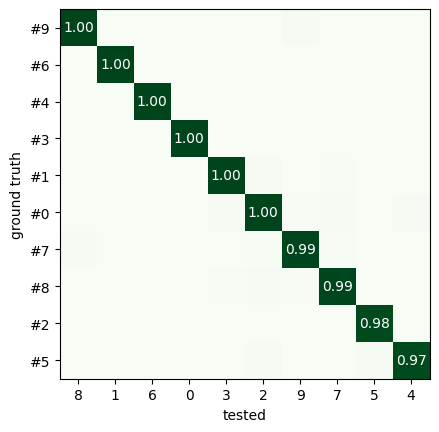
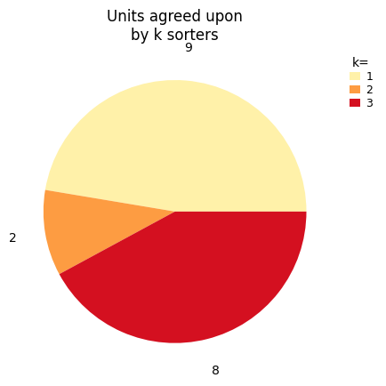
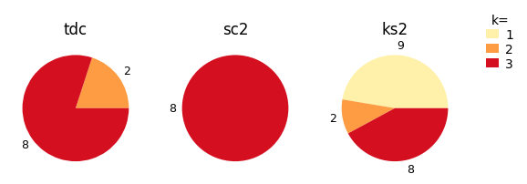

.. code:: ipython3

    %matplotlib inline

Quickstart tutorial
===================

In this introductory example, you will see how to use SpikeInterface to
perform a full electrophysiology analysis. We will download a simulated
dataset, and we will then perform some pre-processing, run a spike
sorting algorithm, post-process the spike sorting output, perform
curation (manual and automatic), and compare spike sorting results.

.. code:: ipython3

    import matplotlib.pyplot as plt
    from pprint import pprint

The spikeinterface module by itself imports only the spikeinterface.core
submodule which is not useful for the end user

.. code:: ipython3

    import spikeinterface

We need to import one by one different submodules separately
(preferred). There are several modules:

-  ``extractors`` : file IO
-  ``preprocessing`` : preprocessing
-  ``sorters`` : Python wrappers of spike sorters
-  ``postprocessing`` : postprocessing
-  ``qualitymetrics`` : quality metrics on units found by sorters
-  ``curation`` : automatic curation of spike sorting output
-  ``comparison`` : comparison of spike sorting outputs
-  ``widgets`` : visualization

.. code:: ipython3

    import spikeinterface as si  # import core only
    import spikeinterface.extractors as se
    import spikeinterface.preprocessing as spre
    import spikeinterface.sorters as ss
    import spikeinterface.postprocessing as spost
    import spikeinterface.qualitymetrics as sqm
    import spikeinterface.comparison as sc
    import spikeinterface.exporters as sexp
    import spikeinterface.curation as scur
    import spikeinterface.widgets as sw

Alternatively, we can import all submodules at once with
``import spikeinterface.full as si`` which internally imports
core+extractors+preprocessing+sorters+postprocessing+
qualitymetrics+comparison+widgets+exporters. In this case all aliases in
the following tutorial would be ``si``.

This is useful for notebooks, but it is a heavier import because
internally many more dependencies are imported
(scipy/sklearn/networkx/matplotlib/h5py…)

.. code:: ipython3

    import spikeinterface.full as si

Before getting started, we can set some global arguments for parallel
processing. For this example, let’s use 4 jobs and time chunks of 1s:

.. code:: ipython3

    global_job_kwargs = dict(n_jobs=4, chunk_duration="1s")
    si.set_global_job_kwargs(**global_job_kwargs)

First, let’s download a simulated dataset from the
https://gin.g-node.org/NeuralEnsemble/ephy_testing_data repo We download
the dataset using DataLad but it can also be downloaded directly.

Then we can open it. Note that
`MEArec <https://mearec.readthedocs.io%3E>`__ simulated files contain
both a “recording” and a “sorting” object.

.. code:: ipython3

    local_path = si.download_dataset(remote_path="mearec/mearec_test_10s.h5")
    recording, sorting_true = se.read_mearec(local_path)
    print(recording)
    print(sorting_true)

.. parsed-literal::

    MEArecRecordingExtractor: 32 channels - 32.0kHz - 1 segments - 320,000 samples - 10.00s
                              float32 dtype - 39.06 MiB
      file_path: /home/nolanlab/spikeinterface_datasets/ephy_testing_data/mearec/mearec_test_10s.h5
    MEArecSortingExtractor: 10 units - 1 segments - 32.0kHz
      file_path: /home/nolanlab/spikeinterface_datasets/ephy_testing_data/mearec/mearec_test_10s.h5

``recording`` is a ``BaseRecording`` object, which extracts information
about channel ids, channel locations (if present), the sampling
frequency of the recording, and the extracellular traces.
``sorting_true`` is a ``BaseSorting`` object, which contains information
about spike-sorting related information, including unit ids, spike
trains, etc. Since the data are simulated, ``sorting_true`` has
ground-truth information of the spiking activity of each unit.

Let’s use the ``spikeinterface.widgets`` module to visualize the traces
and the raster plots.

.. code:: ipython3

    w_ts = sw.plot_traces(recording, time_range=(0, 5))
    w_rs = sw.plot_rasters(sorting_true, time_range=(0, 5))

This is how you retrieve info from a ``BaseRecording``\ …

.. code:: ipython3

    channel_ids = recording.get_channel_ids()
    fs = recording.get_sampling_frequency()
    num_chan = recording.get_num_channels()
    num_seg = recording.get_num_segments()

    print("Channel ids:", channel_ids)
    print("Sampling frequency:", fs)
    print("Number of channels:", num_chan)
    print("Number of segments:", num_seg)

.. parsed-literal::

    Channel ids: ['1' '2' '3' '4' '5' '6' '7' '8' '9' '10' '11' '12' '13' '14' '15' '16'
     '17' '18' '19' '20' '21' '22' '23' '24' '25' '26' '27' '28' '29' '30'
     '31' '32']
    Sampling frequency: 32000.0
    Number of channels: 32
    Number of segments: 1

…and from a ``BaseSorting``

.. code:: ipython3

    num_seg = recording.get_num_segments()
    unit_ids = sorting_true.get_unit_ids()
    spike_train = sorting_true.get_unit_spike_train(unit_id=unit_ids[0])

    print("Number of segments:", num_seg)
    print("Unit ids:", unit_ids)
    print("Spike train of first unit:", spike_train)

.. parsed-literal::

    Number of segments: 1
    Unit ids: ['#0' '#1' '#2' '#3' '#4' '#5' '#6' '#7' '#8' '#9']
    Spike train of first unit: [  5197   8413  13124  15420  15497  15668  16929  19607  55107  59060
      60958 105193 105569 117082 119243 119326 122293 122877 132413 139498
     147402 147682 148271 149857 165454 170569 174319 176237 183598 192278
     201535 217193 219715 221226 222967 223897 225338 243206 243775 248754
     253184 253308 265132 266197 266662 283149 284716 287592 304025 305286
     310438 310775 318460]

SpikeInterface internally uses the
`ProbeInterface <https://probeinterface.readthedocs.io/en/main/>`__
package to handle ``probeinterface.Probe`` and
``probeinterface.ProbeGroup``. So any probe in the probeinterface
collection can be downloaded and set to a ``Recording`` object. In this
case, the MEArec dataset already handles a ``Probe`` and we don’t need
to set it *manually*.

.. code:: ipython3

    probe = recording.get_probe()
    print(probe)

    from probeinterface.plotting import plot_probe

    _ = plot_probe(probe)

.. parsed-literal::

    Probe - 32ch - 1shanks

If your recording does not have a ``Probe``, you can set it using
``set_probe``. Note: ``set_probe`` creates a copy of the recording with
the new probe, rather than modifying the existing recording in place.
There is more information
`here <https://spikeinterface.readthedocs.io/en/latest/modules_gallery/core/plot_3_handle_probe_info.html>`__.

Using the ``spikeinterface.preprocessing`` module, you can perform
preprocessing on the recordings. Each pre-processing function also
returns a ``BaseRecording``, which makes it easy to build pipelines.
Here, we filter the recording and apply common median reference (CMR).
All these preprocessing steps are “lazy”. The computation is done on
demand when we call ``recording.get_traces(...)`` or when we save the
object to disk.

.. code:: ipython3

    recording_cmr = recording
    recording_f = si.bandpass_filter(recording, freq_min=300, freq_max=6000)
    print(recording_f)
    recording_cmr = si.common_reference(recording_f, reference="global", operator="median")
    print(recording_cmr)

    # this computes and saves the recording after applying the preprocessing chain
    recording_preprocessed = recording_cmr.save(format="binary")
    print(recording_preprocessed)

.. parsed-literal::

    BandpassFilterRecording: 32 channels - 32.0kHz - 1 segments - 320,000 samples - 10.00s
                             float32 dtype - 39.06 MiB
    CommonReferenceRecording: 32 channels - 32.0kHz - 1 segments - 320,000 samples - 10.00s
                              float32 dtype - 39.06 MiB
    Use cache_folder=/tmp/spikeinterface_cache/tmpru22r5_r/GW132ZJO
    write_binary_recording with n_jobs = 4 and chunk_size = 32000

.. parsed-literal::

    write_binary_recording:   0%|          | 0/10 [00:00<?, ?it/s]

.. parsed-literal::

    BinaryFolderRecording: 32 channels - 32.0kHz - 1 segments - 320,000 samples - 10.00s
                           float32 dtype - 39.06 MiB

To reload a preprocessed recording that was saved to disk, you can use
``load_extractor()`` function from the ``core`` module.

Now you are ready to spike sort using the ``spikeinterface.sorters``
module! Let’s first check which sorters are implemented and which are
installed

.. code:: ipython3

    print("Available sorters", ss.available_sorters())
    print("Installed sorters", ss.installed_sorters())

.. parsed-literal::

    Available sorters ['combinato', 'hdsort', 'herdingspikes', 'ironclust', 'kilosort', 'kilosort2', 'kilosort2_5', 'kilosort3', 'kilosort4', 'klusta', 'mountainsort4', 'mountainsort5', 'pykilosort', 'simple', 'spykingcircus', 'spykingcircus2', 'tridesclous', 'tridesclous2', 'waveclus', 'waveclus_snippets', 'yass']
    Installed sorters ['mountainsort4', 'simple', 'spykingcircus2', 'tridesclous', 'tridesclous2']

The ``ss.installed_sorters()`` will list the sorters installed on the
machine. We can see we have HerdingSpikes and Tridesclous installed.
Spike sorters come with a set of parameters that users can change. The
available parameters are dictionaries and can be accessed with:

.. code:: ipython3

    print("Tridesclous params:")
    pprint(ss.get_default_sorter_params("tridesclous"))
    print("SpykingCircus2 params:")
    pprint(ss.get_default_sorter_params("spykingcircus2"))

.. parsed-literal::

    Tridesclous params:
    {'chunk_duration': '1s',
     'common_ref_removal': False,
     'detect_sign': -1,
     'detect_threshold': 5,
     'freq_max': 5000.0,
     'freq_min': 400.0,
     'max_threads_per_process': 1,
     'mp_context': None,
     'n_jobs': 20,
     'nested_params': None,
     'progress_bar': True}
    SpykingCircus2 params:
    {'apply_preprocessing': True,
     'cache_preprocessing': {'delete_cache': True,
                             'memory_limit': 0.5,
                             'mode': 'memory'},
     'clustering': {'legacy': False},
     'debug': False,
     'detection': {'detect_threshold': 4, 'peak_sign': 'neg'},
     'filtering': {'freq_min': 150},
     'general': {'ms_after': 2, 'ms_before': 2, 'radius_um': 100},
     'job_kwargs': {'n_jobs': 0.8},
     'matching': {'method': 'circus-omp-svd'},
     'multi_units_only': False,
     'selection': {'method': 'smart_sampling_amplitudes',
                   'min_n_peaks': 100000,
                   'n_peaks_per_channel': 5000,
                   'seed': 42,
                   'select_per_channel': False},
     'sparsity': {'method': 'ptp', 'threshold': 0.25}}

Let’s run ``tridesclous`` and change one of the parameters, say, the
``detect_threshold``:

.. code:: ipython3

    sorting_TDC = ss.run_sorter(sorter_name="tridesclous", recording=recording_preprocessed, detect_threshold=4)
    print(sorting_TDC)

.. parsed-literal::

    TridesclousSortingExtractor: 10 units - 1 segments - 32.0kHz

Alternatively we can pass a full dictionary containing the parameters:

.. code:: ipython3

    other_params = ss.get_default_sorter_params("tridesclous")
    other_params["detect_threshold"] = 6

    # parameters set by params dictionary
    sorting_TDC_2 = ss.run_sorter(
        sorter_name="tridesclous", recording=recording_preprocessed, output_folder="tdc_output2", **other_params
    )
    print(sorting_TDC_2)

.. parsed-literal::

    TridesclousSortingExtractor: 9 units - 1 segments - 32.0kHz

Let’s run ``spykingcircus2`` as well, with default parameters:

.. code:: ipython3

    sorting_SC2 = ss.run_sorter(sorter_name="spykingcircus2", recording=recording_preprocessed)
    print(sorting_SC2)

.. parsed-literal::

    write_memory_recording:   0%|          | 0/1 [00:00<?, ?it/s]

.. parsed-literal::

    NumpyFolderSorting: 8 units - 1 segments - 32.0kHz

The ``sorting_TDC`` and ``sorting_SC2`` are ``BaseSorting`` objects. We
can print the units found using:

.. code:: ipython3

    print("Units found by tridesclous:", sorting_TDC.get_unit_ids())
    print("Units found by spyking-circus2:", sorting_SC2.get_unit_ids())

.. parsed-literal::

    Units found by tridesclous: [0 1 2 3 4 5 6 7 8 9]
    Units found by spyking-circus2: [0 1 2 3 4 5 6 7]

If a sorter is not installed locally, we can also avoid installing it
and run it anyways, using a container (Docker or Singularity). To do
this, you will need to install Docker. More information
`here <https://spikeinterface.readthedocs.io/en/latest/modules/sorters.html?highlight=docker#running-sorters-in-docker-singularity-containers>`__.
Let’s run ``Kilosort2`` using Docker:

.. code:: ipython3

    sorting_KS2 = ss.run_sorter(sorter_name="kilosort2", recording=recording_preprocessed, docker_image=True, verbose=True)
    print(sorting_KS2)

.. parsed-literal::

    installation_mode='auto' switching to installation_mode: 'dev'
    Starting container
    Installing spikeinterface with folder in container
    Installing neo with pypi in container
    Installing mearec with pypi in container
    Running kilosort2 sorter inside spikeinterface/kilosort2-compiled-base
    Stopping container
    KiloSortSortingExtractor: 19 units - 1 segments - 32.0kHz

For postprocessing SpikeInterface pairs recording and sorting objects
into a ``SortingAnalyzer`` object. The ``SortingAnalyzer`` can be loaded
in memory or saved in a folder. Here, we save it in binary format.

.. code:: ipython3

    analyzer_TDC = si.create_sorting_analyzer(sorting=sorting_TDC, recording=recording_preprocessed, format='binary_folder', folder='analyzer_TDC_binary')

.. parsed-literal::

    estimate_sparsity:   0%|          | 0/10 [00:00<?, ?it/s]

This folder is where all the postprocessing data will be saved such as
waveforms and templates. Let’s calculate some waveforms. When doing
this, the function samples some spikes (by default
``max_spikes_per_unit=500``) for each unit, extracts their waveforms,
and stores them to disk in
``./analyzer_TDC_binary/extensions/waveforms``. These waveforms are
helpful to compute the average waveform, or “template”, for each unit
and then to compute, for example, quality metrics. Computations with the
``SortingAnalyzer`` object are done using the ``compute`` method:

.. code:: ipython3

    analyzer_TDC.compute("random_spikes")
    analyzer_TDC.compute("waveforms")

.. parsed-literal::

    compute_waveforms:   0%|          | 0/10 [00:00<?, ?it/s]

.. parsed-literal::

    <spikeinterface.core.analyzer_extension_core.ComputeWaveforms at 0x7fb4f53b5370>

The results of these calculations are saved as ``extensions``. Some
simple data, such as the ``unit_ids`` can be accessed directly from the
``SortingAnalyzer`` object. Extension data is accessed by first getting
the extension then getting the data

.. code:: ipython3

    unit_id0 = analyzer_TDC.unit_ids[0]
    waveforms = analyzer_TDC.get_extension("waveforms").get_data()[unit_id0]
    print(waveforms.shape)

.. parsed-literal::

    (96, 25)

There are many more properties we can calculate

.. code:: ipython3

    analyzer_TDC.compute("noise_levels")
    analyzer_TDC.compute("templates")
    analyzer_TDC.compute("spike_amplitudes")

.. parsed-literal::

    spike_amplitudes:   0%|          | 0/10 [00:00<?, ?it/s]

.. parsed-literal::

    <spikeinterface.postprocessing.spike_amplitudes.ComputeSpikeAmplitudes at 0x7fb50b4c0700>

Many of the extensions have parameters you can tune

.. code:: ipython3

    analyzer_TDC.compute("unit_locations", method="center_of_mass")
    analyzer_TDC.compute("spike_locations", ms_before=0.5)
    analyzer_TDC.compute("correlograms", bin_ms=0.1)
    analyzer_TDC.compute("template_similarity", method="cosine_similarity")

.. parsed-literal::

    spike_locations:   0%|          | 0/10 [00:00<?, ?it/s]

.. parsed-literal::

    <spikeinterface.postprocessing.template_similarity.ComputeTemplateSimilarity at 0x7fb4f546d640>

As you can see, it becomes a bit overwhelming if you’re computing lots of extensions.
Luckily, there’s some nice syntax for this very situation. We can redo the last
nine compute statements in one command as follows

.. code:: ipython3

    extensions_to_compute = [
        "random_spikes",
        "waveforms",
        "noise_levels",
        "templates",
        "spike_amplitudes",
        "unit_locations",
        "spike_locations",
        "correlograms",
        "template_similarity"
    ]

    extension_params = {
        "unit_locations": {"method": "center_of_mass"},
        "spike_locations": {"ms_before": 0.1},
        "correlograms": {"bin_ms": 0.1},
        "template_similarity": {"method": "cosine_similarity"}
    }

    analyzer_TDC.compute(extensions_to_compute, extension_params=extension_params)

Which you might find easier. Note that if we pass no extension parameters, the
computation simply uses the default parameters.

Find out more about the available parameters and extensions
`here <https://spikeinterface.readthedocs.io/en/latest/modules/postprocessing.html>`__.

The calculations are saved in the ``extensions`` subfolder of the
``SortingAnalyzer`` folder. Similar to the waveforms we can access them
using ``get_extension`` and ``get_data``. For example, here we can make
a historgram of spike amplitudes

.. code:: ipython3

    amplitudes = analyzer_TDC.get_extension("spike_amplitudes").get_data()
    plt.hist(amplitudes, bins=50)
    plt.show()

You can check which extensions have been saved (in your local folder)
and which have been loaded (in your enviroment)…

.. code:: ipython3

    print(analyzer_TDC.get_saved_extension_names())
    print(analyzer_TDC.get_loaded_extension_names())

.. parsed-literal::

    ['noise_levels', 'spike_locations', 'template_similarity', 'waveforms', 'spike_amplitudes', 'templates', 'correlograms', 'unit_locations', 'random_spikes']
    ['random_spikes', 'waveforms', 'noise_levels', 'templates', 'spike_amplitudes', 'unit_locations', 'spike_locations', 'correlograms', 'template_similarity']

…or delete an extension…

.. code:: ipython3

    analyzer_TDC.delete_extension("spike_amplitudes")

This deletes the extension’s data in the ``SortingAnalyzer`` folder.

Importantly, ``SortingAnalyzers`` (and all extensions) can be reloaded
at later times from their folders: (Here, spike_amplitudes is not loaded
since we just deleted it)

.. code:: ipython3

    sorting_analyzer_path = './analyzer_TDC_binary'
    analyzer_loaded = si.load_sorting_analyzer(sorting_analyzer_path)
    print(analyzer_loaded.get_loaded_extension_names())

.. parsed-literal::

    ['noise_levels', 'templates', 'spike_locations', 'template_similarity', 'waveforms', 'correlograms', 'unit_locations', 'random_spikes']

And any deleted extensions are easily recomputed

.. code:: ipython3

    analyzer_TDC.compute("spike_amplitudes")

.. parsed-literal::

    spike_amplitudes:   0%|          | 0/10 [00:00<?, ?it/s]

.. parsed-literal::

    <spikeinterface.postprocessing.spike_amplitudes.ComputeSpikeAmplitudes at 0x7fb4f457f520>

Once we have computed all of the postprocessing information, we can
compute quality metrics (some quality metrics require certain extensions
- e.g., drift metrics require ``spike_locations``):

.. code:: ipython3

    qm_params = sqm.get_default_qm_params()
    pprint(qm_params)

.. parsed-literal::

    {'amplitude_cutoff': {'amplitudes_bins_min_ratio': 5,
                          'histogram_smoothing_value': 3,
                          'num_histogram_bins': 100,
                          'peak_sign': 'neg'},
     'amplitude_cv': {'amplitude_extension': 'spike_amplitudes',
                      'average_num_spikes_per_bin': 50,
                      'min_num_bins': 10,
                      'percentiles': (5, 95)},
     'amplitude_median': {'peak_sign': 'neg'},
     'drift': {'direction': 'y',
               'interval_s': 60,
               'min_num_bins': 2,
               'min_spikes_per_interval': 100},
     'firing_range': {'bin_size_s': 5, 'percentiles': (5, 95)},
     'isi_violation': {'isi_threshold_ms': 1.5, 'min_isi_ms': 0},
     'nearest_neighbor': {'max_spikes': 10000, 'n_neighbors': 5},
     'nn_isolation': {'max_spikes': 10000,
                      'min_fr': 0.0,
                      'min_spikes': 10,
                      'n_components': 10,
                      'n_neighbors': 4,
                      'peak_sign': 'neg',
                      'radius_um': 100},
     'nn_noise_overlap': {'max_spikes': 10000,
                          'min_fr': 0.0,
                          'min_spikes': 10,
                          'n_components': 10,
                          'n_neighbors': 4,
                          'peak_sign': 'neg',
                          'radius_um': 100},
     'presence_ratio': {'bin_duration_s': 60, 'mean_fr_ratio_thresh': 0.0},
     'rp_violation': {'censored_period_ms': 0.0, 'refractory_period_ms': 1.0},
     'silhouette': {'method': ('simplified',)},
     'sliding_rp_violation': {'bin_size_ms': 0.25,
                              'contamination_values': None,
                              'exclude_ref_period_below_ms': 0.5,
                              'max_ref_period_ms': 10,
                              'min_spikes': 0,
                              'window_size_s': 1},
     'snr': {'peak_mode': 'extremum', 'peak_sign': 'neg'},
     'synchrony': {'synchrony_sizes': (2, 4, 8)}}

Since the recording is very short, let’s change some parameters to
accommodate the duration:

.. code:: ipython3

    qm_params["presence_ratio"]["bin_duration_s"] = 1
    qm_params["amplitude_cutoff"]["num_histogram_bins"] = 5
    qm_params["drift"]["interval_s"] = 2
    qm_params["drift"]["min_spikes_per_interval"] = 2

Quality metrics are extensions, so computations and data extraction work
in the same way as earlier

.. code:: ipython3

    analyzer_TDC.compute("quality_metrics", qm_params)
    analyzer_TDC.get_extension("quality_metrics").get_data()

.. parsed-literal::

    /home/nolanlab/Chris/Developing/spikeinterface/src/spikeinterface/qualitymetrics/misc_metrics.py:880: UserWarning: Some units have too few spikes : amplitude_cutoff is set to NaN
      warnings.warn(f"Some units have too few spikes : amplitude_cutoff is set to NaN")
    /home/nolanlab/Chris/Developing/spikeinterface/src/spikeinterface/qualitymetrics/misc_metrics.py:1033: UserWarning: The recording is too short given the specified 'interval_s' and 'min_num_bins'. Drift metrics will be set to NaN
      warnings.warn(
    /home/nolanlab/Chris/Developing/spikeinterface/src/spikeinterface/qualitymetrics/misc_metrics.py:147: UserWarning: Bin duration of 60s is larger than recording duration. Presence ratios are set to NaN.
      warnings.warn(

.. raw:: html

    

    
    <table border="1" class="dataframe">
      <thead>
        <tr style="text-align: right;">
          <th></th>
          <th>amplitude_cutoff</th>
          <th>amplitude_cv_median</th>
          <th>amplitude_cv_range</th>
          <th>amplitude_median</th>
          <th>drift_ptp</th>
          <th>drift_std</th>
          <th>drift_mad</th>
          <th>firing_range</th>
          <th>firing_rate</th>
          <th>isi_violations_ratio</th>
          <th>...</th>
          <th>num_spikes</th>
          <th>presence_ratio</th>
          <th>rp_contamination</th>
          <th>rp_violations</th>
          <th>sd_ratio</th>
          <th>sliding_rp_violation</th>
          <th>snr</th>
          <th>sync_spike_2</th>
          <th>sync_spike_4</th>
          <th>sync_spike_8</th>
        </tr>
      </thead>
      <tbody>
        <tr>
          <th>0</th>
          <td>NaN</td>
          <td>NaN</td>
          <td>NaN</td>
          <td>-306.199036</td>
          <td>NaN</td>
          <td>NaN</td>
          <td>NaN</td>
          <td>0.72</td>
          <td>3.0</td>
          <td>0.0</td>
          <td>...</td>
          <td>30.0</td>
          <td>NaN</td>
          <td>0.0</td>
          <td>0.0</td>
          <td>1.536918</td>
          <td>NaN</td>
          <td>26.995409</td>
          <td>0.0</td>
          <td>0.0</td>
          <td>0.0</td>
        </tr>
        <tr>
          <th>1</th>
          <td>NaN</td>
          <td>NaN</td>
          <td>NaN</td>
          <td>-273.444977</td>
          <td>NaN</td>
          <td>NaN</td>
          <td>NaN</td>
          <td>0.18</td>
          <td>5.1</td>
          <td>0.0</td>
          <td>...</td>
          <td>51.0</td>
          <td>NaN</td>
          <td>0.0</td>
          <td>0.0</td>
          <td>1.311148</td>
          <td>NaN</td>
          <td>24.007496</td>
          <td>0.0</td>
          <td>0.0</td>
          <td>0.0</td>
        </tr>
        <tr>
          <th>2</th>
          <td>NaN</td>
          <td>NaN</td>
          <td>NaN</td>
          <td>-269.204590</td>
          <td>NaN</td>
          <td>NaN</td>
          <td>NaN</td>
          <td>0.90</td>
          <td>5.3</td>
          <td>0.0</td>
          <td>...</td>
          <td>53.0</td>
          <td>NaN</td>
          <td>0.0</td>
          <td>0.0</td>
          <td>2.016703</td>
          <td>NaN</td>
          <td>24.002202</td>
          <td>0.0</td>
          <td>0.0</td>
          <td>0.0</td>
        </tr>
        <tr>
          <th>3</th>
          <td>NaN</td>
          <td>NaN</td>
          <td>NaN</td>
          <td>-311.545715</td>
          <td>NaN</td>
          <td>NaN</td>
          <td>NaN</td>
          <td>0.72</td>
          <td>5.0</td>
          <td>0.0</td>
          <td>...</td>
          <td>50.0</td>
          <td>NaN</td>
          <td>0.0</td>
          <td>0.0</td>
          <td>2.011083</td>
          <td>NaN</td>
          <td>26.794354</td>
          <td>0.0</td>
          <td>0.0</td>
          <td>0.0</td>
        </tr>
        <tr>
          <th>4</th>
          <td>NaN</td>
          <td>NaN</td>
          <td>NaN</td>
          <td>-106.953278</td>
          <td>NaN</td>
          <td>NaN</td>
          <td>NaN</td>
          <td>0.72</td>
          <td>3.6</td>
          <td>0.0</td>
          <td>...</td>
          <td>36.0</td>
          <td>NaN</td>
          <td>0.0</td>
          <td>0.0</td>
          <td>0.680199</td>
          <td>NaN</td>
          <td>9.588057</td>
          <td>0.0</td>
          <td>0.0</td>
          <td>0.0</td>
        </tr>
        <tr>
          <th>5</th>
          <td>NaN</td>
          <td>NaN</td>
          <td>NaN</td>
          <td>-150.833191</td>
          <td>NaN</td>
          <td>NaN</td>
          <td>NaN</td>
          <td>0.36</td>
          <td>4.2</td>
          <td>0.0</td>
          <td>...</td>
          <td>42.0</td>
          <td>NaN</td>
          <td>0.0</td>
          <td>0.0</td>
          <td>0.965515</td>
          <td>NaN</td>
          <td>13.057643</td>
          <td>0.0</td>
          <td>0.0</td>
          <td>0.0</td>
        </tr>
        <tr>
          <th>6</th>
          <td>NaN</td>
          <td>NaN</td>
          <td>NaN</td>
          <td>-90.358444</td>
          <td>NaN</td>
          <td>NaN</td>
          <td>NaN</td>
          <td>0.00</td>
          <td>4.8</td>
          <td>0.0</td>
          <td>...</td>
          <td>48.0</td>
          <td>NaN</td>
          <td>0.0</td>
          <td>0.0</td>
          <td>1.177009</td>
          <td>NaN</td>
          <td>8.210516</td>
          <td>0.0</td>
          <td>0.0</td>
          <td>0.0</td>
        </tr>
        <tr>
          <th>7</th>
          <td>NaN</td>
          <td>NaN</td>
          <td>NaN</td>
          <td>-102.491577</td>
          <td>NaN</td>
          <td>NaN</td>
          <td>NaN</td>
          <td>2.34</td>
          <td>19.3</td>
          <td>0.0</td>
          <td>...</td>
          <td>193.0</td>
          <td>NaN</td>
          <td>0.0</td>
          <td>0.0</td>
          <td>0.974259</td>
          <td>0.155</td>
          <td>8.785389</td>
          <td>0.0</td>
          <td>0.0</td>
          <td>0.0</td>
        </tr>
        <tr>
          <th>8</th>
          <td>NaN</td>
          <td>NaN</td>
          <td>NaN</td>
          <td>-127.252319</td>
          <td>NaN</td>
          <td>NaN</td>
          <td>NaN</td>
          <td>0.90</td>
          <td>12.9</td>
          <td>0.0</td>
          <td>...</td>
          <td>129.0</td>
          <td>NaN</td>
          <td>0.0</td>
          <td>0.0</td>
          <td>0.949695</td>
          <td>0.310</td>
          <td>11.064464</td>
          <td>0.0</td>
          <td>0.0</td>
          <td>0.0</td>
        </tr>
        <tr>
          <th>9</th>
          <td>NaN</td>
          <td>NaN</td>
          <td>NaN</td>
          <td>-97.207291</td>
          <td>NaN</td>
          <td>NaN</td>
          <td>NaN</td>
          <td>2.16</td>
          <td>11.0</td>
          <td>0.0</td>
          <td>...</td>
          <td>110.0</td>
          <td>NaN</td>
          <td>0.0</td>
          <td>0.0</td>
          <td>1.027925</td>
          <td>0.270</td>
          <td>8.229249</td>
          <td>0.0</td>
          <td>0.0</td>
          <td>0.0</td>
        </tr>
      </tbody>
    </table>
    
10 rows × 21 columns

    

And since the quality metrics are extensions, they are saved
``SortingAnalyzer`` folder.

Now, we can use some of the powerful tools for spike sorting
visualization.

We can export a sorting summary and quality metrics plot using the
``sortingview`` backend. This will generate shareable links for
web-based visualization. For this to work you need to install
``sortingview`` and construct a ``kachery-cloud``:
`https://github.com/magland/sortingview <more%20details>`__.

.. code:: ipython3

    w1 = sw.plot_quality_metrics(analyzer_TDC, display=False, backend="sortingview")

https://figurl.org/f?v=npm://@fi-sci/figurl-sortingview@12/dist&d=sha1://dee4b56654e411ddd15e7cc8af763d5796c5140a

.. code:: ipython3

    w2 = sw.plot_sorting_summary(analyzer_TDC, display=False, curation=True, backend="sortingview")

https://figurl.org/f?v=npm://@fi-sci/figurl-sortingview@12/dist&d=sha1://588f5c77f7f1f445addcc219c648213d5324b123

The sorting summary plot can also be used for manual labeling and
curation. In the example above, we manually merged two units (0, 4) and
added accept labels (2, 6, 7). After applying our curation, we can click
on the “Save as snapshot (sha://)” and copy the URI:

.. code:: ipython3

    uri = "sha1://68cb54a9aaed2303fb82dedbc302c853e818f1b6"

    sorting_curated_sv = scur.apply_sortingview_curation(sorting_TDC, uri_or_json=uri)
    print(sorting_curated_sv)
    print(sorting_curated_sv.get_property("accept"))

.. parsed-literal::

    MergeUnitsSorting: 9 units - 1 segments - 32.0kHz
    [False  True False False  True  True False False False]

Alternatively, we can export the data locally to Phy.
`Phy <https://github.com/cortex-lab/phy>`__ is a GUI for manual curation
of the spike sorting output. To export to phy you can run:

.. code:: ipython3

    sexp.export_to_phy(analyzer_TDC, "phy_folder_for_TDC", verbose=True)

.. parsed-literal::

    write_binary_recording:   0%|          | 0/10 [00:00<?, ?it/s]

.. parsed-literal::

    Fitting PCA:   0%|          | 0/10 [00:00<?, ?it/s]

.. parsed-literal::

    Projecting waveforms:   0%|          | 0/10 [00:00<?, ?it/s]

.. parsed-literal::

    extract PCs:   0%|          | 0/10 [00:00<?, ?it/s]

.. parsed-literal::

    Run:
    phy template-gui  /home/nolanlab/Dropbox/Spike/testing_docs/phy_folder_for_TDC/params.py

Then you can run the template-gui with:
``phy template-gui phy_folder_for_TDC/params.py`` and manually curate
the results.

After curating with Phy, the curated sorting can be reloaded to
SpikeInterface. In this case, we exclude the units that have been
labeled as “noise”:

.. code:: ipython3

    sorting_curated_phy = se.read_phy("phy_folder_for_TDC", exclude_cluster_groups=["noise"])

Quality metrics can be also used to automatically curate the spike
sorting output. For example, you can select sorted units with a SNR
above a certain threshold:

.. code:: ipython3

    qm_data = analyzer_TDC.get_extension("quality_metrics").get_data()
    keep_mask = (qm_data["snr"] > 10) & (qm_data["isi_violations_ratio"] < 0.01)
    print("Mask:", keep_mask.values)

    sorting_curated_auto = sorting_TDC.select_units(sorting_TDC.unit_ids[keep_mask])
    print(sorting_curated_auto)

.. parsed-literal::

    Mask: [ True  True  True  True False  True False False  True False]
    UnitsSelectionSorting: 6 units - 1 segments - 32.0kHz

The final part of this tutorial deals with comparing spike sorting
outputs. We can either:

1. compare the spike sorting results with the ground-truth sorting
   ``sorting_true``

2. compare the output of two sorters (e.g. Tridesclous and
   SpykingCircus2)

3. compare the output of multiple sorters (e.g. Tridesclous,
   SpykingCircus2, and Kilosort2)

.. code:: ipython3

    comp_gt = sc.compare_sorter_to_ground_truth(gt_sorting=sorting_true, tested_sorting=sorting_TDC)
    comp_pair = sc.compare_two_sorters(sorting1=sorting_TDC, sorting2=sorting_SC2)
    comp_multi = sc.compare_multiple_sorters(
        sorting_list=[sorting_TDC, sorting_SC2, sorting_KS2], name_list=["tdc", "sc2", "ks2"]
    )

When comparing with a ground-truth sorting (1,), you can get the sorting
performance and plot a confusion matrix

.. code:: ipython3

    print(comp_gt.get_performance())
    w_conf = sw.plot_confusion_matrix(comp_gt)
    w_agr = sw.plot_agreement_matrix(comp_gt)

.. parsed-literal::

                accuracy    recall precision false_discovery_rate miss_rate
    gt_unit_id
    #0               1.0       1.0       1.0                  0.0       0.0
    #1               1.0       1.0       1.0                  0.0       0.0
    #2          0.976744  0.976744       1.0                  0.0  0.023256
    #3               1.0       1.0       1.0                  0.0       0.0
    #4               1.0       1.0       1.0                  0.0       0.0
    #5          0.972973  0.972973       1.0                  0.0  0.027027
    #6               1.0       1.0       1.0                  0.0       0.0
    #7          0.990991  0.990991       1.0                  0.0  0.009009
    #8          0.989744  0.989744       1.0                  0.0  0.010256
    #9               1.0       1.0       1.0                  0.0       0.0

When comparing two sorters (2.), we can see the matching of units
between sorters. Units which are not matched have -1 as their unit id:

.. code:: ipython3

    comp_pair.hungarian_match_12

.. parsed-literal::

    0    0.0
    1    1.0
    2    2.0
    3    3.0
    4   -1.0
    5   -1.0
    6    4.0
    7    6.0
    8    7.0
    9    5.0
    dtype: float64

or the reverse:

.. code:: ipython3

    comp_pair.hungarian_match_21

.. parsed-literal::

    0    0.0
    1    1.0
    2    2.0
    3    3.0
    4    6.0
    5    9.0
    6    7.0
    7    8.0
    dtype: float64

When comparing multiple sorters (3.), you can extract a ``BaseSorting``
object with units in agreement between sorters. You can also plot a
graph showing how the units are matched between the sorters.

.. code:: ipython3

    sorting_agreement = comp_multi.get_agreement_sorting(minimum_agreement_count=2)

    print("Units in agreement between TDC, SC2, and KS2:", sorting_agreement.get_unit_ids())

    w_multi = sw.plot_multicomparison_agreement(comp_multi)
    w_multi = sw.plot_multicomparison_agreement_by_sorter(comp_multi)

.. parsed-literal::

    Units in agreement between TDC, SC2, and KS2: [0 1 2 3 4 5 6 7 8 9]

We see that 10 unit were found by all sorters (note that this simulated
dataset is a very simple example, and usually sorters do not do such a
great job)!

However, Kilosort2 found 9 additional units that are not matched to
ground-truth!

**That’s all for this “How to get started” tutorial! Enjoy
SpikeInterface!**
