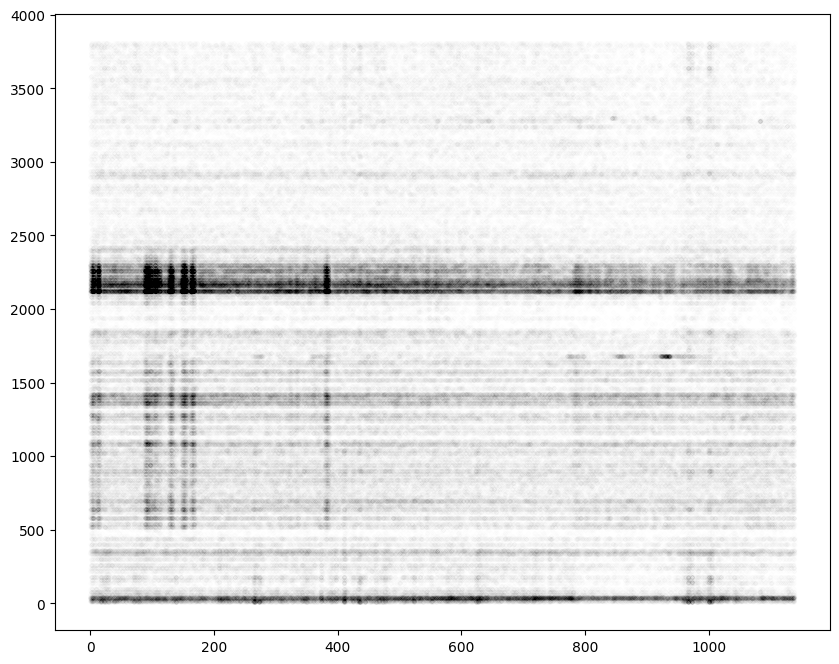

Analyze Neuropixels datasets
============================

This example shows how to perform Neuropixels-specific analysis,
including custom pre- and post-processing.

.. code:: ipython3

    %matplotlib inline

.. code:: ipython3

    import spikeinterface.full as si

    import numpy as np
    import matplotlib.pyplot as plt
    from pathlib import Path

.. code:: ipython3

    base_folder = Path('/mnt/data/sam/DataSpikeSorting/howto_si/neuropixel_example/')

    spikeglx_folder = base_folder / 'Rec_1_10_11_2021_g0'

Read the data
-------------

The ``SpikeGLX`` folder can contain several “streams” (AP, LF and NIDQ).
We need to specify which one to read:

.. code:: ipython3

    stream_names, stream_ids = si.get_neo_streams('spikeglx', spikeglx_folder)
    stream_names

.. parsed-literal::

    ['imec0.ap', 'nidq', 'imec0.lf']

.. code:: ipython3

    # we do not load the sync channel, so the probe is automatically loaded
    raw_rec = si.read_spikeglx(spikeglx_folder, stream_name='imec0.ap', load_sync_channel=False)
    raw_rec

.. parsed-literal::

    SpikeGLXRecordingExtractor: 384 channels - 30.0kHz - 1 segments - 34,145,070 samples
                                1,138.15s (18.97 minutes) - int16 dtype - 24.42 GiB

.. code:: ipython3

    # we automaticaly have the probe loaded!
    raw_rec.get_probe().to_dataframe()

.. raw:: html

    

    
    <table border="1" class="dataframe">
      <thead>
        <tr style="text-align: right;">
          <th></th>
          <th>x</th>
          <th>y</th>
          <th>contact_shapes</th>
          <th>width</th>
          <th>shank_ids</th>
          <th>contact_ids</th>
        </tr>
      </thead>
      <tbody>
        <tr>
          <th>0</th>
          <td>16.0</td>
          <td>0.0</td>
          <td>square</td>
          <td>12.0</td>
          <td></td>
          <td>e0</td>
        </tr>
        <tr>
          <th>1</th>
          <td>48.0</td>
          <td>0.0</td>
          <td>square</td>
          <td>12.0</td>
          <td></td>
          <td>e1</td>
        </tr>
        <tr>
          <th>2</th>
          <td>0.0</td>
          <td>20.0</td>
          <td>square</td>
          <td>12.0</td>
          <td></td>
          <td>e2</td>
        </tr>
        <tr>
          <th>3</th>
          <td>32.0</td>
          <td>20.0</td>
          <td>square</td>
          <td>12.0</td>
          <td></td>
          <td>e3</td>
        </tr>
        <tr>
          <th>4</th>
          <td>16.0</td>
          <td>40.0</td>
          <td>square</td>
          <td>12.0</td>
          <td></td>
          <td>e4</td>
        </tr>
        <tr>
          <th>...</th>
          <td>...</td>
          <td>...</td>
          <td>...</td>
          <td>...</td>
          <td>...</td>
          <td>...</td>
        </tr>
        <tr>
          <th>379</th>
          <td>32.0</td>
          <td>3780.0</td>
          <td>square</td>
          <td>12.0</td>
          <td></td>
          <td>e379</td>
        </tr>
        <tr>
          <th>380</th>
          <td>16.0</td>
          <td>3800.0</td>
          <td>square</td>
          <td>12.0</td>
          <td></td>
          <td>e380</td>
        </tr>
        <tr>
          <th>381</th>
          <td>48.0</td>
          <td>3800.0</td>
          <td>square</td>
          <td>12.0</td>
          <td></td>
          <td>e381</td>
        </tr>
        <tr>
          <th>382</th>
          <td>0.0</td>
          <td>3820.0</td>
          <td>square</td>
          <td>12.0</td>
          <td></td>
          <td>e382</td>
        </tr>
        <tr>
          <th>383</th>
          <td>32.0</td>
          <td>3820.0</td>
          <td>square</td>
          <td>12.0</td>
          <td></td>
          <td>e383</td>
        </tr>
      </tbody>
    </table>
    
384 rows × 6 columns

    

.. code:: ipython3

    fig, ax = plt.subplots(figsize=(15, 10))
    si.plot_probe_map(raw_rec, ax=ax, with_channel_ids=True)
    ax.set_ylim(-100, 100)

.. parsed-literal::

    (-100.0, 100.0)

.. image:: analyze_neuropixels_files/analyze_neuropixels_8_1.png

Preprocess the recording
------------------------

Let’s do something similar to the IBL destriping chain (See
:ref:``ibl_destripe``) to preprocess the data but:

-  instead of interpolating bad channels, we remove then.
-  instead of highpass_spatial_filter() we use common_reference()

.. code:: ipython3

    rec1 = si.highpass_filter(raw_rec, freq_min=400.)
    bad_channel_ids, channel_labels = si.detect_bad_channels(rec1)
    rec2 = rec1.remove_channels(bad_channel_ids)
    print('bad_channel_ids', bad_channel_ids)

    rec3 = si.phase_shift(rec2)
    rec4 = si.common_reference(rec3, operator="median", reference="global")
    rec = rec4
    rec

.. parsed-literal::

    bad_channel_ids ['imec0.ap#AP191']

.. parsed-literal::

    CommonReferenceRecording: 383 channels - 30.0kHz - 1 segments - 34,145,070 samples
                              1,138.15s (18.97 minutes) - int16 dtype - 24.36 GiB

Visualize the preprocessing steps
---------------------------------

Interactive explore the preprocess steps could de done with this with
the ipywydgets interactive ploter

.. code:: python

   %matplotlib widget
   si.plot_traces({'filter':rec1, 'cmr': rec4}, backend='ipywidgets')

Note that using this ipywydgets make possible to explore diffrents
preprocessing chain wihtout to save the entire file to disk. Everything
is lazy, so you can change the previsous cell (parameters, step order,
…) and visualize it immediatly.

.. code:: ipython3

    # here we use static plot using matplotlib backend
    fig, axs = plt.subplots(ncols=3, figsize=(20, 10))

    si.plot_traces(rec1, backend='matplotlib',  clim=(-50, 50), ax=axs[0])
    si.plot_traces(rec4, backend='matplotlib',  clim=(-50, 50), ax=axs[1])
    si.plot_traces(rec, backend='matplotlib',  clim=(-50, 50), ax=axs[2])
    for i, label in enumerate(('filter', 'cmr', 'final')):
        axs[i].set_title(label)

.. code:: ipython3

    # plot some channels
    fig, ax = plt.subplots(figsize=(20, 10))
    some_chans = rec.channel_ids[[100, 150, 200, ]]
    si.plot_traces({'filter':rec1, 'cmr': rec4}, backend='matplotlib', mode='line', ax=ax, channel_ids=some_chans)

.. parsed-literal::

    <spikeinterface.widgets.traces.TracesWidget at 0x7f35829cc790>

Should we save the preprocessed data to a binary file?
~~~~~~~~~~~~~~~~~~~~~~~~~~~~~~~~~~~~~~~~~~~~~~~~~~~~~~

Depending on the machine, the I/O speed, and the number of times we will
need to “use” the preprocessed recording, we can decide whether it is
convenient to save the preprocessed recording to a file.

Saving is not necessarily a good choice, as it consumes a lot of disk
space and sometimes the writing to disk can be slower than recomputing
the preprocessing chain on-the-fly.

Here, we decide to do save it because Kilosort requires a binary file as
input, so the preprocessed recording will need to be saved at some
point.

Depending on the complexity of the preprocessing chain, this operation
can take a while. However, we can make use of the powerful
parallelization mechanism of SpikeInterface.

.. code:: ipython3

    job_kwargs = dict(n_jobs=40, chunk_duration='1s', progress_bar=True)

    rec = rec.save(folder=base_folder / 'preprocess', format='binary', **job_kwargs)

.. code:: ipython3

    # our recording now points to the new binary folder
    rec

.. parsed-literal::

    BinaryFolderRecording: 383 channels - 30.0kHz - 1 segments - 34,145,070 samples
                           1,138.15s (18.97 minutes) - int16 dtype - 24.36 GiB

Check spiking activity and drift before spike sorting
-----------------------------------------------------

A good practice before running a spike sorter is to check the “peaks
activity” and the presence of drifts.

SpikeInterface has several tools to:

-  estimate the noise levels
-  detect peaks (prior to sorting)
-  estimate positions of peaks

Check noise level
~~~~~~~~~~~~~~~~~

Noise levels can be estimated on the scaled traces or on the raw
(``int16``) traces.

.. code:: ipython3

    # we can estimate the noise on the scaled traces (microV) or on the raw one (which is in our case int16).
    noise_levels_microV = si.get_noise_levels(rec, return_scaled=True)
    noise_levels_int16 = si.get_noise_levels(rec, return_scaled=False)

.. code:: ipython3

    fig, ax = plt.subplots()
    _ = ax.hist(noise_levels_microV, bins=np.arange(5, 30, 2.5))
    ax.set_xlabel('noise  [microV]')

.. parsed-literal::

    Text(0.5, 0, 'noise  [microV]')

Detect and localize peaks
~~~~~~~~~~~~~~~~~~~~~~~~~

SpikeInterface includes built-in algorithms to detect peaks and also to
localize their position.

This is part of the **sortingcomponents** module and needs to be
imported explicitly.

The two functions (detect + localize):

-  can be run parallel
-  are very fast when the preprocessed recording is already saved (and a
   bit slower otherwise)
-  implement several methods

Let’s use here the ``locally_exclusive`` method for detection and the
``center_of_mass`` for peak localization:

.. code:: ipython3

    from spikeinterface.sortingcomponents.peak_detection import detect_peaks

    job_kwargs = dict(n_jobs=40, chunk_duration='1s', progress_bar=True)
    peaks = detect_peaks(rec,  method='locally_exclusive', noise_levels=noise_levels_int16,
                         detect_threshold=5, radius_um=50., **job_kwargs)
    peaks

.. parsed-literal::

    detect peaks:   0%|          | 0/1139 [00:00<?, ?it/s]

.. parsed-literal::

    array([(      21, 224, -45., 0), (      36,  84, -34., 0),
           (      40, 103, -30., 0), ..., (34144653,   5, -30., 0),
           (34144662, 128, -30., 0), (34144867, 344, -30., 0)],
          dtype=[('sample_ind', '<i8'), ('channel_ind', '<i8'), ('amplitude', '<f8'), ('segment_ind', '<i8')])

.. code:: ipython3

    from spikeinterface.sortingcomponents.peak_localization import localize_peaks

    peak_locations = localize_peaks(rec, peaks, method='center_of_mass', radius_um=50., **job_kwargs)

.. parsed-literal::

    localize peaks:   0%|          | 0/1139 [00:00<?, ?it/s]

Check for drifts
~~~~~~~~~~~~~~~~

We can *manually* check for drifts with a simple scatter plots of peak
times VS estimated peak depths.

In this example, we do not see any apparent drift.

In case we notice apparent drifts in the recording, one can use the
SpikeInterface modules to estimate and correct motion. See the
documentation for motion estimation and correction for more details.

.. code:: ipython3

    # check for drifts
    fs = rec.sampling_frequency
    fig, ax = plt.subplots(figsize=(10, 8))
    ax.scatter(peaks['sample_ind'] / fs, peak_locations['y'], color='k', marker='.',  alpha=0.002)

.. parsed-literal::

    <matplotlib.collections.PathCollection at 0x7f7961802a10>

.. code:: ipython3

    # we can also use the peak location estimates to have an insight of cluster separation before sorting
    fig, ax = plt.subplots(figsize=(15, 10))
    si.plot_probe_map(rec, ax=ax, with_channel_ids=True)
    ax.set_ylim(-100, 150)

    ax.scatter(peak_locations['x'], peak_locations['y'], color='purple', alpha=0.002)

.. parsed-literal::

    <matplotlib.collections.PathCollection at 0x7f7961701750>

Run a spike sorter
------------------

Even if running spike sorting is probably the most critical part of the
pipeline, in SpikeInterface this is dead-simple: one function.

**Important notes**:

-  most of sorters are wrapped from external tools (kilosort,
   kisolort2.5, spykingcircus, montainsort4 …) that often also need
   other requirements (e.g., MATLAB, CUDA)
-  some sorters are internally developed (spyekingcircus2)
-  external sorter can be run inside a container (docker, singularity)
   WITHOUT pre-installation

Please carwfully read the ``spikeinterface.sorters`` documentation for
more information.

In this example:

-  we will run kilosort2.5
-  we apply no drift correction (because we don’t have drift)
-  we use the docker image because we don’t want to pay for MATLAB :)

.. code:: ipython3

    # check default params for kilosort2.5
    si.get_default_sorter_params('kilosort2_5')

.. parsed-literal::

    {'detect_threshold': 6,
     'projection_threshold': [10, 4],
     'preclust_threshold': 8,
     'car': True,
     'minFR': 0.1,
     'minfr_goodchannels': 0.1,
     'nblocks': 5,
     'sig': 20,
     'freq_min': 150,
     'sigmaMask': 30,
     'nPCs': 3,
     'ntbuff': 64,
     'nfilt_factor': 4,
     'NT': None,
     'do_correction': True,
     'wave_length': 61,
     'keep_good_only': False,
     'n_jobs': 40,
     'chunk_duration': '1s',
     'progress_bar': True}

.. code:: ipython3

    # run kilosort2.5 without drift correction
    params_kilosort2_5 = {'do_correction': False}

    sorting = si.run_sorter('kilosort2_5', rec, output_folder=base_folder / 'kilosort2.5_output',
                            docker_image=True, verbose=True, **params_kilosort2_5)

.. code:: ipython3

    # the results can be read back for futur session
    sorting = si.read_sorter_folder(base_folder / 'kilosort2.5_output')

.. code:: ipython3

    # here we have 31 untis in our recording
    sorting

.. parsed-literal::

    KiloSortSortingExtractor: 31 units - 1 segments - 30.0kHz

Post processing
---------------

All the postprocessing step is based on the **SortingAnalyzer** object.

This object combines a ``sorting`` and a ``recording`` object. It will
also help to run some computation aka “extensions” to get an insight on
the qulity of units.

The first extentions we will run are: \* select some spikes per units \*
etxract waveforms \* compute templates \* compute noise levels

Note that we use the ``sparse=True`` option. This option is important
because the waveforms will be extracted only for a few channels around
the main channel of each unit. This saves tons of disk space and speeds
up the waveforms extraction and further processing.

Note that our object is not persistent to disk because we use
``format="memory"`` we could use ``format="binary_folder"`` or
``format="zarr"``.

.. code:: ipython3

    analyzer = si.create_sorting_analyzer(sorting, rec, sparse=True, format="memory")
    analyzer

.. parsed-literal::

    estimate_sparsity:   0%|          | 0/1139 [00:00<?, ?it/s]

.. parsed-literal::

    SortingAnalyzer: 383 channels - 31 units - 1 segments - memory - sparse - has recording
    Loaded 0 extensions:

.. code:: ipython3

    analyzer.compute("random_spikes", method="uniform", max_spikes_per_unit=500)
    analyzer.compute("waveforms",  ms_before=1.5,ms_after=2., **job_kwargs)
    analyzer.compute("templates", operators=["average", "median", "std"])
    analyzer.compute("noise_levels")
    analyzer

.. parsed-literal::

    SortingAnalyzer: 383 channels - 31 units - 1 segments - memory - sparse - has recording
    Loaded 4 extensions: random_spikes, waveforms, templates, noise_levels

Many additional computations rely on the ``SortingAnalyzer``. Some
computations are slower than others, but can be performed in parallel
using the ``**job_kwargs`` mechanism.

.. code:: ipython3

    analyzer.compute("correlograms")
    analyzer.compute("unit_locations")
    analyzer.compute("spike_amplitudes", **job_kwargs)
    analyzer.compute("template_similarity")
    analyzer

.. parsed-literal::

    spike_amplitudes:   0%|          | 0/1139 [00:00<?, ?it/s]

.. parsed-literal::

    SortingAnalyzer: 383 channels - 31 units - 1 segments - memory - sparse - has recording
    Loaded 8 extensions: random_spikes, waveforms, templates, noise_levels, correlograms, unit_locations, spike_amplitudes, template_similarity

Our ``SortingAnalyzer`` can be saved to disk using ``save_as()`` which
make a copy of the analyzer and all computed extensions.

.. code:: ipython3

    analyzer_saved = analyzer.save_as(folder=base_folder / "analyzer", format="binary_folder")
    analyzer_saved

.. parsed-literal::

    SortingAnalyzer: 383 channels - 31 units - 1 segments - binary_folder - sparse - has recording
    Loaded 8 extensions: random_spikes, waveforms, templates, noise_levels, correlograms, unit_locations, spike_amplitudes, template_similarity

Quality metrics
---------------

We have a single function ``compute_quality_metrics(SortingAnalyzer)``
that returns a ``pandas.Dataframe`` with the desired metrics.

Note that this function is also an extension and so can be saved. And so
this is equivalent to do :
``metrics = analyzer.compute("quality_metrics").get_data()``

Please visit the `metrics
documentation <https://spikeinterface.readthedocs.io/en/latest/modules/qualitymetrics.html>`__
for more information and a list of all supported metrics.

Some metrics are based on PCA (like
``'isolation_distance', 'l_ratio', 'd_prime'``) and require to estimate
PCA for their computation. This can be achieved with:

``analyzer.compute("principal_components")``

.. code:: ipython3

    metric_names=['firing_rate', 'presence_ratio', 'snr', 'isi_violation', 'amplitude_cutoff']

    # metrics = analyzer.compute("quality_metrics").get_data()
    # equivalent to
    metrics = si.compute_quality_metrics(analyzer, metric_names=metric_names)

    metrics

.. parsed-literal::

    /home/samuel.garcia/Documents/SpikeInterface/spikeinterface/src/spikeinterface/qualitymetrics/misc_metrics.py:846: UserWarning: Some units have too few spikes : amplitude_cutoff is set to NaN
      warnings.warn(f"Some units have too few spikes : amplitude_cutoff is set to NaN")

.. raw:: html

    

    
    <table border="1" class="dataframe">
      <thead>
        <tr style="text-align: right;">
          <th></th>
          <th>amplitude_cutoff</th>
          <th>firing_rate</th>
          <th>isi_violations_ratio</th>
          <th>isi_violations_count</th>
          <th>presence_ratio</th>
          <th>snr</th>
        </tr>
      </thead>
      <tbody>
        <tr>
          <th>0</th>
          <td>0.011528</td>
          <td>0.798668</td>
          <td>4.591436</td>
          <td>10.0</td>
          <td>1.000000</td>
          <td>1.430458</td>
        </tr>
        <tr>
          <th>1</th>
          <td>0.000062</td>
          <td>9.886262</td>
          <td>5.333802</td>
          <td>1780.0</td>
          <td>1.000000</td>
          <td>1.938214</td>
        </tr>
        <tr>
          <th>2</th>
          <td>0.002567</td>
          <td>2.849373</td>
          <td>3.859813</td>
          <td>107.0</td>
          <td>1.000000</td>
          <td>1.586939</td>
        </tr>
        <tr>
          <th>3</th>
          <td>0.000099</td>
          <td>5.404408</td>
          <td>3.519589</td>
          <td>351.0</td>
          <td>1.000000</td>
          <td>2.073651</td>
        </tr>
        <tr>
          <th>4</th>
          <td>0.001487</td>
          <td>4.772678</td>
          <td>3.947255</td>
          <td>307.0</td>
          <td>1.000000</td>
          <td>1.595303</td>
        </tr>
        <tr>
          <th>5</th>
          <td>0.001190</td>
          <td>1.802055</td>
          <td>6.403293</td>
          <td>71.0</td>
          <td>1.000000</td>
          <td>2.411436</td>
        </tr>
        <tr>
          <th>6</th>
          <td>0.003508</td>
          <td>0.531567</td>
          <td>94.320694</td>
          <td>91.0</td>
          <td>0.888889</td>
          <td>3.377035</td>
        </tr>
        <tr>
          <th>7</th>
          <td>0.000119</td>
          <td>5.400015</td>
          <td>0.612662</td>
          <td>61.0</td>
          <td>1.000000</td>
          <td>4.631496</td>
        </tr>
        <tr>
          <th>8</th>
          <td>0.000265</td>
          <td>10.563680</td>
          <td>0.073487</td>
          <td>28.0</td>
          <td>1.000000</td>
          <td>8.178637</td>
        </tr>
        <tr>
          <th>9</th>
          <td>0.000968</td>
          <td>8.181734</td>
          <td>0.730646</td>
          <td>167.0</td>
          <td>1.000000</td>
          <td>3.900670</td>
        </tr>
        <tr>
          <th>10</th>
          <td>0.000259</td>
          <td>16.839682</td>
          <td>0.298477</td>
          <td>289.0</td>
          <td>1.000000</td>
          <td>5.044798</td>
        </tr>
        <tr>
          <th>11</th>
          <td>NaN</td>
          <td>0.007029</td>
          <td>0.000000</td>
          <td>0.0</td>
          <td>0.388889</td>
          <td>4.032886</td>
        </tr>
        <tr>
          <th>12</th>
          <td>0.000264</td>
          <td>10.184115</td>
          <td>0.720070</td>
          <td>255.0</td>
          <td>1.000000</td>
          <td>4.767068</td>
        </tr>
        <tr>
          <th>13</th>
          <td>NaN</td>
          <td>0.005272</td>
          <td>0.000000</td>
          <td>0.0</td>
          <td>0.222222</td>
          <td>4.627749</td>
        </tr>
        <tr>
          <th>14</th>
          <td>0.000371</td>
          <td>10.047929</td>
          <td>0.771631</td>
          <td>266.0</td>
          <td>1.000000</td>
          <td>5.185702</td>
        </tr>
        <tr>
          <th>15</th>
          <td>NaN</td>
          <td>0.107192</td>
          <td>0.000000</td>
          <td>0.0</td>
          <td>0.888889</td>
          <td>4.248180</td>
        </tr>
        <tr>
          <th>16</th>
          <td>0.000452</td>
          <td>0.535081</td>
          <td>8.183362</td>
          <td>8.0</td>
          <td>0.944444</td>
          <td>2.309993</td>
        </tr>
        <tr>
          <th>17</th>
          <td>0.000196</td>
          <td>4.650550</td>
          <td>6.391673</td>
          <td>472.0</td>
          <td>1.000000</td>
          <td>2.064208</td>
        </tr>
        <tr>
          <th>18</th>
          <td>NaN</td>
          <td>0.077319</td>
          <td>293.942411</td>
          <td>6.0</td>
          <td>0.722222</td>
          <td>6.619197</td>
        </tr>
        <tr>
          <th>19</th>
          <td>0.000053</td>
          <td>7.088728</td>
          <td>5.146421</td>
          <td>883.0</td>
          <td>1.000000</td>
          <td>2.057868</td>
        </tr>
        <tr>
          <th>20</th>
          <td>0.000071</td>
          <td>9.821244</td>
          <td>5.322676</td>
          <td>1753.0</td>
          <td>1.000000</td>
          <td>1.688922</td>
        </tr>
        <tr>
          <th>21</th>
          <td>NaN</td>
          <td>0.046567</td>
          <td>405.178005</td>
          <td>3.0</td>
          <td>0.666667</td>
          <td>5.899876</td>
        </tr>
        <tr>
          <th>22</th>
          <td>NaN</td>
          <td>0.094891</td>
          <td>65.051727</td>
          <td>2.0</td>
          <td>0.722222</td>
          <td>6.476350</td>
        </tr>
        <tr>
          <th>23</th>
          <td>0.002927</td>
          <td>1.849501</td>
          <td>13.699103</td>
          <td>160.0</td>
          <td>1.000000</td>
          <td>2.282473</td>
        </tr>
        <tr>
          <th>24</th>
          <td>0.003143</td>
          <td>1.420733</td>
          <td>4.352889</td>
          <td>30.0</td>
          <td>1.000000</td>
          <td>1.573989</td>
        </tr>
        <tr>
          <th>25</th>
          <td>0.002457</td>
          <td>0.675661</td>
          <td>56.455510</td>
          <td>88.0</td>
          <td>0.944444</td>
          <td>4.107643</td>
        </tr>
        <tr>
          <th>26</th>
          <td>0.003152</td>
          <td>0.642273</td>
          <td>2.129918</td>
          <td>3.0</td>
          <td>1.000000</td>
          <td>1.902601</td>
        </tr>
        <tr>
          <th>27</th>
          <td>0.000229</td>
          <td>1.012173</td>
          <td>6.860924</td>
          <td>24.0</td>
          <td>0.888889</td>
          <td>1.854307</td>
        </tr>
        <tr>
          <th>28</th>
          <td>0.002856</td>
          <td>0.804818</td>
          <td>38.433003</td>
          <td>85.0</td>
          <td>0.888889</td>
          <td>3.755829</td>
        </tr>
        <tr>
          <th>29</th>
          <td>0.002854</td>
          <td>1.012173</td>
          <td>1.143487</td>
          <td>4.0</td>
          <td>1.000000</td>
          <td>1.345607</td>
        </tr>
        <tr>
          <th>30</th>
          <td>0.005439</td>
          <td>0.649302</td>
          <td>63.910953</td>
          <td>92.0</td>
          <td>0.888889</td>
          <td>4.168347</td>
        </tr>
      </tbody>
    </table>
    

Curation using metrics
----------------------

A very common curation approach is to threshold these metrics to select
*good* units:

.. code:: ipython3

    amplitude_cutoff_thresh = 0.1
    isi_violations_ratio_thresh = 1
    presence_ratio_thresh = 0.9

    our_query = f"(amplitude_cutoff < {amplitude_cutoff_thresh}) & (isi_violations_ratio < {isi_violations_ratio_thresh}) & (presence_ratio > {presence_ratio_thresh})"
    print(our_query)

.. parsed-literal::

    (amplitude_cutoff < 0.1) & (isi_violations_ratio < 1) & (presence_ratio > 0.9)

.. code:: ipython3

    keep_units = metrics.query(our_query)
    keep_unit_ids = keep_units.index.values
    keep_unit_ids

.. parsed-literal::

    array([ 7,  8,  9, 10, 12, 14])

Export final results to disk folder and visulize with sortingview
-----------------------------------------------------------------

In order to export the final results we need to make a copy of the the
waveforms, but only for the selected units (so we can avoid to compute
them again).

.. code:: ipython3

    analyzer_clean = analyzer.select_units(keep_unit_ids, folder=base_folder / 'analyzer_clean', format='binary_folder')

.. code:: ipython3

    analyzer_clean

.. parsed-literal::

    SortingAnalyzer: 383 channels - 6 units - 1 segments - binary_folder - sparse - has recording
    Loaded 9 extensions: random_spikes, waveforms, templates, noise_levels, correlograms, unit_locations, spike_amplitudes, template_similarity, quality_metrics

Then we export figures to a report folder

.. code:: ipython3

    # export spike sorting report to a folder
    si.export_report(analyzer_clean, base_folder / 'report', format='png')

.. code:: ipython3

    analyzer_clean = si.load_sorting_analyzer(base_folder / 'analyzer_clean')
    analyzer_clean

.. parsed-literal::

    SortingAnalyzer: 383 channels - 6 units - 1 segments - binary_folder - sparse - has recording
    Loaded 9 extensions: random_spikes, waveforms, templates, noise_levels, template_similarity, spike_amplitudes, correlograms, unit_locations, quality_metrics

And push the results to sortingview webased viewer

.. code:: python

   si.plot_sorting_summary(analyzer_clean, backend='sortingview')
