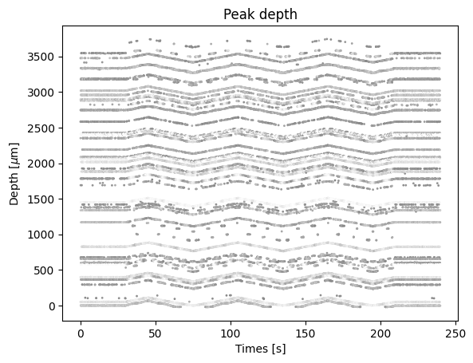
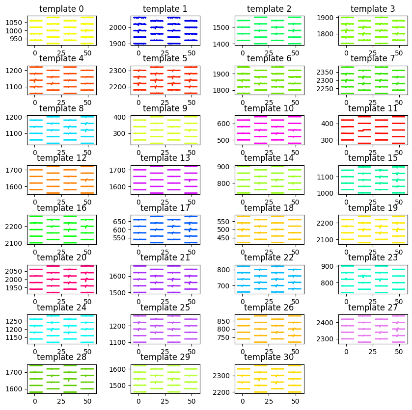
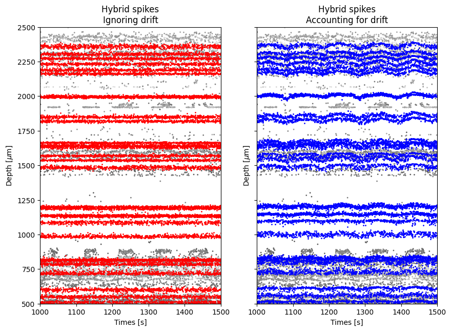
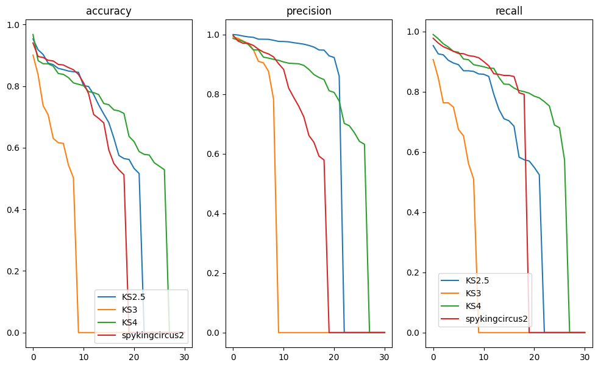

Benchmark spike sorting with hybrid recordings
==============================================

This example shows how to use the SpikeInterface hybrid recordings
framework to benchmark spike sorting results.

Hybrid recordings are built from existing recordings by injecting units
with known spiking activity. The template (aka average waveforms) of the
injected units can be from previous spike sorted data. In this example,
we will be using an open database of templates that we have constructed
from the International Brain Laboratory - Brain Wide Map (available on
`DANDI <https://dandiarchive.org/dandiset/000409?search=IBL&page=2&sortOption=0&sortDir=-1&showDrafts=true&showEmpty=false&pos=9>`_).

Importantly, recordings from long-shank probes, such as Neuropixels,
usually experience drifts. Such drifts have to be taken into account in
order to smoothly inject spikes into the recording.

.. code:: ipython3

    import spikeinterface as si
    import spikeinterface.extractors as se
    import spikeinterface.preprocessing as spre
    import spikeinterface.comparison as sc
    import spikeinterface.generation as sgen
    import spikeinterface.widgets as sw

    from spikeinterface.sortingcomponents.motion import estimate_motion

    import numpy as np
    import matplotlib.pyplot as plt
    from pathlib import Path

.. code:: ipython3

    %matplotlib inline

.. code:: ipython3

    si.set_global_job_kwargs(n_jobs=16)

For this notebook, we will use a drifting recording similar to the one
acquired by Nick Steinmetz and available
`here <https://doi.org/10.6084/m9.figshare.14024495.v1>`__, where an
triangular motion was imposed to the recording by moving the probe up
and down with a micro-manipulator.

.. code:: ipython3

    workdir = Path("/ssd980/working/hybrid/steinmetz_imposed_motion")
    workdir.mkdir(exist_ok=True)

.. code:: ipython3

    recording_np1_imposed = se.read_spikeglx("/hdd1/data/spikeglx/nick-steinmetz/dataset1/p1_g0_t0/")
    recording_preproc = spre.highpass_filter(recording_np1_imposed)
    recording_preproc = spre.common_reference(recording_preproc)

To visualize the drift, we can estimate the motion and plot it:

.. code:: ipython3

    # to correct for drift, we need a float dtype
    recording_preproc = spre.astype(recording_preproc, "float")
    _, motion_info = spre.correct_motion(
        recording_preproc, preset="nonrigid_fast_and_accurate", n_jobs=4, progress_bar=True, output_motion_info=True
    )

.. parsed-literal::

    detect and localize:   0%|          | 0/1958 [00:00<?, ?it/s]

.. code:: ipython3

    ax = sw.plot_drift_raster_map(
        peaks=motion_info["peaks"],
        peak_locations=motion_info["peak_locations"],
        recording=recording_preproc,
        cmap="Greys_r",
        scatter_decimate=10,
        depth_lim=(-10, 3000)
    )

Retrieve templates from database
--------------------------------

.. code:: ipython3

    templates_info = sgen.fetch_templates_database_info()

    print(f"Number of templates in database: {len(templates_info)}")
    print(f"Template database columns: {templates_info.columns}")

.. parsed-literal::

    Number of templates in database: 601
    Template database columns: Index(['probe', 'probe_manufacturer', 'brain_area', 'depth_along_probe',
           'amplitude_uv', 'noise_level_uv', 'signal_to_noise_ratio',
           'template_index', 'best_channel_index', 'spikes_per_unit', 'dataset',
           'dataset_path'],
          dtype='object')

.. code:: ipython3

    available_brain_areas = np.unique(templates_info.brain_area)
    print(f"Available brain areas: {available_brain_areas}")

.. parsed-literal::

    Available brain areas: ['ACAd6a' 'ACAv5' 'ACAv6a' 'AIp6a' 'AIp6b' 'AUDp6a' 'AUDv6a' 'CA1' 'CA3'
     'CENT2' 'CENT3' 'CLA' 'COApm' 'CP' 'DG-sg' 'ECT5' 'ENTl3' 'ICd' 'ICe'
     'IRN' 'LGd-sh' 'LP' 'LSc' 'MB' 'MEA' 'MGm' 'MOs5' 'MRN' 'MV' 'MY' 'NLL'
     'P' 'PA' 'PAG' 'PARN' 'PB' 'PERI2/3' 'PERI5' 'PIR' 'PSV' 'PVT' 'Pa4'
     'PoT' 'RN' 'RSPagl5' 'RSPagl6a' 'RSPd5' 'RSPd6a' 'RSPv5' 'SCdg' 'SCig'
     'SCiw' 'SCsg' 'SF' 'SGN' 'SPFp' 'SSp-n5' 'SSp-n6a' 'SSs6a' 'SSs6b' 'SUT'
     'TEa5' 'TEa6a' 'TRS' 'VII' 'VISa5' 'VISa6a' 'VISp5' 'VISp6a' 'VISrl6b'
     'VPL' 'VPM' 'arb' 'ccb' 'ec' 'ee' 'fiber tracts' 'int' 'll' 'opt' 'scp']

Let’s perform a query: templates from visual brain regions and at the
“top” of the probe

.. code:: ipython3

    target_area = ["VISa5", "VISa6a", "VISp5", "VISp6a", "VISrl6b"]
    minimum_depth = 1500
    templates_selected_info = templates_info.query(f"brain_area in {target_area} and depth_along_probe > {minimum_depth}")
    len(templates_selected_info)

.. parsed-literal::

    31

We can now retrieve the selected templates as a ``Templates`` object:

.. code:: ipython3

    templates_selected = sgen.query_templates_from_database(templates_selected_info, verbose=True)
    print(templates_selected)

.. parsed-literal::

    Fetching templates from 2 datasets
    Templates: 31 units - 240 samples - 384 channels
    sampling_frequency=30.00 kHz - ms_before=3.00 ms - ms_after=5.00 ms
    Probe - IMEC - Neuropixels 1.0 - 18194814141 - 384ch - 1shanks

While we selected templates from a target aread and at certain depths,
we can see that the template amplitudes are quite large. This will make
spike sorting easy… we can further manipulate the ``Templates`` by
rescaling, relocating, or further selections with the
``sgen.scale_template_to_range``, ``sgen.relocate_templates``, and
``sgen.select_templates`` functions.

In our case, let’s rescale the amplitudes between 50 and 150
:math:`\mu`\ V and relocate them towards the bottom half of the probe,
where the activity looks interesting!

.. code:: ipython3

    min_amplitude = 50
    max_amplitude = 150
    templates_scaled = sgen.scale_template_to_range(
        templates=templates_selected,
        min_amplitude=min_amplitude,
        max_amplitude=max_amplitude
    )

    min_displacement = 1000
    max_displacement = 3000
    templates_relocated = sgen.relocate_templates(
        templates=templates_scaled,
        min_displacement=min_displacement,
        max_displacement=max_displacement
    )

Let’s plot the selected templates:

.. code:: ipython3

    sparsity_plot = si.compute_sparsity(templates_relocated)
    fig = plt.figure(figsize=(10, 10))
    w = sw.plot_unit_templates(templates_relocated, sparsity=sparsity_plot, ncols=4, figure=fig)
    w.figure.subplots_adjust(wspace=0.5, hspace=0.7)

Constructing hybrid recordings
------------------------------

We can construct now hybrid recordings with the selected templates.

We will do this in two ways to show how important it is to account for
drifts when injecting hybrid spikes.

-  For the first recording we will not pass the estimated motion
   (``recording_hybrid_ignore_drift``).
-  For the second recording, we will pass and account for the estimated
   motion (``recording_hybrid_with_drift``).

.. code:: ipython3

    recording_hybrid_ignore_drift, sorting_hybrid = sgen.generate_hybrid_recording(
        recording=recording_preproc, templates=templates_relocated, seed=2308
    )
    recording_hybrid_ignore_drift

.. raw:: html

    
<strong>InjectTemplatesRecording: 384 channels - 30.0kHz - 1 segments - 58,715,724 samples - 1,957.19s (32.62 minutes) - float64 dtype - 167.99 GiB</strong>

  
<strong>Channel IDs</strong>
<ul>['imec0.ap#AP0' 'imec0.ap#AP1' 'imec0.ap#AP2' 'imec0.ap#AP3'
     'imec0.ap#AP4' 'imec0.ap#AP5' 'imec0.ap#AP6' 'imec0.ap#AP7'
     'imec0.ap#AP8' 'imec0.ap#AP9' 'imec0.ap#AP10' 'imec0.ap#AP11'
     'imec0.ap#AP12' 'imec0.ap#AP13' 'imec0.ap#AP14' 'imec0.ap#AP15'
     'imec0.ap#AP16' 'imec0.ap#AP17' 'imec0.ap#AP18' 'imec0.ap#AP19'
     'imec0.ap#AP20' 'imec0.ap#AP21' 'imec0.ap#AP22' 'imec0.ap#AP23'
     'imec0.ap#AP24' 'imec0.ap#AP25' 'imec0.ap#AP26' 'imec0.ap#AP27'
     'imec0.ap#AP28' 'imec0.ap#AP29' 'imec0.ap#AP30' 'imec0.ap#AP31'
     'imec0.ap#AP32' 'imec0.ap#AP33' 'imec0.ap#AP34' 'imec0.ap#AP35'
     'imec0.ap#AP36' 'imec0.ap#AP37' 'imec0.ap#AP38' 'imec0.ap#AP39'
     'imec0.ap#AP40' 'imec0.ap#AP41' 'imec0.ap#AP42' 'imec0.ap#AP43'
     'imec0.ap#AP44' 'imec0.ap#AP45' 'imec0.ap#AP46' 'imec0.ap#AP47'
     'imec0.ap#AP48' 'imec0.ap#AP49' 'imec0.ap#AP50' 'imec0.ap#AP51'
     'imec0.ap#AP52' 'imec0.ap#AP53' 'imec0.ap#AP54' 'imec0.ap#AP55'
     'imec0.ap#AP56' 'imec0.ap#AP57' 'imec0.ap#AP58' 'imec0.ap#AP59'
     'imec0.ap#AP60' 'imec0.ap#AP61' 'imec0.ap#AP62' 'imec0.ap#AP63'
     'imec0.ap#AP64' 'imec0.ap#AP65' 'imec0.ap#AP66' 'imec0.ap#AP67'
     'imec0.ap#AP68' 'imec0.ap#AP69' 'imec0.ap#AP70' 'imec0.ap#AP71'
     'imec0.ap#AP72' 'imec0.ap#AP73' 'imec0.ap#AP74' 'imec0.ap#AP75'
     'imec0.ap#AP76' 'imec0.ap#AP77' 'imec0.ap#AP78' 'imec0.ap#AP79'
     'imec0.ap#AP80' 'imec0.ap#AP81' 'imec0.ap#AP82' 'imec0.ap#AP83'
     'imec0.ap#AP84' 'imec0.ap#AP85' 'imec0.ap#AP86' 'imec0.ap#AP87'
     'imec0.ap#AP88' 'imec0.ap#AP89' 'imec0.ap#AP90' 'imec0.ap#AP91'
     'imec0.ap#AP92' 'imec0.ap#AP93' 'imec0.ap#AP94' 'imec0.ap#AP95'
     'imec0.ap#AP96' 'imec0.ap#AP97' 'imec0.ap#AP98' 'imec0.ap#AP99'
     'imec0.ap#AP100' 'imec0.ap#AP101' 'imec0.ap#AP102' 'imec0.ap#AP103'
     'imec0.ap#AP104' 'imec0.ap#AP105' 'imec0.ap#AP106' 'imec0.ap#AP107'
     'imec0.ap#AP108' 'imec0.ap#AP109' 'imec0.ap#AP110' 'imec0.ap#AP111'
     'imec0.ap#AP112' 'imec0.ap#AP113' 'imec0.ap#AP114' 'imec0.ap#AP115'
     'imec0.ap#AP116' 'imec0.ap#AP117' 'imec0.ap#AP118' 'imec0.ap#AP119'
     'imec0.ap#AP120' 'imec0.ap#AP121' 'imec0.ap#AP122' 'imec0.ap#AP123'
     'imec0.ap#AP124' 'imec0.ap#AP125' 'imec0.ap#AP126' 'imec0.ap#AP127'
     'imec0.ap#AP128' 'imec0.ap#AP129' 'imec0.ap#AP130' 'imec0.ap#AP131'
     'imec0.ap#AP132' 'imec0.ap#AP133' 'imec0.ap#AP134' 'imec0.ap#AP135'
     'imec0.ap#AP136' 'imec0.ap#AP137' 'imec0.ap#AP138' 'imec0.ap#AP139'
     'imec0.ap#AP140' 'imec0.ap#AP141' 'imec0.ap#AP142' 'imec0.ap#AP143'
     'imec0.ap#AP144' 'imec0.ap#AP145' 'imec0.ap#AP146' 'imec0.ap#AP147'
     'imec0.ap#AP148' 'imec0.ap#AP149' 'imec0.ap#AP150' 'imec0.ap#AP151'
     'imec0.ap#AP152' 'imec0.ap#AP153' 'imec0.ap#AP154' 'imec0.ap#AP155'
     'imec0.ap#AP156' 'imec0.ap#AP157' 'imec0.ap#AP158' 'imec0.ap#AP159'
     'imec0.ap#AP160' 'imec0.ap#AP161' 'imec0.ap#AP162' 'imec0.ap#AP163'
     'imec0.ap#AP164' 'imec0.ap#AP165' 'imec0.ap#AP166' 'imec0.ap#AP167'
     'imec0.ap#AP168' 'imec0.ap#AP169' 'imec0.ap#AP170' 'imec0.ap#AP171'
     'imec0.ap#AP172' 'imec0.ap#AP173' 'imec0.ap#AP174' 'imec0.ap#AP175'
     'imec0.ap#AP176' 'imec0.ap#AP177' 'imec0.ap#AP178' 'imec0.ap#AP179'
     'imec0.ap#AP180' 'imec0.ap#AP181' 'imec0.ap#AP182' 'imec0.ap#AP183'
     'imec0.ap#AP184' 'imec0.ap#AP185' 'imec0.ap#AP186' 'imec0.ap#AP187'
     'imec0.ap#AP188' 'imec0.ap#AP189' 'imec0.ap#AP190' 'imec0.ap#AP191'
     'imec0.ap#AP192' 'imec0.ap#AP193' 'imec0.ap#AP194' 'imec0.ap#AP195'
     'imec0.ap#AP196' 'imec0.ap#AP197' 'imec0.ap#AP198' 'imec0.ap#AP199'
     'imec0.ap#AP200' 'imec0.ap#AP201' 'imec0.ap#AP202' 'imec0.ap#AP203'
     'imec0.ap#AP204' 'imec0.ap#AP205' 'imec0.ap#AP206' 'imec0.ap#AP207'
     'imec0.ap#AP208' 'imec0.ap#AP209' 'imec0.ap#AP210' 'imec0.ap#AP211'
     'imec0.ap#AP212' 'imec0.ap#AP213' 'imec0.ap#AP214' 'imec0.ap#AP215'
     'imec0.ap#AP216' 'imec0.ap#AP217' 'imec0.ap#AP218' 'imec0.ap#AP219'
     'imec0.ap#AP220' 'imec0.ap#AP221' 'imec0.ap#AP222' 'imec0.ap#AP223'
     'imec0.ap#AP224' 'imec0.ap#AP225' 'imec0.ap#AP226' 'imec0.ap#AP227'
     'imec0.ap#AP228' 'imec0.ap#AP229' 'imec0.ap#AP230' 'imec0.ap#AP231'
     'imec0.ap#AP232' 'imec0.ap#AP233' 'imec0.ap#AP234' 'imec0.ap#AP235'
     'imec0.ap#AP236' 'imec0.ap#AP237' 'imec0.ap#AP238' 'imec0.ap#AP239'
     'imec0.ap#AP240' 'imec0.ap#AP241' 'imec0.ap#AP242' 'imec0.ap#AP243'
     'imec0.ap#AP244' 'imec0.ap#AP245' 'imec0.ap#AP246' 'imec0.ap#AP247'
     'imec0.ap#AP248' 'imec0.ap#AP249' 'imec0.ap#AP250' 'imec0.ap#AP251'
     'imec0.ap#AP252' 'imec0.ap#AP253' 'imec0.ap#AP254' 'imec0.ap#AP255'
     'imec0.ap#AP256' 'imec0.ap#AP257' 'imec0.ap#AP258' 'imec0.ap#AP259'
     'imec0.ap#AP260' 'imec0.ap#AP261' 'imec0.ap#AP262' 'imec0.ap#AP263'
     'imec0.ap#AP264' 'imec0.ap#AP265' 'imec0.ap#AP266' 'imec0.ap#AP267'
     'imec0.ap#AP268' 'imec0.ap#AP269' 'imec0.ap#AP270' 'imec0.ap#AP271'
     'imec0.ap#AP272' 'imec0.ap#AP273' 'imec0.ap#AP274' 'imec0.ap#AP275'
     'imec0.ap#AP276' 'imec0.ap#AP277' 'imec0.ap#AP278' 'imec0.ap#AP279'
     'imec0.ap#AP280' 'imec0.ap#AP281' 'imec0.ap#AP282' 'imec0.ap#AP283'
     'imec0.ap#AP284' 'imec0.ap#AP285' 'imec0.ap#AP286' 'imec0.ap#AP287'
     'imec0.ap#AP288' 'imec0.ap#AP289' 'imec0.ap#AP290' 'imec0.ap#AP291'
     'imec0.ap#AP292' 'imec0.ap#AP293' 'imec0.ap#AP294' 'imec0.ap#AP295'
     'imec0.ap#AP296' 'imec0.ap#AP297' 'imec0.ap#AP298' 'imec0.ap#AP299'
     'imec0.ap#AP300' 'imec0.ap#AP301' 'imec0.ap#AP302' 'imec0.ap#AP303'
     'imec0.ap#AP304' 'imec0.ap#AP305' 'imec0.ap#AP306' 'imec0.ap#AP307'
     'imec0.ap#AP308' 'imec0.ap#AP309' 'imec0.ap#AP310' 'imec0.ap#AP311'
     'imec0.ap#AP312' 'imec0.ap#AP313' 'imec0.ap#AP314' 'imec0.ap#AP315'
     'imec0.ap#AP316' 'imec0.ap#AP317' 'imec0.ap#AP318' 'imec0.ap#AP319'
     'imec0.ap#AP320' 'imec0.ap#AP321' 'imec0.ap#AP322' 'imec0.ap#AP323'
     'imec0.ap#AP324' 'imec0.ap#AP325' 'imec0.ap#AP326' 'imec0.ap#AP327'
     'imec0.ap#AP328' 'imec0.ap#AP329' 'imec0.ap#AP330' 'imec0.ap#AP331'
     'imec0.ap#AP332' 'imec0.ap#AP333' 'imec0.ap#AP334' 'imec0.ap#AP335'
     'imec0.ap#AP336' 'imec0.ap#AP337' 'imec0.ap#AP338' 'imec0.ap#AP339'
     'imec0.ap#AP340' 'imec0.ap#AP341' 'imec0.ap#AP342' 'imec0.ap#AP343'
     'imec0.ap#AP344' 'imec0.ap#AP345' 'imec0.ap#AP346' 'imec0.ap#AP347'
     'imec0.ap#AP348' 'imec0.ap#AP349' 'imec0.ap#AP350' 'imec0.ap#AP351'
     'imec0.ap#AP352' 'imec0.ap#AP353' 'imec0.ap#AP354' 'imec0.ap#AP355'
     'imec0.ap#AP356' 'imec0.ap#AP357' 'imec0.ap#AP358' 'imec0.ap#AP359'
     'imec0.ap#AP360' 'imec0.ap#AP361' 'imec0.ap#AP362' 'imec0.ap#AP363'
     'imec0.ap#AP364' 'imec0.ap#AP365' 'imec0.ap#AP366' 'imec0.ap#AP367'
     'imec0.ap#AP368' 'imec0.ap#AP369' 'imec0.ap#AP370' 'imec0.ap#AP371'
     'imec0.ap#AP372' 'imec0.ap#AP373' 'imec0.ap#AP374' 'imec0.ap#AP375'
     'imec0.ap#AP376' 'imec0.ap#AP377' 'imec0.ap#AP378' 'imec0.ap#AP379'
     'imec0.ap#AP380' 'imec0.ap#AP381' 'imec0.ap#AP382' 'imec0.ap#AP383'] 

  
<strong>Annotations</strong>
<ul><li> <strong> is_filtered </strong>: True</li><li> <strong> probe_0_planar_contour </strong>: [[ -11 9989]
     [ -11  -11]
     [  24 -186]
     [  59  -11]
     [  59 9989]]</li><li> <strong> probes_info </strong>: [{'model_name': 'Neuropixels 1.0', 'manufacturer': 'IMEC', 'probe_type': '0', 'serial_number': '18408406612', 'part_number': 'PRB_1_4_0480_1_C', 'port': '1', 'slot': '2'}]</li></ul> 

<strong>Channel Properties</strong>
<ul>

 <strong> gain_to_uV </strong> 
[2.34375 2.34375 2.34375 2.34375 2.34375 2.34375 2.34375 2.34375 2.34375
     2.34375 2.34375 2.34375 2.34375 2.34375 2.34375 2.34375 2.34375 2.34375
     2.34375 2.34375 2.34375 2.34375 2.34375 2.34375 2.34375 2.34375 2.34375
     2.34375 2.34375 2.34375 2.34375 2.34375 2.34375 2.34375 2.34375 2.34375
     2.34375 2.34375 2.34375 2.34375 2.34375 2.34375 2.34375 2.34375 2.34375
     2.34375 2.34375 2.34375 2.34375 2.34375 2.34375 2.34375 2.34375 2.34375
     2.34375 2.34375 2.34375 2.34375 2.34375 2.34375 2.34375 2.34375 2.34375
     2.34375 2.34375 2.34375 2.34375 2.34375 2.34375 2.34375 2.34375 2.34375
     2.34375 2.34375 2.34375 2.34375 2.34375 2.34375 2.34375 2.34375 2.34375
     2.34375 2.34375 2.34375 2.34375 2.34375 2.34375 2.34375 2.34375 2.34375
     2.34375 2.34375 2.34375 2.34375 2.34375 2.34375 2.34375 2.34375 2.34375
     2.34375 2.34375 2.34375 2.34375 2.34375 2.34375 2.34375 2.34375 2.34375
     2.34375 2.34375 2.34375 2.34375 2.34375 2.34375 2.34375 2.34375 2.34375
     2.34375 2.34375 2.34375 2.34375 2.34375 2.34375 2.34375 2.34375 2.34375
     2.34375 2.34375 2.34375 2.34375 2.34375 2.34375 2.34375 2.34375 2.34375
     2.34375 2.34375 2.34375 2.34375 2.34375 2.34375 2.34375 2.34375 2.34375
     2.34375 2.34375 2.34375 2.34375 2.34375 2.34375 2.34375 2.34375 2.34375
     2.34375 2.34375 2.34375 2.34375 2.34375 2.34375 2.34375 2.34375 2.34375
     2.34375 2.34375 2.34375 2.34375 2.34375 2.34375 2.34375 2.34375 2.34375
     2.34375 2.34375 2.34375 2.34375 2.34375 2.34375 2.34375 2.34375 2.34375
     2.34375 2.34375 2.34375 2.34375 2.34375 2.34375 2.34375 2.34375 2.34375
     2.34375 2.34375 2.34375 2.34375 2.34375 2.34375 2.34375 2.34375 2.34375
     2.34375 2.34375 2.34375 2.34375 2.34375 2.34375 2.34375 2.34375 2.34375
     2.34375 2.34375 2.34375 2.34375 2.34375 2.34375 2.34375 2.34375 2.34375
     2.34375 2.34375 2.34375 2.34375 2.34375 2.34375 2.34375 2.34375 2.34375
     2.34375 2.34375 2.34375 2.34375 2.34375 2.34375 2.34375 2.34375 2.34375
     2.34375 2.34375 2.34375 2.34375 2.34375 2.34375 2.34375 2.34375 2.34375
     2.34375 2.34375 2.34375 2.34375 2.34375 2.34375 2.34375 2.34375 2.34375
     2.34375 2.34375 2.34375 2.34375 2.34375 2.34375 2.34375 2.34375 2.34375
     2.34375 2.34375 2.34375 2.34375 2.34375 2.34375 2.34375 2.34375 2.34375
     2.34375 2.34375 2.34375 2.34375 2.34375 2.34375 2.34375 2.34375 2.34375
     2.34375 2.34375 2.34375 2.34375 2.34375 2.34375 2.34375 2.34375 2.34375
     2.34375 2.34375 2.34375 2.34375 2.34375 2.34375 2.34375 2.34375 2.34375
     2.34375 2.34375 2.34375 2.34375 2.34375 2.34375 2.34375 2.34375 2.34375
     2.34375 2.34375 2.34375 2.34375 2.34375 2.34375 2.34375 2.34375 2.34375
     2.34375 2.34375 2.34375 2.34375 2.34375 2.34375 2.34375 2.34375 2.34375
     2.34375 2.34375 2.34375 2.34375 2.34375 2.34375 2.34375 2.34375 2.34375
     2.34375 2.34375 2.34375 2.34375 2.34375 2.34375 2.34375 2.34375 2.34375
     2.34375 2.34375 2.34375 2.34375 2.34375 2.34375 2.34375 2.34375 2.34375
     2.34375 2.34375 2.34375 2.34375 2.34375 2.34375 2.34375 2.34375 2.34375
     2.34375 2.34375 2.34375 2.34375 2.34375 2.34375 2.34375 2.34375 2.34375
     2.34375 2.34375 2.34375 2.34375 2.34375 2.34375 2.34375 2.34375 2.34375
     2.34375 2.34375 2.34375 2.34375 2.34375 2.34375]

 <strong> offset_to_uV </strong> 
[0 0 0 0 0 0 0 0 0 0 0 0 0 0 0 0 0 0 0 0 0 0 0 0 0 0 0 0 0 0 0 0 0 0 0 0 0
     0 0 0 0 0 0 0 0 0 0 0 0 0 0 0 0 0 0 0 0 0 0 0 0 0 0 0 0 0 0 0 0 0 0 0 0 0
     0 0 0 0 0 0 0 0 0 0 0 0 0 0 0 0 0 0 0 0 0 0 0 0 0 0 0 0 0 0 0 0 0 0 0 0 0
     0 0 0 0 0 0 0 0 0 0 0 0 0 0 0 0 0 0 0 0 0 0 0 0 0 0 0 0 0 0 0 0 0 0 0 0 0
     0 0 0 0 0 0 0 0 0 0 0 0 0 0 0 0 0 0 0 0 0 0 0 0 0 0 0 0 0 0 0 0 0 0 0 0 0
     0 0 0 0 0 0 0 0 0 0 0 0 0 0 0 0 0 0 0 0 0 0 0 0 0 0 0 0 0 0 0 0 0 0 0 0 0
     0 0 0 0 0 0 0 0 0 0 0 0 0 0 0 0 0 0 0 0 0 0 0 0 0 0 0 0 0 0 0 0 0 0 0 0 0
     0 0 0 0 0 0 0 0 0 0 0 0 0 0 0 0 0 0 0 0 0 0 0 0 0 0 0 0 0 0 0 0 0 0 0 0 0
     0 0 0 0 0 0 0 0 0 0 0 0 0 0 0 0 0 0 0 0 0 0 0 0 0 0 0 0 0 0 0 0 0 0 0 0 0
     0 0 0 0 0 0 0 0 0 0 0 0 0 0 0 0 0 0 0 0 0 0 0 0 0 0 0 0 0 0 0 0 0 0 0 0 0
     0 0 0 0 0 0 0 0 0 0 0 0 0 0]

 <strong> channel_names </strong> 
['AP0' 'AP1' 'AP2' 'AP3' 'AP4' 'AP5' 'AP6' 'AP7' 'AP8' 'AP9' 'AP10' 'AP11'
     'AP12' 'AP13' 'AP14' 'AP15' 'AP16' 'AP17' 'AP18' 'AP19' 'AP20' 'AP21'
     'AP22' 'AP23' 'AP24' 'AP25' 'AP26' 'AP27' 'AP28' 'AP29' 'AP30' 'AP31'
     'AP32' 'AP33' 'AP34' 'AP35' 'AP36' 'AP37' 'AP38' 'AP39' 'AP40' 'AP41'
     'AP42' 'AP43' 'AP44' 'AP45' 'AP46' 'AP47' 'AP48' 'AP49' 'AP50' 'AP51'
     'AP52' 'AP53' 'AP54' 'AP55' 'AP56' 'AP57' 'AP58' 'AP59' 'AP60' 'AP61'
     'AP62' 'AP63' 'AP64' 'AP65' 'AP66' 'AP67' 'AP68' 'AP69' 'AP70' 'AP71'
     'AP72' 'AP73' 'AP74' 'AP75' 'AP76' 'AP77' 'AP78' 'AP79' 'AP80' 'AP81'
     'AP82' 'AP83' 'AP84' 'AP85' 'AP86' 'AP87' 'AP88' 'AP89' 'AP90' 'AP91'
     'AP92' 'AP93' 'AP94' 'AP95' 'AP96' 'AP97' 'AP98' 'AP99' 'AP100' 'AP101'
     'AP102' 'AP103' 'AP104' 'AP105' 'AP106' 'AP107' 'AP108' 'AP109' 'AP110'
     'AP111' 'AP112' 'AP113' 'AP114' 'AP115' 'AP116' 'AP117' 'AP118' 'AP119'
     'AP120' 'AP121' 'AP122' 'AP123' 'AP124' 'AP125' 'AP126' 'AP127' 'AP128'
     'AP129' 'AP130' 'AP131' 'AP132' 'AP133' 'AP134' 'AP135' 'AP136' 'AP137'
     'AP138' 'AP139' 'AP140' 'AP141' 'AP142' 'AP143' 'AP144' 'AP145' 'AP146'
     'AP147' 'AP148' 'AP149' 'AP150' 'AP151' 'AP152' 'AP153' 'AP154' 'AP155'
     'AP156' 'AP157' 'AP158' 'AP159' 'AP160' 'AP161' 'AP162' 'AP163' 'AP164'
     'AP165' 'AP166' 'AP167' 'AP168' 'AP169' 'AP170' 'AP171' 'AP172' 'AP173'
     'AP174' 'AP175' 'AP176' 'AP177' 'AP178' 'AP179' 'AP180' 'AP181' 'AP182'
     'AP183' 'AP184' 'AP185' 'AP186' 'AP187' 'AP188' 'AP189' 'AP190' 'AP191'
     'AP192' 'AP193' 'AP194' 'AP195' 'AP196' 'AP197' 'AP198' 'AP199' 'AP200'
     'AP201' 'AP202' 'AP203' 'AP204' 'AP205' 'AP206' 'AP207' 'AP208' 'AP209'
     'AP210' 'AP211' 'AP212' 'AP213' 'AP214' 'AP215' 'AP216' 'AP217' 'AP218'
     'AP219' 'AP220' 'AP221' 'AP222' 'AP223' 'AP224' 'AP225' 'AP226' 'AP227'
     'AP228' 'AP229' 'AP230' 'AP231' 'AP232' 'AP233' 'AP234' 'AP235' 'AP236'
     'AP237' 'AP238' 'AP239' 'AP240' 'AP241' 'AP242' 'AP243' 'AP244' 'AP245'
     'AP246' 'AP247' 'AP248' 'AP249' 'AP250' 'AP251' 'AP252' 'AP253' 'AP254'
     'AP255' 'AP256' 'AP257' 'AP258' 'AP259' 'AP260' 'AP261' 'AP262' 'AP263'
     'AP264' 'AP265' 'AP266' 'AP267' 'AP268' 'AP269' 'AP270' 'AP271' 'AP272'
     'AP273' 'AP274' 'AP275' 'AP276' 'AP277' 'AP278' 'AP279' 'AP280' 'AP281'
     'AP282' 'AP283' 'AP284' 'AP285' 'AP286' 'AP287' 'AP288' 'AP289' 'AP290'
     'AP291' 'AP292' 'AP293' 'AP294' 'AP295' 'AP296' 'AP297' 'AP298' 'AP299'
     'AP300' 'AP301' 'AP302' 'AP303' 'AP304' 'AP305' 'AP306' 'AP307' 'AP308'
     'AP309' 'AP310' 'AP311' 'AP312' 'AP313' 'AP314' 'AP315' 'AP316' 'AP317'
     'AP318' 'AP319' 'AP320' 'AP321' 'AP322' 'AP323' 'AP324' 'AP325' 'AP326'
     'AP327' 'AP328' 'AP329' 'AP330' 'AP331' 'AP332' 'AP333' 'AP334' 'AP335'
     'AP336' 'AP337' 'AP338' 'AP339' 'AP340' 'AP341' 'AP342' 'AP343' 'AP344'
     'AP345' 'AP346' 'AP347' 'AP348' 'AP349' 'AP350' 'AP351' 'AP352' 'AP353'
     'AP354' 'AP355' 'AP356' 'AP357' 'AP358' 'AP359' 'AP360' 'AP361' 'AP362'
     'AP363' 'AP364' 'AP365' 'AP366' 'AP367' 'AP368' 'AP369' 'AP370' 'AP371'
     'AP372' 'AP373' 'AP374' 'AP375' 'AP376' 'AP377' 'AP378' 'AP379' 'AP380'
     'AP381' 'AP382' 'AP383']

 <strong> contact_vector </strong> 
[(0, 16.,    0., 'square', 12., '', 'e0',   0, 'um', 1., 0., 0., 1.,   0, 0, 0, 500, 250, 1)
     (0, 48.,    0., 'square', 12., '', 'e1',   1, 'um', 1., 0., 0., 1.,   1, 0, 0, 500, 250, 1)
     (0,  0.,   20., 'square', 12., '', 'e2',   2, 'um', 1., 0., 0., 1.,   2, 0, 0, 500, 250, 1)
     (0, 32.,   20., 'square', 12., '', 'e3',   3, 'um', 1., 0., 0., 1.,   3, 0, 0, 500, 250, 1)
     (0, 16.,   40., 'square', 12., '', 'e4',   4, 'um', 1., 0., 0., 1.,   4, 0, 0, 500, 250, 1)
     (0, 48.,   40., 'square', 12., '', 'e5',   5, 'um', 1., 0., 0., 1.,   5, 0, 0, 500, 250, 1)
     (0,  0.,   60., 'square', 12., '', 'e6',   6, 'um', 1., 0., 0., 1.,   6, 0, 0, 500, 250, 1)
     (0, 32.,   60., 'square', 12., '', 'e7',   7, 'um', 1., 0., 0., 1.,   7, 0, 0, 500, 250, 1)
     (0, 16.,   80., 'square', 12., '', 'e8',   8, 'um', 1., 0., 0., 1.,   8, 0, 0, 500, 250, 1)
     (0, 48.,   80., 'square', 12., '', 'e9',   9, 'um', 1., 0., 0., 1.,   9, 0, 0, 500, 250, 1)
     (0,  0.,  100., 'square', 12., '', 'e10',  10, 'um', 1., 0., 0., 1.,  10, 0, 0, 500, 250, 1)
     (0, 32.,  100., 'square', 12., '', 'e11',  11, 'um', 1., 0., 0., 1.,  11, 0, 0, 500, 250, 1)
     (0, 16.,  120., 'square', 12., '', 'e12',  12, 'um', 1., 0., 0., 1.,  12, 0, 0, 500, 250, 1)
     (0, 48.,  120., 'square', 12., '', 'e13',  13, 'um', 1., 0., 0., 1.,  13, 0, 0, 500, 250, 1)
     (0,  0.,  140., 'square', 12., '', 'e14',  14, 'um', 1., 0., 0., 1.,  14, 0, 0, 500, 250, 1)
     (0, 32.,  140., 'square', 12., '', 'e15',  15, 'um', 1., 0., 0., 1.,  15, 0, 0, 500, 250, 1)
     (0, 16.,  160., 'square', 12., '', 'e16',  16, 'um', 1., 0., 0., 1.,  16, 0, 0, 500, 250, 1)
     (0, 48.,  160., 'square', 12., '', 'e17',  17, 'um', 1., 0., 0., 1.,  17, 0, 0, 500, 250, 1)
     (0,  0.,  180., 'square', 12., '', 'e18',  18, 'um', 1., 0., 0., 1.,  18, 0, 0, 500, 250, 1)
     (0, 32.,  180., 'square', 12., '', 'e19',  19, 'um', 1., 0., 0., 1.,  19, 0, 0, 500, 250, 1)
     (0, 16.,  200., 'square', 12., '', 'e20',  20, 'um', 1., 0., 0., 1.,  20, 0, 0, 500, 250, 1)
     (0, 48.,  200., 'square', 12., '', 'e21',  21, 'um', 1., 0., 0., 1.,  21, 0, 0, 500, 250, 1)
     (0,  0.,  220., 'square', 12., '', 'e22',  22, 'um', 1., 0., 0., 1.,  22, 0, 0, 500, 250, 1)
     (0, 32.,  220., 'square', 12., '', 'e23',  23, 'um', 1., 0., 0., 1.,  23, 0, 0, 500, 250, 1)
     (0, 16.,  240., 'square', 12., '', 'e24',  24, 'um', 1., 0., 0., 1.,  24, 0, 0, 500, 250, 1)
     (0, 48.,  240., 'square', 12., '', 'e25',  25, 'um', 1., 0., 0., 1.,  25, 0, 0, 500, 250, 1)
     (0,  0.,  260., 'square', 12., '', 'e26',  26, 'um', 1., 0., 0., 1.,  26, 0, 0, 500, 250, 1)
     (0, 32.,  260., 'square', 12., '', 'e27',  27, 'um', 1., 0., 0., 1.,  27, 0, 0, 500, 250, 1)
     (0, 16.,  280., 'square', 12., '', 'e28',  28, 'um', 1., 0., 0., 1.,  28, 0, 0, 500, 250, 1)
     (0, 48.,  280., 'square', 12., '', 'e29',  29, 'um', 1., 0., 0., 1.,  29, 0, 0, 500, 250, 1)
     (0,  0.,  300., 'square', 12., '', 'e30',  30, 'um', 1., 0., 0., 1.,  30, 0, 0, 500, 250, 1)
     (0, 32.,  300., 'square', 12., '', 'e31',  31, 'um', 1., 0., 0., 1.,  31, 0, 0, 500, 250, 1)
     (0, 16.,  320., 'square', 12., '', 'e32',  32, 'um', 1., 0., 0., 1.,  32, 0, 0, 500, 250, 1)
     (0, 48.,  320., 'square', 12., '', 'e33',  33, 'um', 1., 0., 0., 1.,  33, 0, 0, 500, 250, 1)
     (0,  0.,  340., 'square', 12., '', 'e34',  34, 'um', 1., 0., 0., 1.,  34, 0, 0, 500, 250, 1)
     (0, 32.,  340., 'square', 12., '', 'e35',  35, 'um', 1., 0., 0., 1.,  35, 0, 0, 500, 250, 1)
     (0, 16.,  360., 'square', 12., '', 'e36',  36, 'um', 1., 0., 0., 1.,  36, 0, 0, 500, 250, 1)
     (0, 48.,  360., 'square', 12., '', 'e37',  37, 'um', 1., 0., 0., 1.,  37, 0, 0, 500, 250, 1)
     (0,  0.,  380., 'square', 12., '', 'e38',  38, 'um', 1., 0., 0., 1.,  38, 0, 0, 500, 250, 1)
     (0, 32.,  380., 'square', 12., '', 'e39',  39, 'um', 1., 0., 0., 1.,  39, 0, 0, 500, 250, 1)
     (0, 16.,  400., 'square', 12., '', 'e40',  40, 'um', 1., 0., 0., 1.,  40, 0, 0, 500, 250, 1)
     (0, 48.,  400., 'square', 12., '', 'e41',  41, 'um', 1., 0., 0., 1.,  41, 0, 0, 500, 250, 1)
     (0,  0.,  420., 'square', 12., '', 'e42',  42, 'um', 1., 0., 0., 1.,  42, 0, 0, 500, 250, 1)
     (0, 32.,  420., 'square', 12., '', 'e43',  43, 'um', 1., 0., 0., 1.,  43, 0, 0, 500, 250, 1)
     (0, 16.,  440., 'square', 12., '', 'e44',  44, 'um', 1., 0., 0., 1.,  44, 0, 0, 500, 250, 1)
     (0, 48.,  440., 'square', 12., '', 'e45',  45, 'um', 1., 0., 0., 1.,  45, 0, 0, 500, 250, 1)
     (0,  0.,  460., 'square', 12., '', 'e46',  46, 'um', 1., 0., 0., 1.,  46, 0, 0, 500, 250, 1)
     (0, 32.,  460., 'square', 12., '', 'e47',  47, 'um', 1., 0., 0., 1.,  47, 0, 0, 500, 250, 1)
     (0, 16.,  480., 'square', 12., '', 'e48',  48, 'um', 1., 0., 0., 1.,  48, 0, 0, 500, 250, 1)
     (0, 48.,  480., 'square', 12., '', 'e49',  49, 'um', 1., 0., 0., 1.,  49, 0, 0, 500, 250, 1)
     (0,  0.,  500., 'square', 12., '', 'e50',  50, 'um', 1., 0., 0., 1.,  50, 0, 0, 500, 250, 1)
     (0, 32.,  500., 'square', 12., '', 'e51',  51, 'um', 1., 0., 0., 1.,  51, 0, 0, 500, 250, 1)
     (0, 16.,  520., 'square', 12., '', 'e52',  52, 'um', 1., 0., 0., 1.,  52, 0, 0, 500, 250, 1)
     (0, 48.,  520., 'square', 12., '', 'e53',  53, 'um', 1., 0., 0., 1.,  53, 0, 0, 500, 250, 1)
     (0,  0.,  540., 'square', 12., '', 'e54',  54, 'um', 1., 0., 0., 1.,  54, 0, 0, 500, 250, 1)
     (0, 32.,  540., 'square', 12., '', 'e55',  55, 'um', 1., 0., 0., 1.,  55, 0, 0, 500, 250, 1)
     (0, 16.,  560., 'square', 12., '', 'e56',  56, 'um', 1., 0., 0., 1.,  56, 0, 0, 500, 250, 1)
     (0, 48.,  560., 'square', 12., '', 'e57',  57, 'um', 1., 0., 0., 1.,  57, 0, 0, 500, 250, 1)
     (0,  0.,  580., 'square', 12., '', 'e58',  58, 'um', 1., 0., 0., 1.,  58, 0, 0, 500, 250, 1)
     (0, 32.,  580., 'square', 12., '', 'e59',  59, 'um', 1., 0., 0., 1.,  59, 0, 0, 500, 250, 1)
     (0, 16.,  600., 'square', 12., '', 'e60',  60, 'um', 1., 0., 0., 1.,  60, 0, 0, 500, 250, 1)
     (0, 48.,  600., 'square', 12., '', 'e61',  61, 'um', 1., 0., 0., 1.,  61, 0, 0, 500, 250, 1)
     (0,  0.,  620., 'square', 12., '', 'e62',  62, 'um', 1., 0., 0., 1.,  62, 0, 0, 500, 250, 1)
     (0, 32.,  620., 'square', 12., '', 'e63',  63, 'um', 1., 0., 0., 1.,  63, 0, 0, 500, 250, 1)
     (0, 16.,  640., 'square', 12., '', 'e64',  64, 'um', 1., 0., 0., 1.,  64, 0, 0, 500, 250, 1)
     (0, 48.,  640., 'square', 12., '', 'e65',  65, 'um', 1., 0., 0., 1.,  65, 0, 0, 500, 250, 1)
     (0,  0.,  660., 'square', 12., '', 'e66',  66, 'um', 1., 0., 0., 1.,  66, 0, 0, 500, 250, 1)
     (0, 32.,  660., 'square', 12., '', 'e67',  67, 'um', 1., 0., 0., 1.,  67, 0, 0, 500, 250, 1)
     (0, 16.,  680., 'square', 12., '', 'e68',  68, 'um', 1., 0., 0., 1.,  68, 0, 0, 500, 250, 1)
     (0, 48.,  680., 'square', 12., '', 'e69',  69, 'um', 1., 0., 0., 1.,  69, 0, 0, 500, 250, 1)
     (0,  0.,  700., 'square', 12., '', 'e70',  70, 'um', 1., 0., 0., 1.,  70, 0, 0, 500, 250, 1)
     (0, 32.,  700., 'square', 12., '', 'e71',  71, 'um', 1., 0., 0., 1.,  71, 0, 0, 500, 250, 1)
     (0, 16.,  720., 'square', 12., '', 'e72',  72, 'um', 1., 0., 0., 1.,  72, 0, 0, 500, 250, 1)
     (0, 48.,  720., 'square', 12., '', 'e73',  73, 'um', 1., 0., 0., 1.,  73, 0, 0, 500, 250, 1)
     (0,  0.,  740., 'square', 12., '', 'e74',  74, 'um', 1., 0., 0., 1.,  74, 0, 0, 500, 250, 1)
     (0, 32.,  740., 'square', 12., '', 'e75',  75, 'um', 1., 0., 0., 1.,  75, 0, 0, 500, 250, 1)
     (0, 16.,  760., 'square', 12., '', 'e76',  76, 'um', 1., 0., 0., 1.,  76, 0, 0, 500, 250, 1)
     (0, 48.,  760., 'square', 12., '', 'e77',  77, 'um', 1., 0., 0., 1.,  77, 0, 0, 500, 250, 1)
     (0,  0.,  780., 'square', 12., '', 'e78',  78, 'um', 1., 0., 0., 1.,  78, 0, 0, 500, 250, 1)
     (0, 32.,  780., 'square', 12., '', 'e79',  79, 'um', 1., 0., 0., 1.,  79, 0, 0, 500, 250, 1)
     (0, 16.,  800., 'square', 12., '', 'e80',  80, 'um', 1., 0., 0., 1.,  80, 0, 0, 500, 250, 1)
     (0, 48.,  800., 'square', 12., '', 'e81',  81, 'um', 1., 0., 0., 1.,  81, 0, 0, 500, 250, 1)
     (0,  0.,  820., 'square', 12., '', 'e82',  82, 'um', 1., 0., 0., 1.,  82, 0, 0, 500, 250, 1)
     (0, 32.,  820., 'square', 12., '', 'e83',  83, 'um', 1., 0., 0., 1.,  83, 0, 0, 500, 250, 1)
     (0, 16.,  840., 'square', 12., '', 'e84',  84, 'um', 1., 0., 0., 1.,  84, 0, 0, 500, 250, 1)
     (0, 48.,  840., 'square', 12., '', 'e85',  85, 'um', 1., 0., 0., 1.,  85, 0, 0, 500, 250, 1)
     (0,  0.,  860., 'square', 12., '', 'e86',  86, 'um', 1., 0., 0., 1.,  86, 0, 0, 500, 250, 1)
     (0, 32.,  860., 'square', 12., '', 'e87',  87, 'um', 1., 0., 0., 1.,  87, 0, 0, 500, 250, 1)
     (0, 16.,  880., 'square', 12., '', 'e88',  88, 'um', 1., 0., 0., 1.,  88, 0, 0, 500, 250, 1)
     (0, 48.,  880., 'square', 12., '', 'e89',  89, 'um', 1., 0., 0., 1.,  89, 0, 0, 500, 250, 1)
     (0,  0.,  900., 'square', 12., '', 'e90',  90, 'um', 1., 0., 0., 1.,  90, 0, 0, 500, 250, 1)
     (0, 32.,  900., 'square', 12., '', 'e91',  91, 'um', 1., 0., 0., 1.,  91, 0, 0, 500, 250, 1)
     (0, 16.,  920., 'square', 12., '', 'e92',  92, 'um', 1., 0., 0., 1.,  92, 0, 0, 500, 250, 1)
     (0, 48.,  920., 'square', 12., '', 'e93',  93, 'um', 1., 0., 0., 1.,  93, 0, 0, 500, 250, 1)
     (0,  0.,  940., 'square', 12., '', 'e94',  94, 'um', 1., 0., 0., 1.,  94, 0, 0, 500, 250, 1)
     (0, 32.,  940., 'square', 12., '', 'e95',  95, 'um', 1., 0., 0., 1.,  95, 0, 0, 500, 250, 1)
     (0, 16.,  960., 'square', 12., '', 'e96',  96, 'um', 1., 0., 0., 1.,  96, 0, 0, 500, 250, 1)
     (0, 48.,  960., 'square', 12., '', 'e97',  97, 'um', 1., 0., 0., 1.,  97, 0, 0, 500, 250, 1)
     (0,  0.,  980., 'square', 12., '', 'e98',  98, 'um', 1., 0., 0., 1.,  98, 0, 0, 500, 250, 1)
     (0, 32.,  980., 'square', 12., '', 'e99',  99, 'um', 1., 0., 0., 1.,  99, 0, 0, 500, 250, 1)
     (0, 16., 1000., 'square', 12., '', 'e100', 100, 'um', 1., 0., 0., 1., 100, 0, 0, 500, 250, 1)
     (0, 48., 1000., 'square', 12., '', 'e101', 101, 'um', 1., 0., 0., 1., 101, 0, 0, 500, 250, 1)
     (0,  0., 1020., 'square', 12., '', 'e102', 102, 'um', 1., 0., 0., 1., 102, 0, 0, 500, 250, 1)
     (0, 32., 1020., 'square', 12., '', 'e103', 103, 'um', 1., 0., 0., 1., 103, 0, 0, 500, 250, 1)
     (0, 16., 1040., 'square', 12., '', 'e104', 104, 'um', 1., 0., 0., 1., 104, 0, 0, 500, 250, 1)
     (0, 48., 1040., 'square', 12., '', 'e105', 105, 'um', 1., 0., 0., 1., 105, 0, 0, 500, 250, 1)
     (0,  0., 1060., 'square', 12., '', 'e106', 106, 'um', 1., 0., 0., 1., 106, 0, 0, 500, 250, 1)
     (0, 32., 1060., 'square', 12., '', 'e107', 107, 'um', 1., 0., 0., 1., 107, 0, 0, 500, 250, 1)
     (0, 16., 1080., 'square', 12., '', 'e108', 108, 'um', 1., 0., 0., 1., 108, 0, 0, 500, 250, 1)
     (0, 48., 1080., 'square', 12., '', 'e109', 109, 'um', 1., 0., 0., 1., 109, 0, 0, 500, 250, 1)
     (0,  0., 1100., 'square', 12., '', 'e110', 110, 'um', 1., 0., 0., 1., 110, 0, 0, 500, 250, 1)
     (0, 32., 1100., 'square', 12., '', 'e111', 111, 'um', 1., 0., 0., 1., 111, 0, 0, 500, 250, 1)
     (0, 16., 1120., 'square', 12., '', 'e112', 112, 'um', 1., 0., 0., 1., 112, 0, 0, 500, 250, 1)
     (0, 48., 1120., 'square', 12., '', 'e113', 113, 'um', 1., 0., 0., 1., 113, 0, 0, 500, 250, 1)
     (0,  0., 1140., 'square', 12., '', 'e114', 114, 'um', 1., 0., 0., 1., 114, 0, 0, 500, 250, 1)
     (0, 32., 1140., 'square', 12., '', 'e115', 115, 'um', 1., 0., 0., 1., 115, 0, 0, 500, 250, 1)
     (0, 16., 1160., 'square', 12., '', 'e116', 116, 'um', 1., 0., 0., 1., 116, 0, 0, 500, 250, 1)
     (0, 48., 1160., 'square', 12., '', 'e117', 117, 'um', 1., 0., 0., 1., 117, 0, 0, 500, 250, 1)
     (0,  0., 1180., 'square', 12., '', 'e118', 118, 'um', 1., 0., 0., 1., 118, 0, 0, 500, 250, 1)
     (0, 32., 1180., 'square', 12., '', 'e119', 119, 'um', 1., 0., 0., 1., 119, 0, 0, 500, 250, 1)
     (0, 16., 1200., 'square', 12., '', 'e120', 120, 'um', 1., 0., 0., 1., 120, 0, 0, 500, 250, 1)
     (0, 48., 1200., 'square', 12., '', 'e121', 121, 'um', 1., 0., 0., 1., 121, 0, 0, 500, 250, 1)
     (0,  0., 1220., 'square', 12., '', 'e122', 122, 'um', 1., 0., 0., 1., 122, 0, 0, 500, 250, 1)
     (0, 32., 1220., 'square', 12., '', 'e123', 123, 'um', 1., 0., 0., 1., 123, 0, 0, 500, 250, 1)
     (0, 16., 1240., 'square', 12., '', 'e124', 124, 'um', 1., 0., 0., 1., 124, 0, 0, 500, 250, 1)
     (0, 48., 1240., 'square', 12., '', 'e125', 125, 'um', 1., 0., 0., 1., 125, 0, 0, 500, 250, 1)
     (0,  0., 1260., 'square', 12., '', 'e126', 126, 'um', 1., 0., 0., 1., 126, 0, 0, 500, 250, 1)
     (0, 32., 1260., 'square', 12., '', 'e127', 127, 'um', 1., 0., 0., 1., 127, 0, 0, 500, 250, 1)
     (0, 16., 1280., 'square', 12., '', 'e128', 128, 'um', 1., 0., 0., 1., 128, 0, 0, 500, 250, 1)
     (0, 48., 1280., 'square', 12., '', 'e129', 129, 'um', 1., 0., 0., 1., 129, 0, 0, 500, 250, 1)
     (0,  0., 1300., 'square', 12., '', 'e130', 130, 'um', 1., 0., 0., 1., 130, 0, 0, 500, 250, 1)
     (0, 32., 1300., 'square', 12., '', 'e131', 131, 'um', 1., 0., 0., 1., 131, 0, 0, 500, 250, 1)
     (0, 16., 1320., 'square', 12., '', 'e132', 132, 'um', 1., 0., 0., 1., 132, 0, 0, 500, 250, 1)
     (0, 48., 1320., 'square', 12., '', 'e133', 133, 'um', 1., 0., 0., 1., 133, 0, 0, 500, 250, 1)
     (0,  0., 1340., 'square', 12., '', 'e134', 134, 'um', 1., 0., 0., 1., 134, 0, 0, 500, 250, 1)
     (0, 32., 1340., 'square', 12., '', 'e135', 135, 'um', 1., 0., 0., 1., 135, 0, 0, 500, 250, 1)
     (0, 16., 1360., 'square', 12., '', 'e136', 136, 'um', 1., 0., 0., 1., 136, 0, 0, 500, 250, 1)
     (0, 48., 1360., 'square', 12., '', 'e137', 137, 'um', 1., 0., 0., 1., 137, 0, 0, 500, 250, 1)
     (0,  0., 1380., 'square', 12., '', 'e138', 138, 'um', 1., 0., 0., 1., 138, 0, 0, 500, 250, 1)
     (0, 32., 1380., 'square', 12., '', 'e139', 139, 'um', 1., 0., 0., 1., 139, 0, 0, 500, 250, 1)
     (0, 16., 1400., 'square', 12., '', 'e140', 140, 'um', 1., 0., 0., 1., 140, 0, 0, 500, 250, 1)
     (0, 48., 1400., 'square', 12., '', 'e141', 141, 'um', 1., 0., 0., 1., 141, 0, 0, 500, 250, 1)
     (0,  0., 1420., 'square', 12., '', 'e142', 142, 'um', 1., 0., 0., 1., 142, 0, 0, 500, 250, 1)
     (0, 32., 1420., 'square', 12., '', 'e143', 143, 'um', 1., 0., 0., 1., 143, 0, 0, 500, 250, 1)
     (0, 16., 1440., 'square', 12., '', 'e144', 144, 'um', 1., 0., 0., 1., 144, 0, 0, 500, 250, 1)
     (0, 48., 1440., 'square', 12., '', 'e145', 145, 'um', 1., 0., 0., 1., 145, 0, 0, 500, 250, 1)
     (0,  0., 1460., 'square', 12., '', 'e146', 146, 'um', 1., 0., 0., 1., 146, 0, 0, 500, 250, 1)
     (0, 32., 1460., 'square', 12., '', 'e147', 147, 'um', 1., 0., 0., 1., 147, 0, 0, 500, 250, 1)
     (0, 16., 1480., 'square', 12., '', 'e148', 148, 'um', 1., 0., 0., 1., 148, 0, 0, 500, 250, 1)
     (0, 48., 1480., 'square', 12., '', 'e149', 149, 'um', 1., 0., 0., 1., 149, 0, 0, 500, 250, 1)
     (0,  0., 1500., 'square', 12., '', 'e150', 150, 'um', 1., 0., 0., 1., 150, 0, 0, 500, 250, 1)
     (0, 32., 1500., 'square', 12., '', 'e151', 151, 'um', 1., 0., 0., 1., 151, 0, 0, 500, 250, 1)
     (0, 16., 1520., 'square', 12., '', 'e152', 152, 'um', 1., 0., 0., 1., 152, 0, 0, 500, 250, 1)
     (0, 48., 1520., 'square', 12., '', 'e153', 153, 'um', 1., 0., 0., 1., 153, 0, 0, 500, 250, 1)
     (0,  0., 1540., 'square', 12., '', 'e154', 154, 'um', 1., 0., 0., 1., 154, 0, 0, 500, 250, 1)
     (0, 32., 1540., 'square', 12., '', 'e155', 155, 'um', 1., 0., 0., 1., 155, 0, 0, 500, 250, 1)
     (0, 16., 1560., 'square', 12., '', 'e156', 156, 'um', 1., 0., 0., 1., 156, 0, 0, 500, 250, 1)
     (0, 48., 1560., 'square', 12., '', 'e157', 157, 'um', 1., 0., 0., 1., 157, 0, 0, 500, 250, 1)
     (0,  0., 1580., 'square', 12., '', 'e158', 158, 'um', 1., 0., 0., 1., 158, 0, 0, 500, 250, 1)
     (0, 32., 1580., 'square', 12., '', 'e159', 159, 'um', 1., 0., 0., 1., 159, 0, 0, 500, 250, 1)
     (0, 16., 1600., 'square', 12., '', 'e160', 160, 'um', 1., 0., 0., 1., 160, 0, 0, 500, 250, 1)
     (0, 48., 1600., 'square', 12., '', 'e161', 161, 'um', 1., 0., 0., 1., 161, 0, 0, 500, 250, 1)
     (0,  0., 1620., 'square', 12., '', 'e162', 162, 'um', 1., 0., 0., 1., 162, 0, 0, 500, 250, 1)
     (0, 32., 1620., 'square', 12., '', 'e163', 163, 'um', 1., 0., 0., 1., 163, 0, 0, 500, 250, 1)
     (0, 16., 1640., 'square', 12., '', 'e164', 164, 'um', 1., 0., 0., 1., 164, 0, 0, 500, 250, 1)
     (0, 48., 1640., 'square', 12., '', 'e165', 165, 'um', 1., 0., 0., 1., 165, 0, 0, 500, 250, 1)
     (0,  0., 1660., 'square', 12., '', 'e166', 166, 'um', 1., 0., 0., 1., 166, 0, 0, 500, 250, 1)
     (0, 32., 1660., 'square', 12., '', 'e167', 167, 'um', 1., 0., 0., 1., 167, 0, 0, 500, 250, 1)
     (0, 16., 1680., 'square', 12., '', 'e168', 168, 'um', 1., 0., 0., 1., 168, 0, 0, 500, 250, 1)
     (0, 48., 1680., 'square', 12., '', 'e169', 169, 'um', 1., 0., 0., 1., 169, 0, 0, 500, 250, 1)
     (0,  0., 1700., 'square', 12., '', 'e170', 170, 'um', 1., 0., 0., 1., 170, 0, 0, 500, 250, 1)
     (0, 32., 1700., 'square', 12., '', 'e171', 171, 'um', 1., 0., 0., 1., 171, 0, 0, 500, 250, 1)
     (0, 16., 1720., 'square', 12., '', 'e172', 172, 'um', 1., 0., 0., 1., 172, 0, 0, 500, 250, 1)
     (0, 48., 1720., 'square', 12., '', 'e173', 173, 'um', 1., 0., 0., 1., 173, 0, 0, 500, 250, 1)
     (0,  0., 1740., 'square', 12., '', 'e174', 174, 'um', 1., 0., 0., 1., 174, 0, 0, 500, 250, 1)
     (0, 32., 1740., 'square', 12., '', 'e175', 175, 'um', 1., 0., 0., 1., 175, 0, 0, 500, 250, 1)
     (0, 16., 1760., 'square', 12., '', 'e176', 176, 'um', 1., 0., 0., 1., 176, 0, 0, 500, 250, 1)
     (0, 48., 1760., 'square', 12., '', 'e177', 177, 'um', 1., 0., 0., 1., 177, 0, 0, 500, 250, 1)
     (0,  0., 1780., 'square', 12., '', 'e178', 178, 'um', 1., 0., 0., 1., 178, 0, 0, 500, 250, 1)
     (0, 32., 1780., 'square', 12., '', 'e179', 179, 'um', 1., 0., 0., 1., 179, 0, 0, 500, 250, 1)
     (0, 16., 1800., 'square', 12., '', 'e180', 180, 'um', 1., 0., 0., 1., 180, 0, 0, 500, 250, 1)
     (0, 48., 1800., 'square', 12., '', 'e181', 181, 'um', 1., 0., 0., 1., 181, 0, 0, 500, 250, 1)
     (0,  0., 1820., 'square', 12., '', 'e182', 182, 'um', 1., 0., 0., 1., 182, 0, 0, 500, 250, 1)
     (0, 32., 1820., 'square', 12., '', 'e183', 183, 'um', 1., 0., 0., 1., 183, 0, 0, 500, 250, 1)
     (0, 16., 1840., 'square', 12., '', 'e184', 184, 'um', 1., 0., 0., 1., 184, 0, 0, 500, 250, 1)
     (0, 48., 1840., 'square', 12., '', 'e185', 185, 'um', 1., 0., 0., 1., 185, 0, 0, 500, 250, 1)
     (0,  0., 1860., 'square', 12., '', 'e186', 186, 'um', 1., 0., 0., 1., 186, 0, 0, 500, 250, 1)
     (0, 32., 1860., 'square', 12., '', 'e187', 187, 'um', 1., 0., 0., 1., 187, 0, 0, 500, 250, 1)
     (0, 16., 1880., 'square', 12., '', 'e188', 188, 'um', 1., 0., 0., 1., 188, 0, 0, 500, 250, 1)
     (0, 48., 1880., 'square', 12., '', 'e189', 189, 'um', 1., 0., 0., 1., 189, 0, 0, 500, 250, 1)
     (0,  0., 1900., 'square', 12., '', 'e190', 190, 'um', 1., 0., 0., 1., 190, 0, 0, 500, 250, 1)
     (0, 32., 1900., 'square', 12., '', 'e191', 191, 'um', 1., 0., 0., 1., 191, 0, 0, 500, 250, 1)
     (0, 16., 1920., 'square', 12., '', 'e192', 192, 'um', 1., 0., 0., 1., 192, 0, 0, 500, 250, 1)
     (0, 48., 1920., 'square', 12., '', 'e193', 193, 'um', 1., 0., 0., 1., 193, 0, 0, 500, 250, 1)
     (0,  0., 1940., 'square', 12., '', 'e194', 194, 'um', 1., 0., 0., 1., 194, 0, 0, 500, 250, 1)
     (0, 32., 1940., 'square', 12., '', 'e195', 195, 'um', 1., 0., 0., 1., 195, 0, 0, 500, 250, 1)
     (0, 16., 1960., 'square', 12., '', 'e196', 196, 'um', 1., 0., 0., 1., 196, 0, 0, 500, 250, 1)
     (0, 48., 1960., 'square', 12., '', 'e197', 197, 'um', 1., 0., 0., 1., 197, 0, 0, 500, 250, 1)
     (0,  0., 1980., 'square', 12., '', 'e198', 198, 'um', 1., 0., 0., 1., 198, 0, 0, 500, 250, 1)
     (0, 32., 1980., 'square', 12., '', 'e199', 199, 'um', 1., 0., 0., 1., 199, 0, 0, 500, 250, 1)
     (0, 16., 2000., 'square', 12., '', 'e200', 200, 'um', 1., 0., 0., 1., 200, 0, 0, 500, 250, 1)
     (0, 48., 2000., 'square', 12., '', 'e201', 201, 'um', 1., 0., 0., 1., 201, 0, 0, 500, 250, 1)
     (0,  0., 2020., 'square', 12., '', 'e202', 202, 'um', 1., 0., 0., 1., 202, 0, 0, 500, 250, 1)
     (0, 32., 2020., 'square', 12., '', 'e203', 203, 'um', 1., 0., 0., 1., 203, 0, 0, 500, 250, 1)
     (0, 16., 2040., 'square', 12., '', 'e204', 204, 'um', 1., 0., 0., 1., 204, 0, 0, 500, 250, 1)
     (0, 48., 2040., 'square', 12., '', 'e205', 205, 'um', 1., 0., 0., 1., 205, 0, 0, 500, 250, 1)
     (0,  0., 2060., 'square', 12., '', 'e206', 206, 'um', 1., 0., 0., 1., 206, 0, 0, 500, 250, 1)
     (0, 32., 2060., 'square', 12., '', 'e207', 207, 'um', 1., 0., 0., 1., 207, 0, 0, 500, 250, 1)
     (0, 16., 2080., 'square', 12., '', 'e208', 208, 'um', 1., 0., 0., 1., 208, 0, 0, 500, 250, 1)
     (0, 48., 2080., 'square', 12., '', 'e209', 209, 'um', 1., 0., 0., 1., 209, 0, 0, 500, 250, 1)
     (0,  0., 2100., 'square', 12., '', 'e210', 210, 'um', 1., 0., 0., 1., 210, 0, 0, 500, 250, 1)
     (0, 32., 2100., 'square', 12., '', 'e211', 211, 'um', 1., 0., 0., 1., 211, 0, 0, 500, 250, 1)
     (0, 16., 2120., 'square', 12., '', 'e212', 212, 'um', 1., 0., 0., 1., 212, 0, 0, 500, 250, 1)
     (0, 48., 2120., 'square', 12., '', 'e213', 213, 'um', 1., 0., 0., 1., 213, 0, 0, 500, 250, 1)
     (0,  0., 2140., 'square', 12., '', 'e214', 214, 'um', 1., 0., 0., 1., 214, 0, 0, 500, 250, 1)
     (0, 32., 2140., 'square', 12., '', 'e215', 215, 'um', 1., 0., 0., 1., 215, 0, 0, 500, 250, 1)
     (0, 16., 2160., 'square', 12., '', 'e216', 216, 'um', 1., 0., 0., 1., 216, 0, 0, 500, 250, 1)
     (0, 48., 2160., 'square', 12., '', 'e217', 217, 'um', 1., 0., 0., 1., 217, 0, 0, 500, 250, 1)
     (0,  0., 2180., 'square', 12., '', 'e218', 218, 'um', 1., 0., 0., 1., 218, 0, 0, 500, 250, 1)
     (0, 32., 2180., 'square', 12., '', 'e219', 219, 'um', 1., 0., 0., 1., 219, 0, 0, 500, 250, 1)
     (0, 16., 2200., 'square', 12., '', 'e220', 220, 'um', 1., 0., 0., 1., 220, 0, 0, 500, 250, 1)
     (0, 48., 2200., 'square', 12., '', 'e221', 221, 'um', 1., 0., 0., 1., 221, 0, 0, 500, 250, 1)
     (0,  0., 2220., 'square', 12., '', 'e222', 222, 'um', 1., 0., 0., 1., 222, 0, 0, 500, 250, 1)
     (0, 32., 2220., 'square', 12., '', 'e223', 223, 'um', 1., 0., 0., 1., 223, 0, 0, 500, 250, 1)
     (0, 16., 2240., 'square', 12., '', 'e224', 224, 'um', 1., 0., 0., 1., 224, 0, 0, 500, 250, 1)
     (0, 48., 2240., 'square', 12., '', 'e225', 225, 'um', 1., 0., 0., 1., 225, 0, 0, 500, 250, 1)
     (0,  0., 2260., 'square', 12., '', 'e226', 226, 'um', 1., 0., 0., 1., 226, 0, 0, 500, 250, 1)
     (0, 32., 2260., 'square', 12., '', 'e227', 227, 'um', 1., 0., 0., 1., 227, 0, 0, 500, 250, 1)
     (0, 16., 2280., 'square', 12., '', 'e228', 228, 'um', 1., 0., 0., 1., 228, 0, 0, 500, 250, 1)
     (0, 48., 2280., 'square', 12., '', 'e229', 229, 'um', 1., 0., 0., 1., 229, 0, 0, 500, 250, 1)
     (0,  0., 2300., 'square', 12., '', 'e230', 230, 'um', 1., 0., 0., 1., 230, 0, 0, 500, 250, 1)
     (0, 32., 2300., 'square', 12., '', 'e231', 231, 'um', 1., 0., 0., 1., 231, 0, 0, 500, 250, 1)
     (0, 16., 2320., 'square', 12., '', 'e232', 232, 'um', 1., 0., 0., 1., 232, 0, 0, 500, 250, 1)
     (0, 48., 2320., 'square', 12., '', 'e233', 233, 'um', 1., 0., 0., 1., 233, 0, 0, 500, 250, 1)
     (0,  0., 2340., 'square', 12., '', 'e234', 234, 'um', 1., 0., 0., 1., 234, 0, 0, 500, 250, 1)
     (0, 32., 2340., 'square', 12., '', 'e235', 235, 'um', 1., 0., 0., 1., 235, 0, 0, 500, 250, 1)
     (0, 16., 2360., 'square', 12., '', 'e236', 236, 'um', 1., 0., 0., 1., 236, 0, 0, 500, 250, 1)
     (0, 48., 2360., 'square', 12., '', 'e237', 237, 'um', 1., 0., 0., 1., 237, 0, 0, 500, 250, 1)
     (0,  0., 2380., 'square', 12., '', 'e238', 238, 'um', 1., 0., 0., 1., 238, 0, 0, 500, 250, 1)
     (0, 32., 2380., 'square', 12., '', 'e239', 239, 'um', 1., 0., 0., 1., 239, 0, 0, 500, 250, 1)
     (0, 16., 2400., 'square', 12., '', 'e240', 240, 'um', 1., 0., 0., 1., 240, 0, 0, 500, 250, 1)
     (0, 48., 2400., 'square', 12., '', 'e241', 241, 'um', 1., 0., 0., 1., 241, 0, 0, 500, 250, 1)
     (0,  0., 2420., 'square', 12., '', 'e242', 242, 'um', 1., 0., 0., 1., 242, 0, 0, 500, 250, 1)
     (0, 32., 2420., 'square', 12., '', 'e243', 243, 'um', 1., 0., 0., 1., 243, 0, 0, 500, 250, 1)
     (0, 16., 2440., 'square', 12., '', 'e244', 244, 'um', 1., 0., 0., 1., 244, 0, 0, 500, 250, 1)
     (0, 48., 2440., 'square', 12., '', 'e245', 245, 'um', 1., 0., 0., 1., 245, 0, 0, 500, 250, 1)
     (0,  0., 2460., 'square', 12., '', 'e246', 246, 'um', 1., 0., 0., 1., 246, 0, 0, 500, 250, 1)
     (0, 32., 2460., 'square', 12., '', 'e247', 247, 'um', 1., 0., 0., 1., 247, 0, 0, 500, 250, 1)
     (0, 16., 2480., 'square', 12., '', 'e248', 248, 'um', 1., 0., 0., 1., 248, 0, 0, 500, 250, 1)
     (0, 48., 2480., 'square', 12., '', 'e249', 249, 'um', 1., 0., 0., 1., 249, 0, 0, 500, 250, 1)
     (0,  0., 2500., 'square', 12., '', 'e250', 250, 'um', 1., 0., 0., 1., 250, 0, 0, 500, 250, 1)
     (0, 32., 2500., 'square', 12., '', 'e251', 251, 'um', 1., 0., 0., 1., 251, 0, 0, 500, 250, 1)
     (0, 16., 2520., 'square', 12., '', 'e252', 252, 'um', 1., 0., 0., 1., 252, 0, 0, 500, 250, 1)
     (0, 48., 2520., 'square', 12., '', 'e253', 253, 'um', 1., 0., 0., 1., 253, 0, 0, 500, 250, 1)
     (0,  0., 2540., 'square', 12., '', 'e254', 254, 'um', 1., 0., 0., 1., 254, 0, 0, 500, 250, 1)
     (0, 32., 2540., 'square', 12., '', 'e255', 255, 'um', 1., 0., 0., 1., 255, 0, 0, 500, 250, 1)
     (0, 16., 2560., 'square', 12., '', 'e256', 256, 'um', 1., 0., 0., 1., 256, 0, 0, 500, 250, 1)
     (0, 48., 2560., 'square', 12., '', 'e257', 257, 'um', 1., 0., 0., 1., 257, 0, 0, 500, 250, 1)
     (0,  0., 2580., 'square', 12., '', 'e258', 258, 'um', 1., 0., 0., 1., 258, 0, 0, 500, 250, 1)
     (0, 32., 2580., 'square', 12., '', 'e259', 259, 'um', 1., 0., 0., 1., 259, 0, 0, 500, 250, 1)
     (0, 16., 2600., 'square', 12., '', 'e260', 260, 'um', 1., 0., 0., 1., 260, 0, 0, 500, 250, 1)
     (0, 48., 2600., 'square', 12., '', 'e261', 261, 'um', 1., 0., 0., 1., 261, 0, 0, 500, 250, 1)
     (0,  0., 2620., 'square', 12., '', 'e262', 262, 'um', 1., 0., 0., 1., 262, 0, 0, 500, 250, 1)
     (0, 32., 2620., 'square', 12., '', 'e263', 263, 'um', 1., 0., 0., 1., 263, 0, 0, 500, 250, 1)
     (0, 16., 2640., 'square', 12., '', 'e264', 264, 'um', 1., 0., 0., 1., 264, 0, 0, 500, 250, 1)
     (0, 48., 2640., 'square', 12., '', 'e265', 265, 'um', 1., 0., 0., 1., 265, 0, 0, 500, 250, 1)
     (0,  0., 2660., 'square', 12., '', 'e266', 266, 'um', 1., 0., 0., 1., 266, 0, 0, 500, 250, 1)
     (0, 32., 2660., 'square', 12., '', 'e267', 267, 'um', 1., 0., 0., 1., 267, 0, 0, 500, 250, 1)
     (0, 16., 2680., 'square', 12., '', 'e268', 268, 'um', 1., 0., 0., 1., 268, 0, 0, 500, 250, 1)
     (0, 48., 2680., 'square', 12., '', 'e269', 269, 'um', 1., 0., 0., 1., 269, 0, 0, 500, 250, 1)
     (0,  0., 2700., 'square', 12., '', 'e270', 270, 'um', 1., 0., 0., 1., 270, 0, 0, 500, 250, 1)
     (0, 32., 2700., 'square', 12., '', 'e271', 271, 'um', 1., 0., 0., 1., 271, 0, 0, 500, 250, 1)
     (0, 16., 2720., 'square', 12., '', 'e272', 272, 'um', 1., 0., 0., 1., 272, 0, 0, 500, 250, 1)
     (0, 48., 2720., 'square', 12., '', 'e273', 273, 'um', 1., 0., 0., 1., 273, 0, 0, 500, 250, 1)
     (0,  0., 2740., 'square', 12., '', 'e274', 274, 'um', 1., 0., 0., 1., 274, 0, 0, 500, 250, 1)
     (0, 32., 2740., 'square', 12., '', 'e275', 275, 'um', 1., 0., 0., 1., 275, 0, 0, 500, 250, 1)
     (0, 16., 2760., 'square', 12., '', 'e276', 276, 'um', 1., 0., 0., 1., 276, 0, 0, 500, 250, 1)
     (0, 48., 2760., 'square', 12., '', 'e277', 277, 'um', 1., 0., 0., 1., 277, 0, 0, 500, 250, 1)
     (0,  0., 2780., 'square', 12., '', 'e278', 278, 'um', 1., 0., 0., 1., 278, 0, 0, 500, 250, 1)
     (0, 32., 2780., 'square', 12., '', 'e279', 279, 'um', 1., 0., 0., 1., 279, 0, 0, 500, 250, 1)
     (0, 16., 2800., 'square', 12., '', 'e280', 280, 'um', 1., 0., 0., 1., 280, 0, 0, 500, 250, 1)
     (0, 48., 2800., 'square', 12., '', 'e281', 281, 'um', 1., 0., 0., 1., 281, 0, 0, 500, 250, 1)
     (0,  0., 2820., 'square', 12., '', 'e282', 282, 'um', 1., 0., 0., 1., 282, 0, 0, 500, 250, 1)
     (0, 32., 2820., 'square', 12., '', 'e283', 283, 'um', 1., 0., 0., 1., 283, 0, 0, 500, 250, 1)
     (0, 16., 2840., 'square', 12., '', 'e284', 284, 'um', 1., 0., 0., 1., 284, 0, 0, 500, 250, 1)
     (0, 48., 2840., 'square', 12., '', 'e285', 285, 'um', 1., 0., 0., 1., 285, 0, 0, 500, 250, 1)
     (0,  0., 2860., 'square', 12., '', 'e286', 286, 'um', 1., 0., 0., 1., 286, 0, 0, 500, 250, 1)
     (0, 32., 2860., 'square', 12., '', 'e287', 287, 'um', 1., 0., 0., 1., 287, 0, 0, 500, 250, 1)
     (0, 16., 2880., 'square', 12., '', 'e288', 288, 'um', 1., 0., 0., 1., 288, 0, 0, 500, 250, 1)
     (0, 48., 2880., 'square', 12., '', 'e289', 289, 'um', 1., 0., 0., 1., 289, 0, 0, 500, 250, 1)
     (0,  0., 2900., 'square', 12., '', 'e290', 290, 'um', 1., 0., 0., 1., 290, 0, 0, 500, 250, 1)
     (0, 32., 2900., 'square', 12., '', 'e291', 291, 'um', 1., 0., 0., 1., 291, 0, 0, 500, 250, 1)
     (0, 16., 2920., 'square', 12., '', 'e292', 292, 'um', 1., 0., 0., 1., 292, 0, 0, 500, 250, 1)
     (0, 48., 2920., 'square', 12., '', 'e293', 293, 'um', 1., 0., 0., 1., 293, 0, 0, 500, 250, 1)
     (0,  0., 2940., 'square', 12., '', 'e294', 294, 'um', 1., 0., 0., 1., 294, 0, 0, 500, 250, 1)
     (0, 32., 2940., 'square', 12., '', 'e295', 295, 'um', 1., 0., 0., 1., 295, 0, 0, 500, 250, 1)
     (0, 16., 2960., 'square', 12., '', 'e296', 296, 'um', 1., 0., 0., 1., 296, 0, 0, 500, 250, 1)
     (0, 48., 2960., 'square', 12., '', 'e297', 297, 'um', 1., 0., 0., 1., 297, 0, 0, 500, 250, 1)
     (0,  0., 2980., 'square', 12., '', 'e298', 298, 'um', 1., 0., 0., 1., 298, 0, 0, 500, 250, 1)
     (0, 32., 2980., 'square', 12., '', 'e299', 299, 'um', 1., 0., 0., 1., 299, 0, 0, 500, 250, 1)
     (0, 16., 3000., 'square', 12., '', 'e300', 300, 'um', 1., 0., 0., 1., 300, 0, 0, 500, 250, 1)
     (0, 48., 3000., 'square', 12., '', 'e301', 301, 'um', 1., 0., 0., 1., 301, 0, 0, 500, 250, 1)
     (0,  0., 3020., 'square', 12., '', 'e302', 302, 'um', 1., 0., 0., 1., 302, 0, 0, 500, 250, 1)
     (0, 32., 3020., 'square', 12., '', 'e303', 303, 'um', 1., 0., 0., 1., 303, 0, 0, 500, 250, 1)
     (0, 16., 3040., 'square', 12., '', 'e304', 304, 'um', 1., 0., 0., 1., 304, 0, 0, 500, 250, 1)
     (0, 48., 3040., 'square', 12., '', 'e305', 305, 'um', 1., 0., 0., 1., 305, 0, 0, 500, 250, 1)
     (0,  0., 3060., 'square', 12., '', 'e306', 306, 'um', 1., 0., 0., 1., 306, 0, 0, 500, 250, 1)
     (0, 32., 3060., 'square', 12., '', 'e307', 307, 'um', 1., 0., 0., 1., 307, 0, 0, 500, 250, 1)
     (0, 16., 3080., 'square', 12., '', 'e308', 308, 'um', 1., 0., 0., 1., 308, 0, 0, 500, 250, 1)
     (0, 48., 3080., 'square', 12., '', 'e309', 309, 'um', 1., 0., 0., 1., 309, 0, 0, 500, 250, 1)
     (0,  0., 3100., 'square', 12., '', 'e310', 310, 'um', 1., 0., 0., 1., 310, 0, 0, 500, 250, 1)
     (0, 32., 3100., 'square', 12., '', 'e311', 311, 'um', 1., 0., 0., 1., 311, 0, 0, 500, 250, 1)
     (0, 16., 3120., 'square', 12., '', 'e312', 312, 'um', 1., 0., 0., 1., 312, 0, 0, 500, 250, 1)
     (0, 48., 3120., 'square', 12., '', 'e313', 313, 'um', 1., 0., 0., 1., 313, 0, 0, 500, 250, 1)
     (0,  0., 3140., 'square', 12., '', 'e314', 314, 'um', 1., 0., 0., 1., 314, 0, 0, 500, 250, 1)
     (0, 32., 3140., 'square', 12., '', 'e315', 315, 'um', 1., 0., 0., 1., 315, 0, 0, 500, 250, 1)
     (0, 16., 3160., 'square', 12., '', 'e316', 316, 'um', 1., 0., 0., 1., 316, 0, 0, 500, 250, 1)
     (0, 48., 3160., 'square', 12., '', 'e317', 317, 'um', 1., 0., 0., 1., 317, 0, 0, 500, 250, 1)
     (0,  0., 3180., 'square', 12., '', 'e318', 318, 'um', 1., 0., 0., 1., 318, 0, 0, 500, 250, 1)
     (0, 32., 3180., 'square', 12., '', 'e319', 319, 'um', 1., 0., 0., 1., 319, 0, 0, 500, 250, 1)
     (0, 16., 3200., 'square', 12., '', 'e320', 320, 'um', 1., 0., 0., 1., 320, 0, 0, 500, 250, 1)
     (0, 48., 3200., 'square', 12., '', 'e321', 321, 'um', 1., 0., 0., 1., 321, 0, 0, 500, 250, 1)
     (0,  0., 3220., 'square', 12., '', 'e322', 322, 'um', 1., 0., 0., 1., 322, 0, 0, 500, 250, 1)
     (0, 32., 3220., 'square', 12., '', 'e323', 323, 'um', 1., 0., 0., 1., 323, 0, 0, 500, 250, 1)
     (0, 16., 3240., 'square', 12., '', 'e324', 324, 'um', 1., 0., 0., 1., 324, 0, 0, 500, 250, 1)
     (0, 48., 3240., 'square', 12., '', 'e325', 325, 'um', 1., 0., 0., 1., 325, 0, 0, 500, 250, 1)
     (0,  0., 3260., 'square', 12., '', 'e326', 326, 'um', 1., 0., 0., 1., 326, 0, 0, 500, 250, 1)
     (0, 32., 3260., 'square', 12., '', 'e327', 327, 'um', 1., 0., 0., 1., 327, 0, 0, 500, 250, 1)
     (0, 16., 3280., 'square', 12., '', 'e328', 328, 'um', 1., 0., 0., 1., 328, 0, 0, 500, 250, 1)
     (0, 48., 3280., 'square', 12., '', 'e329', 329, 'um', 1., 0., 0., 1., 329, 0, 0, 500, 250, 1)
     (0,  0., 3300., 'square', 12., '', 'e330', 330, 'um', 1., 0., 0., 1., 330, 0, 0, 500, 250, 1)
     (0, 32., 3300., 'square', 12., '', 'e331', 331, 'um', 1., 0., 0., 1., 331, 0, 0, 500, 250, 1)
     (0, 16., 3320., 'square', 12., '', 'e332', 332, 'um', 1., 0., 0., 1., 332, 0, 0, 500, 250, 1)
     (0, 48., 3320., 'square', 12., '', 'e333', 333, 'um', 1., 0., 0., 1., 333, 0, 0, 500, 250, 1)
     (0,  0., 3340., 'square', 12., '', 'e334', 334, 'um', 1., 0., 0., 1., 334, 0, 0, 500, 250, 1)
     (0, 32., 3340., 'square', 12., '', 'e335', 335, 'um', 1., 0., 0., 1., 335, 0, 0, 500, 250, 1)
     (0, 16., 3360., 'square', 12., '', 'e336', 336, 'um', 1., 0., 0., 1., 336, 0, 0, 500, 250, 1)
     (0, 48., 3360., 'square', 12., '', 'e337', 337, 'um', 1., 0., 0., 1., 337, 0, 0, 500, 250, 1)
     (0,  0., 3380., 'square', 12., '', 'e338', 338, 'um', 1., 0., 0., 1., 338, 0, 0, 500, 250, 1)
     (0, 32., 3380., 'square', 12., '', 'e339', 339, 'um', 1., 0., 0., 1., 339, 0, 0, 500, 250, 1)
     (0, 16., 3400., 'square', 12., '', 'e340', 340, 'um', 1., 0., 0., 1., 340, 0, 0, 500, 250, 1)
     (0, 48., 3400., 'square', 12., '', 'e341', 341, 'um', 1., 0., 0., 1., 341, 0, 0, 500, 250, 1)
     (0,  0., 3420., 'square', 12., '', 'e342', 342, 'um', 1., 0., 0., 1., 342, 0, 0, 500, 250, 1)
     (0, 32., 3420., 'square', 12., '', 'e343', 343, 'um', 1., 0., 0., 1., 343, 0, 0, 500, 250, 1)
     (0, 16., 3440., 'square', 12., '', 'e344', 344, 'um', 1., 0., 0., 1., 344, 0, 0, 500, 250, 1)
     (0, 48., 3440., 'square', 12., '', 'e345', 345, 'um', 1., 0., 0., 1., 345, 0, 0, 500, 250, 1)
     (0,  0., 3460., 'square', 12., '', 'e346', 346, 'um', 1., 0., 0., 1., 346, 0, 0, 500, 250, 1)
     (0, 32., 3460., 'square', 12., '', 'e347', 347, 'um', 1., 0., 0., 1., 347, 0, 0, 500, 250, 1)
     (0, 16., 3480., 'square', 12., '', 'e348', 348, 'um', 1., 0., 0., 1., 348, 0, 0, 500, 250, 1)
     (0, 48., 3480., 'square', 12., '', 'e349', 349, 'um', 1., 0., 0., 1., 349, 0, 0, 500, 250, 1)
     (0,  0., 3500., 'square', 12., '', 'e350', 350, 'um', 1., 0., 0., 1., 350, 0, 0, 500, 250, 1)
     (0, 32., 3500., 'square', 12., '', 'e351', 351, 'um', 1., 0., 0., 1., 351, 0, 0, 500, 250, 1)
     (0, 16., 3520., 'square', 12., '', 'e352', 352, 'um', 1., 0., 0., 1., 352, 0, 0, 500, 250, 1)
     (0, 48., 3520., 'square', 12., '', 'e353', 353, 'um', 1., 0., 0., 1., 353, 0, 0, 500, 250, 1)
     (0,  0., 3540., 'square', 12., '', 'e354', 354, 'um', 1., 0., 0., 1., 354, 0, 0, 500, 250, 1)
     (0, 32., 3540., 'square', 12., '', 'e355', 355, 'um', 1., 0., 0., 1., 355, 0, 0, 500, 250, 1)
     (0, 16., 3560., 'square', 12., '', 'e356', 356, 'um', 1., 0., 0., 1., 356, 0, 0, 500, 250, 1)
     (0, 48., 3560., 'square', 12., '', 'e357', 357, 'um', 1., 0., 0., 1., 357, 0, 0, 500, 250, 1)
     (0,  0., 3580., 'square', 12., '', 'e358', 358, 'um', 1., 0., 0., 1., 358, 0, 0, 500, 250, 1)
     (0, 32., 3580., 'square', 12., '', 'e359', 359, 'um', 1., 0., 0., 1., 359, 0, 0, 500, 250, 1)
     (0, 16., 3600., 'square', 12., '', 'e360', 360, 'um', 1., 0., 0., 1., 360, 0, 0, 500, 250, 1)
     (0, 48., 3600., 'square', 12., '', 'e361', 361, 'um', 1., 0., 0., 1., 361, 0, 0, 500, 250, 1)
     (0,  0., 3620., 'square', 12., '', 'e362', 362, 'um', 1., 0., 0., 1., 362, 0, 0, 500, 250, 1)
     (0, 32., 3620., 'square', 12., '', 'e363', 363, 'um', 1., 0., 0., 1., 363, 0, 0, 500, 250, 1)
     (0, 16., 3640., 'square', 12., '', 'e364', 364, 'um', 1., 0., 0., 1., 364, 0, 0, 500, 250, 1)
     (0, 48., 3640., 'square', 12., '', 'e365', 365, 'um', 1., 0., 0., 1., 365, 0, 0, 500, 250, 1)
     (0,  0., 3660., 'square', 12., '', 'e366', 366, 'um', 1., 0., 0., 1., 366, 0, 0, 500, 250, 1)
     (0, 32., 3660., 'square', 12., '', 'e367', 367, 'um', 1., 0., 0., 1., 367, 0, 0, 500, 250, 1)
     (0, 16., 3680., 'square', 12., '', 'e368', 368, 'um', 1., 0., 0., 1., 368, 0, 0, 500, 250, 1)
     (0, 48., 3680., 'square', 12., '', 'e369', 369, 'um', 1., 0., 0., 1., 369, 0, 0, 500, 250, 1)
     (0,  0., 3700., 'square', 12., '', 'e370', 370, 'um', 1., 0., 0., 1., 370, 0, 0, 500, 250, 1)
     (0, 32., 3700., 'square', 12., '', 'e371', 371, 'um', 1., 0., 0., 1., 371, 0, 0, 500, 250, 1)
     (0, 16., 3720., 'square', 12., '', 'e372', 372, 'um', 1., 0., 0., 1., 372, 0, 0, 500, 250, 1)
     (0, 48., 3720., 'square', 12., '', 'e373', 373, 'um', 1., 0., 0., 1., 373, 0, 0, 500, 250, 1)
     (0,  0., 3740., 'square', 12., '', 'e374', 374, 'um', 1., 0., 0., 1., 374, 0, 0, 500, 250, 1)
     (0, 32., 3740., 'square', 12., '', 'e375', 375, 'um', 1., 0., 0., 1., 375, 0, 0, 500, 250, 1)
     (0, 16., 3760., 'square', 12., '', 'e376', 376, 'um', 1., 0., 0., 1., 376, 0, 0, 500, 250, 1)
     (0, 48., 3760., 'square', 12., '', 'e377', 377, 'um', 1., 0., 0., 1., 377, 0, 0, 500, 250, 1)
     (0,  0., 3780., 'square', 12., '', 'e378', 378, 'um', 1., 0., 0., 1., 378, 0, 0, 500, 250, 1)
     (0, 32., 3780., 'square', 12., '', 'e379', 379, 'um', 1., 0., 0., 1., 379, 0, 0, 500, 250, 1)
     (0, 16., 3800., 'square', 12., '', 'e380', 380, 'um', 1., 0., 0., 1., 380, 0, 0, 500, 250, 1)
     (0, 48., 3800., 'square', 12., '', 'e381', 381, 'um', 1., 0., 0., 1., 381, 0, 0, 500, 250, 1)
     (0,  0., 3820., 'square', 12., '', 'e382', 382, 'um', 1., 0., 0., 1., 382, 0, 0, 500, 250, 1)
     (0, 32., 3820., 'square', 12., '', 'e383', 383, 'um', 1., 0., 0., 1., 383, 0, 0, 500, 250, 1)]

 <strong> location </strong> 
[[  16.    0.]
     [  48.    0.]
     [   0.   20.]
     [  32.   20.]
     [  16.   40.]
     [  48.   40.]
     [   0.   60.]
     [  32.   60.]
     [  16.   80.]
     [  48.   80.]
     [   0.  100.]
     [  32.  100.]
     [  16.  120.]
     [  48.  120.]
     [   0.  140.]
     [  32.  140.]
     [  16.  160.]
     [  48.  160.]
     [   0.  180.]
     [  32.  180.]
     [  16.  200.]
     [  48.  200.]
     [   0.  220.]
     [  32.  220.]
     [  16.  240.]
     [  48.  240.]
     [   0.  260.]
     [  32.  260.]
     [  16.  280.]
     [  48.  280.]
     [   0.  300.]
     [  32.  300.]
     [  16.  320.]
     [  48.  320.]
     [   0.  340.]
     [  32.  340.]
     [  16.  360.]
     [  48.  360.]
     [   0.  380.]
     [  32.  380.]
     [  16.  400.]
     [  48.  400.]
     [   0.  420.]
     [  32.  420.]
     [  16.  440.]
     [  48.  440.]
     [   0.  460.]
     [  32.  460.]
     [  16.  480.]
     [  48.  480.]
     [   0.  500.]
     [  32.  500.]
     [  16.  520.]
     [  48.  520.]
     [   0.  540.]
     [  32.  540.]
     [  16.  560.]
     [  48.  560.]
     [   0.  580.]
     [  32.  580.]
     [  16.  600.]
     [  48.  600.]
     [   0.  620.]
     [  32.  620.]
     [  16.  640.]
     [  48.  640.]
     [   0.  660.]
     [  32.  660.]
     [  16.  680.]
     [  48.  680.]
     [   0.  700.]
     [  32.  700.]
     [  16.  720.]
     [  48.  720.]
     [   0.  740.]
     [  32.  740.]
     [  16.  760.]
     [  48.  760.]
     [   0.  780.]
     [  32.  780.]
     [  16.  800.]
     [  48.  800.]
     [   0.  820.]
     [  32.  820.]
     [  16.  840.]
     [  48.  840.]
     [   0.  860.]
     [  32.  860.]
     [  16.  880.]
     [  48.  880.]
     [   0.  900.]
     [  32.  900.]
     [  16.  920.]
     [  48.  920.]
     [   0.  940.]
     [  32.  940.]
     [  16.  960.]
     [  48.  960.]
     [   0.  980.]
     [  32.  980.]
     [  16. 1000.]
     [  48. 1000.]
     [   0. 1020.]
     [  32. 1020.]
     [  16. 1040.]
     [  48. 1040.]
     [   0. 1060.]
     [  32. 1060.]
     [  16. 1080.]
     [  48. 1080.]
     [   0. 1100.]
     [  32. 1100.]
     [  16. 1120.]
     [  48. 1120.]
     [   0. 1140.]
     [  32. 1140.]
     [  16. 1160.]
     [  48. 1160.]
     [   0. 1180.]
     [  32. 1180.]
     [  16. 1200.]
     [  48. 1200.]
     [   0. 1220.]
     [  32. 1220.]
     [  16. 1240.]
     [  48. 1240.]
     [   0. 1260.]
     [  32. 1260.]
     [  16. 1280.]
     [  48. 1280.]
     [   0. 1300.]
     [  32. 1300.]
     [  16. 1320.]
     [  48. 1320.]
     [   0. 1340.]
     [  32. 1340.]
     [  16. 1360.]
     [  48. 1360.]
     [   0. 1380.]
     [  32. 1380.]
     [  16. 1400.]
     [  48. 1400.]
     [   0. 1420.]
     [  32. 1420.]
     [  16. 1440.]
     [  48. 1440.]
     [   0. 1460.]
     [  32. 1460.]
     [  16. 1480.]
     [  48. 1480.]
     [   0. 1500.]
     [  32. 1500.]
     [  16. 1520.]
     [  48. 1520.]
     [   0. 1540.]
     [  32. 1540.]
     [  16. 1560.]
     [  48. 1560.]
     [   0. 1580.]
     [  32. 1580.]
     [  16. 1600.]
     [  48. 1600.]
     [   0. 1620.]
     [  32. 1620.]
     [  16. 1640.]
     [  48. 1640.]
     [   0. 1660.]
     [  32. 1660.]
     [  16. 1680.]
     [  48. 1680.]
     [   0. 1700.]
     [  32. 1700.]
     [  16. 1720.]
     [  48. 1720.]
     [   0. 1740.]
     [  32. 1740.]
     [  16. 1760.]
     [  48. 1760.]
     [   0. 1780.]
     [  32. 1780.]
     [  16. 1800.]
     [  48. 1800.]
     [   0. 1820.]
     [  32. 1820.]
     [  16. 1840.]
     [  48. 1840.]
     [   0. 1860.]
     [  32. 1860.]
     [  16. 1880.]
     [  48. 1880.]
     [   0. 1900.]
     [  32. 1900.]
     [  16. 1920.]
     [  48. 1920.]
     [   0. 1940.]
     [  32. 1940.]
     [  16. 1960.]
     [  48. 1960.]
     [   0. 1980.]
     [  32. 1980.]
     [  16. 2000.]
     [  48. 2000.]
     [   0. 2020.]
     [  32. 2020.]
     [  16. 2040.]
     [  48. 2040.]
     [   0. 2060.]
     [  32. 2060.]
     [  16. 2080.]
     [  48. 2080.]
     [   0. 2100.]
     [  32. 2100.]
     [  16. 2120.]
     [  48. 2120.]
     [   0. 2140.]
     [  32. 2140.]
     [  16. 2160.]
     [  48. 2160.]
     [   0. 2180.]
     [  32. 2180.]
     [  16. 2200.]
     [  48. 2200.]
     [   0. 2220.]
     [  32. 2220.]
     [  16. 2240.]
     [  48. 2240.]
     [   0. 2260.]
     [  32. 2260.]
     [  16. 2280.]
     [  48. 2280.]
     [   0. 2300.]
     [  32. 2300.]
     [  16. 2320.]
     [  48. 2320.]
     [   0. 2340.]
     [  32. 2340.]
     [  16. 2360.]
     [  48. 2360.]
     [   0. 2380.]
     [  32. 2380.]
     [  16. 2400.]
     [  48. 2400.]
     [   0. 2420.]
     [  32. 2420.]
     [  16. 2440.]
     [  48. 2440.]
     [   0. 2460.]
     [  32. 2460.]
     [  16. 2480.]
     [  48. 2480.]
     [   0. 2500.]
     [  32. 2500.]
     [  16. 2520.]
     [  48. 2520.]
     [   0. 2540.]
     [  32. 2540.]
     [  16. 2560.]
     [  48. 2560.]
     [   0. 2580.]
     [  32. 2580.]
     [  16. 2600.]
     [  48. 2600.]
     [   0. 2620.]
     [  32. 2620.]
     [  16. 2640.]
     [  48. 2640.]
     [   0. 2660.]
     [  32. 2660.]
     [  16. 2680.]
     [  48. 2680.]
     [   0. 2700.]
     [  32. 2700.]
     [  16. 2720.]
     [  48. 2720.]
     [   0. 2740.]
     [  32. 2740.]
     [  16. 2760.]
     [  48. 2760.]
     [   0. 2780.]
     [  32. 2780.]
     [  16. 2800.]
     [  48. 2800.]
     [   0. 2820.]
     [  32. 2820.]
     [  16. 2840.]
     [  48. 2840.]
     [   0. 2860.]
     [  32. 2860.]
     [  16. 2880.]
     [  48. 2880.]
     [   0. 2900.]
     [  32. 2900.]
     [  16. 2920.]
     [  48. 2920.]
     [   0. 2940.]
     [  32. 2940.]
     [  16. 2960.]
     [  48. 2960.]
     [   0. 2980.]
     [  32. 2980.]
     [  16. 3000.]
     [  48. 3000.]
     [   0. 3020.]
     [  32. 3020.]
     [  16. 3040.]
     [  48. 3040.]
     [   0. 3060.]
     [  32. 3060.]
     [  16. 3080.]
     [  48. 3080.]
     [   0. 3100.]
     [  32. 3100.]
     [  16. 3120.]
     [  48. 3120.]
     [   0. 3140.]
     [  32. 3140.]
     [  16. 3160.]
     [  48. 3160.]
     [   0. 3180.]
     [  32. 3180.]
     [  16. 3200.]
     [  48. 3200.]
     [   0. 3220.]
     [  32. 3220.]
     [  16. 3240.]
     [  48. 3240.]
     [   0. 3260.]
     [  32. 3260.]
     [  16. 3280.]
     [  48. 3280.]
     [   0. 3300.]
     [  32. 3300.]
     [  16. 3320.]
     [  48. 3320.]
     [   0. 3340.]
     [  32. 3340.]
     [  16. 3360.]
     [  48. 3360.]
     [   0. 3380.]
     [  32. 3380.]
     [  16. 3400.]
     [  48. 3400.]
     [   0. 3420.]
     [  32. 3420.]
     [  16. 3440.]
     [  48. 3440.]
     [   0. 3460.]
     [  32. 3460.]
     [  16. 3480.]
     [  48. 3480.]
     [   0. 3500.]
     [  32. 3500.]
     [  16. 3520.]
     [  48. 3520.]
     [   0. 3540.]
     [  32. 3540.]
     [  16. 3560.]
     [  48. 3560.]
     [   0. 3580.]
     [  32. 3580.]
     [  16. 3600.]
     [  48. 3600.]
     [   0. 3620.]
     [  32. 3620.]
     [  16. 3640.]
     [  48. 3640.]
     [   0. 3660.]
     [  32. 3660.]
     [  16. 3680.]
     [  48. 3680.]
     [   0. 3700.]
     [  32. 3700.]
     [  16. 3720.]
     [  48. 3720.]
     [   0. 3740.]
     [  32. 3740.]
     [  16. 3760.]
     [  48. 3760.]
     [   0. 3780.]
     [  32. 3780.]
     [  16. 3800.]
     [  48. 3800.]
     [   0. 3820.]
     [  32. 3820.]]

 <strong> group </strong> 
[0 0 0 0 0 0 0 0 0 0 0 0 0 0 0 0 0 0 0 0 0 0 0 0 0 0 0 0 0 0 0 0 0 0 0 0 0
     0 0 0 0 0 0 0 0 0 0 0 0 0 0 0 0 0 0 0 0 0 0 0 0 0 0 0 0 0 0 0 0 0 0 0 0 0
     0 0 0 0 0 0 0 0 0 0 0 0 0 0 0 0 0 0 0 0 0 0 0 0 0 0 0 0 0 0 0 0 0 0 0 0 0
     0 0 0 0 0 0 0 0 0 0 0 0 0 0 0 0 0 0 0 0 0 0 0 0 0 0 0 0 0 0 0 0 0 0 0 0 0
     0 0 0 0 0 0 0 0 0 0 0 0 0 0 0 0 0 0 0 0 0 0 0 0 0 0 0 0 0 0 0 0 0 0 0 0 0
     0 0 0 0 0 0 0 0 0 0 0 0 0 0 0 0 0 0 0 0 0 0 0 0 0 0 0 0 0 0 0 0 0 0 0 0 0
     0 0 0 0 0 0 0 0 0 0 0 0 0 0 0 0 0 0 0 0 0 0 0 0 0 0 0 0 0 0 0 0 0 0 0 0 0
     0 0 0 0 0 0 0 0 0 0 0 0 0 0 0 0 0 0 0 0 0 0 0 0 0 0 0 0 0 0 0 0 0 0 0 0 0
     0 0 0 0 0 0 0 0 0 0 0 0 0 0 0 0 0 0 0 0 0 0 0 0 0 0 0 0 0 0 0 0 0 0 0 0 0
     0 0 0 0 0 0 0 0 0 0 0 0 0 0 0 0 0 0 0 0 0 0 0 0 0 0 0 0 0 0 0 0 0 0 0 0 0
     0 0 0 0 0 0 0 0 0 0 0 0 0 0]

 <strong> inter_sample_shift </strong> 
[0.         0.         0.07692308 0.07692308 0.15384615 0.15384615
     0.23076923 0.23076923 0.30769231 0.30769231 0.38461538 0.38461538
     0.46153846 0.46153846 0.53846154 0.53846154 0.61538462 0.61538462
     0.69230769 0.69230769 0.76923077 0.76923077 0.84615385 0.84615385
     1.         0.         0.07692308 0.07692308 0.15384615 0.15384615
     0.23076923 0.23076923 0.30769231 0.30769231 0.38461538 0.38461538
     0.46153846 0.46153846 0.53846154 0.53846154 0.61538462 0.61538462
     0.69230769 0.69230769 0.76923077 0.76923077 0.84615385 0.84615385
     2.         0.         0.07692308 0.07692308 0.15384615 0.15384615
     0.23076923 0.23076923 0.30769231 0.30769231 0.38461538 0.38461538
     0.46153846 0.46153846 0.53846154 0.53846154 0.61538462 0.61538462
     0.69230769 0.69230769 0.76923077 0.76923077 0.84615385 0.84615385
     3.         0.         0.07692308 0.07692308 0.15384615 0.15384615
     0.23076923 0.23076923 0.30769231 0.30769231 0.38461538 0.38461538
     0.46153846 0.46153846 0.53846154 0.53846154 0.61538462 0.61538462
     0.69230769 0.69230769 0.76923077 0.76923077 0.84615385 0.84615385
     4.         0.         0.07692308 0.07692308 0.15384615 0.15384615
     0.23076923 0.23076923 0.30769231 0.30769231 0.38461538 0.38461538
     0.46153846 0.46153846 0.53846154 0.53846154 0.61538462 0.61538462
     0.69230769 0.69230769 0.76923077 0.76923077 0.84615385 0.84615385
     5.         0.         0.07692308 0.07692308 0.15384615 0.15384615
     0.23076923 0.23076923 0.30769231 0.30769231 0.38461538 0.38461538
     0.46153846 0.46153846 0.53846154 0.53846154 0.61538462 0.61538462
     0.69230769 0.69230769 0.76923077 0.76923077 0.84615385 0.84615385
     6.         0.         0.07692308 0.07692308 0.15384615 0.15384615
     0.23076923 0.23076923 0.30769231 0.30769231 0.38461538 0.38461538
     0.46153846 0.46153846 0.53846154 0.53846154 0.61538462 0.61538462
     0.69230769 0.69230769 0.76923077 0.76923077 0.84615385 0.84615385
     7.         0.         0.07692308 0.07692308 0.15384615 0.15384615
     0.23076923 0.23076923 0.30769231 0.30769231 0.38461538 0.38461538
     0.46153846 0.46153846 0.53846154 0.53846154 0.61538462 0.61538462
     0.69230769 0.69230769 0.76923077 0.76923077 0.84615385 0.84615385
     8.         0.         0.07692308 0.07692308 0.15384615 0.15384615
     0.23076923 0.23076923 0.30769231 0.30769231 0.38461538 0.38461538
     0.46153846 0.46153846 0.53846154 0.53846154 0.61538462 0.61538462
     0.69230769 0.69230769 0.76923077 0.76923077 0.84615385 0.84615385
     9.         0.         0.07692308 0.07692308 0.15384615 0.15384615
     0.23076923 0.23076923 0.30769231 0.30769231 0.38461538 0.38461538
     0.46153846 0.46153846 0.53846154 0.53846154 0.61538462 0.61538462
     0.69230769 0.69230769 0.76923077 0.76923077 0.84615385 0.84615385
     10.        0.         0.07692308 0.07692308 0.15384615 0.15384615
     0.23076923 0.23076923 0.30769231 0.30769231 0.38461538 0.38461538
     0.46153846 0.46153846 0.53846154 0.53846154 0.61538462 0.61538462
     0.69230769 0.69230769 0.76923077 0.76923077 0.84615385 0.84615385
     11.        0.         0.07692308 0.07692308 0.15384615 0.15384615
     0.23076923 0.23076923 0.30769231 0.30769231 0.38461538 0.38461538
     0.46153846 0.46153846 0.53846154 0.53846154 0.61538462 0.61538462
     0.69230769 0.69230769 0.76923077 0.76923077 0.84615385 0.84615385
     12.        0.         0.07692308 0.07692308 0.15384615 0.15384615
     0.23076923 0.23076923 0.30769231 0.30769231 0.38461538 0.38461538
     0.46153846 0.46153846 0.53846154 0.53846154 0.61538462 0.61538462
     0.69230769 0.69230769 0.76923077 0.76923077 0.84615385 0.84615385
     13.        0.         0.07692308 0.07692308 0.15384615 0.15384615
     0.23076923 0.23076923 0.30769231 0.30769231 0.38461538 0.38461538
     0.46153846 0.46153846 0.53846154 0.53846154 0.61538462 0.61538462
     0.69230769 0.69230769 0.76923077 0.76923077 0.84615385 0.84615385
     14.        0.         0.07692308 0.07692308 0.15384615 0.15384615
     0.23076923 0.23076923 0.30769231 0.30769231 0.38461538 0.38461538
     0.46153846 0.46153846 0.53846154 0.53846154 0.61538462 0.61538462
     0.69230769 0.69230769 0.76923077 0.76923077 0.84615385 0.84615385
     15.        0.         0.07692308 0.07692308 0.15384615 0.15384615
     0.23076923 0.23076923 0.30769231 0.30769231 0.38461538 0.38461538
     0.46153846 0.46153846 0.53846154 0.53846154 0.61538462 0.61538462
     0.69230769 0.69230769 0.76923077 0.76923077 0.84615385 0.84615385]
</ul>

Note that the ``generate_hybrid_recording`` is warning us that we might
want to account for drift!

.. code:: ipython3

    # by passing the `sorting_hybrid` object, we make sure that injected spikes are the same
    # this will take a bit more time because it's interpolating the templates to account for drifts
    recording_hybrid_with_drift, sorting_hybrid = sgen.generate_hybrid_recording(
        recording=recording_preproc,
        templates=templates_relocated,
        motion=motion_info["motion"],
        sorting=sorting_hybrid,
        seed=2308,
    )
    recording_hybrid_with_drift

.. raw:: html

    
<strong>InjectDriftingTemplatesRecording: 384 channels - 30.0kHz - 1 segments - 58,715,724 samples - 1,957.19s (32.62 minutes) - float64 dtype - 167.99 GiB</strong>

  
<strong>Channel IDs</strong>
<ul>['imec0.ap#AP0' 'imec0.ap#AP1' 'imec0.ap#AP2' 'imec0.ap#AP3'
     'imec0.ap#AP4' 'imec0.ap#AP5' 'imec0.ap#AP6' 'imec0.ap#AP7'
     'imec0.ap#AP8' 'imec0.ap#AP9' 'imec0.ap#AP10' 'imec0.ap#AP11'
     'imec0.ap#AP12' 'imec0.ap#AP13' 'imec0.ap#AP14' 'imec0.ap#AP15'
     'imec0.ap#AP16' 'imec0.ap#AP17' 'imec0.ap#AP18' 'imec0.ap#AP19'
     'imec0.ap#AP20' 'imec0.ap#AP21' 'imec0.ap#AP22' 'imec0.ap#AP23'
     'imec0.ap#AP24' 'imec0.ap#AP25' 'imec0.ap#AP26' 'imec0.ap#AP27'
     'imec0.ap#AP28' 'imec0.ap#AP29' 'imec0.ap#AP30' 'imec0.ap#AP31'
     'imec0.ap#AP32' 'imec0.ap#AP33' 'imec0.ap#AP34' 'imec0.ap#AP35'
     'imec0.ap#AP36' 'imec0.ap#AP37' 'imec0.ap#AP38' 'imec0.ap#AP39'
     'imec0.ap#AP40' 'imec0.ap#AP41' 'imec0.ap#AP42' 'imec0.ap#AP43'
     'imec0.ap#AP44' 'imec0.ap#AP45' 'imec0.ap#AP46' 'imec0.ap#AP47'
     'imec0.ap#AP48' 'imec0.ap#AP49' 'imec0.ap#AP50' 'imec0.ap#AP51'
     'imec0.ap#AP52' 'imec0.ap#AP53' 'imec0.ap#AP54' 'imec0.ap#AP55'
     'imec0.ap#AP56' 'imec0.ap#AP57' 'imec0.ap#AP58' 'imec0.ap#AP59'
     'imec0.ap#AP60' 'imec0.ap#AP61' 'imec0.ap#AP62' 'imec0.ap#AP63'
     'imec0.ap#AP64' 'imec0.ap#AP65' 'imec0.ap#AP66' 'imec0.ap#AP67'
     'imec0.ap#AP68' 'imec0.ap#AP69' 'imec0.ap#AP70' 'imec0.ap#AP71'
     'imec0.ap#AP72' 'imec0.ap#AP73' 'imec0.ap#AP74' 'imec0.ap#AP75'
     'imec0.ap#AP76' 'imec0.ap#AP77' 'imec0.ap#AP78' 'imec0.ap#AP79'
     'imec0.ap#AP80' 'imec0.ap#AP81' 'imec0.ap#AP82' 'imec0.ap#AP83'
     'imec0.ap#AP84' 'imec0.ap#AP85' 'imec0.ap#AP86' 'imec0.ap#AP87'
     'imec0.ap#AP88' 'imec0.ap#AP89' 'imec0.ap#AP90' 'imec0.ap#AP91'
     'imec0.ap#AP92' 'imec0.ap#AP93' 'imec0.ap#AP94' 'imec0.ap#AP95'
     'imec0.ap#AP96' 'imec0.ap#AP97' 'imec0.ap#AP98' 'imec0.ap#AP99'
     'imec0.ap#AP100' 'imec0.ap#AP101' 'imec0.ap#AP102' 'imec0.ap#AP103'
     'imec0.ap#AP104' 'imec0.ap#AP105' 'imec0.ap#AP106' 'imec0.ap#AP107'
     'imec0.ap#AP108' 'imec0.ap#AP109' 'imec0.ap#AP110' 'imec0.ap#AP111'
     'imec0.ap#AP112' 'imec0.ap#AP113' 'imec0.ap#AP114' 'imec0.ap#AP115'
     'imec0.ap#AP116' 'imec0.ap#AP117' 'imec0.ap#AP118' 'imec0.ap#AP119'
     'imec0.ap#AP120' 'imec0.ap#AP121' 'imec0.ap#AP122' 'imec0.ap#AP123'
     'imec0.ap#AP124' 'imec0.ap#AP125' 'imec0.ap#AP126' 'imec0.ap#AP127'
     'imec0.ap#AP128' 'imec0.ap#AP129' 'imec0.ap#AP130' 'imec0.ap#AP131'
     'imec0.ap#AP132' 'imec0.ap#AP133' 'imec0.ap#AP134' 'imec0.ap#AP135'
     'imec0.ap#AP136' 'imec0.ap#AP137' 'imec0.ap#AP138' 'imec0.ap#AP139'
     'imec0.ap#AP140' 'imec0.ap#AP141' 'imec0.ap#AP142' 'imec0.ap#AP143'
     'imec0.ap#AP144' 'imec0.ap#AP145' 'imec0.ap#AP146' 'imec0.ap#AP147'
     'imec0.ap#AP148' 'imec0.ap#AP149' 'imec0.ap#AP150' 'imec0.ap#AP151'
     'imec0.ap#AP152' 'imec0.ap#AP153' 'imec0.ap#AP154' 'imec0.ap#AP155'
     'imec0.ap#AP156' 'imec0.ap#AP157' 'imec0.ap#AP158' 'imec0.ap#AP159'
     'imec0.ap#AP160' 'imec0.ap#AP161' 'imec0.ap#AP162' 'imec0.ap#AP163'
     'imec0.ap#AP164' 'imec0.ap#AP165' 'imec0.ap#AP166' 'imec0.ap#AP167'
     'imec0.ap#AP168' 'imec0.ap#AP169' 'imec0.ap#AP170' 'imec0.ap#AP171'
     'imec0.ap#AP172' 'imec0.ap#AP173' 'imec0.ap#AP174' 'imec0.ap#AP175'
     'imec0.ap#AP176' 'imec0.ap#AP177' 'imec0.ap#AP178' 'imec0.ap#AP179'
     'imec0.ap#AP180' 'imec0.ap#AP181' 'imec0.ap#AP182' 'imec0.ap#AP183'
     'imec0.ap#AP184' 'imec0.ap#AP185' 'imec0.ap#AP186' 'imec0.ap#AP187'
     'imec0.ap#AP188' 'imec0.ap#AP189' 'imec0.ap#AP190' 'imec0.ap#AP191'
     'imec0.ap#AP192' 'imec0.ap#AP193' 'imec0.ap#AP194' 'imec0.ap#AP195'
     'imec0.ap#AP196' 'imec0.ap#AP197' 'imec0.ap#AP198' 'imec0.ap#AP199'
     'imec0.ap#AP200' 'imec0.ap#AP201' 'imec0.ap#AP202' 'imec0.ap#AP203'
     'imec0.ap#AP204' 'imec0.ap#AP205' 'imec0.ap#AP206' 'imec0.ap#AP207'
     'imec0.ap#AP208' 'imec0.ap#AP209' 'imec0.ap#AP210' 'imec0.ap#AP211'
     'imec0.ap#AP212' 'imec0.ap#AP213' 'imec0.ap#AP214' 'imec0.ap#AP215'
     'imec0.ap#AP216' 'imec0.ap#AP217' 'imec0.ap#AP218' 'imec0.ap#AP219'
     'imec0.ap#AP220' 'imec0.ap#AP221' 'imec0.ap#AP222' 'imec0.ap#AP223'
     'imec0.ap#AP224' 'imec0.ap#AP225' 'imec0.ap#AP226' 'imec0.ap#AP227'
     'imec0.ap#AP228' 'imec0.ap#AP229' 'imec0.ap#AP230' 'imec0.ap#AP231'
     'imec0.ap#AP232' 'imec0.ap#AP233' 'imec0.ap#AP234' 'imec0.ap#AP235'
     'imec0.ap#AP236' 'imec0.ap#AP237' 'imec0.ap#AP238' 'imec0.ap#AP239'
     'imec0.ap#AP240' 'imec0.ap#AP241' 'imec0.ap#AP242' 'imec0.ap#AP243'
     'imec0.ap#AP244' 'imec0.ap#AP245' 'imec0.ap#AP246' 'imec0.ap#AP247'
     'imec0.ap#AP248' 'imec0.ap#AP249' 'imec0.ap#AP250' 'imec0.ap#AP251'
     'imec0.ap#AP252' 'imec0.ap#AP253' 'imec0.ap#AP254' 'imec0.ap#AP255'
     'imec0.ap#AP256' 'imec0.ap#AP257' 'imec0.ap#AP258' 'imec0.ap#AP259'
     'imec0.ap#AP260' 'imec0.ap#AP261' 'imec0.ap#AP262' 'imec0.ap#AP263'
     'imec0.ap#AP264' 'imec0.ap#AP265' 'imec0.ap#AP266' 'imec0.ap#AP267'
     'imec0.ap#AP268' 'imec0.ap#AP269' 'imec0.ap#AP270' 'imec0.ap#AP271'
     'imec0.ap#AP272' 'imec0.ap#AP273' 'imec0.ap#AP274' 'imec0.ap#AP275'
     'imec0.ap#AP276' 'imec0.ap#AP277' 'imec0.ap#AP278' 'imec0.ap#AP279'
     'imec0.ap#AP280' 'imec0.ap#AP281' 'imec0.ap#AP282' 'imec0.ap#AP283'
     'imec0.ap#AP284' 'imec0.ap#AP285' 'imec0.ap#AP286' 'imec0.ap#AP287'
     'imec0.ap#AP288' 'imec0.ap#AP289' 'imec0.ap#AP290' 'imec0.ap#AP291'
     'imec0.ap#AP292' 'imec0.ap#AP293' 'imec0.ap#AP294' 'imec0.ap#AP295'
     'imec0.ap#AP296' 'imec0.ap#AP297' 'imec0.ap#AP298' 'imec0.ap#AP299'
     'imec0.ap#AP300' 'imec0.ap#AP301' 'imec0.ap#AP302' 'imec0.ap#AP303'
     'imec0.ap#AP304' 'imec0.ap#AP305' 'imec0.ap#AP306' 'imec0.ap#AP307'
     'imec0.ap#AP308' 'imec0.ap#AP309' 'imec0.ap#AP310' 'imec0.ap#AP311'
     'imec0.ap#AP312' 'imec0.ap#AP313' 'imec0.ap#AP314' 'imec0.ap#AP315'
     'imec0.ap#AP316' 'imec0.ap#AP317' 'imec0.ap#AP318' 'imec0.ap#AP319'
     'imec0.ap#AP320' 'imec0.ap#AP321' 'imec0.ap#AP322' 'imec0.ap#AP323'
     'imec0.ap#AP324' 'imec0.ap#AP325' 'imec0.ap#AP326' 'imec0.ap#AP327'
     'imec0.ap#AP328' 'imec0.ap#AP329' 'imec0.ap#AP330' 'imec0.ap#AP331'
     'imec0.ap#AP332' 'imec0.ap#AP333' 'imec0.ap#AP334' 'imec0.ap#AP335'
     'imec0.ap#AP336' 'imec0.ap#AP337' 'imec0.ap#AP338' 'imec0.ap#AP339'
     'imec0.ap#AP340' 'imec0.ap#AP341' 'imec0.ap#AP342' 'imec0.ap#AP343'
     'imec0.ap#AP344' 'imec0.ap#AP345' 'imec0.ap#AP346' 'imec0.ap#AP347'
     'imec0.ap#AP348' 'imec0.ap#AP349' 'imec0.ap#AP350' 'imec0.ap#AP351'
     'imec0.ap#AP352' 'imec0.ap#AP353' 'imec0.ap#AP354' 'imec0.ap#AP355'
     'imec0.ap#AP356' 'imec0.ap#AP357' 'imec0.ap#AP358' 'imec0.ap#AP359'
     'imec0.ap#AP360' 'imec0.ap#AP361' 'imec0.ap#AP362' 'imec0.ap#AP363'
     'imec0.ap#AP364' 'imec0.ap#AP365' 'imec0.ap#AP366' 'imec0.ap#AP367'
     'imec0.ap#AP368' 'imec0.ap#AP369' 'imec0.ap#AP370' 'imec0.ap#AP371'
     'imec0.ap#AP372' 'imec0.ap#AP373' 'imec0.ap#AP374' 'imec0.ap#AP375'
     'imec0.ap#AP376' 'imec0.ap#AP377' 'imec0.ap#AP378' 'imec0.ap#AP379'
     'imec0.ap#AP380' 'imec0.ap#AP381' 'imec0.ap#AP382' 'imec0.ap#AP383'] 

  
<strong>Annotations</strong>
<ul><li> <strong> is_filtered </strong>: True</li><li> <strong> probe_0_planar_contour </strong>: [[ -11 9989]
     [ -11  -11]
     [  24 -186]
     [  59  -11]
     [  59 9989]]</li><li> <strong> probes_info </strong>: [{'manufacturer': 'IMEC', 'model_name': 'Neuropixels 1.0', 'serial_number': '18194814141'}]</li></ul> 

<strong>Channel Properties</strong>
<ul>

 <strong> gain_to_uV </strong> 
[2.34375 2.34375 2.34375 2.34375 2.34375 2.34375 2.34375 2.34375 2.34375
     2.34375 2.34375 2.34375 2.34375 2.34375 2.34375 2.34375 2.34375 2.34375
     2.34375 2.34375 2.34375 2.34375 2.34375 2.34375 2.34375 2.34375 2.34375
     2.34375 2.34375 2.34375 2.34375 2.34375 2.34375 2.34375 2.34375 2.34375
     2.34375 2.34375 2.34375 2.34375 2.34375 2.34375 2.34375 2.34375 2.34375
     2.34375 2.34375 2.34375 2.34375 2.34375 2.34375 2.34375 2.34375 2.34375
     2.34375 2.34375 2.34375 2.34375 2.34375 2.34375 2.34375 2.34375 2.34375
     2.34375 2.34375 2.34375 2.34375 2.34375 2.34375 2.34375 2.34375 2.34375
     2.34375 2.34375 2.34375 2.34375 2.34375 2.34375 2.34375 2.34375 2.34375
     2.34375 2.34375 2.34375 2.34375 2.34375 2.34375 2.34375 2.34375 2.34375
     2.34375 2.34375 2.34375 2.34375 2.34375 2.34375 2.34375 2.34375 2.34375
     2.34375 2.34375 2.34375 2.34375 2.34375 2.34375 2.34375 2.34375 2.34375
     2.34375 2.34375 2.34375 2.34375 2.34375 2.34375 2.34375 2.34375 2.34375
     2.34375 2.34375 2.34375 2.34375 2.34375 2.34375 2.34375 2.34375 2.34375
     2.34375 2.34375 2.34375 2.34375 2.34375 2.34375 2.34375 2.34375 2.34375
     2.34375 2.34375 2.34375 2.34375 2.34375 2.34375 2.34375 2.34375 2.34375
     2.34375 2.34375 2.34375 2.34375 2.34375 2.34375 2.34375 2.34375 2.34375
     2.34375 2.34375 2.34375 2.34375 2.34375 2.34375 2.34375 2.34375 2.34375
     2.34375 2.34375 2.34375 2.34375 2.34375 2.34375 2.34375 2.34375 2.34375
     2.34375 2.34375 2.34375 2.34375 2.34375 2.34375 2.34375 2.34375 2.34375
     2.34375 2.34375 2.34375 2.34375 2.34375 2.34375 2.34375 2.34375 2.34375
     2.34375 2.34375 2.34375 2.34375 2.34375 2.34375 2.34375 2.34375 2.34375
     2.34375 2.34375 2.34375 2.34375 2.34375 2.34375 2.34375 2.34375 2.34375
     2.34375 2.34375 2.34375 2.34375 2.34375 2.34375 2.34375 2.34375 2.34375
     2.34375 2.34375 2.34375 2.34375 2.34375 2.34375 2.34375 2.34375 2.34375
     2.34375 2.34375 2.34375 2.34375 2.34375 2.34375 2.34375 2.34375 2.34375
     2.34375 2.34375 2.34375 2.34375 2.34375 2.34375 2.34375 2.34375 2.34375
     2.34375 2.34375 2.34375 2.34375 2.34375 2.34375 2.34375 2.34375 2.34375
     2.34375 2.34375 2.34375 2.34375 2.34375 2.34375 2.34375 2.34375 2.34375
     2.34375 2.34375 2.34375 2.34375 2.34375 2.34375 2.34375 2.34375 2.34375
     2.34375 2.34375 2.34375 2.34375 2.34375 2.34375 2.34375 2.34375 2.34375
     2.34375 2.34375 2.34375 2.34375 2.34375 2.34375 2.34375 2.34375 2.34375
     2.34375 2.34375 2.34375 2.34375 2.34375 2.34375 2.34375 2.34375 2.34375
     2.34375 2.34375 2.34375 2.34375 2.34375 2.34375 2.34375 2.34375 2.34375
     2.34375 2.34375 2.34375 2.34375 2.34375 2.34375 2.34375 2.34375 2.34375
     2.34375 2.34375 2.34375 2.34375 2.34375 2.34375 2.34375 2.34375 2.34375
     2.34375 2.34375 2.34375 2.34375 2.34375 2.34375 2.34375 2.34375 2.34375
     2.34375 2.34375 2.34375 2.34375 2.34375 2.34375 2.34375 2.34375 2.34375
     2.34375 2.34375 2.34375 2.34375 2.34375 2.34375 2.34375 2.34375 2.34375
     2.34375 2.34375 2.34375 2.34375 2.34375 2.34375 2.34375 2.34375 2.34375
     2.34375 2.34375 2.34375 2.34375 2.34375 2.34375 2.34375 2.34375 2.34375
     2.34375 2.34375 2.34375 2.34375 2.34375 2.34375 2.34375 2.34375 2.34375
     2.34375 2.34375 2.34375 2.34375 2.34375 2.34375]

 <strong> offset_to_uV </strong> 
[0 0 0 0 0 0 0 0 0 0 0 0 0 0 0 0 0 0 0 0 0 0 0 0 0 0 0 0 0 0 0 0 0 0 0 0 0
     0 0 0 0 0 0 0 0 0 0 0 0 0 0 0 0 0 0 0 0 0 0 0 0 0 0 0 0 0 0 0 0 0 0 0 0 0
     0 0 0 0 0 0 0 0 0 0 0 0 0 0 0 0 0 0 0 0 0 0 0 0 0 0 0 0 0 0 0 0 0 0 0 0 0
     0 0 0 0 0 0 0 0 0 0 0 0 0 0 0 0 0 0 0 0 0 0 0 0 0 0 0 0 0 0 0 0 0 0 0 0 0
     0 0 0 0 0 0 0 0 0 0 0 0 0 0 0 0 0 0 0 0 0 0 0 0 0 0 0 0 0 0 0 0 0 0 0 0 0
     0 0 0 0 0 0 0 0 0 0 0 0 0 0 0 0 0 0 0 0 0 0 0 0 0 0 0 0 0 0 0 0 0 0 0 0 0
     0 0 0 0 0 0 0 0 0 0 0 0 0 0 0 0 0 0 0 0 0 0 0 0 0 0 0 0 0 0 0 0 0 0 0 0 0
     0 0 0 0 0 0 0 0 0 0 0 0 0 0 0 0 0 0 0 0 0 0 0 0 0 0 0 0 0 0 0 0 0 0 0 0 0
     0 0 0 0 0 0 0 0 0 0 0 0 0 0 0 0 0 0 0 0 0 0 0 0 0 0 0 0 0 0 0 0 0 0 0 0 0
     0 0 0 0 0 0 0 0 0 0 0 0 0 0 0 0 0 0 0 0 0 0 0 0 0 0 0 0 0 0 0 0 0 0 0 0 0
     0 0 0 0 0 0 0 0 0 0 0 0 0 0]

 <strong> channel_names </strong> 
['AP0' 'AP1' 'AP2' 'AP3' 'AP4' 'AP5' 'AP6' 'AP7' 'AP8' 'AP9' 'AP10' 'AP11'
     'AP12' 'AP13' 'AP14' 'AP15' 'AP16' 'AP17' 'AP18' 'AP19' 'AP20' 'AP21'
     'AP22' 'AP23' 'AP24' 'AP25' 'AP26' 'AP27' 'AP28' 'AP29' 'AP30' 'AP31'
     'AP32' 'AP33' 'AP34' 'AP35' 'AP36' 'AP37' 'AP38' 'AP39' 'AP40' 'AP41'
     'AP42' 'AP43' 'AP44' 'AP45' 'AP46' 'AP47' 'AP48' 'AP49' 'AP50' 'AP51'
     'AP52' 'AP53' 'AP54' 'AP55' 'AP56' 'AP57' 'AP58' 'AP59' 'AP60' 'AP61'
     'AP62' 'AP63' 'AP64' 'AP65' 'AP66' 'AP67' 'AP68' 'AP69' 'AP70' 'AP71'
     'AP72' 'AP73' 'AP74' 'AP75' 'AP76' 'AP77' 'AP78' 'AP79' 'AP80' 'AP81'
     'AP82' 'AP83' 'AP84' 'AP85' 'AP86' 'AP87' 'AP88' 'AP89' 'AP90' 'AP91'
     'AP92' 'AP93' 'AP94' 'AP95' 'AP96' 'AP97' 'AP98' 'AP99' 'AP100' 'AP101'
     'AP102' 'AP103' 'AP104' 'AP105' 'AP106' 'AP107' 'AP108' 'AP109' 'AP110'
     'AP111' 'AP112' 'AP113' 'AP114' 'AP115' 'AP116' 'AP117' 'AP118' 'AP119'
     'AP120' 'AP121' 'AP122' 'AP123' 'AP124' 'AP125' 'AP126' 'AP127' 'AP128'
     'AP129' 'AP130' 'AP131' 'AP132' 'AP133' 'AP134' 'AP135' 'AP136' 'AP137'
     'AP138' 'AP139' 'AP140' 'AP141' 'AP142' 'AP143' 'AP144' 'AP145' 'AP146'
     'AP147' 'AP148' 'AP149' 'AP150' 'AP151' 'AP152' 'AP153' 'AP154' 'AP155'
     'AP156' 'AP157' 'AP158' 'AP159' 'AP160' 'AP161' 'AP162' 'AP163' 'AP164'
     'AP165' 'AP166' 'AP167' 'AP168' 'AP169' 'AP170' 'AP171' 'AP172' 'AP173'
     'AP174' 'AP175' 'AP176' 'AP177' 'AP178' 'AP179' 'AP180' 'AP181' 'AP182'
     'AP183' 'AP184' 'AP185' 'AP186' 'AP187' 'AP188' 'AP189' 'AP190' 'AP191'
     'AP192' 'AP193' 'AP194' 'AP195' 'AP196' 'AP197' 'AP198' 'AP199' 'AP200'
     'AP201' 'AP202' 'AP203' 'AP204' 'AP205' 'AP206' 'AP207' 'AP208' 'AP209'
     'AP210' 'AP211' 'AP212' 'AP213' 'AP214' 'AP215' 'AP216' 'AP217' 'AP218'
     'AP219' 'AP220' 'AP221' 'AP222' 'AP223' 'AP224' 'AP225' 'AP226' 'AP227'
     'AP228' 'AP229' 'AP230' 'AP231' 'AP232' 'AP233' 'AP234' 'AP235' 'AP236'
     'AP237' 'AP238' 'AP239' 'AP240' 'AP241' 'AP242' 'AP243' 'AP244' 'AP245'
     'AP246' 'AP247' 'AP248' 'AP249' 'AP250' 'AP251' 'AP252' 'AP253' 'AP254'
     'AP255' 'AP256' 'AP257' 'AP258' 'AP259' 'AP260' 'AP261' 'AP262' 'AP263'
     'AP264' 'AP265' 'AP266' 'AP267' 'AP268' 'AP269' 'AP270' 'AP271' 'AP272'
     'AP273' 'AP274' 'AP275' 'AP276' 'AP277' 'AP278' 'AP279' 'AP280' 'AP281'
     'AP282' 'AP283' 'AP284' 'AP285' 'AP286' 'AP287' 'AP288' 'AP289' 'AP290'
     'AP291' 'AP292' 'AP293' 'AP294' 'AP295' 'AP296' 'AP297' 'AP298' 'AP299'
     'AP300' 'AP301' 'AP302' 'AP303' 'AP304' 'AP305' 'AP306' 'AP307' 'AP308'
     'AP309' 'AP310' 'AP311' 'AP312' 'AP313' 'AP314' 'AP315' 'AP316' 'AP317'
     'AP318' 'AP319' 'AP320' 'AP321' 'AP322' 'AP323' 'AP324' 'AP325' 'AP326'
     'AP327' 'AP328' 'AP329' 'AP330' 'AP331' 'AP332' 'AP333' 'AP334' 'AP335'
     'AP336' 'AP337' 'AP338' 'AP339' 'AP340' 'AP341' 'AP342' 'AP343' 'AP344'
     'AP345' 'AP346' 'AP347' 'AP348' 'AP349' 'AP350' 'AP351' 'AP352' 'AP353'
     'AP354' 'AP355' 'AP356' 'AP357' 'AP358' 'AP359' 'AP360' 'AP361' 'AP362'
     'AP363' 'AP364' 'AP365' 'AP366' 'AP367' 'AP368' 'AP369' 'AP370' 'AP371'
     'AP372' 'AP373' 'AP374' 'AP375' 'AP376' 'AP377' 'AP378' 'AP379' 'AP380'
     'AP381' 'AP382' 'AP383']

 <strong> contact_vector </strong> 
[(0, 16.,    0., 'circle', 1., '', '',   0, 'um', 1., 0., 0., 1.)
     (0, 48.,    0., 'circle', 1., '', '',   1, 'um', 1., 0., 0., 1.)
     (0,  0.,   20., 'circle', 1., '', '',   2, 'um', 1., 0., 0., 1.)
     (0, 32.,   20., 'circle', 1., '', '',   3, 'um', 1., 0., 0., 1.)
     (0, 16.,   40., 'circle', 1., '', '',   4, 'um', 1., 0., 0., 1.)
     (0, 48.,   40., 'circle', 1., '', '',   5, 'um', 1., 0., 0., 1.)
     (0,  0.,   60., 'circle', 1., '', '',   6, 'um', 1., 0., 0., 1.)
     (0, 32.,   60., 'circle', 1., '', '',   7, 'um', 1., 0., 0., 1.)
     (0, 16.,   80., 'circle', 1., '', '',   8, 'um', 1., 0., 0., 1.)
     (0, 48.,   80., 'circle', 1., '', '',   9, 'um', 1., 0., 0., 1.)
     (0,  0.,  100., 'circle', 1., '', '',  10, 'um', 1., 0., 0., 1.)
     (0, 32.,  100., 'circle', 1., '', '',  11, 'um', 1., 0., 0., 1.)
     (0, 16.,  120., 'circle', 1., '', '',  12, 'um', 1., 0., 0., 1.)
     (0, 48.,  120., 'circle', 1., '', '',  13, 'um', 1., 0., 0., 1.)
     (0,  0.,  140., 'circle', 1., '', '',  14, 'um', 1., 0., 0., 1.)
     (0, 32.,  140., 'circle', 1., '', '',  15, 'um', 1., 0., 0., 1.)
     (0, 16.,  160., 'circle', 1., '', '',  16, 'um', 1., 0., 0., 1.)
     (0, 48.,  160., 'circle', 1., '', '',  17, 'um', 1., 0., 0., 1.)
     (0,  0.,  180., 'circle', 1., '', '',  18, 'um', 1., 0., 0., 1.)
     (0, 32.,  180., 'circle', 1., '', '',  19, 'um', 1., 0., 0., 1.)
     (0, 16.,  200., 'circle', 1., '', '',  20, 'um', 1., 0., 0., 1.)
     (0, 48.,  200., 'circle', 1., '', '',  21, 'um', 1., 0., 0., 1.)
     (0,  0.,  220., 'circle', 1., '', '',  22, 'um', 1., 0., 0., 1.)
     (0, 32.,  220., 'circle', 1., '', '',  23, 'um', 1., 0., 0., 1.)
     (0, 16.,  240., 'circle', 1., '', '',  24, 'um', 1., 0., 0., 1.)
     (0, 48.,  240., 'circle', 1., '', '',  25, 'um', 1., 0., 0., 1.)
     (0,  0.,  260., 'circle', 1., '', '',  26, 'um', 1., 0., 0., 1.)
     (0, 32.,  260., 'circle', 1., '', '',  27, 'um', 1., 0., 0., 1.)
     (0, 16.,  280., 'circle', 1., '', '',  28, 'um', 1., 0., 0., 1.)
     (0, 48.,  280., 'circle', 1., '', '',  29, 'um', 1., 0., 0., 1.)
     (0,  0.,  300., 'circle', 1., '', '',  30, 'um', 1., 0., 0., 1.)
     (0, 32.,  300., 'circle', 1., '', '',  31, 'um', 1., 0., 0., 1.)
     (0, 16.,  320., 'circle', 1., '', '',  32, 'um', 1., 0., 0., 1.)
     (0, 48.,  320., 'circle', 1., '', '',  33, 'um', 1., 0., 0., 1.)
     (0,  0.,  340., 'circle', 1., '', '',  34, 'um', 1., 0., 0., 1.)
     (0, 32.,  340., 'circle', 1., '', '',  35, 'um', 1., 0., 0., 1.)
     (0, 16.,  360., 'circle', 1., '', '',  36, 'um', 1., 0., 0., 1.)
     (0, 48.,  360., 'circle', 1., '', '',  37, 'um', 1., 0., 0., 1.)
     (0,  0.,  380., 'circle', 1., '', '',  38, 'um', 1., 0., 0., 1.)
     (0, 32.,  380., 'circle', 1., '', '',  39, 'um', 1., 0., 0., 1.)
     (0, 16.,  400., 'circle', 1., '', '',  40, 'um', 1., 0., 0., 1.)
     (0, 48.,  400., 'circle', 1., '', '',  41, 'um', 1., 0., 0., 1.)
     (0,  0.,  420., 'circle', 1., '', '',  42, 'um', 1., 0., 0., 1.)
     (0, 32.,  420., 'circle', 1., '', '',  43, 'um', 1., 0., 0., 1.)
     (0, 16.,  440., 'circle', 1., '', '',  44, 'um', 1., 0., 0., 1.)
     (0, 48.,  440., 'circle', 1., '', '',  45, 'um', 1., 0., 0., 1.)
     (0,  0.,  460., 'circle', 1., '', '',  46, 'um', 1., 0., 0., 1.)
     (0, 32.,  460., 'circle', 1., '', '',  47, 'um', 1., 0., 0., 1.)
     (0, 16.,  480., 'circle', 1., '', '',  48, 'um', 1., 0., 0., 1.)
     (0, 48.,  480., 'circle', 1., '', '',  49, 'um', 1., 0., 0., 1.)
     (0,  0.,  500., 'circle', 1., '', '',  50, 'um', 1., 0., 0., 1.)
     (0, 32.,  500., 'circle', 1., '', '',  51, 'um', 1., 0., 0., 1.)
     (0, 16.,  520., 'circle', 1., '', '',  52, 'um', 1., 0., 0., 1.)
     (0, 48.,  520., 'circle', 1., '', '',  53, 'um', 1., 0., 0., 1.)
     (0,  0.,  540., 'circle', 1., '', '',  54, 'um', 1., 0., 0., 1.)
     (0, 32.,  540., 'circle', 1., '', '',  55, 'um', 1., 0., 0., 1.)
     (0, 16.,  560., 'circle', 1., '', '',  56, 'um', 1., 0., 0., 1.)
     (0, 48.,  560., 'circle', 1., '', '',  57, 'um', 1., 0., 0., 1.)
     (0,  0.,  580., 'circle', 1., '', '',  58, 'um', 1., 0., 0., 1.)
     (0, 32.,  580., 'circle', 1., '', '',  59, 'um', 1., 0., 0., 1.)
     (0, 16.,  600., 'circle', 1., '', '',  60, 'um', 1., 0., 0., 1.)
     (0, 48.,  600., 'circle', 1., '', '',  61, 'um', 1., 0., 0., 1.)
     (0,  0.,  620., 'circle', 1., '', '',  62, 'um', 1., 0., 0., 1.)
     (0, 32.,  620., 'circle', 1., '', '',  63, 'um', 1., 0., 0., 1.)
     (0, 16.,  640., 'circle', 1., '', '',  64, 'um', 1., 0., 0., 1.)
     (0, 48.,  640., 'circle', 1., '', '',  65, 'um', 1., 0., 0., 1.)
     (0,  0.,  660., 'circle', 1., '', '',  66, 'um', 1., 0., 0., 1.)
     (0, 32.,  660., 'circle', 1., '', '',  67, 'um', 1., 0., 0., 1.)
     (0, 16.,  680., 'circle', 1., '', '',  68, 'um', 1., 0., 0., 1.)
     (0, 48.,  680., 'circle', 1., '', '',  69, 'um', 1., 0., 0., 1.)
     (0,  0.,  700., 'circle', 1., '', '',  70, 'um', 1., 0., 0., 1.)
     (0, 32.,  700., 'circle', 1., '', '',  71, 'um', 1., 0., 0., 1.)
     (0, 16.,  720., 'circle', 1., '', '',  72, 'um', 1., 0., 0., 1.)
     (0, 48.,  720., 'circle', 1., '', '',  73, 'um', 1., 0., 0., 1.)
     (0,  0.,  740., 'circle', 1., '', '',  74, 'um', 1., 0., 0., 1.)
     (0, 32.,  740., 'circle', 1., '', '',  75, 'um', 1., 0., 0., 1.)
     (0, 16.,  760., 'circle', 1., '', '',  76, 'um', 1., 0., 0., 1.)
     (0, 48.,  760., 'circle', 1., '', '',  77, 'um', 1., 0., 0., 1.)
     (0,  0.,  780., 'circle', 1., '', '',  78, 'um', 1., 0., 0., 1.)
     (0, 32.,  780., 'circle', 1., '', '',  79, 'um', 1., 0., 0., 1.)
     (0, 16.,  800., 'circle', 1., '', '',  80, 'um', 1., 0., 0., 1.)
     (0, 48.,  800., 'circle', 1., '', '',  81, 'um', 1., 0., 0., 1.)
     (0,  0.,  820., 'circle', 1., '', '',  82, 'um', 1., 0., 0., 1.)
     (0, 32.,  820., 'circle', 1., '', '',  83, 'um', 1., 0., 0., 1.)
     (0, 16.,  840., 'circle', 1., '', '',  84, 'um', 1., 0., 0., 1.)
     (0, 48.,  840., 'circle', 1., '', '',  85, 'um', 1., 0., 0., 1.)
     (0,  0.,  860., 'circle', 1., '', '',  86, 'um', 1., 0., 0., 1.)
     (0, 32.,  860., 'circle', 1., '', '',  87, 'um', 1., 0., 0., 1.)
     (0, 16.,  880., 'circle', 1., '', '',  88, 'um', 1., 0., 0., 1.)
     (0, 48.,  880., 'circle', 1., '', '',  89, 'um', 1., 0., 0., 1.)
     (0,  0.,  900., 'circle', 1., '', '',  90, 'um', 1., 0., 0., 1.)
     (0, 32.,  900., 'circle', 1., '', '',  91, 'um', 1., 0., 0., 1.)
     (0, 16.,  920., 'circle', 1., '', '',  92, 'um', 1., 0., 0., 1.)
     (0, 48.,  920., 'circle', 1., '', '',  93, 'um', 1., 0., 0., 1.)
     (0,  0.,  940., 'circle', 1., '', '',  94, 'um', 1., 0., 0., 1.)
     (0, 32.,  940., 'circle', 1., '', '',  95, 'um', 1., 0., 0., 1.)
     (0, 16.,  960., 'circle', 1., '', '',  96, 'um', 1., 0., 0., 1.)
     (0, 48.,  960., 'circle', 1., '', '',  97, 'um', 1., 0., 0., 1.)
     (0,  0.,  980., 'circle', 1., '', '',  98, 'um', 1., 0., 0., 1.)
     (0, 32.,  980., 'circle', 1., '', '',  99, 'um', 1., 0., 0., 1.)
     (0, 16., 1000., 'circle', 1., '', '', 100, 'um', 1., 0., 0., 1.)
     (0, 48., 1000., 'circle', 1., '', '', 101, 'um', 1., 0., 0., 1.)
     (0,  0., 1020., 'circle', 1., '', '', 102, 'um', 1., 0., 0., 1.)
     (0, 32., 1020., 'circle', 1., '', '', 103, 'um', 1., 0., 0., 1.)
     (0, 16., 1040., 'circle', 1., '', '', 104, 'um', 1., 0., 0., 1.)
     (0, 48., 1040., 'circle', 1., '', '', 105, 'um', 1., 0., 0., 1.)
     (0,  0., 1060., 'circle', 1., '', '', 106, 'um', 1., 0., 0., 1.)
     (0, 32., 1060., 'circle', 1., '', '', 107, 'um', 1., 0., 0., 1.)
     (0, 16., 1080., 'circle', 1., '', '', 108, 'um', 1., 0., 0., 1.)
     (0, 48., 1080., 'circle', 1., '', '', 109, 'um', 1., 0., 0., 1.)
     (0,  0., 1100., 'circle', 1., '', '', 110, 'um', 1., 0., 0., 1.)
     (0, 32., 1100., 'circle', 1., '', '', 111, 'um', 1., 0., 0., 1.)
     (0, 16., 1120., 'circle', 1., '', '', 112, 'um', 1., 0., 0., 1.)
     (0, 48., 1120., 'circle', 1., '', '', 113, 'um', 1., 0., 0., 1.)
     (0,  0., 1140., 'circle', 1., '', '', 114, 'um', 1., 0., 0., 1.)
     (0, 32., 1140., 'circle', 1., '', '', 115, 'um', 1., 0., 0., 1.)
     (0, 16., 1160., 'circle', 1., '', '', 116, 'um', 1., 0., 0., 1.)
     (0, 48., 1160., 'circle', 1., '', '', 117, 'um', 1., 0., 0., 1.)
     (0,  0., 1180., 'circle', 1., '', '', 118, 'um', 1., 0., 0., 1.)
     (0, 32., 1180., 'circle', 1., '', '', 119, 'um', 1., 0., 0., 1.)
     (0, 16., 1200., 'circle', 1., '', '', 120, 'um', 1., 0., 0., 1.)
     (0, 48., 1200., 'circle', 1., '', '', 121, 'um', 1., 0., 0., 1.)
     (0,  0., 1220., 'circle', 1., '', '', 122, 'um', 1., 0., 0., 1.)
     (0, 32., 1220., 'circle', 1., '', '', 123, 'um', 1., 0., 0., 1.)
     (0, 16., 1240., 'circle', 1., '', '', 124, 'um', 1., 0., 0., 1.)
     (0, 48., 1240., 'circle', 1., '', '', 125, 'um', 1., 0., 0., 1.)
     (0,  0., 1260., 'circle', 1., '', '', 126, 'um', 1., 0., 0., 1.)
     (0, 32., 1260., 'circle', 1., '', '', 127, 'um', 1., 0., 0., 1.)
     (0, 16., 1280., 'circle', 1., '', '', 128, 'um', 1., 0., 0., 1.)
     (0, 48., 1280., 'circle', 1., '', '', 129, 'um', 1., 0., 0., 1.)
     (0,  0., 1300., 'circle', 1., '', '', 130, 'um', 1., 0., 0., 1.)
     (0, 32., 1300., 'circle', 1., '', '', 131, 'um', 1., 0., 0., 1.)
     (0, 16., 1320., 'circle', 1., '', '', 132, 'um', 1., 0., 0., 1.)
     (0, 48., 1320., 'circle', 1., '', '', 133, 'um', 1., 0., 0., 1.)
     (0,  0., 1340., 'circle', 1., '', '', 134, 'um', 1., 0., 0., 1.)
     (0, 32., 1340., 'circle', 1., '', '', 135, 'um', 1., 0., 0., 1.)
     (0, 16., 1360., 'circle', 1., '', '', 136, 'um', 1., 0., 0., 1.)
     (0, 48., 1360., 'circle', 1., '', '', 137, 'um', 1., 0., 0., 1.)
     (0,  0., 1380., 'circle', 1., '', '', 138, 'um', 1., 0., 0., 1.)
     (0, 32., 1380., 'circle', 1., '', '', 139, 'um', 1., 0., 0., 1.)
     (0, 16., 1400., 'circle', 1., '', '', 140, 'um', 1., 0., 0., 1.)
     (0, 48., 1400., 'circle', 1., '', '', 141, 'um', 1., 0., 0., 1.)
     (0,  0., 1420., 'circle', 1., '', '', 142, 'um', 1., 0., 0., 1.)
     (0, 32., 1420., 'circle', 1., '', '', 143, 'um', 1., 0., 0., 1.)
     (0, 16., 1440., 'circle', 1., '', '', 144, 'um', 1., 0., 0., 1.)
     (0, 48., 1440., 'circle', 1., '', '', 145, 'um', 1., 0., 0., 1.)
     (0,  0., 1460., 'circle', 1., '', '', 146, 'um', 1., 0., 0., 1.)
     (0, 32., 1460., 'circle', 1., '', '', 147, 'um', 1., 0., 0., 1.)
     (0, 16., 1480., 'circle', 1., '', '', 148, 'um', 1., 0., 0., 1.)
     (0, 48., 1480., 'circle', 1., '', '', 149, 'um', 1., 0., 0., 1.)
     (0,  0., 1500., 'circle', 1., '', '', 150, 'um', 1., 0., 0., 1.)
     (0, 32., 1500., 'circle', 1., '', '', 151, 'um', 1., 0., 0., 1.)
     (0, 16., 1520., 'circle', 1., '', '', 152, 'um', 1., 0., 0., 1.)
     (0, 48., 1520., 'circle', 1., '', '', 153, 'um', 1., 0., 0., 1.)
     (0,  0., 1540., 'circle', 1., '', '', 154, 'um', 1., 0., 0., 1.)
     (0, 32., 1540., 'circle', 1., '', '', 155, 'um', 1., 0., 0., 1.)
     (0, 16., 1560., 'circle', 1., '', '', 156, 'um', 1., 0., 0., 1.)
     (0, 48., 1560., 'circle', 1., '', '', 157, 'um', 1., 0., 0., 1.)
     (0,  0., 1580., 'circle', 1., '', '', 158, 'um', 1., 0., 0., 1.)
     (0, 32., 1580., 'circle', 1., '', '', 159, 'um', 1., 0., 0., 1.)
     (0, 16., 1600., 'circle', 1., '', '', 160, 'um', 1., 0., 0., 1.)
     (0, 48., 1600., 'circle', 1., '', '', 161, 'um', 1., 0., 0., 1.)
     (0,  0., 1620., 'circle', 1., '', '', 162, 'um', 1., 0., 0., 1.)
     (0, 32., 1620., 'circle', 1., '', '', 163, 'um', 1., 0., 0., 1.)
     (0, 16., 1640., 'circle', 1., '', '', 164, 'um', 1., 0., 0., 1.)
     (0, 48., 1640., 'circle', 1., '', '', 165, 'um', 1., 0., 0., 1.)
     (0,  0., 1660., 'circle', 1., '', '', 166, 'um', 1., 0., 0., 1.)
     (0, 32., 1660., 'circle', 1., '', '', 167, 'um', 1., 0., 0., 1.)
     (0, 16., 1680., 'circle', 1., '', '', 168, 'um', 1., 0., 0., 1.)
     (0, 48., 1680., 'circle', 1., '', '', 169, 'um', 1., 0., 0., 1.)
     (0,  0., 1700., 'circle', 1., '', '', 170, 'um', 1., 0., 0., 1.)
     (0, 32., 1700., 'circle', 1., '', '', 171, 'um', 1., 0., 0., 1.)
     (0, 16., 1720., 'circle', 1., '', '', 172, 'um', 1., 0., 0., 1.)
     (0, 48., 1720., 'circle', 1., '', '', 173, 'um', 1., 0., 0., 1.)
     (0,  0., 1740., 'circle', 1., '', '', 174, 'um', 1., 0., 0., 1.)
     (0, 32., 1740., 'circle', 1., '', '', 175, 'um', 1., 0., 0., 1.)
     (0, 16., 1760., 'circle', 1., '', '', 176, 'um', 1., 0., 0., 1.)
     (0, 48., 1760., 'circle', 1., '', '', 177, 'um', 1., 0., 0., 1.)
     (0,  0., 1780., 'circle', 1., '', '', 178, 'um', 1., 0., 0., 1.)
     (0, 32., 1780., 'circle', 1., '', '', 179, 'um', 1., 0., 0., 1.)
     (0, 16., 1800., 'circle', 1., '', '', 180, 'um', 1., 0., 0., 1.)
     (0, 48., 1800., 'circle', 1., '', '', 181, 'um', 1., 0., 0., 1.)
     (0,  0., 1820., 'circle', 1., '', '', 182, 'um', 1., 0., 0., 1.)
     (0, 32., 1820., 'circle', 1., '', '', 183, 'um', 1., 0., 0., 1.)
     (0, 16., 1840., 'circle', 1., '', '', 184, 'um', 1., 0., 0., 1.)
     (0, 48., 1840., 'circle', 1., '', '', 185, 'um', 1., 0., 0., 1.)
     (0,  0., 1860., 'circle', 1., '', '', 186, 'um', 1., 0., 0., 1.)
     (0, 32., 1860., 'circle', 1., '', '', 187, 'um', 1., 0., 0., 1.)
     (0, 16., 1880., 'circle', 1., '', '', 188, 'um', 1., 0., 0., 1.)
     (0, 48., 1880., 'circle', 1., '', '', 189, 'um', 1., 0., 0., 1.)
     (0,  0., 1900., 'circle', 1., '', '', 190, 'um', 1., 0., 0., 1.)
     (0, 32., 1900., 'circle', 1., '', '', 191, 'um', 1., 0., 0., 1.)
     (0, 16., 1920., 'circle', 1., '', '', 192, 'um', 1., 0., 0., 1.)
     (0, 48., 1920., 'circle', 1., '', '', 193, 'um', 1., 0., 0., 1.)
     (0,  0., 1940., 'circle', 1., '', '', 194, 'um', 1., 0., 0., 1.)
     (0, 32., 1940., 'circle', 1., '', '', 195, 'um', 1., 0., 0., 1.)
     (0, 16., 1960., 'circle', 1., '', '', 196, 'um', 1., 0., 0., 1.)
     (0, 48., 1960., 'circle', 1., '', '', 197, 'um', 1., 0., 0., 1.)
     (0,  0., 1980., 'circle', 1., '', '', 198, 'um', 1., 0., 0., 1.)
     (0, 32., 1980., 'circle', 1., '', '', 199, 'um', 1., 0., 0., 1.)
     (0, 16., 2000., 'circle', 1., '', '', 200, 'um', 1., 0., 0., 1.)
     (0, 48., 2000., 'circle', 1., '', '', 201, 'um', 1., 0., 0., 1.)
     (0,  0., 2020., 'circle', 1., '', '', 202, 'um', 1., 0., 0., 1.)
     (0, 32., 2020., 'circle', 1., '', '', 203, 'um', 1., 0., 0., 1.)
     (0, 16., 2040., 'circle', 1., '', '', 204, 'um', 1., 0., 0., 1.)
     (0, 48., 2040., 'circle', 1., '', '', 205, 'um', 1., 0., 0., 1.)
     (0,  0., 2060., 'circle', 1., '', '', 206, 'um', 1., 0., 0., 1.)
     (0, 32., 2060., 'circle', 1., '', '', 207, 'um', 1., 0., 0., 1.)
     (0, 16., 2080., 'circle', 1., '', '', 208, 'um', 1., 0., 0., 1.)
     (0, 48., 2080., 'circle', 1., '', '', 209, 'um', 1., 0., 0., 1.)
     (0,  0., 2100., 'circle', 1., '', '', 210, 'um', 1., 0., 0., 1.)
     (0, 32., 2100., 'circle', 1., '', '', 211, 'um', 1., 0., 0., 1.)
     (0, 16., 2120., 'circle', 1., '', '', 212, 'um', 1., 0., 0., 1.)
     (0, 48., 2120., 'circle', 1., '', '', 213, 'um', 1., 0., 0., 1.)
     (0,  0., 2140., 'circle', 1., '', '', 214, 'um', 1., 0., 0., 1.)
     (0, 32., 2140., 'circle', 1., '', '', 215, 'um', 1., 0., 0., 1.)
     (0, 16., 2160., 'circle', 1., '', '', 216, 'um', 1., 0., 0., 1.)
     (0, 48., 2160., 'circle', 1., '', '', 217, 'um', 1., 0., 0., 1.)
     (0,  0., 2180., 'circle', 1., '', '', 218, 'um', 1., 0., 0., 1.)
     (0, 32., 2180., 'circle', 1., '', '', 219, 'um', 1., 0., 0., 1.)
     (0, 16., 2200., 'circle', 1., '', '', 220, 'um', 1., 0., 0., 1.)
     (0, 48., 2200., 'circle', 1., '', '', 221, 'um', 1., 0., 0., 1.)
     (0,  0., 2220., 'circle', 1., '', '', 222, 'um', 1., 0., 0., 1.)
     (0, 32., 2220., 'circle', 1., '', '', 223, 'um', 1., 0., 0., 1.)
     (0, 16., 2240., 'circle', 1., '', '', 224, 'um', 1., 0., 0., 1.)
     (0, 48., 2240., 'circle', 1., '', '', 225, 'um', 1., 0., 0., 1.)
     (0,  0., 2260., 'circle', 1., '', '', 226, 'um', 1., 0., 0., 1.)
     (0, 32., 2260., 'circle', 1., '', '', 227, 'um', 1., 0., 0., 1.)
     (0, 16., 2280., 'circle', 1., '', '', 228, 'um', 1., 0., 0., 1.)
     (0, 48., 2280., 'circle', 1., '', '', 229, 'um', 1., 0., 0., 1.)
     (0,  0., 2300., 'circle', 1., '', '', 230, 'um', 1., 0., 0., 1.)
     (0, 32., 2300., 'circle', 1., '', '', 231, 'um', 1., 0., 0., 1.)
     (0, 16., 2320., 'circle', 1., '', '', 232, 'um', 1., 0., 0., 1.)
     (0, 48., 2320., 'circle', 1., '', '', 233, 'um', 1., 0., 0., 1.)
     (0,  0., 2340., 'circle', 1., '', '', 234, 'um', 1., 0., 0., 1.)
     (0, 32., 2340., 'circle', 1., '', '', 235, 'um', 1., 0., 0., 1.)
     (0, 16., 2360., 'circle', 1., '', '', 236, 'um', 1., 0., 0., 1.)
     (0, 48., 2360., 'circle', 1., '', '', 237, 'um', 1., 0., 0., 1.)
     (0,  0., 2380., 'circle', 1., '', '', 238, 'um', 1., 0., 0., 1.)
     (0, 32., 2380., 'circle', 1., '', '', 239, 'um', 1., 0., 0., 1.)
     (0, 16., 2400., 'circle', 1., '', '', 240, 'um', 1., 0., 0., 1.)
     (0, 48., 2400., 'circle', 1., '', '', 241, 'um', 1., 0., 0., 1.)
     (0,  0., 2420., 'circle', 1., '', '', 242, 'um', 1., 0., 0., 1.)
     (0, 32., 2420., 'circle', 1., '', '', 243, 'um', 1., 0., 0., 1.)
     (0, 16., 2440., 'circle', 1., '', '', 244, 'um', 1., 0., 0., 1.)
     (0, 48., 2440., 'circle', 1., '', '', 245, 'um', 1., 0., 0., 1.)
     (0,  0., 2460., 'circle', 1., '', '', 246, 'um', 1., 0., 0., 1.)
     (0, 32., 2460., 'circle', 1., '', '', 247, 'um', 1., 0., 0., 1.)
     (0, 16., 2480., 'circle', 1., '', '', 248, 'um', 1., 0., 0., 1.)
     (0, 48., 2480., 'circle', 1., '', '', 249, 'um', 1., 0., 0., 1.)
     (0,  0., 2500., 'circle', 1., '', '', 250, 'um', 1., 0., 0., 1.)
     (0, 32., 2500., 'circle', 1., '', '', 251, 'um', 1., 0., 0., 1.)
     (0, 16., 2520., 'circle', 1., '', '', 252, 'um', 1., 0., 0., 1.)
     (0, 48., 2520., 'circle', 1., '', '', 253, 'um', 1., 0., 0., 1.)
     (0,  0., 2540., 'circle', 1., '', '', 254, 'um', 1., 0., 0., 1.)
     (0, 32., 2540., 'circle', 1., '', '', 255, 'um', 1., 0., 0., 1.)
     (0, 16., 2560., 'circle', 1., '', '', 256, 'um', 1., 0., 0., 1.)
     (0, 48., 2560., 'circle', 1., '', '', 257, 'um', 1., 0., 0., 1.)
     (0,  0., 2580., 'circle', 1., '', '', 258, 'um', 1., 0., 0., 1.)
     (0, 32., 2580., 'circle', 1., '', '', 259, 'um', 1., 0., 0., 1.)
     (0, 16., 2600., 'circle', 1., '', '', 260, 'um', 1., 0., 0., 1.)
     (0, 48., 2600., 'circle', 1., '', '', 261, 'um', 1., 0., 0., 1.)
     (0,  0., 2620., 'circle', 1., '', '', 262, 'um', 1., 0., 0., 1.)
     (0, 32., 2620., 'circle', 1., '', '', 263, 'um', 1., 0., 0., 1.)
     (0, 16., 2640., 'circle', 1., '', '', 264, 'um', 1., 0., 0., 1.)
     (0, 48., 2640., 'circle', 1., '', '', 265, 'um', 1., 0., 0., 1.)
     (0,  0., 2660., 'circle', 1., '', '', 266, 'um', 1., 0., 0., 1.)
     (0, 32., 2660., 'circle', 1., '', '', 267, 'um', 1., 0., 0., 1.)
     (0, 16., 2680., 'circle', 1., '', '', 268, 'um', 1., 0., 0., 1.)
     (0, 48., 2680., 'circle', 1., '', '', 269, 'um', 1., 0., 0., 1.)
     (0,  0., 2700., 'circle', 1., '', '', 270, 'um', 1., 0., 0., 1.)
     (0, 32., 2700., 'circle', 1., '', '', 271, 'um', 1., 0., 0., 1.)
     (0, 16., 2720., 'circle', 1., '', '', 272, 'um', 1., 0., 0., 1.)
     (0, 48., 2720., 'circle', 1., '', '', 273, 'um', 1., 0., 0., 1.)
     (0,  0., 2740., 'circle', 1., '', '', 274, 'um', 1., 0., 0., 1.)
     (0, 32., 2740., 'circle', 1., '', '', 275, 'um', 1., 0., 0., 1.)
     (0, 16., 2760., 'circle', 1., '', '', 276, 'um', 1., 0., 0., 1.)
     (0, 48., 2760., 'circle', 1., '', '', 277, 'um', 1., 0., 0., 1.)
     (0,  0., 2780., 'circle', 1., '', '', 278, 'um', 1., 0., 0., 1.)
     (0, 32., 2780., 'circle', 1., '', '', 279, 'um', 1., 0., 0., 1.)
     (0, 16., 2800., 'circle', 1., '', '', 280, 'um', 1., 0., 0., 1.)
     (0, 48., 2800., 'circle', 1., '', '', 281, 'um', 1., 0., 0., 1.)
     (0,  0., 2820., 'circle', 1., '', '', 282, 'um', 1., 0., 0., 1.)
     (0, 32., 2820., 'circle', 1., '', '', 283, 'um', 1., 0., 0., 1.)
     (0, 16., 2840., 'circle', 1., '', '', 284, 'um', 1., 0., 0., 1.)
     (0, 48., 2840., 'circle', 1., '', '', 285, 'um', 1., 0., 0., 1.)
     (0,  0., 2860., 'circle', 1., '', '', 286, 'um', 1., 0., 0., 1.)
     (0, 32., 2860., 'circle', 1., '', '', 287, 'um', 1., 0., 0., 1.)
     (0, 16., 2880., 'circle', 1., '', '', 288, 'um', 1., 0., 0., 1.)
     (0, 48., 2880., 'circle', 1., '', '', 289, 'um', 1., 0., 0., 1.)
     (0,  0., 2900., 'circle', 1., '', '', 290, 'um', 1., 0., 0., 1.)
     (0, 32., 2900., 'circle', 1., '', '', 291, 'um', 1., 0., 0., 1.)
     (0, 16., 2920., 'circle', 1., '', '', 292, 'um', 1., 0., 0., 1.)
     (0, 48., 2920., 'circle', 1., '', '', 293, 'um', 1., 0., 0., 1.)
     (0,  0., 2940., 'circle', 1., '', '', 294, 'um', 1., 0., 0., 1.)
     (0, 32., 2940., 'circle', 1., '', '', 295, 'um', 1., 0., 0., 1.)
     (0, 16., 2960., 'circle', 1., '', '', 296, 'um', 1., 0., 0., 1.)
     (0, 48., 2960., 'circle', 1., '', '', 297, 'um', 1., 0., 0., 1.)
     (0,  0., 2980., 'circle', 1., '', '', 298, 'um', 1., 0., 0., 1.)
     (0, 32., 2980., 'circle', 1., '', '', 299, 'um', 1., 0., 0., 1.)
     (0, 16., 3000., 'circle', 1., '', '', 300, 'um', 1., 0., 0., 1.)
     (0, 48., 3000., 'circle', 1., '', '', 301, 'um', 1., 0., 0., 1.)
     (0,  0., 3020., 'circle', 1., '', '', 302, 'um', 1., 0., 0., 1.)
     (0, 32., 3020., 'circle', 1., '', '', 303, 'um', 1., 0., 0., 1.)
     (0, 16., 3040., 'circle', 1., '', '', 304, 'um', 1., 0., 0., 1.)
     (0, 48., 3040., 'circle', 1., '', '', 305, 'um', 1., 0., 0., 1.)
     (0,  0., 3060., 'circle', 1., '', '', 306, 'um', 1., 0., 0., 1.)
     (0, 32., 3060., 'circle', 1., '', '', 307, 'um', 1., 0., 0., 1.)
     (0, 16., 3080., 'circle', 1., '', '', 308, 'um', 1., 0., 0., 1.)
     (0, 48., 3080., 'circle', 1., '', '', 309, 'um', 1., 0., 0., 1.)
     (0,  0., 3100., 'circle', 1., '', '', 310, 'um', 1., 0., 0., 1.)
     (0, 32., 3100., 'circle', 1., '', '', 311, 'um', 1., 0., 0., 1.)
     (0, 16., 3120., 'circle', 1., '', '', 312, 'um', 1., 0., 0., 1.)
     (0, 48., 3120., 'circle', 1., '', '', 313, 'um', 1., 0., 0., 1.)
     (0,  0., 3140., 'circle', 1., '', '', 314, 'um', 1., 0., 0., 1.)
     (0, 32., 3140., 'circle', 1., '', '', 315, 'um', 1., 0., 0., 1.)
     (0, 16., 3160., 'circle', 1., '', '', 316, 'um', 1., 0., 0., 1.)
     (0, 48., 3160., 'circle', 1., '', '', 317, 'um', 1., 0., 0., 1.)
     (0,  0., 3180., 'circle', 1., '', '', 318, 'um', 1., 0., 0., 1.)
     (0, 32., 3180., 'circle', 1., '', '', 319, 'um', 1., 0., 0., 1.)
     (0, 16., 3200., 'circle', 1., '', '', 320, 'um', 1., 0., 0., 1.)
     (0, 48., 3200., 'circle', 1., '', '', 321, 'um', 1., 0., 0., 1.)
     (0,  0., 3220., 'circle', 1., '', '', 322, 'um', 1., 0., 0., 1.)
     (0, 32., 3220., 'circle', 1., '', '', 323, 'um', 1., 0., 0., 1.)
     (0, 16., 3240., 'circle', 1., '', '', 324, 'um', 1., 0., 0., 1.)
     (0, 48., 3240., 'circle', 1., '', '', 325, 'um', 1., 0., 0., 1.)
     (0,  0., 3260., 'circle', 1., '', '', 326, 'um', 1., 0., 0., 1.)
     (0, 32., 3260., 'circle', 1., '', '', 327, 'um', 1., 0., 0., 1.)
     (0, 16., 3280., 'circle', 1., '', '', 328, 'um', 1., 0., 0., 1.)
     (0, 48., 3280., 'circle', 1., '', '', 329, 'um', 1., 0., 0., 1.)
     (0,  0., 3300., 'circle', 1., '', '', 330, 'um', 1., 0., 0., 1.)
     (0, 32., 3300., 'circle', 1., '', '', 331, 'um', 1., 0., 0., 1.)
     (0, 16., 3320., 'circle', 1., '', '', 332, 'um', 1., 0., 0., 1.)
     (0, 48., 3320., 'circle', 1., '', '', 333, 'um', 1., 0., 0., 1.)
     (0,  0., 3340., 'circle', 1., '', '', 334, 'um', 1., 0., 0., 1.)
     (0, 32., 3340., 'circle', 1., '', '', 335, 'um', 1., 0., 0., 1.)
     (0, 16., 3360., 'circle', 1., '', '', 336, 'um', 1., 0., 0., 1.)
     (0, 48., 3360., 'circle', 1., '', '', 337, 'um', 1., 0., 0., 1.)
     (0,  0., 3380., 'circle', 1., '', '', 338, 'um', 1., 0., 0., 1.)
     (0, 32., 3380., 'circle', 1., '', '', 339, 'um', 1., 0., 0., 1.)
     (0, 16., 3400., 'circle', 1., '', '', 340, 'um', 1., 0., 0., 1.)
     (0, 48., 3400., 'circle', 1., '', '', 341, 'um', 1., 0., 0., 1.)
     (0,  0., 3420., 'circle', 1., '', '', 342, 'um', 1., 0., 0., 1.)
     (0, 32., 3420., 'circle', 1., '', '', 343, 'um', 1., 0., 0., 1.)
     (0, 16., 3440., 'circle', 1., '', '', 344, 'um', 1., 0., 0., 1.)
     (0, 48., 3440., 'circle', 1., '', '', 345, 'um', 1., 0., 0., 1.)
     (0,  0., 3460., 'circle', 1., '', '', 346, 'um', 1., 0., 0., 1.)
     (0, 32., 3460., 'circle', 1., '', '', 347, 'um', 1., 0., 0., 1.)
     (0, 16., 3480., 'circle', 1., '', '', 348, 'um', 1., 0., 0., 1.)
     (0, 48., 3480., 'circle', 1., '', '', 349, 'um', 1., 0., 0., 1.)
     (0,  0., 3500., 'circle', 1., '', '', 350, 'um', 1., 0., 0., 1.)
     (0, 32., 3500., 'circle', 1., '', '', 351, 'um', 1., 0., 0., 1.)
     (0, 16., 3520., 'circle', 1., '', '', 352, 'um', 1., 0., 0., 1.)
     (0, 48., 3520., 'circle', 1., '', '', 353, 'um', 1., 0., 0., 1.)
     (0,  0., 3540., 'circle', 1., '', '', 354, 'um', 1., 0., 0., 1.)
     (0, 32., 3540., 'circle', 1., '', '', 355, 'um', 1., 0., 0., 1.)
     (0, 16., 3560., 'circle', 1., '', '', 356, 'um', 1., 0., 0., 1.)
     (0, 48., 3560., 'circle', 1., '', '', 357, 'um', 1., 0., 0., 1.)
     (0,  0., 3580., 'circle', 1., '', '', 358, 'um', 1., 0., 0., 1.)
     (0, 32., 3580., 'circle', 1., '', '', 359, 'um', 1., 0., 0., 1.)
     (0, 16., 3600., 'circle', 1., '', '', 360, 'um', 1., 0., 0., 1.)
     (0, 48., 3600., 'circle', 1., '', '', 361, 'um', 1., 0., 0., 1.)
     (0,  0., 3620., 'circle', 1., '', '', 362, 'um', 1., 0., 0., 1.)
     (0, 32., 3620., 'circle', 1., '', '', 363, 'um', 1., 0., 0., 1.)
     (0, 16., 3640., 'circle', 1., '', '', 364, 'um', 1., 0., 0., 1.)
     (0, 48., 3640., 'circle', 1., '', '', 365, 'um', 1., 0., 0., 1.)
     (0,  0., 3660., 'circle', 1., '', '', 366, 'um', 1., 0., 0., 1.)
     (0, 32., 3660., 'circle', 1., '', '', 367, 'um', 1., 0., 0., 1.)
     (0, 16., 3680., 'circle', 1., '', '', 368, 'um', 1., 0., 0., 1.)
     (0, 48., 3680., 'circle', 1., '', '', 369, 'um', 1., 0., 0., 1.)
     (0,  0., 3700., 'circle', 1., '', '', 370, 'um', 1., 0., 0., 1.)
     (0, 32., 3700., 'circle', 1., '', '', 371, 'um', 1., 0., 0., 1.)
     (0, 16., 3720., 'circle', 1., '', '', 372, 'um', 1., 0., 0., 1.)
     (0, 48., 3720., 'circle', 1., '', '', 373, 'um', 1., 0., 0., 1.)
     (0,  0., 3740., 'circle', 1., '', '', 374, 'um', 1., 0., 0., 1.)
     (0, 32., 3740., 'circle', 1., '', '', 375, 'um', 1., 0., 0., 1.)
     (0, 16., 3760., 'circle', 1., '', '', 376, 'um', 1., 0., 0., 1.)
     (0, 48., 3760., 'circle', 1., '', '', 377, 'um', 1., 0., 0., 1.)
     (0,  0., 3780., 'circle', 1., '', '', 378, 'um', 1., 0., 0., 1.)
     (0, 32., 3780., 'circle', 1., '', '', 379, 'um', 1., 0., 0., 1.)
     (0, 16., 3800., 'circle', 1., '', '', 380, 'um', 1., 0., 0., 1.)
     (0, 48., 3800., 'circle', 1., '', '', 381, 'um', 1., 0., 0., 1.)
     (0,  0., 3820., 'circle', 1., '', '', 382, 'um', 1., 0., 0., 1.)
     (0, 32., 3820., 'circle', 1., '', '', 383, 'um', 1., 0., 0., 1.)]

 <strong> location </strong> 
[[  16.    0.]
     [  48.    0.]
     [   0.   20.]
     [  32.   20.]
     [  16.   40.]
     [  48.   40.]
     [   0.   60.]
     [  32.   60.]
     [  16.   80.]
     [  48.   80.]
     [   0.  100.]
     [  32.  100.]
     [  16.  120.]
     [  48.  120.]
     [   0.  140.]
     [  32.  140.]
     [  16.  160.]
     [  48.  160.]
     [   0.  180.]
     [  32.  180.]
     [  16.  200.]
     [  48.  200.]
     [   0.  220.]
     [  32.  220.]
     [  16.  240.]
     [  48.  240.]
     [   0.  260.]
     [  32.  260.]
     [  16.  280.]
     [  48.  280.]
     [   0.  300.]
     [  32.  300.]
     [  16.  320.]
     [  48.  320.]
     [   0.  340.]
     [  32.  340.]
     [  16.  360.]
     [  48.  360.]
     [   0.  380.]
     [  32.  380.]
     [  16.  400.]
     [  48.  400.]
     [   0.  420.]
     [  32.  420.]
     [  16.  440.]
     [  48.  440.]
     [   0.  460.]
     [  32.  460.]
     [  16.  480.]
     [  48.  480.]
     [   0.  500.]
     [  32.  500.]
     [  16.  520.]
     [  48.  520.]
     [   0.  540.]
     [  32.  540.]
     [  16.  560.]
     [  48.  560.]
     [   0.  580.]
     [  32.  580.]
     [  16.  600.]
     [  48.  600.]
     [   0.  620.]
     [  32.  620.]
     [  16.  640.]
     [  48.  640.]
     [   0.  660.]
     [  32.  660.]
     [  16.  680.]
     [  48.  680.]
     [   0.  700.]
     [  32.  700.]
     [  16.  720.]
     [  48.  720.]
     [   0.  740.]
     [  32.  740.]
     [  16.  760.]
     [  48.  760.]
     [   0.  780.]
     [  32.  780.]
     [  16.  800.]
     [  48.  800.]
     [   0.  820.]
     [  32.  820.]
     [  16.  840.]
     [  48.  840.]
     [   0.  860.]
     [  32.  860.]
     [  16.  880.]
     [  48.  880.]
     [   0.  900.]
     [  32.  900.]
     [  16.  920.]
     [  48.  920.]
     [   0.  940.]
     [  32.  940.]
     [  16.  960.]
     [  48.  960.]
     [   0.  980.]
     [  32.  980.]
     [  16. 1000.]
     [  48. 1000.]
     [   0. 1020.]
     [  32. 1020.]
     [  16. 1040.]
     [  48. 1040.]
     [   0. 1060.]
     [  32. 1060.]
     [  16. 1080.]
     [  48. 1080.]
     [   0. 1100.]
     [  32. 1100.]
     [  16. 1120.]
     [  48. 1120.]
     [   0. 1140.]
     [  32. 1140.]
     [  16. 1160.]
     [  48. 1160.]
     [   0. 1180.]
     [  32. 1180.]
     [  16. 1200.]
     [  48. 1200.]
     [   0. 1220.]
     [  32. 1220.]
     [  16. 1240.]
     [  48. 1240.]
     [   0. 1260.]
     [  32. 1260.]
     [  16. 1280.]
     [  48. 1280.]
     [   0. 1300.]
     [  32. 1300.]
     [  16. 1320.]
     [  48. 1320.]
     [   0. 1340.]
     [  32. 1340.]
     [  16. 1360.]
     [  48. 1360.]
     [   0. 1380.]
     [  32. 1380.]
     [  16. 1400.]
     [  48. 1400.]
     [   0. 1420.]
     [  32. 1420.]
     [  16. 1440.]
     [  48. 1440.]
     [   0. 1460.]
     [  32. 1460.]
     [  16. 1480.]
     [  48. 1480.]
     [   0. 1500.]
     [  32. 1500.]
     [  16. 1520.]
     [  48. 1520.]
     [   0. 1540.]
     [  32. 1540.]
     [  16. 1560.]
     [  48. 1560.]
     [   0. 1580.]
     [  32. 1580.]
     [  16. 1600.]
     [  48. 1600.]
     [   0. 1620.]
     [  32. 1620.]
     [  16. 1640.]
     [  48. 1640.]
     [   0. 1660.]
     [  32. 1660.]
     [  16. 1680.]
     [  48. 1680.]
     [   0. 1700.]
     [  32. 1700.]
     [  16. 1720.]
     [  48. 1720.]
     [   0. 1740.]
     [  32. 1740.]
     [  16. 1760.]
     [  48. 1760.]
     [   0. 1780.]
     [  32. 1780.]
     [  16. 1800.]
     [  48. 1800.]
     [   0. 1820.]
     [  32. 1820.]
     [  16. 1840.]
     [  48. 1840.]
     [   0. 1860.]
     [  32. 1860.]
     [  16. 1880.]
     [  48. 1880.]
     [   0. 1900.]
     [  32. 1900.]
     [  16. 1920.]
     [  48. 1920.]
     [   0. 1940.]
     [  32. 1940.]
     [  16. 1960.]
     [  48. 1960.]
     [   0. 1980.]
     [  32. 1980.]
     [  16. 2000.]
     [  48. 2000.]
     [   0. 2020.]
     [  32. 2020.]
     [  16. 2040.]
     [  48. 2040.]
     [   0. 2060.]
     [  32. 2060.]
     [  16. 2080.]
     [  48. 2080.]
     [   0. 2100.]
     [  32. 2100.]
     [  16. 2120.]
     [  48. 2120.]
     [   0. 2140.]
     [  32. 2140.]
     [  16. 2160.]
     [  48. 2160.]
     [   0. 2180.]
     [  32. 2180.]
     [  16. 2200.]
     [  48. 2200.]
     [   0. 2220.]
     [  32. 2220.]
     [  16. 2240.]
     [  48. 2240.]
     [   0. 2260.]
     [  32. 2260.]
     [  16. 2280.]
     [  48. 2280.]
     [   0. 2300.]
     [  32. 2300.]
     [  16. 2320.]
     [  48. 2320.]
     [   0. 2340.]
     [  32. 2340.]
     [  16. 2360.]
     [  48. 2360.]
     [   0. 2380.]
     [  32. 2380.]
     [  16. 2400.]
     [  48. 2400.]
     [   0. 2420.]
     [  32. 2420.]
     [  16. 2440.]
     [  48. 2440.]
     [   0. 2460.]
     [  32. 2460.]
     [  16. 2480.]
     [  48. 2480.]
     [   0. 2500.]
     [  32. 2500.]
     [  16. 2520.]
     [  48. 2520.]
     [   0. 2540.]
     [  32. 2540.]
     [  16. 2560.]
     [  48. 2560.]
     [   0. 2580.]
     [  32. 2580.]
     [  16. 2600.]
     [  48. 2600.]
     [   0. 2620.]
     [  32. 2620.]
     [  16. 2640.]
     [  48. 2640.]
     [   0. 2660.]
     [  32. 2660.]
     [  16. 2680.]
     [  48. 2680.]
     [   0. 2700.]
     [  32. 2700.]
     [  16. 2720.]
     [  48. 2720.]
     [   0. 2740.]
     [  32. 2740.]
     [  16. 2760.]
     [  48. 2760.]
     [   0. 2780.]
     [  32. 2780.]
     [  16. 2800.]
     [  48. 2800.]
     [   0. 2820.]
     [  32. 2820.]
     [  16. 2840.]
     [  48. 2840.]
     [   0. 2860.]
     [  32. 2860.]
     [  16. 2880.]
     [  48. 2880.]
     [   0. 2900.]
     [  32. 2900.]
     [  16. 2920.]
     [  48. 2920.]
     [   0. 2940.]
     [  32. 2940.]
     [  16. 2960.]
     [  48. 2960.]
     [   0. 2980.]
     [  32. 2980.]
     [  16. 3000.]
     [  48. 3000.]
     [   0. 3020.]
     [  32. 3020.]
     [  16. 3040.]
     [  48. 3040.]
     [   0. 3060.]
     [  32. 3060.]
     [  16. 3080.]
     [  48. 3080.]
     [   0. 3100.]
     [  32. 3100.]
     [  16. 3120.]
     [  48. 3120.]
     [   0. 3140.]
     [  32. 3140.]
     [  16. 3160.]
     [  48. 3160.]
     [   0. 3180.]
     [  32. 3180.]
     [  16. 3200.]
     [  48. 3200.]
     [   0. 3220.]
     [  32. 3220.]
     [  16. 3240.]
     [  48. 3240.]
     [   0. 3260.]
     [  32. 3260.]
     [  16. 3280.]
     [  48. 3280.]
     [   0. 3300.]
     [  32. 3300.]
     [  16. 3320.]
     [  48. 3320.]
     [   0. 3340.]
     [  32. 3340.]
     [  16. 3360.]
     [  48. 3360.]
     [   0. 3380.]
     [  32. 3380.]
     [  16. 3400.]
     [  48. 3400.]
     [   0. 3420.]
     [  32. 3420.]
     [  16. 3440.]
     [  48. 3440.]
     [   0. 3460.]
     [  32. 3460.]
     [  16. 3480.]
     [  48. 3480.]
     [   0. 3500.]
     [  32. 3500.]
     [  16. 3520.]
     [  48. 3520.]
     [   0. 3540.]
     [  32. 3540.]
     [  16. 3560.]
     [  48. 3560.]
     [   0. 3580.]
     [  32. 3580.]
     [  16. 3600.]
     [  48. 3600.]
     [   0. 3620.]
     [  32. 3620.]
     [  16. 3640.]
     [  48. 3640.]
     [   0. 3660.]
     [  32. 3660.]
     [  16. 3680.]
     [  48. 3680.]
     [   0. 3700.]
     [  32. 3700.]
     [  16. 3720.]
     [  48. 3720.]
     [   0. 3740.]
     [  32. 3740.]
     [  16. 3760.]
     [  48. 3760.]
     [   0. 3780.]
     [  32. 3780.]
     [  16. 3800.]
     [  48. 3800.]
     [   0. 3820.]
     [  32. 3820.]]

 <strong> group </strong> 
[0 0 0 0 0 0 0 0 0 0 0 0 0 0 0 0 0 0 0 0 0 0 0 0 0 0 0 0 0 0 0 0 0 0 0 0 0
     0 0 0 0 0 0 0 0 0 0 0 0 0 0 0 0 0 0 0 0 0 0 0 0 0 0 0 0 0 0 0 0 0 0 0 0 0
     0 0 0 0 0 0 0 0 0 0 0 0 0 0 0 0 0 0 0 0 0 0 0 0 0 0 0 0 0 0 0 0 0 0 0 0 0
     0 0 0 0 0 0 0 0 0 0 0 0 0 0 0 0 0 0 0 0 0 0 0 0 0 0 0 0 0 0 0 0 0 0 0 0 0
     0 0 0 0 0 0 0 0 0 0 0 0 0 0 0 0 0 0 0 0 0 0 0 0 0 0 0 0 0 0 0 0 0 0 0 0 0
     0 0 0 0 0 0 0 0 0 0 0 0 0 0 0 0 0 0 0 0 0 0 0 0 0 0 0 0 0 0 0 0 0 0 0 0 0
     0 0 0 0 0 0 0 0 0 0 0 0 0 0 0 0 0 0 0 0 0 0 0 0 0 0 0 0 0 0 0 0 0 0 0 0 0
     0 0 0 0 0 0 0 0 0 0 0 0 0 0 0 0 0 0 0 0 0 0 0 0 0 0 0 0 0 0 0 0 0 0 0 0 0
     0 0 0 0 0 0 0 0 0 0 0 0 0 0 0 0 0 0 0 0 0 0 0 0 0 0 0 0 0 0 0 0 0 0 0 0 0
     0 0 0 0 0 0 0 0 0 0 0 0 0 0 0 0 0 0 0 0 0 0 0 0 0 0 0 0 0 0 0 0 0 0 0 0 0
     0 0 0 0 0 0 0 0 0 0 0 0 0 0]

 <strong> inter_sample_shift </strong> 
[0.         0.         0.07692308 0.07692308 0.15384615 0.15384615
     0.23076923 0.23076923 0.30769231 0.30769231 0.38461538 0.38461538
     0.46153846 0.46153846 0.53846154 0.53846154 0.61538462 0.61538462
     0.69230769 0.69230769 0.76923077 0.76923077 0.84615385 0.84615385
     0.         0.         0.07692308 0.07692308 0.15384615 0.15384615
     0.23076923 0.23076923 0.30769231 0.30769231 0.38461538 0.38461538
     0.46153846 0.46153846 0.53846154 0.53846154 0.61538462 0.61538462
     0.69230769 0.69230769 0.76923077 0.76923077 0.84615385 0.84615385
     0.         0.         0.07692308 0.07692308 0.15384615 0.15384615
     0.23076923 0.23076923 0.30769231 0.30769231 0.38461538 0.38461538
     0.46153846 0.46153846 0.53846154 0.53846154 0.61538462 0.61538462
     0.69230769 0.69230769 0.76923077 0.76923077 0.84615385 0.84615385
     0.         0.         0.07692308 0.07692308 0.15384615 0.15384615
     0.23076923 0.23076923 0.30769231 0.30769231 0.38461538 0.38461538
     0.46153846 0.46153846 0.53846154 0.53846154 0.61538462 0.61538462
     0.69230769 0.69230769 0.76923077 0.76923077 0.84615385 0.84615385
     0.         0.         0.07692308 0.07692308 0.15384615 0.15384615
     0.23076923 0.23076923 0.30769231 0.30769231 0.38461538 0.38461538
     0.46153846 0.46153846 0.53846154 0.53846154 0.61538462 0.61538462
     0.69230769 0.69230769 0.76923077 0.76923077 0.84615385 0.84615385
     0.         0.         0.07692308 0.07692308 0.15384615 0.15384615
     0.23076923 0.23076923 0.30769231 0.30769231 0.38461538 0.38461538
     0.46153846 0.46153846 0.53846154 0.53846154 0.61538462 0.61538462
     0.69230769 0.69230769 0.76923077 0.76923077 0.84615385 0.84615385
     0.         0.         0.07692308 0.07692308 0.15384615 0.15384615
     0.23076923 0.23076923 0.30769231 0.30769231 0.38461538 0.38461538
     0.46153846 0.46153846 0.53846154 0.53846154 0.61538462 0.61538462
     0.69230769 0.69230769 0.76923077 0.76923077 0.84615385 0.84615385
     0.         0.         0.07692308 0.07692308 0.15384615 0.15384615
     0.23076923 0.23076923 0.30769231 0.30769231 0.38461538 0.38461538
     0.46153846 0.46153846 0.53846154 0.53846154 0.61538462 0.61538462
     0.69230769 0.69230769 0.76923077 0.76923077 0.84615385 0.84615385
     0.         0.         0.07692308 0.07692308 0.15384615 0.15384615
     0.23076923 0.23076923 0.30769231 0.30769231 0.38461538 0.38461538
     0.46153846 0.46153846 0.53846154 0.53846154 0.61538462 0.61538462
     0.69230769 0.69230769 0.76923077 0.76923077 0.84615385 0.84615385
     0.         0.         0.07692308 0.07692308 0.15384615 0.15384615
     0.23076923 0.23076923 0.30769231 0.30769231 0.38461538 0.38461538
     0.46153846 0.46153846 0.53846154 0.53846154 0.61538462 0.61538462
     0.69230769 0.69230769 0.76923077 0.76923077 0.84615385 0.84615385
     0.         0.         0.07692308 0.07692308 0.15384615 0.15384615
     0.23076923 0.23076923 0.30769231 0.30769231 0.38461538 0.38461538
     0.46153846 0.46153846 0.53846154 0.53846154 0.61538462 0.61538462
     0.69230769 0.69230769 0.76923077 0.76923077 0.84615385 0.84615385
     0.         0.         0.07692308 0.07692308 0.15384615 0.15384615
     0.23076923 0.23076923 0.30769231 0.30769231 0.38461538 0.38461538
     0.46153846 0.46153846 0.53846154 0.53846154 0.61538462 0.61538462
     0.69230769 0.69230769 0.76923077 0.76923077 0.84615385 0.84615385
     0.         0.         0.07692308 0.07692308 0.15384615 0.15384615
     0.23076923 0.23076923 0.30769231 0.30769231 0.38461538 0.38461538
     0.46153846 0.46153846 0.53846154 0.53846154 0.61538462 0.61538462
     0.69230769 0.69230769 0.76923077 0.76923077 0.84615385 0.84615385
     0.         0.         0.07692308 0.07692308 0.15384615 0.15384615
     0.23076923 0.23076923 0.30769231 0.30769231 0.38461538 0.38461538
     0.46153846 0.46153846 0.53846154 0.53846154 0.61538462 0.61538462
     0.69230769 0.69230769 0.76923077 0.76923077 0.84615385 0.84615385
     0.         0.         0.07692308 0.07692308 0.15384615 0.15384615
     0.23076923 0.23076923 0.30769231 0.30769231 0.38461538 0.38461538
     0.46153846 0.46153846 0.53846154 0.53846154 0.61538462 0.61538462
     0.69230769 0.69230769 0.76923077 0.76923077 0.84615385 0.84615385
     0.         0.         0.07692308 0.07692308 0.15384615 0.15384615
     0.23076923 0.23076923 0.30769231 0.30769231 0.38461538 0.38461538
     0.46153846 0.46153846 0.53846154 0.53846154 0.61538462 0.61538462
     0.69230769 0.69230769 0.76923077 0.76923077 0.84615385 0.84615385]
</ul>

We can use the ``SortingAnalyzer`` to estimate spike locations and plot
them:

.. code:: ipython3

    # construct analyzers and compute spike locations
    analyzer_hybrid_ignore_drift = si.create_sorting_analyzer(sorting_hybrid, recording_hybrid_ignore_drift)
    analyzer_hybrid_ignore_drift.compute(["random_spikes", "templates"])
    analyzer_hybrid_ignore_drift.compute("spike_locations", method="grid_convolution")

    analyzer_hybrid_with_drift = si.create_sorting_analyzer(sorting_hybrid, recording_hybrid_with_drift)
    analyzer_hybrid_with_drift.compute(["random_spikes", "templates"])
    analyzer_hybrid_with_drift.compute("spike_locations", method="grid_convolution")

.. parsed-literal::

    estimate_sparsity:   0%|          | 0/1958 [00:00<?, ?it/s]

.. parsed-literal::

    estimate_templates_with_accumulator:   0%|          | 0/1958 [00:00<?, ?it/s]

.. parsed-literal::

    spike_locations:   0%|          | 0/1958 [00:00<?, ?it/s]

.. parsed-literal::

    estimate_sparsity:   0%|          | 0/1958 [00:00<?, ?it/s]

.. parsed-literal::

    estimate_templates_with_accumulator:   0%|          | 0/1958 [00:00<?, ?it/s]

.. parsed-literal::

    spike_locations:   0%|          | 0/1958 [00:00<?, ?it/s]

Let’s plot the added hybrid spikes using the drift maps:

.. code:: ipython3

    fig, axs = plt.subplots(ncols=2, figsize=(10, 7), sharex=True, sharey=True)
    _ = sw.plot_drift_raster_map(
        peaks=motion_info["peaks"],
        peak_locations=motion_info["peak_locations"],
        recording=recording_preproc,
        cmap="Greys_r",
        scatter_decimate=10,
        ax=axs[0],
    )
    _ = sw.plot_drift_raster_map(
        sorting_analyzer=analyzer_hybrid_ignore_drift,
        color_amplitude=False,
        color="r",
        scatter_decimate=10,
        ax=axs[0]
    )
    _ = sw.plot_drift_raster_map(
        peaks=motion_info["peaks"],
        peak_locations=motion_info["peak_locations"],
        recording=recording_preproc,
        cmap="Greys_r",
        scatter_decimate=10,
        ax=axs[1],
    )
    _ = sw.plot_drift_raster_map(
        sorting_analyzer=analyzer_hybrid_with_drift,
        color_amplitude=False,
        color="b",
        scatter_decimate=10,
        ax=axs[1]
    )
    axs[0].set_title("Hybrid spikes\nIgnoring drift")
    axs[1].set_title("Hybrid spikes\nAccounting for drift")
    axs[0].set_xlim(1000, 1500)
    axs[0].set_ylim(500, 2500)

We can see that clearly following drift is essential in order to
properly blend the hybrid spikes into the recording!

Ground-truth study
------------------

In this section we will use the hybrid recording to benchmark a few
spike sorters:

-  ``Kilosort2.5``
-  ``Kilosort3``
-  ``Kilosort4``
-  ``Spyking-CIRCUS 2``

.. code:: ipython3

    # to speed up computations, let's first dump the recording to binary
    recording_hybrid_bin = recording_hybrid_with_drift.save(
        folder=workdir / "hybrid_bin",
        overwrite=True
    )

.. parsed-literal::

    write_binary_recording
    n_jobs=16 - samples_per_chunk=30,000 - chunk_memory=87.89 MiB - total_memory=1.37 GiB - chunk_duration=1.00s

.. parsed-literal::

    write_binary_recording:   0%|          | 0/1958 [00:00<?, ?it/s]

.. code:: ipython3

    datasets = {
        "hybrid": (recording_hybrid_bin, sorting_hybrid),
    }

    cases = {
        ("kilosort2.5", "hybrid"): {
            "label": "KS2.5",
            "dataset": "hybrid",
            "run_sorter_params": {
                "sorter_name": "kilosort2_5",
            },
        },
        ("kilosort3", "hybrid"): {
            "label": "KS3",
            "dataset": "hybrid",
            "run_sorter_params": {
                "sorter_name": "kilosort3",
            },
        },
        ("kilosort4", "hybrid"): {
            "label": "KS4",
            "dataset": "hybrid",
            "run_sorter_params": {"sorter_name": "kilosort4", "nblocks": 5},
        },
        ("sc2", "hybrid"): {
            "label": "spykingcircus2",
            "dataset": "hybrid",
            "run_sorter_params": {
                "sorter_name": "spykingcircus2",
            },
        },
    }

.. code:: ipython3

    study_folder = workdir / "gt_study"

    gtstudy = sc.GroundTruthStudy(study_folder)

.. code:: ipython3

    # run the spike sorting jobs
    gtstudy.run_sorters(verbose=False, keep=True)

.. code:: ipython3

    # run the comparisons
    gtstudy.run_comparisons(exhaustive_gt=False)

Plot performances
-----------------

Given that we know the exactly where we injected the hybrid spikes, we
can now compute and plot performance metrics: accuracy, precision, and
recall.

In the following plot, the x axis is the unit index, while the y axis is
the performance metric. The units are sorted by performance.

.. code:: ipython3

    w_perf = sw.plot_study_performances(gtstudy, figsize=(12, 7))
    w_perf.axes[0, 0].legend(loc=4)

From the performance plots, we can see that there is no clear “winner”,
but ``Kilosort3`` definitely performs worse than the other options.

Although non of the sorters find all units perfectly, ``Kilosort2.5``,
``Kilosort4``, and ``SpyKING CIRCUS 2`` all find around 10-12 hybrid
units with accuracy greater than 80%. ``Kilosort4`` has a better overall
curve, being able to find almost all units with an accuracy above 50%.
``Kilosort2.5`` performs well when looking at precision (finding all
spikes in a hybrid unit), at the cost of lower recall (finding spikes
when it shouldn’t).

In this example, we showed how to:

-  Access and fetch templates from the SpikeInterface template database
-  Manipulate templates (scaling/relocating)
-  Construct hybrid recordings accounting for drifts
-  Use the ``GroundTruthStudy`` to benchmark different sorters

The hybrid framework can be extended to target multiple recordings from
different brain regions and species and creating recordings of
increasing complexity to challenge the existing sorters!

In addition, hybrid studies can also be used to fine-tune spike sorting
parameters on specific datasets.

**Are you ready to try it on your data?**
