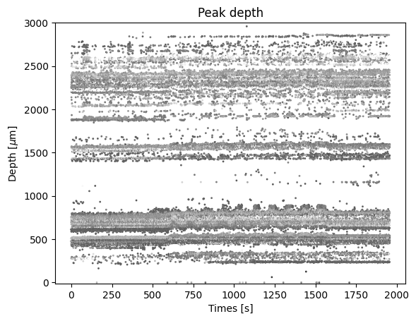

Benchmark spike sorting with hybrid recordings
==============================================

This example shows how to use the SpikeInterface hybrid recordings
framework to benchmark spike sorting results.

Hybrid recordings are built from existing recordings by injecting units
with known spiking activity. The template (aka average waveforms) of the
injected units can be from previous spike sorted data. In this example,
we will be using an open database of templates that we have constructed
from the International Brain Laboratory - Brain Wide Map (available on
`DANDI <https://dandiarchive.org/dandiset/000409?search=IBL&page=2&sortOption=0&sortDir=-1&showDrafts=true&showEmpty=false&pos=9>`__).

Importantly, recordings from long-shank probes, such as Neuropixels,
usually experience drifts. Such drifts have to be taken into account in
order to smoothly inject spikes into the recording.

.. code:: ipython3

    import spikeinterface as si
    import spikeinterface.extractors as se
    import spikeinterface.preprocessing as spre
    import spikeinterface.comparison as sc
    import spikeinterface.generation as sgen
    import spikeinterface.widgets as sw

    from spikeinterface.sortingcomponents.motion_estimation import estimate_motion

    import numpy as np
    import matplotlib.pyplot as plt
    from pathlib import Path

.. code:: ipython3

    %matplotlib inline

.. code:: ipython3

    si.set_global_job_kwargs(n_jobs=16)

To make this notebook self-contained, we will simulate a drifting
recording similar to the one acquired by Nick Steinmetz and available
`here <https://doi.org/10.6084/m9.figshare.14024495.v1>`__, where an
triangular motion was imposed to the recording by moving the probe up
and down with a micro-manipulator.

.. code:: ipython3

    generate_displacement_vector_kwargs = {
        "motion_list": [
            {
                "drift_mode": "zigzag",
                "non_rigid_gradient": None,
                "t_start_drift": 30.0,
                "t_end_drift": 210,
                "period_s": 60,
            }
        ],
        "drift_start_um": [0, 60],
        "drift_stop_um": [0, -60],
    }

    # this generates a "static" and "drifting" recording version
    static_recording, drifting_recording, sorting = sgen.generate_drifting_recording(
        probe_name="Neuropixel-384",
        seed=23,
        duration=240,
        num_units=100,
        generate_displacement_vector_kwargs=generate_displacement_vector_kwargs,
    )

    # we sort the channels by depth, to match the  hybrid templates
    drifting_recording = spre.depth_order(drifting_recording)

To visualize the drift, we can estimate the motion and plot it:

.. code:: ipython3

    _, motion_info = spre.correct_motion(
        drifting_recording,
        preset="nonrigid_fast_and_accurate",
        n_jobs=4,
        progress_bar=True,
        output_motion_info=True
    )

.. parsed-literal::

    detect and localize:   0%|          | 0/240 [00:00<?, ?it/s]

.. code:: ipython3

    ax = sw.plot_drift_map(
        peaks=motion_info["peaks"],
        peak_locations=motion_info["peak_locations"],
        recording=drifting_recording,
        cmap="Greys_r",
    )

Retrieve templates from database
--------------------------------

.. code:: ipython3

    templates_info = sgen.fetch_templates_database_info()

.. code:: ipython3

    print(len(templates_info))

.. parsed-literal::

    601

.. code:: ipython3

    templates_info.head()

.. raw:: html

    

    
    <table border="1" class="dataframe">
      <thead>
        <tr style="text-align: right;">
          <th></th>
          <th>probe</th>
          <th>probe_manufacturer</th>
          <th>brain_area</th>
          <th>depth_along_probe</th>
          <th>amplitude_uv</th>
          <th>noise_level_uv</th>
          <th>signal_to_noise_ratio</th>
          <th>template_index</th>
          <th>best_channel_index</th>
          <th>spikes_per_unit</th>
          <th>dataset</th>
          <th>dataset_path</th>
        </tr>
      </thead>
      <tbody>
        <tr>
          <th>0</th>
          <td>Neuropixels 1.0</td>
          <td>IMEC</td>
          <td>PVT</td>
          <td>60.0</td>
          <td>197.258440</td>
          <td>17.952494</td>
          <td>10.987802</td>
          <td>0</td>
          <td>6</td>
          <td>6293</td>
          <td>000409_sub-KS043_ses-9468fa93-21ae-4984-955c-e...</td>
          <td>s3://spikeinterface-template-database/000409_s...</td>
        </tr>
        <tr>
          <th>1</th>
          <td>Neuropixels 1.0</td>
          <td>IMEC</td>
          <td>PVT</td>
          <td>80.0</td>
          <td>111.848290</td>
          <td>20.329010</td>
          <td>5.501905</td>
          <td>1</td>
          <td>9</td>
          <td>8379</td>
          <td>000409_sub-KS043_ses-9468fa93-21ae-4984-955c-e...</td>
          <td>s3://spikeinterface-template-database/000409_s...</td>
        </tr>
        <tr>
          <th>2</th>
          <td>Neuropixels 1.0</td>
          <td>IMEC</td>
          <td>PVT</td>
          <td>80.0</td>
          <td>212.141510</td>
          <td>17.189373</td>
          <td>12.341434</td>
          <td>2</td>
          <td>8</td>
          <td>2940</td>
          <td>000409_sub-KS043_ses-9468fa93-21ae-4984-955c-e...</td>
          <td>s3://spikeinterface-template-database/000409_s...</td>
        </tr>
        <tr>
          <th>3</th>
          <td>Neuropixels 1.0</td>
          <td>IMEC</td>
          <td>PVT</td>
          <td>120.0</td>
          <td>118.650696</td>
          <td>19.815313</td>
          <td>5.987828</td>
          <td>3</td>
          <td>12</td>
          <td>3674</td>
          <td>000409_sub-KS043_ses-9468fa93-21ae-4984-955c-e...</td>
          <td>s3://spikeinterface-template-database/000409_s...</td>
        </tr>
        <tr>
          <th>4</th>
          <td>Neuropixels 1.0</td>
          <td>IMEC</td>
          <td>PVT</td>
          <td>140.0</td>
          <td>111.785810</td>
          <td>22.470306</td>
          <td>4.974824</td>
          <td>4</td>
          <td>15</td>
          <td>5834</td>
          <td>000409_sub-KS043_ses-9468fa93-21ae-4984-955c-e...</td>
          <td>s3://spikeinterface-template-database/000409_s...</td>
        </tr>
      </tbody>
    </table>
    

.. code:: ipython3

    available_brain_areas = np.unique(templates_info.brain_area)
    print(f"Available brain areas: {available_brain_areas}")

.. parsed-literal::

    Available brain areas: ['ACAd6a' 'ACAv5' 'ACAv6a' 'AIp6a' 'AIp6b' 'AUDp6a' 'AUDv6a' 'CA1' 'CA3'
     'CENT2' 'CENT3' 'CLA' 'COApm' 'CP' 'DG-sg' 'ECT5' 'ENTl3' 'ICd' 'ICe'
     'IRN' 'LGd-sh' 'LP' 'LSc' 'MB' 'MEA' 'MGm' 'MOs5' 'MRN' 'MV' 'MY' 'NLL'
     'P' 'PA' 'PAG' 'PARN' 'PB' 'PERI2/3' 'PERI5' 'PIR' 'PSV' 'PVT' 'Pa4'
     'PoT' 'RN' 'RSPagl5' 'RSPagl6a' 'RSPd5' 'RSPd6a' 'RSPv5' 'SCdg' 'SCig'
     'SCiw' 'SCsg' 'SF' 'SGN' 'SPFp' 'SSp-n5' 'SSp-n6a' 'SSs6a' 'SSs6b' 'SUT'
     'TEa5' 'TEa6a' 'TRS' 'VII' 'VISa5' 'VISa6a' 'VISp5' 'VISp6a' 'VISrl6b'
     'VPL' 'VPM' 'arb' 'ccb' 'ec' 'ee' 'fiber tracts' 'int' 'll' 'opt' 'scp']

.. code:: ipython3

    # let's perform a query: templates from visual brain regions and at the "top" of the probe
    target_area = ["VISa5", "VISa6a", "VISp5", "VISp6a", "VISrl6b"]
    minimum_depth = 1500
    templates_selected_info = templates_info.query(f"brain_area in {target_area} and depth_along_probe > {minimum_depth}")
    len(templates_selected_info)

.. parsed-literal::

    31

We can now retrieve the selected templates as a ``Templates`` object

.. code:: ipython3

    templates_selected = sgen.query_templates_from_database(templates_selected_info, verbose=True)
    print(templates_selected)

.. parsed-literal::

    Fetching templates from 2 datasets
    Templates: 31 units - 240 samples - 384 channels
    sampling_frequency=30.00 kHz - ms_before=3.00 ms - ms_after=5.00 ms
    Probe - IMEC - Neuropixels 1.0 - 18194814141 - 384ch - 1shanks

While we selected templates from a target aread and at certain depths,
we can see that the template amplitudes are quite large. This will make
spike sorting easy… we can further manipulate the ``Templates`` by
rescaling, relocating, or further selections with the
``sgen.scale_template_to_range``, ``sgen.relocate_templates``, and
``sgen.select_templates`` functions.

In our case, let’s rescale the amplitudes between 50 and 150
:math:`\mu`\ V and relocate them throughout the entire depth of the
probe.

.. code:: ipython3

    min_amplitude = 50
    max_amplitude = 150
    templates_scaled = sgen.scale_template_to_range(
        templates=templates_selected,
        min_amplitude=min_amplitude,
        max_amplitude=max_amplitude
    )

.. code:: ipython3

    min_displacement = 200
    max_displacement = 4000
    templates_relocated = sgen.relocate_templates(
        templates=templates_scaled,
        min_displacement=min_displacement,
        max_displacement=max_displacement
    )

Let’s plot the selected templates:

.. code:: ipython3

    sparsity_plot = si.compute_sparsity(templates_relocated)
    fig = plt.figure(figsize=(10, 10))
    w = sw.plot_unit_templates(templates_relocated, sparsity=sparsity_plot, ncols=4, figure=fig)
    w.figure.subplots_adjust(wspace=0.5, hspace=0.7)

.. image:: benchmark_with_hybrid_recordings_files/benchmark_with_hybrid_recordings_22_0.png

Constructing hybrid recordings
------------------------------

.. code:: ipython3

    recording_hybrid_no_drift, sorting_hybrid = sgen.generate_hybrid_recording(
        recording=drifting_recording, templates=templates_relocated, seed=2308
    )
    recording_hybrid_no_drift

.. raw:: html

    
<strong>InjectTemplatesRecording: 384 channels - 30.0kHz - 1 segments - 7,200,000 samples - 240.00s (4.00 minutes) - float32 dtype - 10.30 GiB</strong>

  
<strong>Channel IDs</strong>
<ul>[ 96 288   0 192  97 289   1 193  98 290   2 194  99 291   3 195 100 292
       4 196 101 293   5 197 102 294   6 198 103 295   7 199 104 296   8 200
     105 297   9 201 106 298  10 202 107 299  11 203 108 300  12 204 109 301
      13 205 110 302  14 206 111 303  15 207 112 304  16 208 113 305  17 209
     114 306  18 210 115 307  19 211 116 308  20 212 117 309  21 213 118 310
      22 214 119 311  23 215 120 312  24 216 121 313  25 217 122 314  26 218
     123 315  27 219 124 316  28 220 125 317  29 221 126 318  30 222 127 319
      31 223 128 320  32 224 129 321  33 225 130 322  34 226 131 323  35 227
     132 324  36 228 133 325  37 229 134 326  38 230 135 327  39 231 136 328
      40 232 137 329  41 233 138 330  42 234 139 331  43 235 140 332  44 236
     141 333  45 237 142 334  46 238 143 335  47 239 144 336  48 240 145 337
      49 241 146 338  50 242 147 339  51 243 148 340  52 244 149 341  53 245
     150 342  54 246 151 343  55 247 152 344  56 248 153 345  57 249 154 346
      58 250 155 347  59 251 156 348  60 252 157 349  61 253 158 350  62 254
     159 351  63 255 160 352  64 256 161 353  65 257 162 354  66 258 163 355
      67 259 164 356  68 260 165 357  69 261 166 358  70 262 167 359  71 263
     168 360  72 264 169 361  73 265 170 362  74 266 171 363  75 267 172 364
      76 268 173 365  77 269 174 366  78 270 175 367  79 271 176 368  80 272
     177 369  81 273 178 370  82 274 179 371  83 275 180 372  84 276 181 373
      85 277 182 374  86 278 183 375  87 279 184 376  88 280 185 377  89 281
     186 378  90 282 187 379  91 283 188 380  92 284 189 381  93 285 190 382
      94 286 191 383  95 287] 

  
<strong>Annotations</strong>
<ul><li> <strong> is_filtered </strong>: False</li><li> <strong> probe_0_planar_contour </strong>: [[ -25. 3845.]
     [ -25.  -25.]
     [  24. -125.]
     [  73.  -25.]
     [  73. 3845.]]</li><li> <strong> probes_info </strong>: [{}]</li></ul> 

<strong>Channel Properties</strong>
<ul>

 <strong> contact_vector </strong> 
[(0, 16.,    0., 'square', 12., '', '96',   0, 'um', 1., 0., 0., 1.)
     (0, 48.,    0., 'square', 12., '', '288',   1, 'um', 1., 0., 0., 1.)
     (0,  0.,   20., 'square', 12., '', '0',   2, 'um', 1., 0., 0., 1.)
     (0, 32.,   20., 'square', 12., '', '192',   3, 'um', 1., 0., 0., 1.)
     (0, 16.,   40., 'square', 12., '', '97',   4, 'um', 1., 0., 0., 1.)
     (0, 48.,   40., 'square', 12., '', '289',   5, 'um', 1., 0., 0., 1.)
     (0,  0.,   60., 'square', 12., '', '1',   6, 'um', 1., 0., 0., 1.)
     (0, 32.,   60., 'square', 12., '', '193',   7, 'um', 1., 0., 0., 1.)
     (0, 16.,   80., 'square', 12., '', '98',   8, 'um', 1., 0., 0., 1.)
     (0, 48.,   80., 'square', 12., '', '290',   9, 'um', 1., 0., 0., 1.)
     (0,  0.,  100., 'square', 12., '', '2',  10, 'um', 1., 0., 0., 1.)
     (0, 32.,  100., 'square', 12., '', '194',  11, 'um', 1., 0., 0., 1.)
     (0, 16.,  120., 'square', 12., '', '99',  12, 'um', 1., 0., 0., 1.)
     (0, 48.,  120., 'square', 12., '', '291',  13, 'um', 1., 0., 0., 1.)
     (0,  0.,  140., 'square', 12., '', '3',  14, 'um', 1., 0., 0., 1.)
     (0, 32.,  140., 'square', 12., '', '195',  15, 'um', 1., 0., 0., 1.)
     (0, 16.,  160., 'square', 12., '', '100',  16, 'um', 1., 0., 0., 1.)
     (0, 48.,  160., 'square', 12., '', '292',  17, 'um', 1., 0., 0., 1.)
     (0,  0.,  180., 'square', 12., '', '4',  18, 'um', 1., 0., 0., 1.)
     (0, 32.,  180., 'square', 12., '', '196',  19, 'um', 1., 0., 0., 1.)
     (0, 16.,  200., 'square', 12., '', '101',  20, 'um', 1., 0., 0., 1.)
     (0, 48.,  200., 'square', 12., '', '293',  21, 'um', 1., 0., 0., 1.)
     (0,  0.,  220., 'square', 12., '', '5',  22, 'um', 1., 0., 0., 1.)
     (0, 32.,  220., 'square', 12., '', '197',  23, 'um', 1., 0., 0., 1.)
     (0, 16.,  240., 'square', 12., '', '102',  24, 'um', 1., 0., 0., 1.)
     (0, 48.,  240., 'square', 12., '', '294',  25, 'um', 1., 0., 0., 1.)
     (0,  0.,  260., 'square', 12., '', '6',  26, 'um', 1., 0., 0., 1.)
     (0, 32.,  260., 'square', 12., '', '198',  27, 'um', 1., 0., 0., 1.)
     (0, 16.,  280., 'square', 12., '', '103',  28, 'um', 1., 0., 0., 1.)
     (0, 48.,  280., 'square', 12., '', '295',  29, 'um', 1., 0., 0., 1.)
     (0,  0.,  300., 'square', 12., '', '7',  30, 'um', 1., 0., 0., 1.)
     (0, 32.,  300., 'square', 12., '', '199',  31, 'um', 1., 0., 0., 1.)
     (0, 16.,  320., 'square', 12., '', '104',  32, 'um', 1., 0., 0., 1.)
     (0, 48.,  320., 'square', 12., '', '296',  33, 'um', 1., 0., 0., 1.)
     (0,  0.,  340., 'square', 12., '', '8',  34, 'um', 1., 0., 0., 1.)
     (0, 32.,  340., 'square', 12., '', '200',  35, 'um', 1., 0., 0., 1.)
     (0, 16.,  360., 'square', 12., '', '105',  36, 'um', 1., 0., 0., 1.)
     (0, 48.,  360., 'square', 12., '', '297',  37, 'um', 1., 0., 0., 1.)
     (0,  0.,  380., 'square', 12., '', '9',  38, 'um', 1., 0., 0., 1.)
     (0, 32.,  380., 'square', 12., '', '201',  39, 'um', 1., 0., 0., 1.)
     (0, 16.,  400., 'square', 12., '', '106',  40, 'um', 1., 0., 0., 1.)
     (0, 48.,  400., 'square', 12., '', '298',  41, 'um', 1., 0., 0., 1.)
     (0,  0.,  420., 'square', 12., '', '10',  42, 'um', 1., 0., 0., 1.)
     (0, 32.,  420., 'square', 12., '', '202',  43, 'um', 1., 0., 0., 1.)
     (0, 16.,  440., 'square', 12., '', '107',  44, 'um', 1., 0., 0., 1.)
     (0, 48.,  440., 'square', 12., '', '299',  45, 'um', 1., 0., 0., 1.)
     (0,  0.,  460., 'square', 12., '', '11',  46, 'um', 1., 0., 0., 1.)
     (0, 32.,  460., 'square', 12., '', '203',  47, 'um', 1., 0., 0., 1.)
     (0, 16.,  480., 'square', 12., '', '108',  48, 'um', 1., 0., 0., 1.)
     (0, 48.,  480., 'square', 12., '', '300',  49, 'um', 1., 0., 0., 1.)
     (0,  0.,  500., 'square', 12., '', '12',  50, 'um', 1., 0., 0., 1.)
     (0, 32.,  500., 'square', 12., '', '204',  51, 'um', 1., 0., 0., 1.)
     (0, 16.,  520., 'square', 12., '', '109',  52, 'um', 1., 0., 0., 1.)
     (0, 48.,  520., 'square', 12., '', '301',  53, 'um', 1., 0., 0., 1.)
     (0,  0.,  540., 'square', 12., '', '13',  54, 'um', 1., 0., 0., 1.)
     (0, 32.,  540., 'square', 12., '', '205',  55, 'um', 1., 0., 0., 1.)
     (0, 16.,  560., 'square', 12., '', '110',  56, 'um', 1., 0., 0., 1.)
     (0, 48.,  560., 'square', 12., '', '302',  57, 'um', 1., 0., 0., 1.)
     (0,  0.,  580., 'square', 12., '', '14',  58, 'um', 1., 0., 0., 1.)
     (0, 32.,  580., 'square', 12., '', '206',  59, 'um', 1., 0., 0., 1.)
     (0, 16.,  600., 'square', 12., '', '111',  60, 'um', 1., 0., 0., 1.)
     (0, 48.,  600., 'square', 12., '', '303',  61, 'um', 1., 0., 0., 1.)
     (0,  0.,  620., 'square', 12., '', '15',  62, 'um', 1., 0., 0., 1.)
     (0, 32.,  620., 'square', 12., '', '207',  63, 'um', 1., 0., 0., 1.)
     (0, 16.,  640., 'square', 12., '', '112',  64, 'um', 1., 0., 0., 1.)
     (0, 48.,  640., 'square', 12., '', '304',  65, 'um', 1., 0., 0., 1.)
     (0,  0.,  660., 'square', 12., '', '16',  66, 'um', 1., 0., 0., 1.)
     (0, 32.,  660., 'square', 12., '', '208',  67, 'um', 1., 0., 0., 1.)
     (0, 16.,  680., 'square', 12., '', '113',  68, 'um', 1., 0., 0., 1.)
     (0, 48.,  680., 'square', 12., '', '305',  69, 'um', 1., 0., 0., 1.)
     (0,  0.,  700., 'square', 12., '', '17',  70, 'um', 1., 0., 0., 1.)
     (0, 32.,  700., 'square', 12., '', '209',  71, 'um', 1., 0., 0., 1.)
     (0, 16.,  720., 'square', 12., '', '114',  72, 'um', 1., 0., 0., 1.)
     (0, 48.,  720., 'square', 12., '', '306',  73, 'um', 1., 0., 0., 1.)
     (0,  0.,  740., 'square', 12., '', '18',  74, 'um', 1., 0., 0., 1.)
     (0, 32.,  740., 'square', 12., '', '210',  75, 'um', 1., 0., 0., 1.)
     (0, 16.,  760., 'square', 12., '', '115',  76, 'um', 1., 0., 0., 1.)
     (0, 48.,  760., 'square', 12., '', '307',  77, 'um', 1., 0., 0., 1.)
     (0,  0.,  780., 'square', 12., '', '19',  78, 'um', 1., 0., 0., 1.)
     (0, 32.,  780., 'square', 12., '', '211',  79, 'um', 1., 0., 0., 1.)
     (0, 16.,  800., 'square', 12., '', '116',  80, 'um', 1., 0., 0., 1.)
     (0, 48.,  800., 'square', 12., '', '308',  81, 'um', 1., 0., 0., 1.)
     (0,  0.,  820., 'square', 12., '', '20',  82, 'um', 1., 0., 0., 1.)
     (0, 32.,  820., 'square', 12., '', '212',  83, 'um', 1., 0., 0., 1.)
     (0, 16.,  840., 'square', 12., '', '117',  84, 'um', 1., 0., 0., 1.)
     (0, 48.,  840., 'square', 12., '', '309',  85, 'um', 1., 0., 0., 1.)
     (0,  0.,  860., 'square', 12., '', '21',  86, 'um', 1., 0., 0., 1.)
     (0, 32.,  860., 'square', 12., '', '213',  87, 'um', 1., 0., 0., 1.)
     (0, 16.,  880., 'square', 12., '', '118',  88, 'um', 1., 0., 0., 1.)
     (0, 48.,  880., 'square', 12., '', '310',  89, 'um', 1., 0., 0., 1.)
     (0,  0.,  900., 'square', 12., '', '22',  90, 'um', 1., 0., 0., 1.)
     (0, 32.,  900., 'square', 12., '', '214',  91, 'um', 1., 0., 0., 1.)
     (0, 16.,  920., 'square', 12., '', '119',  92, 'um', 1., 0., 0., 1.)
     (0, 48.,  920., 'square', 12., '', '311',  93, 'um', 1., 0., 0., 1.)
     (0,  0.,  940., 'square', 12., '', '23',  94, 'um', 1., 0., 0., 1.)
     (0, 32.,  940., 'square', 12., '', '215',  95, 'um', 1., 0., 0., 1.)
     (0, 16.,  960., 'square', 12., '', '120',  96, 'um', 1., 0., 0., 1.)
     (0, 48.,  960., 'square', 12., '', '312',  97, 'um', 1., 0., 0., 1.)
     (0,  0.,  980., 'square', 12., '', '24',  98, 'um', 1., 0., 0., 1.)
     (0, 32.,  980., 'square', 12., '', '216',  99, 'um', 1., 0., 0., 1.)
     (0, 16., 1000., 'square', 12., '', '121', 100, 'um', 1., 0., 0., 1.)
     (0, 48., 1000., 'square', 12., '', '313', 101, 'um', 1., 0., 0., 1.)
     (0,  0., 1020., 'square', 12., '', '25', 102, 'um', 1., 0., 0., 1.)
     (0, 32., 1020., 'square', 12., '', '217', 103, 'um', 1., 0., 0., 1.)
     (0, 16., 1040., 'square', 12., '', '122', 104, 'um', 1., 0., 0., 1.)
     (0, 48., 1040., 'square', 12., '', '314', 105, 'um', 1., 0., 0., 1.)
     (0,  0., 1060., 'square', 12., '', '26', 106, 'um', 1., 0., 0., 1.)
     (0, 32., 1060., 'square', 12., '', '218', 107, 'um', 1., 0., 0., 1.)
     (0, 16., 1080., 'square', 12., '', '123', 108, 'um', 1., 0., 0., 1.)
     (0, 48., 1080., 'square', 12., '', '315', 109, 'um', 1., 0., 0., 1.)
     (0,  0., 1100., 'square', 12., '', '27', 110, 'um', 1., 0., 0., 1.)
     (0, 32., 1100., 'square', 12., '', '219', 111, 'um', 1., 0., 0., 1.)
     (0, 16., 1120., 'square', 12., '', '124', 112, 'um', 1., 0., 0., 1.)
     (0, 48., 1120., 'square', 12., '', '316', 113, 'um', 1., 0., 0., 1.)
     (0,  0., 1140., 'square', 12., '', '28', 114, 'um', 1., 0., 0., 1.)
     (0, 32., 1140., 'square', 12., '', '220', 115, 'um', 1., 0., 0., 1.)
     (0, 16., 1160., 'square', 12., '', '125', 116, 'um', 1., 0., 0., 1.)
     (0, 48., 1160., 'square', 12., '', '317', 117, 'um', 1., 0., 0., 1.)
     (0,  0., 1180., 'square', 12., '', '29', 118, 'um', 1., 0., 0., 1.)
     (0, 32., 1180., 'square', 12., '', '221', 119, 'um', 1., 0., 0., 1.)
     (0, 16., 1200., 'square', 12., '', '126', 120, 'um', 1., 0., 0., 1.)
     (0, 48., 1200., 'square', 12., '', '318', 121, 'um', 1., 0., 0., 1.)
     (0,  0., 1220., 'square', 12., '', '30', 122, 'um', 1., 0., 0., 1.)
     (0, 32., 1220., 'square', 12., '', '222', 123, 'um', 1., 0., 0., 1.)
     (0, 16., 1240., 'square', 12., '', '127', 124, 'um', 1., 0., 0., 1.)
     (0, 48., 1240., 'square', 12., '', '319', 125, 'um', 1., 0., 0., 1.)
     (0,  0., 1260., 'square', 12., '', '31', 126, 'um', 1., 0., 0., 1.)
     (0, 32., 1260., 'square', 12., '', '223', 127, 'um', 1., 0., 0., 1.)
     (0, 16., 1280., 'square', 12., '', '128', 128, 'um', 1., 0., 0., 1.)
     (0, 48., 1280., 'square', 12., '', '320', 129, 'um', 1., 0., 0., 1.)
     (0,  0., 1300., 'square', 12., '', '32', 130, 'um', 1., 0., 0., 1.)
     (0, 32., 1300., 'square', 12., '', '224', 131, 'um', 1., 0., 0., 1.)
     (0, 16., 1320., 'square', 12., '', '129', 132, 'um', 1., 0., 0., 1.)
     (0, 48., 1320., 'square', 12., '', '321', 133, 'um', 1., 0., 0., 1.)
     (0,  0., 1340., 'square', 12., '', '33', 134, 'um', 1., 0., 0., 1.)
     (0, 32., 1340., 'square', 12., '', '225', 135, 'um', 1., 0., 0., 1.)
     (0, 16., 1360., 'square', 12., '', '130', 136, 'um', 1., 0., 0., 1.)
     (0, 48., 1360., 'square', 12., '', '322', 137, 'um', 1., 0., 0., 1.)
     (0,  0., 1380., 'square', 12., '', '34', 138, 'um', 1., 0., 0., 1.)
     (0, 32., 1380., 'square', 12., '', '226', 139, 'um', 1., 0., 0., 1.)
     (0, 16., 1400., 'square', 12., '', '131', 140, 'um', 1., 0., 0., 1.)
     (0, 48., 1400., 'square', 12., '', '323', 141, 'um', 1., 0., 0., 1.)
     (0,  0., 1420., 'square', 12., '', '35', 142, 'um', 1., 0., 0., 1.)
     (0, 32., 1420., 'square', 12., '', '227', 143, 'um', 1., 0., 0., 1.)
     (0, 16., 1440., 'square', 12., '', '132', 144, 'um', 1., 0., 0., 1.)
     (0, 48., 1440., 'square', 12., '', '324', 145, 'um', 1., 0., 0., 1.)
     (0,  0., 1460., 'square', 12., '', '36', 146, 'um', 1., 0., 0., 1.)
     (0, 32., 1460., 'square', 12., '', '228', 147, 'um', 1., 0., 0., 1.)
     (0, 16., 1480., 'square', 12., '', '133', 148, 'um', 1., 0., 0., 1.)
     (0, 48., 1480., 'square', 12., '', '325', 149, 'um', 1., 0., 0., 1.)
     (0,  0., 1500., 'square', 12., '', '37', 150, 'um', 1., 0., 0., 1.)
     (0, 32., 1500., 'square', 12., '', '229', 151, 'um', 1., 0., 0., 1.)
     (0, 16., 1520., 'square', 12., '', '134', 152, 'um', 1., 0., 0., 1.)
     (0, 48., 1520., 'square', 12., '', '326', 153, 'um', 1., 0., 0., 1.)
     (0,  0., 1540., 'square', 12., '', '38', 154, 'um', 1., 0., 0., 1.)
     (0, 32., 1540., 'square', 12., '', '230', 155, 'um', 1., 0., 0., 1.)
     (0, 16., 1560., 'square', 12., '', '135', 156, 'um', 1., 0., 0., 1.)
     (0, 48., 1560., 'square', 12., '', '327', 157, 'um', 1., 0., 0., 1.)
     (0,  0., 1580., 'square', 12., '', '39', 158, 'um', 1., 0., 0., 1.)
     (0, 32., 1580., 'square', 12., '', '231', 159, 'um', 1., 0., 0., 1.)
     (0, 16., 1600., 'square', 12., '', '136', 160, 'um', 1., 0., 0., 1.)
     (0, 48., 1600., 'square', 12., '', '328', 161, 'um', 1., 0., 0., 1.)
     (0,  0., 1620., 'square', 12., '', '40', 162, 'um', 1., 0., 0., 1.)
     (0, 32., 1620., 'square', 12., '', '232', 163, 'um', 1., 0., 0., 1.)
     (0, 16., 1640., 'square', 12., '', '137', 164, 'um', 1., 0., 0., 1.)
     (0, 48., 1640., 'square', 12., '', '329', 165, 'um', 1., 0., 0., 1.)
     (0,  0., 1660., 'square', 12., '', '41', 166, 'um', 1., 0., 0., 1.)
     (0, 32., 1660., 'square', 12., '', '233', 167, 'um', 1., 0., 0., 1.)
     (0, 16., 1680., 'square', 12., '', '138', 168, 'um', 1., 0., 0., 1.)
     (0, 48., 1680., 'square', 12., '', '330', 169, 'um', 1., 0., 0., 1.)
     (0,  0., 1700., 'square', 12., '', '42', 170, 'um', 1., 0., 0., 1.)
     (0, 32., 1700., 'square', 12., '', '234', 171, 'um', 1., 0., 0., 1.)
     (0, 16., 1720., 'square', 12., '', '139', 172, 'um', 1., 0., 0., 1.)
     (0, 48., 1720., 'square', 12., '', '331', 173, 'um', 1., 0., 0., 1.)
     (0,  0., 1740., 'square', 12., '', '43', 174, 'um', 1., 0., 0., 1.)
     (0, 32., 1740., 'square', 12., '', '235', 175, 'um', 1., 0., 0., 1.)
     (0, 16., 1760., 'square', 12., '', '140', 176, 'um', 1., 0., 0., 1.)
     (0, 48., 1760., 'square', 12., '', '332', 177, 'um', 1., 0., 0., 1.)
     (0,  0., 1780., 'square', 12., '', '44', 178, 'um', 1., 0., 0., 1.)
     (0, 32., 1780., 'square', 12., '', '236', 179, 'um', 1., 0., 0., 1.)
     (0, 16., 1800., 'square', 12., '', '141', 180, 'um', 1., 0., 0., 1.)
     (0, 48., 1800., 'square', 12., '', '333', 181, 'um', 1., 0., 0., 1.)
     (0,  0., 1820., 'square', 12., '', '45', 182, 'um', 1., 0., 0., 1.)
     (0, 32., 1820., 'square', 12., '', '237', 183, 'um', 1., 0., 0., 1.)
     (0, 16., 1840., 'square', 12., '', '142', 184, 'um', 1., 0., 0., 1.)
     (0, 48., 1840., 'square', 12., '', '334', 185, 'um', 1., 0., 0., 1.)
     (0,  0., 1860., 'square', 12., '', '46', 186, 'um', 1., 0., 0., 1.)
     (0, 32., 1860., 'square', 12., '', '238', 187, 'um', 1., 0., 0., 1.)
     (0, 16., 1880., 'square', 12., '', '143', 188, 'um', 1., 0., 0., 1.)
     (0, 48., 1880., 'square', 12., '', '335', 189, 'um', 1., 0., 0., 1.)
     (0,  0., 1900., 'square', 12., '', '47', 190, 'um', 1., 0., 0., 1.)
     (0, 32., 1900., 'square', 12., '', '239', 191, 'um', 1., 0., 0., 1.)
     (0, 16., 1920., 'square', 12., '', '144', 192, 'um', 1., 0., 0., 1.)
     (0, 48., 1920., 'square', 12., '', '336', 193, 'um', 1., 0., 0., 1.)
     (0,  0., 1940., 'square', 12., '', '48', 194, 'um', 1., 0., 0., 1.)
     (0, 32., 1940., 'square', 12., '', '240', 195, 'um', 1., 0., 0., 1.)
     (0, 16., 1960., 'square', 12., '', '145', 196, 'um', 1., 0., 0., 1.)
     (0, 48., 1960., 'square', 12., '', '337', 197, 'um', 1., 0., 0., 1.)
     (0,  0., 1980., 'square', 12., '', '49', 198, 'um', 1., 0., 0., 1.)
     (0, 32., 1980., 'square', 12., '', '241', 199, 'um', 1., 0., 0., 1.)
     (0, 16., 2000., 'square', 12., '', '146', 200, 'um', 1., 0., 0., 1.)
     (0, 48., 2000., 'square', 12., '', '338', 201, 'um', 1., 0., 0., 1.)
     (0,  0., 2020., 'square', 12., '', '50', 202, 'um', 1., 0., 0., 1.)
     (0, 32., 2020., 'square', 12., '', '242', 203, 'um', 1., 0., 0., 1.)
     (0, 16., 2040., 'square', 12., '', '147', 204, 'um', 1., 0., 0., 1.)
     (0, 48., 2040., 'square', 12., '', '339', 205, 'um', 1., 0., 0., 1.)
     (0,  0., 2060., 'square', 12., '', '51', 206, 'um', 1., 0., 0., 1.)
     (0, 32., 2060., 'square', 12., '', '243', 207, 'um', 1., 0., 0., 1.)
     (0, 16., 2080., 'square', 12., '', '148', 208, 'um', 1., 0., 0., 1.)
     (0, 48., 2080., 'square', 12., '', '340', 209, 'um', 1., 0., 0., 1.)
     (0,  0., 2100., 'square', 12., '', '52', 210, 'um', 1., 0., 0., 1.)
     (0, 32., 2100., 'square', 12., '', '244', 211, 'um', 1., 0., 0., 1.)
     (0, 16., 2120., 'square', 12., '', '149', 212, 'um', 1., 0., 0., 1.)
     (0, 48., 2120., 'square', 12., '', '341', 213, 'um', 1., 0., 0., 1.)
     (0,  0., 2140., 'square', 12., '', '53', 214, 'um', 1., 0., 0., 1.)
     (0, 32., 2140., 'square', 12., '', '245', 215, 'um', 1., 0., 0., 1.)
     (0, 16., 2160., 'square', 12., '', '150', 216, 'um', 1., 0., 0., 1.)
     (0, 48., 2160., 'square', 12., '', '342', 217, 'um', 1., 0., 0., 1.)
     (0,  0., 2180., 'square', 12., '', '54', 218, 'um', 1., 0., 0., 1.)
     (0, 32., 2180., 'square', 12., '', '246', 219, 'um', 1., 0., 0., 1.)
     (0, 16., 2200., 'square', 12., '', '151', 220, 'um', 1., 0., 0., 1.)
     (0, 48., 2200., 'square', 12., '', '343', 221, 'um', 1., 0., 0., 1.)
     (0,  0., 2220., 'square', 12., '', '55', 222, 'um', 1., 0., 0., 1.)
     (0, 32., 2220., 'square', 12., '', '247', 223, 'um', 1., 0., 0., 1.)
     (0, 16., 2240., 'square', 12., '', '152', 224, 'um', 1., 0., 0., 1.)
     (0, 48., 2240., 'square', 12., '', '344', 225, 'um', 1., 0., 0., 1.)
     (0,  0., 2260., 'square', 12., '', '56', 226, 'um', 1., 0., 0., 1.)
     (0, 32., 2260., 'square', 12., '', '248', 227, 'um', 1., 0., 0., 1.)
     (0, 16., 2280., 'square', 12., '', '153', 228, 'um', 1., 0., 0., 1.)
     (0, 48., 2280., 'square', 12., '', '345', 229, 'um', 1., 0., 0., 1.)
     (0,  0., 2300., 'square', 12., '', '57', 230, 'um', 1., 0., 0., 1.)
     (0, 32., 2300., 'square', 12., '', '249', 231, 'um', 1., 0., 0., 1.)
     (0, 16., 2320., 'square', 12., '', '154', 232, 'um', 1., 0., 0., 1.)
     (0, 48., 2320., 'square', 12., '', '346', 233, 'um', 1., 0., 0., 1.)
     (0,  0., 2340., 'square', 12., '', '58', 234, 'um', 1., 0., 0., 1.)
     (0, 32., 2340., 'square', 12., '', '250', 235, 'um', 1., 0., 0., 1.)
     (0, 16., 2360., 'square', 12., '', '155', 236, 'um', 1., 0., 0., 1.)
     (0, 48., 2360., 'square', 12., '', '347', 237, 'um', 1., 0., 0., 1.)
     (0,  0., 2380., 'square', 12., '', '59', 238, 'um', 1., 0., 0., 1.)
     (0, 32., 2380., 'square', 12., '', '251', 239, 'um', 1., 0., 0., 1.)
     (0, 16., 2400., 'square', 12., '', '156', 240, 'um', 1., 0., 0., 1.)
     (0, 48., 2400., 'square', 12., '', '348', 241, 'um', 1., 0., 0., 1.)
     (0,  0., 2420., 'square', 12., '', '60', 242, 'um', 1., 0., 0., 1.)
     (0, 32., 2420., 'square', 12., '', '252', 243, 'um', 1., 0., 0., 1.)
     (0, 16., 2440., 'square', 12., '', '157', 244, 'um', 1., 0., 0., 1.)
     (0, 48., 2440., 'square', 12., '', '349', 245, 'um', 1., 0., 0., 1.)
     (0,  0., 2460., 'square', 12., '', '61', 246, 'um', 1., 0., 0., 1.)
     (0, 32., 2460., 'square', 12., '', '253', 247, 'um', 1., 0., 0., 1.)
     (0, 16., 2480., 'square', 12., '', '158', 248, 'um', 1., 0., 0., 1.)
     (0, 48., 2480., 'square', 12., '', '350', 249, 'um', 1., 0., 0., 1.)
     (0,  0., 2500., 'square', 12., '', '62', 250, 'um', 1., 0., 0., 1.)
     (0, 32., 2500., 'square', 12., '', '254', 251, 'um', 1., 0., 0., 1.)
     (0, 16., 2520., 'square', 12., '', '159', 252, 'um', 1., 0., 0., 1.)
     (0, 48., 2520., 'square', 12., '', '351', 253, 'um', 1., 0., 0., 1.)
     (0,  0., 2540., 'square', 12., '', '63', 254, 'um', 1., 0., 0., 1.)
     (0, 32., 2540., 'square', 12., '', '255', 255, 'um', 1., 0., 0., 1.)
     (0, 16., 2560., 'square', 12., '', '160', 256, 'um', 1., 0., 0., 1.)
     (0, 48., 2560., 'square', 12., '', '352', 257, 'um', 1., 0., 0., 1.)
     (0,  0., 2580., 'square', 12., '', '64', 258, 'um', 1., 0., 0., 1.)
     (0, 32., 2580., 'square', 12., '', '256', 259, 'um', 1., 0., 0., 1.)
     (0, 16., 2600., 'square', 12., '', '161', 260, 'um', 1., 0., 0., 1.)
     (0, 48., 2600., 'square', 12., '', '353', 261, 'um', 1., 0., 0., 1.)
     (0,  0., 2620., 'square', 12., '', '65', 262, 'um', 1., 0., 0., 1.)
     (0, 32., 2620., 'square', 12., '', '257', 263, 'um', 1., 0., 0., 1.)
     (0, 16., 2640., 'square', 12., '', '162', 264, 'um', 1., 0., 0., 1.)
     (0, 48., 2640., 'square', 12., '', '354', 265, 'um', 1., 0., 0., 1.)
     (0,  0., 2660., 'square', 12., '', '66', 266, 'um', 1., 0., 0., 1.)
     (0, 32., 2660., 'square', 12., '', '258', 267, 'um', 1., 0., 0., 1.)
     (0, 16., 2680., 'square', 12., '', '163', 268, 'um', 1., 0., 0., 1.)
     (0, 48., 2680., 'square', 12., '', '355', 269, 'um', 1., 0., 0., 1.)
     (0,  0., 2700., 'square', 12., '', '67', 270, 'um', 1., 0., 0., 1.)
     (0, 32., 2700., 'square', 12., '', '259', 271, 'um', 1., 0., 0., 1.)
     (0, 16., 2720., 'square', 12., '', '164', 272, 'um', 1., 0., 0., 1.)
     (0, 48., 2720., 'square', 12., '', '356', 273, 'um', 1., 0., 0., 1.)
     (0,  0., 2740., 'square', 12., '', '68', 274, 'um', 1., 0., 0., 1.)
     (0, 32., 2740., 'square', 12., '', '260', 275, 'um', 1., 0., 0., 1.)
     (0, 16., 2760., 'square', 12., '', '165', 276, 'um', 1., 0., 0., 1.)
     (0, 48., 2760., 'square', 12., '', '357', 277, 'um', 1., 0., 0., 1.)
     (0,  0., 2780., 'square', 12., '', '69', 278, 'um', 1., 0., 0., 1.)
     (0, 32., 2780., 'square', 12., '', '261', 279, 'um', 1., 0., 0., 1.)
     (0, 16., 2800., 'square', 12., '', '166', 280, 'um', 1., 0., 0., 1.)
     (0, 48., 2800., 'square', 12., '', '358', 281, 'um', 1., 0., 0., 1.)
     (0,  0., 2820., 'square', 12., '', '70', 282, 'um', 1., 0., 0., 1.)
     (0, 32., 2820., 'square', 12., '', '262', 283, 'um', 1., 0., 0., 1.)
     (0, 16., 2840., 'square', 12., '', '167', 284, 'um', 1., 0., 0., 1.)
     (0, 48., 2840., 'square', 12., '', '359', 285, 'um', 1., 0., 0., 1.)
     (0,  0., 2860., 'square', 12., '', '71', 286, 'um', 1., 0., 0., 1.)
     (0, 32., 2860., 'square', 12., '', '263', 287, 'um', 1., 0., 0., 1.)
     (0, 16., 2880., 'square', 12., '', '168', 288, 'um', 1., 0., 0., 1.)
     (0, 48., 2880., 'square', 12., '', '360', 289, 'um', 1., 0., 0., 1.)
     (0,  0., 2900., 'square', 12., '', '72', 290, 'um', 1., 0., 0., 1.)
     (0, 32., 2900., 'square', 12., '', '264', 291, 'um', 1., 0., 0., 1.)
     (0, 16., 2920., 'square', 12., '', '169', 292, 'um', 1., 0., 0., 1.)
     (0, 48., 2920., 'square', 12., '', '361', 293, 'um', 1., 0., 0., 1.)
     (0,  0., 2940., 'square', 12., '', '73', 294, 'um', 1., 0., 0., 1.)
     (0, 32., 2940., 'square', 12., '', '265', 295, 'um', 1., 0., 0., 1.)
     (0, 16., 2960., 'square', 12., '', '170', 296, 'um', 1., 0., 0., 1.)
     (0, 48., 2960., 'square', 12., '', '362', 297, 'um', 1., 0., 0., 1.)
     (0,  0., 2980., 'square', 12., '', '74', 298, 'um', 1., 0., 0., 1.)
     (0, 32., 2980., 'square', 12., '', '266', 299, 'um', 1., 0., 0., 1.)
     (0, 16., 3000., 'square', 12., '', '171', 300, 'um', 1., 0., 0., 1.)
     (0, 48., 3000., 'square', 12., '', '363', 301, 'um', 1., 0., 0., 1.)
     (0,  0., 3020., 'square', 12., '', '75', 302, 'um', 1., 0., 0., 1.)
     (0, 32., 3020., 'square', 12., '', '267', 303, 'um', 1., 0., 0., 1.)
     (0, 16., 3040., 'square', 12., '', '172', 304, 'um', 1., 0., 0., 1.)
     (0, 48., 3040., 'square', 12., '', '364', 305, 'um', 1., 0., 0., 1.)
     (0,  0., 3060., 'square', 12., '', '76', 306, 'um', 1., 0., 0., 1.)
     (0, 32., 3060., 'square', 12., '', '268', 307, 'um', 1., 0., 0., 1.)
     (0, 16., 3080., 'square', 12., '', '173', 308, 'um', 1., 0., 0., 1.)
     (0, 48., 3080., 'square', 12., '', '365', 309, 'um', 1., 0., 0., 1.)
     (0,  0., 3100., 'square', 12., '', '77', 310, 'um', 1., 0., 0., 1.)
     (0, 32., 3100., 'square', 12., '', '269', 311, 'um', 1., 0., 0., 1.)
     (0, 16., 3120., 'square', 12., '', '174', 312, 'um', 1., 0., 0., 1.)
     (0, 48., 3120., 'square', 12., '', '366', 313, 'um', 1., 0., 0., 1.)
     (0,  0., 3140., 'square', 12., '', '78', 314, 'um', 1., 0., 0., 1.)
     (0, 32., 3140., 'square', 12., '', '270', 315, 'um', 1., 0., 0., 1.)
     (0, 16., 3160., 'square', 12., '', '175', 316, 'um', 1., 0., 0., 1.)
     (0, 48., 3160., 'square', 12., '', '367', 317, 'um', 1., 0., 0., 1.)
     (0,  0., 3180., 'square', 12., '', '79', 318, 'um', 1., 0., 0., 1.)
     (0, 32., 3180., 'square', 12., '', '271', 319, 'um', 1., 0., 0., 1.)
     (0, 16., 3200., 'square', 12., '', '176', 320, 'um', 1., 0., 0., 1.)
     (0, 48., 3200., 'square', 12., '', '368', 321, 'um', 1., 0., 0., 1.)
     (0,  0., 3220., 'square', 12., '', '80', 322, 'um', 1., 0., 0., 1.)
     (0, 32., 3220., 'square', 12., '', '272', 323, 'um', 1., 0., 0., 1.)
     (0, 16., 3240., 'square', 12., '', '177', 324, 'um', 1., 0., 0., 1.)
     (0, 48., 3240., 'square', 12., '', '369', 325, 'um', 1., 0., 0., 1.)
     (0,  0., 3260., 'square', 12., '', '81', 326, 'um', 1., 0., 0., 1.)
     (0, 32., 3260., 'square', 12., '', '273', 327, 'um', 1., 0., 0., 1.)
     (0, 16., 3280., 'square', 12., '', '178', 328, 'um', 1., 0., 0., 1.)
     (0, 48., 3280., 'square', 12., '', '370', 329, 'um', 1., 0., 0., 1.)
     (0,  0., 3300., 'square', 12., '', '82', 330, 'um', 1., 0., 0., 1.)
     (0, 32., 3300., 'square', 12., '', '274', 331, 'um', 1., 0., 0., 1.)
     (0, 16., 3320., 'square', 12., '', '179', 332, 'um', 1., 0., 0., 1.)
     (0, 48., 3320., 'square', 12., '', '371', 333, 'um', 1., 0., 0., 1.)
     (0,  0., 3340., 'square', 12., '', '83', 334, 'um', 1., 0., 0., 1.)
     (0, 32., 3340., 'square', 12., '', '275', 335, 'um', 1., 0., 0., 1.)
     (0, 16., 3360., 'square', 12., '', '180', 336, 'um', 1., 0., 0., 1.)
     (0, 48., 3360., 'square', 12., '', '372', 337, 'um', 1., 0., 0., 1.)
     (0,  0., 3380., 'square', 12., '', '84', 338, 'um', 1., 0., 0., 1.)
     (0, 32., 3380., 'square', 12., '', '276', 339, 'um', 1., 0., 0., 1.)
     (0, 16., 3400., 'square', 12., '', '181', 340, 'um', 1., 0., 0., 1.)
     (0, 48., 3400., 'square', 12., '', '373', 341, 'um', 1., 0., 0., 1.)
     (0,  0., 3420., 'square', 12., '', '85', 342, 'um', 1., 0., 0., 1.)
     (0, 32., 3420., 'square', 12., '', '277', 343, 'um', 1., 0., 0., 1.)
     (0, 16., 3440., 'square', 12., '', '182', 344, 'um', 1., 0., 0., 1.)
     (0, 48., 3440., 'square', 12., '', '374', 345, 'um', 1., 0., 0., 1.)
     (0,  0., 3460., 'square', 12., '', '86', 346, 'um', 1., 0., 0., 1.)
     (0, 32., 3460., 'square', 12., '', '278', 347, 'um', 1., 0., 0., 1.)
     (0, 16., 3480., 'square', 12., '', '183', 348, 'um', 1., 0., 0., 1.)
     (0, 48., 3480., 'square', 12., '', '375', 349, 'um', 1., 0., 0., 1.)
     (0,  0., 3500., 'square', 12., '', '87', 350, 'um', 1., 0., 0., 1.)
     (0, 32., 3500., 'square', 12., '', '279', 351, 'um', 1., 0., 0., 1.)
     (0, 16., 3520., 'square', 12., '', '184', 352, 'um', 1., 0., 0., 1.)
     (0, 48., 3520., 'square', 12., '', '376', 353, 'um', 1., 0., 0., 1.)
     (0,  0., 3540., 'square', 12., '', '88', 354, 'um', 1., 0., 0., 1.)
     (0, 32., 3540., 'square', 12., '', '280', 355, 'um', 1., 0., 0., 1.)
     (0, 16., 3560., 'square', 12., '', '185', 356, 'um', 1., 0., 0., 1.)
     (0, 48., 3560., 'square', 12., '', '377', 357, 'um', 1., 0., 0., 1.)
     (0,  0., 3580., 'square', 12., '', '89', 358, 'um', 1., 0., 0., 1.)
     (0, 32., 3580., 'square', 12., '', '281', 359, 'um', 1., 0., 0., 1.)
     (0, 16., 3600., 'square', 12., '', '186', 360, 'um', 1., 0., 0., 1.)
     (0, 48., 3600., 'square', 12., '', '378', 361, 'um', 1., 0., 0., 1.)
     (0,  0., 3620., 'square', 12., '', '90', 362, 'um', 1., 0., 0., 1.)
     (0, 32., 3620., 'square', 12., '', '282', 363, 'um', 1., 0., 0., 1.)
     (0, 16., 3640., 'square', 12., '', '187', 364, 'um', 1., 0., 0., 1.)
     (0, 48., 3640., 'square', 12., '', '379', 365, 'um', 1., 0., 0., 1.)
     (0,  0., 3660., 'square', 12., '', '91', 366, 'um', 1., 0., 0., 1.)
     (0, 32., 3660., 'square', 12., '', '283', 367, 'um', 1., 0., 0., 1.)
     (0, 16., 3680., 'square', 12., '', '188', 368, 'um', 1., 0., 0., 1.)
     (0, 48., 3680., 'square', 12., '', '380', 369, 'um', 1., 0., 0., 1.)
     (0,  0., 3700., 'square', 12., '', '92', 370, 'um', 1., 0., 0., 1.)
     (0, 32., 3700., 'square', 12., '', '284', 371, 'um', 1., 0., 0., 1.)
     (0, 16., 3720., 'square', 12., '', '189', 372, 'um', 1., 0., 0., 1.)
     (0, 48., 3720., 'square', 12., '', '381', 373, 'um', 1., 0., 0., 1.)
     (0,  0., 3740., 'square', 12., '', '93', 374, 'um', 1., 0., 0., 1.)
     (0, 32., 3740., 'square', 12., '', '285', 375, 'um', 1., 0., 0., 1.)
     (0, 16., 3760., 'square', 12., '', '190', 376, 'um', 1., 0., 0., 1.)
     (0, 48., 3760., 'square', 12., '', '382', 377, 'um', 1., 0., 0., 1.)
     (0,  0., 3780., 'square', 12., '', '94', 378, 'um', 1., 0., 0., 1.)
     (0, 32., 3780., 'square', 12., '', '286', 379, 'um', 1., 0., 0., 1.)
     (0, 16., 3800., 'square', 12., '', '191', 380, 'um', 1., 0., 0., 1.)
     (0, 48., 3800., 'square', 12., '', '383', 381, 'um', 1., 0., 0., 1.)
     (0,  0., 3820., 'square', 12., '', '95', 382, 'um', 1., 0., 0., 1.)
     (0, 32., 3820., 'square', 12., '', '287', 383, 'um', 1., 0., 0., 1.)]

 <strong> location </strong> 
[[  16.    0.]
     [  48.    0.]
     [   0.   20.]
     [  32.   20.]
     [  16.   40.]
     [  48.   40.]
     [   0.   60.]
     [  32.   60.]
     [  16.   80.]
     [  48.   80.]
     [   0.  100.]
     [  32.  100.]
     [  16.  120.]
     [  48.  120.]
     [   0.  140.]
     [  32.  140.]
     [  16.  160.]
     [  48.  160.]
     [   0.  180.]
     [  32.  180.]
     [  16.  200.]
     [  48.  200.]
     [   0.  220.]
     [  32.  220.]
     [  16.  240.]
     [  48.  240.]
     [   0.  260.]
     [  32.  260.]
     [  16.  280.]
     [  48.  280.]
     [   0.  300.]
     [  32.  300.]
     [  16.  320.]
     [  48.  320.]
     [   0.  340.]
     [  32.  340.]
     [  16.  360.]
     [  48.  360.]
     [   0.  380.]
     [  32.  380.]
     [  16.  400.]
     [  48.  400.]
     [   0.  420.]
     [  32.  420.]
     [  16.  440.]
     [  48.  440.]
     [   0.  460.]
     [  32.  460.]
     [  16.  480.]
     [  48.  480.]
     [   0.  500.]
     [  32.  500.]
     [  16.  520.]
     [  48.  520.]
     [   0.  540.]
     [  32.  540.]
     [  16.  560.]
     [  48.  560.]
     [   0.  580.]
     [  32.  580.]
     [  16.  600.]
     [  48.  600.]
     [   0.  620.]
     [  32.  620.]
     [  16.  640.]
     [  48.  640.]
     [   0.  660.]
     [  32.  660.]
     [  16.  680.]
     [  48.  680.]
     [   0.  700.]
     [  32.  700.]
     [  16.  720.]
     [  48.  720.]
     [   0.  740.]
     [  32.  740.]
     [  16.  760.]
     [  48.  760.]
     [   0.  780.]
     [  32.  780.]
     [  16.  800.]
     [  48.  800.]
     [   0.  820.]
     [  32.  820.]
     [  16.  840.]
     [  48.  840.]
     [   0.  860.]
     [  32.  860.]
     [  16.  880.]
     [  48.  880.]
     [   0.  900.]
     [  32.  900.]
     [  16.  920.]
     [  48.  920.]
     [   0.  940.]
     [  32.  940.]
     [  16.  960.]
     [  48.  960.]
     [   0.  980.]
     [  32.  980.]
     [  16. 1000.]
     [  48. 1000.]
     [   0. 1020.]
     [  32. 1020.]
     [  16. 1040.]
     [  48. 1040.]
     [   0. 1060.]
     [  32. 1060.]
     [  16. 1080.]
     [  48. 1080.]
     [   0. 1100.]
     [  32. 1100.]
     [  16. 1120.]
     [  48. 1120.]
     [   0. 1140.]
     [  32. 1140.]
     [  16. 1160.]
     [  48. 1160.]
     [   0. 1180.]
     [  32. 1180.]
     [  16. 1200.]
     [  48. 1200.]
     [   0. 1220.]
     [  32. 1220.]
     [  16. 1240.]
     [  48. 1240.]
     [   0. 1260.]
     [  32. 1260.]
     [  16. 1280.]
     [  48. 1280.]
     [   0. 1300.]
     [  32. 1300.]
     [  16. 1320.]
     [  48. 1320.]
     [   0. 1340.]
     [  32. 1340.]
     [  16. 1360.]
     [  48. 1360.]
     [   0. 1380.]
     [  32. 1380.]
     [  16. 1400.]
     [  48. 1400.]
     [   0. 1420.]
     [  32. 1420.]
     [  16. 1440.]
     [  48. 1440.]
     [   0. 1460.]
     [  32. 1460.]
     [  16. 1480.]
     [  48. 1480.]
     [   0. 1500.]
     [  32. 1500.]
     [  16. 1520.]
     [  48. 1520.]
     [   0. 1540.]
     [  32. 1540.]
     [  16. 1560.]
     [  48. 1560.]
     [   0. 1580.]
     [  32. 1580.]
     [  16. 1600.]
     [  48. 1600.]
     [   0. 1620.]
     [  32. 1620.]
     [  16. 1640.]
     [  48. 1640.]
     [   0. 1660.]
     [  32. 1660.]
     [  16. 1680.]
     [  48. 1680.]
     [   0. 1700.]
     [  32. 1700.]
     [  16. 1720.]
     [  48. 1720.]
     [   0. 1740.]
     [  32. 1740.]
     [  16. 1760.]
     [  48. 1760.]
     [   0. 1780.]
     [  32. 1780.]
     [  16. 1800.]
     [  48. 1800.]
     [   0. 1820.]
     [  32. 1820.]
     [  16. 1840.]
     [  48. 1840.]
     [   0. 1860.]
     [  32. 1860.]
     [  16. 1880.]
     [  48. 1880.]
     [   0. 1900.]
     [  32. 1900.]
     [  16. 1920.]
     [  48. 1920.]
     [   0. 1940.]
     [  32. 1940.]
     [  16. 1960.]
     [  48. 1960.]
     [   0. 1980.]
     [  32. 1980.]
     [  16. 2000.]
     [  48. 2000.]
     [   0. 2020.]
     [  32. 2020.]
     [  16. 2040.]
     [  48. 2040.]
     [   0. 2060.]
     [  32. 2060.]
     [  16. 2080.]
     [  48. 2080.]
     [   0. 2100.]
     [  32. 2100.]
     [  16. 2120.]
     [  48. 2120.]
     [   0. 2140.]
     [  32. 2140.]
     [  16. 2160.]
     [  48. 2160.]
     [   0. 2180.]
     [  32. 2180.]
     [  16. 2200.]
     [  48. 2200.]
     [   0. 2220.]
     [  32. 2220.]
     [  16. 2240.]
     [  48. 2240.]
     [   0. 2260.]
     [  32. 2260.]
     [  16. 2280.]
     [  48. 2280.]
     [   0. 2300.]
     [  32. 2300.]
     [  16. 2320.]
     [  48. 2320.]
     [   0. 2340.]
     [  32. 2340.]
     [  16. 2360.]
     [  48. 2360.]
     [   0. 2380.]
     [  32. 2380.]
     [  16. 2400.]
     [  48. 2400.]
     [   0. 2420.]
     [  32. 2420.]
     [  16. 2440.]
     [  48. 2440.]
     [   0. 2460.]
     [  32. 2460.]
     [  16. 2480.]
     [  48. 2480.]
     [   0. 2500.]
     [  32. 2500.]
     [  16. 2520.]
     [  48. 2520.]
     [   0. 2540.]
     [  32. 2540.]
     [  16. 2560.]
     [  48. 2560.]
     [   0. 2580.]
     [  32. 2580.]
     [  16. 2600.]
     [  48. 2600.]
     [   0. 2620.]
     [  32. 2620.]
     [  16. 2640.]
     [  48. 2640.]
     [   0. 2660.]
     [  32. 2660.]
     [  16. 2680.]
     [  48. 2680.]
     [   0. 2700.]
     [  32. 2700.]
     [  16. 2720.]
     [  48. 2720.]
     [   0. 2740.]
     [  32. 2740.]
     [  16. 2760.]
     [  48. 2760.]
     [   0. 2780.]
     [  32. 2780.]
     [  16. 2800.]
     [  48. 2800.]
     [   0. 2820.]
     [  32. 2820.]
     [  16. 2840.]
     [  48. 2840.]
     [   0. 2860.]
     [  32. 2860.]
     [  16. 2880.]
     [  48. 2880.]
     [   0. 2900.]
     [  32. 2900.]
     [  16. 2920.]
     [  48. 2920.]
     [   0. 2940.]
     [  32. 2940.]
     [  16. 2960.]
     [  48. 2960.]
     [   0. 2980.]
     [  32. 2980.]
     [  16. 3000.]
     [  48. 3000.]
     [   0. 3020.]
     [  32. 3020.]
     [  16. 3040.]
     [  48. 3040.]
     [   0. 3060.]
     [  32. 3060.]
     [  16. 3080.]
     [  48. 3080.]
     [   0. 3100.]
     [  32. 3100.]
     [  16. 3120.]
     [  48. 3120.]
     [   0. 3140.]
     [  32. 3140.]
     [  16. 3160.]
     [  48. 3160.]
     [   0. 3180.]
     [  32. 3180.]
     [  16. 3200.]
     [  48. 3200.]
     [   0. 3220.]
     [  32. 3220.]
     [  16. 3240.]
     [  48. 3240.]
     [   0. 3260.]
     [  32. 3260.]
     [  16. 3280.]
     [  48. 3280.]
     [   0. 3300.]
     [  32. 3300.]
     [  16. 3320.]
     [  48. 3320.]
     [   0. 3340.]
     [  32. 3340.]
     [  16. 3360.]
     [  48. 3360.]
     [   0. 3380.]
     [  32. 3380.]
     [  16. 3400.]
     [  48. 3400.]
     [   0. 3420.]
     [  32. 3420.]
     [  16. 3440.]
     [  48. 3440.]
     [   0. 3460.]
     [  32. 3460.]
     [  16. 3480.]
     [  48. 3480.]
     [   0. 3500.]
     [  32. 3500.]
     [  16. 3520.]
     [  48. 3520.]
     [   0. 3540.]
     [  32. 3540.]
     [  16. 3560.]
     [  48. 3560.]
     [   0. 3580.]
     [  32. 3580.]
     [  16. 3600.]
     [  48. 3600.]
     [   0. 3620.]
     [  32. 3620.]
     [  16. 3640.]
     [  48. 3640.]
     [   0. 3660.]
     [  32. 3660.]
     [  16. 3680.]
     [  48. 3680.]
     [   0. 3700.]
     [  32. 3700.]
     [  16. 3720.]
     [  48. 3720.]
     [   0. 3740.]
     [  32. 3740.]
     [  16. 3760.]
     [  48. 3760.]
     [   0. 3780.]
     [  32. 3780.]
     [  16. 3800.]
     [  48. 3800.]
     [   0. 3820.]
     [  32. 3820.]]

 <strong> group </strong> 
[0 0 0 0 0 0 0 0 0 0 0 0 0 0 0 0 0 0 0 0 0 0 0 0 0 0 0 0 0 0 0 0 0 0 0 0 0
     0 0 0 0 0 0 0 0 0 0 0 0 0 0 0 0 0 0 0 0 0 0 0 0 0 0 0 0 0 0 0 0 0 0 0 0 0
     0 0 0 0 0 0 0 0 0 0 0 0 0 0 0 0 0 0 0 0 0 0 0 0 0 0 0 0 0 0 0 0 0 0 0 0 0
     0 0 0 0 0 0 0 0 0 0 0 0 0 0 0 0 0 0 0 0 0 0 0 0 0 0 0 0 0 0 0 0 0 0 0 0 0
     0 0 0 0 0 0 0 0 0 0 0 0 0 0 0 0 0 0 0 0 0 0 0 0 0 0 0 0 0 0 0 0 0 0 0 0 0
     0 0 0 0 0 0 0 0 0 0 0 0 0 0 0 0 0 0 0 0 0 0 0 0 0 0 0 0 0 0 0 0 0 0 0 0 0
     0 0 0 0 0 0 0 0 0 0 0 0 0 0 0 0 0 0 0 0 0 0 0 0 0 0 0 0 0 0 0 0 0 0 0 0 0
     0 0 0 0 0 0 0 0 0 0 0 0 0 0 0 0 0 0 0 0 0 0 0 0 0 0 0 0 0 0 0 0 0 0 0 0 0
     0 0 0 0 0 0 0 0 0 0 0 0 0 0 0 0 0 0 0 0 0 0 0 0 0 0 0 0 0 0 0 0 0 0 0 0 0
     0 0 0 0 0 0 0 0 0 0 0 0 0 0 0 0 0 0 0 0 0 0 0 0 0 0 0 0 0 0 0 0 0 0 0 0 0
     0 0 0 0 0 0 0 0 0 0 0 0 0 0]
</ul>

.. code:: ipython3

    recording_hybrid, sorting_hybrid = sgen.generate_hybrid_recording(
        recording=drifting_recording,
        templates=templates_relocated,
        motion=motion_info["motion"],
        sorting=sorting_hybrid,
        seed=2308,
    )
    recording_hybrid

.. raw:: html

    
<strong>InjectDriftingTemplatesRecording: 384 channels - 30.0kHz - 1 segments - 7,200,000 samples - 240.00s (4.00 minutes) - float32 dtype - 10.30 GiB</strong>

  
<strong>Channel IDs</strong>
<ul>[ 96 288   0 192  97 289   1 193  98 290   2 194  99 291   3 195 100 292
       4 196 101 293   5 197 102 294   6 198 103 295   7 199 104 296   8 200
     105 297   9 201 106 298  10 202 107 299  11 203 108 300  12 204 109 301
      13 205 110 302  14 206 111 303  15 207 112 304  16 208 113 305  17 209
     114 306  18 210 115 307  19 211 116 308  20 212 117 309  21 213 118 310
      22 214 119 311  23 215 120 312  24 216 121 313  25 217 122 314  26 218
     123 315  27 219 124 316  28 220 125 317  29 221 126 318  30 222 127 319
      31 223 128 320  32 224 129 321  33 225 130 322  34 226 131 323  35 227
     132 324  36 228 133 325  37 229 134 326  38 230 135 327  39 231 136 328
      40 232 137 329  41 233 138 330  42 234 139 331  43 235 140 332  44 236
     141 333  45 237 142 334  46 238 143 335  47 239 144 336  48 240 145 337
      49 241 146 338  50 242 147 339  51 243 148 340  52 244 149 341  53 245
     150 342  54 246 151 343  55 247 152 344  56 248 153 345  57 249 154 346
      58 250 155 347  59 251 156 348  60 252 157 349  61 253 158 350  62 254
     159 351  63 255 160 352  64 256 161 353  65 257 162 354  66 258 163 355
      67 259 164 356  68 260 165 357  69 261 166 358  70 262 167 359  71 263
     168 360  72 264 169 361  73 265 170 362  74 266 171 363  75 267 172 364
      76 268 173 365  77 269 174 366  78 270 175 367  79 271 176 368  80 272
     177 369  81 273 178 370  82 274 179 371  83 275 180 372  84 276 181 373
      85 277 182 374  86 278 183 375  87 279 184 376  88 280 185 377  89 281
     186 378  90 282 187 379  91 283 188 380  92 284 189 381  93 285 190 382
      94 286 191 383  95 287] 

  
<strong>Annotations</strong>
<ul><li> <strong> is_filtered </strong>: False</li><li> <strong> probe_0_planar_contour </strong>: [[ -25. 3845.]
     [ -25.  -25.]
     [  24. -125.]
     [  73.  -25.]
     [  73. 3845.]]</li><li> <strong> probes_info </strong>: [{'manufacturer': 'IMEC', 'model_name': 'Neuropixels 1.0', 'serial_number': '18194814141'}]</li></ul> 

<strong>Channel Properties</strong>
<ul>

 <strong> contact_vector </strong> 
[(0, 16.,    0., 'circle', 1., '', '',   0, 'um', 1., 0., 0., 1.)
     (0, 48.,    0., 'circle', 1., '', '',   1, 'um', 1., 0., 0., 1.)
     (0,  0.,   20., 'circle', 1., '', '',   2, 'um', 1., 0., 0., 1.)
     (0, 32.,   20., 'circle', 1., '', '',   3, 'um', 1., 0., 0., 1.)
     (0, 16.,   40., 'circle', 1., '', '',   4, 'um', 1., 0., 0., 1.)
     (0, 48.,   40., 'circle', 1., '', '',   5, 'um', 1., 0., 0., 1.)
     (0,  0.,   60., 'circle', 1., '', '',   6, 'um', 1., 0., 0., 1.)
     (0, 32.,   60., 'circle', 1., '', '',   7, 'um', 1., 0., 0., 1.)
     (0, 16.,   80., 'circle', 1., '', '',   8, 'um', 1., 0., 0., 1.)
     (0, 48.,   80., 'circle', 1., '', '',   9, 'um', 1., 0., 0., 1.)
     (0,  0.,  100., 'circle', 1., '', '',  10, 'um', 1., 0., 0., 1.)
     (0, 32.,  100., 'circle', 1., '', '',  11, 'um', 1., 0., 0., 1.)
     (0, 16.,  120., 'circle', 1., '', '',  12, 'um', 1., 0., 0., 1.)
     (0, 48.,  120., 'circle', 1., '', '',  13, 'um', 1., 0., 0., 1.)
     (0,  0.,  140., 'circle', 1., '', '',  14, 'um', 1., 0., 0., 1.)
     (0, 32.,  140., 'circle', 1., '', '',  15, 'um', 1., 0., 0., 1.)
     (0, 16.,  160., 'circle', 1., '', '',  16, 'um', 1., 0., 0., 1.)
     (0, 48.,  160., 'circle', 1., '', '',  17, 'um', 1., 0., 0., 1.)
     (0,  0.,  180., 'circle', 1., '', '',  18, 'um', 1., 0., 0., 1.)
     (0, 32.,  180., 'circle', 1., '', '',  19, 'um', 1., 0., 0., 1.)
     (0, 16.,  200., 'circle', 1., '', '',  20, 'um', 1., 0., 0., 1.)
     (0, 48.,  200., 'circle', 1., '', '',  21, 'um', 1., 0., 0., 1.)
     (0,  0.,  220., 'circle', 1., '', '',  22, 'um', 1., 0., 0., 1.)
     (0, 32.,  220., 'circle', 1., '', '',  23, 'um', 1., 0., 0., 1.)
     (0, 16.,  240., 'circle', 1., '', '',  24, 'um', 1., 0., 0., 1.)
     (0, 48.,  240., 'circle', 1., '', '',  25, 'um', 1., 0., 0., 1.)
     (0,  0.,  260., 'circle', 1., '', '',  26, 'um', 1., 0., 0., 1.)
     (0, 32.,  260., 'circle', 1., '', '',  27, 'um', 1., 0., 0., 1.)
     (0, 16.,  280., 'circle', 1., '', '',  28, 'um', 1., 0., 0., 1.)
     (0, 48.,  280., 'circle', 1., '', '',  29, 'um', 1., 0., 0., 1.)
     (0,  0.,  300., 'circle', 1., '', '',  30, 'um', 1., 0., 0., 1.)
     (0, 32.,  300., 'circle', 1., '', '',  31, 'um', 1., 0., 0., 1.)
     (0, 16.,  320., 'circle', 1., '', '',  32, 'um', 1., 0., 0., 1.)
     (0, 48.,  320., 'circle', 1., '', '',  33, 'um', 1., 0., 0., 1.)
     (0,  0.,  340., 'circle', 1., '', '',  34, 'um', 1., 0., 0., 1.)
     (0, 32.,  340., 'circle', 1., '', '',  35, 'um', 1., 0., 0., 1.)
     (0, 16.,  360., 'circle', 1., '', '',  36, 'um', 1., 0., 0., 1.)
     (0, 48.,  360., 'circle', 1., '', '',  37, 'um', 1., 0., 0., 1.)
     (0,  0.,  380., 'circle', 1., '', '',  38, 'um', 1., 0., 0., 1.)
     (0, 32.,  380., 'circle', 1., '', '',  39, 'um', 1., 0., 0., 1.)
     (0, 16.,  400., 'circle', 1., '', '',  40, 'um', 1., 0., 0., 1.)
     (0, 48.,  400., 'circle', 1., '', '',  41, 'um', 1., 0., 0., 1.)
     (0,  0.,  420., 'circle', 1., '', '',  42, 'um', 1., 0., 0., 1.)
     (0, 32.,  420., 'circle', 1., '', '',  43, 'um', 1., 0., 0., 1.)
     (0, 16.,  440., 'circle', 1., '', '',  44, 'um', 1., 0., 0., 1.)
     (0, 48.,  440., 'circle', 1., '', '',  45, 'um', 1., 0., 0., 1.)
     (0,  0.,  460., 'circle', 1., '', '',  46, 'um', 1., 0., 0., 1.)
     (0, 32.,  460., 'circle', 1., '', '',  47, 'um', 1., 0., 0., 1.)
     (0, 16.,  480., 'circle', 1., '', '',  48, 'um', 1., 0., 0., 1.)
     (0, 48.,  480., 'circle', 1., '', '',  49, 'um', 1., 0., 0., 1.)
     (0,  0.,  500., 'circle', 1., '', '',  50, 'um', 1., 0., 0., 1.)
     (0, 32.,  500., 'circle', 1., '', '',  51, 'um', 1., 0., 0., 1.)
     (0, 16.,  520., 'circle', 1., '', '',  52, 'um', 1., 0., 0., 1.)
     (0, 48.,  520., 'circle', 1., '', '',  53, 'um', 1., 0., 0., 1.)
     (0,  0.,  540., 'circle', 1., '', '',  54, 'um', 1., 0., 0., 1.)
     (0, 32.,  540., 'circle', 1., '', '',  55, 'um', 1., 0., 0., 1.)
     (0, 16.,  560., 'circle', 1., '', '',  56, 'um', 1., 0., 0., 1.)
     (0, 48.,  560., 'circle', 1., '', '',  57, 'um', 1., 0., 0., 1.)
     (0,  0.,  580., 'circle', 1., '', '',  58, 'um', 1., 0., 0., 1.)
     (0, 32.,  580., 'circle', 1., '', '',  59, 'um', 1., 0., 0., 1.)
     (0, 16.,  600., 'circle', 1., '', '',  60, 'um', 1., 0., 0., 1.)
     (0, 48.,  600., 'circle', 1., '', '',  61, 'um', 1., 0., 0., 1.)
     (0,  0.,  620., 'circle', 1., '', '',  62, 'um', 1., 0., 0., 1.)
     (0, 32.,  620., 'circle', 1., '', '',  63, 'um', 1., 0., 0., 1.)
     (0, 16.,  640., 'circle', 1., '', '',  64, 'um', 1., 0., 0., 1.)
     (0, 48.,  640., 'circle', 1., '', '',  65, 'um', 1., 0., 0., 1.)
     (0,  0.,  660., 'circle', 1., '', '',  66, 'um', 1., 0., 0., 1.)
     (0, 32.,  660., 'circle', 1., '', '',  67, 'um', 1., 0., 0., 1.)
     (0, 16.,  680., 'circle', 1., '', '',  68, 'um', 1., 0., 0., 1.)
     (0, 48.,  680., 'circle', 1., '', '',  69, 'um', 1., 0., 0., 1.)
     (0,  0.,  700., 'circle', 1., '', '',  70, 'um', 1., 0., 0., 1.)
     (0, 32.,  700., 'circle', 1., '', '',  71, 'um', 1., 0., 0., 1.)
     (0, 16.,  720., 'circle', 1., '', '',  72, 'um', 1., 0., 0., 1.)
     (0, 48.,  720., 'circle', 1., '', '',  73, 'um', 1., 0., 0., 1.)
     (0,  0.,  740., 'circle', 1., '', '',  74, 'um', 1., 0., 0., 1.)
     (0, 32.,  740., 'circle', 1., '', '',  75, 'um', 1., 0., 0., 1.)
     (0, 16.,  760., 'circle', 1., '', '',  76, 'um', 1., 0., 0., 1.)
     (0, 48.,  760., 'circle', 1., '', '',  77, 'um', 1., 0., 0., 1.)
     (0,  0.,  780., 'circle', 1., '', '',  78, 'um', 1., 0., 0., 1.)
     (0, 32.,  780., 'circle', 1., '', '',  79, 'um', 1., 0., 0., 1.)
     (0, 16.,  800., 'circle', 1., '', '',  80, 'um', 1., 0., 0., 1.)
     (0, 48.,  800., 'circle', 1., '', '',  81, 'um', 1., 0., 0., 1.)
     (0,  0.,  820., 'circle', 1., '', '',  82, 'um', 1., 0., 0., 1.)
     (0, 32.,  820., 'circle', 1., '', '',  83, 'um', 1., 0., 0., 1.)
     (0, 16.,  840., 'circle', 1., '', '',  84, 'um', 1., 0., 0., 1.)
     (0, 48.,  840., 'circle', 1., '', '',  85, 'um', 1., 0., 0., 1.)
     (0,  0.,  860., 'circle', 1., '', '',  86, 'um', 1., 0., 0., 1.)
     (0, 32.,  860., 'circle', 1., '', '',  87, 'um', 1., 0., 0., 1.)
     (0, 16.,  880., 'circle', 1., '', '',  88, 'um', 1., 0., 0., 1.)
     (0, 48.,  880., 'circle', 1., '', '',  89, 'um', 1., 0., 0., 1.)
     (0,  0.,  900., 'circle', 1., '', '',  90, 'um', 1., 0., 0., 1.)
     (0, 32.,  900., 'circle', 1., '', '',  91, 'um', 1., 0., 0., 1.)
     (0, 16.,  920., 'circle', 1., '', '',  92, 'um', 1., 0., 0., 1.)
     (0, 48.,  920., 'circle', 1., '', '',  93, 'um', 1., 0., 0., 1.)
     (0,  0.,  940., 'circle', 1., '', '',  94, 'um', 1., 0., 0., 1.)
     (0, 32.,  940., 'circle', 1., '', '',  95, 'um', 1., 0., 0., 1.)
     (0, 16.,  960., 'circle', 1., '', '',  96, 'um', 1., 0., 0., 1.)
     (0, 48.,  960., 'circle', 1., '', '',  97, 'um', 1., 0., 0., 1.)
     (0,  0.,  980., 'circle', 1., '', '',  98, 'um', 1., 0., 0., 1.)
     (0, 32.,  980., 'circle', 1., '', '',  99, 'um', 1., 0., 0., 1.)
     (0, 16., 1000., 'circle', 1., '', '', 100, 'um', 1., 0., 0., 1.)
     (0, 48., 1000., 'circle', 1., '', '', 101, 'um', 1., 0., 0., 1.)
     (0,  0., 1020., 'circle', 1., '', '', 102, 'um', 1., 0., 0., 1.)
     (0, 32., 1020., 'circle', 1., '', '', 103, 'um', 1., 0., 0., 1.)
     (0, 16., 1040., 'circle', 1., '', '', 104, 'um', 1., 0., 0., 1.)
     (0, 48., 1040., 'circle', 1., '', '', 105, 'um', 1., 0., 0., 1.)
     (0,  0., 1060., 'circle', 1., '', '', 106, 'um', 1., 0., 0., 1.)
     (0, 32., 1060., 'circle', 1., '', '', 107, 'um', 1., 0., 0., 1.)
     (0, 16., 1080., 'circle', 1., '', '', 108, 'um', 1., 0., 0., 1.)
     (0, 48., 1080., 'circle', 1., '', '', 109, 'um', 1., 0., 0., 1.)
     (0,  0., 1100., 'circle', 1., '', '', 110, 'um', 1., 0., 0., 1.)
     (0, 32., 1100., 'circle', 1., '', '', 111, 'um', 1., 0., 0., 1.)
     (0, 16., 1120., 'circle', 1., '', '', 112, 'um', 1., 0., 0., 1.)
     (0, 48., 1120., 'circle', 1., '', '', 113, 'um', 1., 0., 0., 1.)
     (0,  0., 1140., 'circle', 1., '', '', 114, 'um', 1., 0., 0., 1.)
     (0, 32., 1140., 'circle', 1., '', '', 115, 'um', 1., 0., 0., 1.)
     (0, 16., 1160., 'circle', 1., '', '', 116, 'um', 1., 0., 0., 1.)
     (0, 48., 1160., 'circle', 1., '', '', 117, 'um', 1., 0., 0., 1.)
     (0,  0., 1180., 'circle', 1., '', '', 118, 'um', 1., 0., 0., 1.)
     (0, 32., 1180., 'circle', 1., '', '', 119, 'um', 1., 0., 0., 1.)
     (0, 16., 1200., 'circle', 1., '', '', 120, 'um', 1., 0., 0., 1.)
     (0, 48., 1200., 'circle', 1., '', '', 121, 'um', 1., 0., 0., 1.)
     (0,  0., 1220., 'circle', 1., '', '', 122, 'um', 1., 0., 0., 1.)
     (0, 32., 1220., 'circle', 1., '', '', 123, 'um', 1., 0., 0., 1.)
     (0, 16., 1240., 'circle', 1., '', '', 124, 'um', 1., 0., 0., 1.)
     (0, 48., 1240., 'circle', 1., '', '', 125, 'um', 1., 0., 0., 1.)
     (0,  0., 1260., 'circle', 1., '', '', 126, 'um', 1., 0., 0., 1.)
     (0, 32., 1260., 'circle', 1., '', '', 127, 'um', 1., 0., 0., 1.)
     (0, 16., 1280., 'circle', 1., '', '', 128, 'um', 1., 0., 0., 1.)
     (0, 48., 1280., 'circle', 1., '', '', 129, 'um', 1., 0., 0., 1.)
     (0,  0., 1300., 'circle', 1., '', '', 130, 'um', 1., 0., 0., 1.)
     (0, 32., 1300., 'circle', 1., '', '', 131, 'um', 1., 0., 0., 1.)
     (0, 16., 1320., 'circle', 1., '', '', 132, 'um', 1., 0., 0., 1.)
     (0, 48., 1320., 'circle', 1., '', '', 133, 'um', 1., 0., 0., 1.)
     (0,  0., 1340., 'circle', 1., '', '', 134, 'um', 1., 0., 0., 1.)
     (0, 32., 1340., 'circle', 1., '', '', 135, 'um', 1., 0., 0., 1.)
     (0, 16., 1360., 'circle', 1., '', '', 136, 'um', 1., 0., 0., 1.)
     (0, 48., 1360., 'circle', 1., '', '', 137, 'um', 1., 0., 0., 1.)
     (0,  0., 1380., 'circle', 1., '', '', 138, 'um', 1., 0., 0., 1.)
     (0, 32., 1380., 'circle', 1., '', '', 139, 'um', 1., 0., 0., 1.)
     (0, 16., 1400., 'circle', 1., '', '', 140, 'um', 1., 0., 0., 1.)
     (0, 48., 1400., 'circle', 1., '', '', 141, 'um', 1., 0., 0., 1.)
     (0,  0., 1420., 'circle', 1., '', '', 142, 'um', 1., 0., 0., 1.)
     (0, 32., 1420., 'circle', 1., '', '', 143, 'um', 1., 0., 0., 1.)
     (0, 16., 1440., 'circle', 1., '', '', 144, 'um', 1., 0., 0., 1.)
     (0, 48., 1440., 'circle', 1., '', '', 145, 'um', 1., 0., 0., 1.)
     (0,  0., 1460., 'circle', 1., '', '', 146, 'um', 1., 0., 0., 1.)
     (0, 32., 1460., 'circle', 1., '', '', 147, 'um', 1., 0., 0., 1.)
     (0, 16., 1480., 'circle', 1., '', '', 148, 'um', 1., 0., 0., 1.)
     (0, 48., 1480., 'circle', 1., '', '', 149, 'um', 1., 0., 0., 1.)
     (0,  0., 1500., 'circle', 1., '', '', 150, 'um', 1., 0., 0., 1.)
     (0, 32., 1500., 'circle', 1., '', '', 151, 'um', 1., 0., 0., 1.)
     (0, 16., 1520., 'circle', 1., '', '', 152, 'um', 1., 0., 0., 1.)
     (0, 48., 1520., 'circle', 1., '', '', 153, 'um', 1., 0., 0., 1.)
     (0,  0., 1540., 'circle', 1., '', '', 154, 'um', 1., 0., 0., 1.)
     (0, 32., 1540., 'circle', 1., '', '', 155, 'um', 1., 0., 0., 1.)
     (0, 16., 1560., 'circle', 1., '', '', 156, 'um', 1., 0., 0., 1.)
     (0, 48., 1560., 'circle', 1., '', '', 157, 'um', 1., 0., 0., 1.)
     (0,  0., 1580., 'circle', 1., '', '', 158, 'um', 1., 0., 0., 1.)
     (0, 32., 1580., 'circle', 1., '', '', 159, 'um', 1., 0., 0., 1.)
     (0, 16., 1600., 'circle', 1., '', '', 160, 'um', 1., 0., 0., 1.)
     (0, 48., 1600., 'circle', 1., '', '', 161, 'um', 1., 0., 0., 1.)
     (0,  0., 1620., 'circle', 1., '', '', 162, 'um', 1., 0., 0., 1.)
     (0, 32., 1620., 'circle', 1., '', '', 163, 'um', 1., 0., 0., 1.)
     (0, 16., 1640., 'circle', 1., '', '', 164, 'um', 1., 0., 0., 1.)
     (0, 48., 1640., 'circle', 1., '', '', 165, 'um', 1., 0., 0., 1.)
     (0,  0., 1660., 'circle', 1., '', '', 166, 'um', 1., 0., 0., 1.)
     (0, 32., 1660., 'circle', 1., '', '', 167, 'um', 1., 0., 0., 1.)
     (0, 16., 1680., 'circle', 1., '', '', 168, 'um', 1., 0., 0., 1.)
     (0, 48., 1680., 'circle', 1., '', '', 169, 'um', 1., 0., 0., 1.)
     (0,  0., 1700., 'circle', 1., '', '', 170, 'um', 1., 0., 0., 1.)
     (0, 32., 1700., 'circle', 1., '', '', 171, 'um', 1., 0., 0., 1.)
     (0, 16., 1720., 'circle', 1., '', '', 172, 'um', 1., 0., 0., 1.)
     (0, 48., 1720., 'circle', 1., '', '', 173, 'um', 1., 0., 0., 1.)
     (0,  0., 1740., 'circle', 1., '', '', 174, 'um', 1., 0., 0., 1.)
     (0, 32., 1740., 'circle', 1., '', '', 175, 'um', 1., 0., 0., 1.)
     (0, 16., 1760., 'circle', 1., '', '', 176, 'um', 1., 0., 0., 1.)
     (0, 48., 1760., 'circle', 1., '', '', 177, 'um', 1., 0., 0., 1.)
     (0,  0., 1780., 'circle', 1., '', '', 178, 'um', 1., 0., 0., 1.)
     (0, 32., 1780., 'circle', 1., '', '', 179, 'um', 1., 0., 0., 1.)
     (0, 16., 1800., 'circle', 1., '', '', 180, 'um', 1., 0., 0., 1.)
     (0, 48., 1800., 'circle', 1., '', '', 181, 'um', 1., 0., 0., 1.)
     (0,  0., 1820., 'circle', 1., '', '', 182, 'um', 1., 0., 0., 1.)
     (0, 32., 1820., 'circle', 1., '', '', 183, 'um', 1., 0., 0., 1.)
     (0, 16., 1840., 'circle', 1., '', '', 184, 'um', 1., 0., 0., 1.)
     (0, 48., 1840., 'circle', 1., '', '', 185, 'um', 1., 0., 0., 1.)
     (0,  0., 1860., 'circle', 1., '', '', 186, 'um', 1., 0., 0., 1.)
     (0, 32., 1860., 'circle', 1., '', '', 187, 'um', 1., 0., 0., 1.)
     (0, 16., 1880., 'circle', 1., '', '', 188, 'um', 1., 0., 0., 1.)
     (0, 48., 1880., 'circle', 1., '', '', 189, 'um', 1., 0., 0., 1.)
     (0,  0., 1900., 'circle', 1., '', '', 190, 'um', 1., 0., 0., 1.)
     (0, 32., 1900., 'circle', 1., '', '', 191, 'um', 1., 0., 0., 1.)
     (0, 16., 1920., 'circle', 1., '', '', 192, 'um', 1., 0., 0., 1.)
     (0, 48., 1920., 'circle', 1., '', '', 193, 'um', 1., 0., 0., 1.)
     (0,  0., 1940., 'circle', 1., '', '', 194, 'um', 1., 0., 0., 1.)
     (0, 32., 1940., 'circle', 1., '', '', 195, 'um', 1., 0., 0., 1.)
     (0, 16., 1960., 'circle', 1., '', '', 196, 'um', 1., 0., 0., 1.)
     (0, 48., 1960., 'circle', 1., '', '', 197, 'um', 1., 0., 0., 1.)
     (0,  0., 1980., 'circle', 1., '', '', 198, 'um', 1., 0., 0., 1.)
     (0, 32., 1980., 'circle', 1., '', '', 199, 'um', 1., 0., 0., 1.)
     (0, 16., 2000., 'circle', 1., '', '', 200, 'um', 1., 0., 0., 1.)
     (0, 48., 2000., 'circle', 1., '', '', 201, 'um', 1., 0., 0., 1.)
     (0,  0., 2020., 'circle', 1., '', '', 202, 'um', 1., 0., 0., 1.)
     (0, 32., 2020., 'circle', 1., '', '', 203, 'um', 1., 0., 0., 1.)
     (0, 16., 2040., 'circle', 1., '', '', 204, 'um', 1., 0., 0., 1.)
     (0, 48., 2040., 'circle', 1., '', '', 205, 'um', 1., 0., 0., 1.)
     (0,  0., 2060., 'circle', 1., '', '', 206, 'um', 1., 0., 0., 1.)
     (0, 32., 2060., 'circle', 1., '', '', 207, 'um', 1., 0., 0., 1.)
     (0, 16., 2080., 'circle', 1., '', '', 208, 'um', 1., 0., 0., 1.)
     (0, 48., 2080., 'circle', 1., '', '', 209, 'um', 1., 0., 0., 1.)
     (0,  0., 2100., 'circle', 1., '', '', 210, 'um', 1., 0., 0., 1.)
     (0, 32., 2100., 'circle', 1., '', '', 211, 'um', 1., 0., 0., 1.)
     (0, 16., 2120., 'circle', 1., '', '', 212, 'um', 1., 0., 0., 1.)
     (0, 48., 2120., 'circle', 1., '', '', 213, 'um', 1., 0., 0., 1.)
     (0,  0., 2140., 'circle', 1., '', '', 214, 'um', 1., 0., 0., 1.)
     (0, 32., 2140., 'circle', 1., '', '', 215, 'um', 1., 0., 0., 1.)
     (0, 16., 2160., 'circle', 1., '', '', 216, 'um', 1., 0., 0., 1.)
     (0, 48., 2160., 'circle', 1., '', '', 217, 'um', 1., 0., 0., 1.)
     (0,  0., 2180., 'circle', 1., '', '', 218, 'um', 1., 0., 0., 1.)
     (0, 32., 2180., 'circle', 1., '', '', 219, 'um', 1., 0., 0., 1.)
     (0, 16., 2200., 'circle', 1., '', '', 220, 'um', 1., 0., 0., 1.)
     (0, 48., 2200., 'circle', 1., '', '', 221, 'um', 1., 0., 0., 1.)
     (0,  0., 2220., 'circle', 1., '', '', 222, 'um', 1., 0., 0., 1.)
     (0, 32., 2220., 'circle', 1., '', '', 223, 'um', 1., 0., 0., 1.)
     (0, 16., 2240., 'circle', 1., '', '', 224, 'um', 1., 0., 0., 1.)
     (0, 48., 2240., 'circle', 1., '', '', 225, 'um', 1., 0., 0., 1.)
     (0,  0., 2260., 'circle', 1., '', '', 226, 'um', 1., 0., 0., 1.)
     (0, 32., 2260., 'circle', 1., '', '', 227, 'um', 1., 0., 0., 1.)
     (0, 16., 2280., 'circle', 1., '', '', 228, 'um', 1., 0., 0., 1.)
     (0, 48., 2280., 'circle', 1., '', '', 229, 'um', 1., 0., 0., 1.)
     (0,  0., 2300., 'circle', 1., '', '', 230, 'um', 1., 0., 0., 1.)
     (0, 32., 2300., 'circle', 1., '', '', 231, 'um', 1., 0., 0., 1.)
     (0, 16., 2320., 'circle', 1., '', '', 232, 'um', 1., 0., 0., 1.)
     (0, 48., 2320., 'circle', 1., '', '', 233, 'um', 1., 0., 0., 1.)
     (0,  0., 2340., 'circle', 1., '', '', 234, 'um', 1., 0., 0., 1.)
     (0, 32., 2340., 'circle', 1., '', '', 235, 'um', 1., 0., 0., 1.)
     (0, 16., 2360., 'circle', 1., '', '', 236, 'um', 1., 0., 0., 1.)
     (0, 48., 2360., 'circle', 1., '', '', 237, 'um', 1., 0., 0., 1.)
     (0,  0., 2380., 'circle', 1., '', '', 238, 'um', 1., 0., 0., 1.)
     (0, 32., 2380., 'circle', 1., '', '', 239, 'um', 1., 0., 0., 1.)
     (0, 16., 2400., 'circle', 1., '', '', 240, 'um', 1., 0., 0., 1.)
     (0, 48., 2400., 'circle', 1., '', '', 241, 'um', 1., 0., 0., 1.)
     (0,  0., 2420., 'circle', 1., '', '', 242, 'um', 1., 0., 0., 1.)
     (0, 32., 2420., 'circle', 1., '', '', 243, 'um', 1., 0., 0., 1.)
     (0, 16., 2440., 'circle', 1., '', '', 244, 'um', 1., 0., 0., 1.)
     (0, 48., 2440., 'circle', 1., '', '', 245, 'um', 1., 0., 0., 1.)
     (0,  0., 2460., 'circle', 1., '', '', 246, 'um', 1., 0., 0., 1.)
     (0, 32., 2460., 'circle', 1., '', '', 247, 'um', 1., 0., 0., 1.)
     (0, 16., 2480., 'circle', 1., '', '', 248, 'um', 1., 0., 0., 1.)
     (0, 48., 2480., 'circle', 1., '', '', 249, 'um', 1., 0., 0., 1.)
     (0,  0., 2500., 'circle', 1., '', '', 250, 'um', 1., 0., 0., 1.)
     (0, 32., 2500., 'circle', 1., '', '', 251, 'um', 1., 0., 0., 1.)
     (0, 16., 2520., 'circle', 1., '', '', 252, 'um', 1., 0., 0., 1.)
     (0, 48., 2520., 'circle', 1., '', '', 253, 'um', 1., 0., 0., 1.)
     (0,  0., 2540., 'circle', 1., '', '', 254, 'um', 1., 0., 0., 1.)
     (0, 32., 2540., 'circle', 1., '', '', 255, 'um', 1., 0., 0., 1.)
     (0, 16., 2560., 'circle', 1., '', '', 256, 'um', 1., 0., 0., 1.)
     (0, 48., 2560., 'circle', 1., '', '', 257, 'um', 1., 0., 0., 1.)
     (0,  0., 2580., 'circle', 1., '', '', 258, 'um', 1., 0., 0., 1.)
     (0, 32., 2580., 'circle', 1., '', '', 259, 'um', 1., 0., 0., 1.)
     (0, 16., 2600., 'circle', 1., '', '', 260, 'um', 1., 0., 0., 1.)
     (0, 48., 2600., 'circle', 1., '', '', 261, 'um', 1., 0., 0., 1.)
     (0,  0., 2620., 'circle', 1., '', '', 262, 'um', 1., 0., 0., 1.)
     (0, 32., 2620., 'circle', 1., '', '', 263, 'um', 1., 0., 0., 1.)
     (0, 16., 2640., 'circle', 1., '', '', 264, 'um', 1., 0., 0., 1.)
     (0, 48., 2640., 'circle', 1., '', '', 265, 'um', 1., 0., 0., 1.)
     (0,  0., 2660., 'circle', 1., '', '', 266, 'um', 1., 0., 0., 1.)
     (0, 32., 2660., 'circle', 1., '', '', 267, 'um', 1., 0., 0., 1.)
     (0, 16., 2680., 'circle', 1., '', '', 268, 'um', 1., 0., 0., 1.)
     (0, 48., 2680., 'circle', 1., '', '', 269, 'um', 1., 0., 0., 1.)
     (0,  0., 2700., 'circle', 1., '', '', 270, 'um', 1., 0., 0., 1.)
     (0, 32., 2700., 'circle', 1., '', '', 271, 'um', 1., 0., 0., 1.)
     (0, 16., 2720., 'circle', 1., '', '', 272, 'um', 1., 0., 0., 1.)
     (0, 48., 2720., 'circle', 1., '', '', 273, 'um', 1., 0., 0., 1.)
     (0,  0., 2740., 'circle', 1., '', '', 274, 'um', 1., 0., 0., 1.)
     (0, 32., 2740., 'circle', 1., '', '', 275, 'um', 1., 0., 0., 1.)
     (0, 16., 2760., 'circle', 1., '', '', 276, 'um', 1., 0., 0., 1.)
     (0, 48., 2760., 'circle', 1., '', '', 277, 'um', 1., 0., 0., 1.)
     (0,  0., 2780., 'circle', 1., '', '', 278, 'um', 1., 0., 0., 1.)
     (0, 32., 2780., 'circle', 1., '', '', 279, 'um', 1., 0., 0., 1.)
     (0, 16., 2800., 'circle', 1., '', '', 280, 'um', 1., 0., 0., 1.)
     (0, 48., 2800., 'circle', 1., '', '', 281, 'um', 1., 0., 0., 1.)
     (0,  0., 2820., 'circle', 1., '', '', 282, 'um', 1., 0., 0., 1.)
     (0, 32., 2820., 'circle', 1., '', '', 283, 'um', 1., 0., 0., 1.)
     (0, 16., 2840., 'circle', 1., '', '', 284, 'um', 1., 0., 0., 1.)
     (0, 48., 2840., 'circle', 1., '', '', 285, 'um', 1., 0., 0., 1.)
     (0,  0., 2860., 'circle', 1., '', '', 286, 'um', 1., 0., 0., 1.)
     (0, 32., 2860., 'circle', 1., '', '', 287, 'um', 1., 0., 0., 1.)
     (0, 16., 2880., 'circle', 1., '', '', 288, 'um', 1., 0., 0., 1.)
     (0, 48., 2880., 'circle', 1., '', '', 289, 'um', 1., 0., 0., 1.)
     (0,  0., 2900., 'circle', 1., '', '', 290, 'um', 1., 0., 0., 1.)
     (0, 32., 2900., 'circle', 1., '', '', 291, 'um', 1., 0., 0., 1.)
     (0, 16., 2920., 'circle', 1., '', '', 292, 'um', 1., 0., 0., 1.)
     (0, 48., 2920., 'circle', 1., '', '', 293, 'um', 1., 0., 0., 1.)
     (0,  0., 2940., 'circle', 1., '', '', 294, 'um', 1., 0., 0., 1.)
     (0, 32., 2940., 'circle', 1., '', '', 295, 'um', 1., 0., 0., 1.)
     (0, 16., 2960., 'circle', 1., '', '', 296, 'um', 1., 0., 0., 1.)
     (0, 48., 2960., 'circle', 1., '', '', 297, 'um', 1., 0., 0., 1.)
     (0,  0., 2980., 'circle', 1., '', '', 298, 'um', 1., 0., 0., 1.)
     (0, 32., 2980., 'circle', 1., '', '', 299, 'um', 1., 0., 0., 1.)
     (0, 16., 3000., 'circle', 1., '', '', 300, 'um', 1., 0., 0., 1.)
     (0, 48., 3000., 'circle', 1., '', '', 301, 'um', 1., 0., 0., 1.)
     (0,  0., 3020., 'circle', 1., '', '', 302, 'um', 1., 0., 0., 1.)
     (0, 32., 3020., 'circle', 1., '', '', 303, 'um', 1., 0., 0., 1.)
     (0, 16., 3040., 'circle', 1., '', '', 304, 'um', 1., 0., 0., 1.)
     (0, 48., 3040., 'circle', 1., '', '', 305, 'um', 1., 0., 0., 1.)
     (0,  0., 3060., 'circle', 1., '', '', 306, 'um', 1., 0., 0., 1.)
     (0, 32., 3060., 'circle', 1., '', '', 307, 'um', 1., 0., 0., 1.)
     (0, 16., 3080., 'circle', 1., '', '', 308, 'um', 1., 0., 0., 1.)
     (0, 48., 3080., 'circle', 1., '', '', 309, 'um', 1., 0., 0., 1.)
     (0,  0., 3100., 'circle', 1., '', '', 310, 'um', 1., 0., 0., 1.)
     (0, 32., 3100., 'circle', 1., '', '', 311, 'um', 1., 0., 0., 1.)
     (0, 16., 3120., 'circle', 1., '', '', 312, 'um', 1., 0., 0., 1.)
     (0, 48., 3120., 'circle', 1., '', '', 313, 'um', 1., 0., 0., 1.)
     (0,  0., 3140., 'circle', 1., '', '', 314, 'um', 1., 0., 0., 1.)
     (0, 32., 3140., 'circle', 1., '', '', 315, 'um', 1., 0., 0., 1.)
     (0, 16., 3160., 'circle', 1., '', '', 316, 'um', 1., 0., 0., 1.)
     (0, 48., 3160., 'circle', 1., '', '', 317, 'um', 1., 0., 0., 1.)
     (0,  0., 3180., 'circle', 1., '', '', 318, 'um', 1., 0., 0., 1.)
     (0, 32., 3180., 'circle', 1., '', '', 319, 'um', 1., 0., 0., 1.)
     (0, 16., 3200., 'circle', 1., '', '', 320, 'um', 1., 0., 0., 1.)
     (0, 48., 3200., 'circle', 1., '', '', 321, 'um', 1., 0., 0., 1.)
     (0,  0., 3220., 'circle', 1., '', '', 322, 'um', 1., 0., 0., 1.)
     (0, 32., 3220., 'circle', 1., '', '', 323, 'um', 1., 0., 0., 1.)
     (0, 16., 3240., 'circle', 1., '', '', 324, 'um', 1., 0., 0., 1.)
     (0, 48., 3240., 'circle', 1., '', '', 325, 'um', 1., 0., 0., 1.)
     (0,  0., 3260., 'circle', 1., '', '', 326, 'um', 1., 0., 0., 1.)
     (0, 32., 3260., 'circle', 1., '', '', 327, 'um', 1., 0., 0., 1.)
     (0, 16., 3280., 'circle', 1., '', '', 328, 'um', 1., 0., 0., 1.)
     (0, 48., 3280., 'circle', 1., '', '', 329, 'um', 1., 0., 0., 1.)
     (0,  0., 3300., 'circle', 1., '', '', 330, 'um', 1., 0., 0., 1.)
     (0, 32., 3300., 'circle', 1., '', '', 331, 'um', 1., 0., 0., 1.)
     (0, 16., 3320., 'circle', 1., '', '', 332, 'um', 1., 0., 0., 1.)
     (0, 48., 3320., 'circle', 1., '', '', 333, 'um', 1., 0., 0., 1.)
     (0,  0., 3340., 'circle', 1., '', '', 334, 'um', 1., 0., 0., 1.)
     (0, 32., 3340., 'circle', 1., '', '', 335, 'um', 1., 0., 0., 1.)
     (0, 16., 3360., 'circle', 1., '', '', 336, 'um', 1., 0., 0., 1.)
     (0, 48., 3360., 'circle', 1., '', '', 337, 'um', 1., 0., 0., 1.)
     (0,  0., 3380., 'circle', 1., '', '', 338, 'um', 1., 0., 0., 1.)
     (0, 32., 3380., 'circle', 1., '', '', 339, 'um', 1., 0., 0., 1.)
     (0, 16., 3400., 'circle', 1., '', '', 340, 'um', 1., 0., 0., 1.)
     (0, 48., 3400., 'circle', 1., '', '', 341, 'um', 1., 0., 0., 1.)
     (0,  0., 3420., 'circle', 1., '', '', 342, 'um', 1., 0., 0., 1.)
     (0, 32., 3420., 'circle', 1., '', '', 343, 'um', 1., 0., 0., 1.)
     (0, 16., 3440., 'circle', 1., '', '', 344, 'um', 1., 0., 0., 1.)
     (0, 48., 3440., 'circle', 1., '', '', 345, 'um', 1., 0., 0., 1.)
     (0,  0., 3460., 'circle', 1., '', '', 346, 'um', 1., 0., 0., 1.)
     (0, 32., 3460., 'circle', 1., '', '', 347, 'um', 1., 0., 0., 1.)
     (0, 16., 3480., 'circle', 1., '', '', 348, 'um', 1., 0., 0., 1.)
     (0, 48., 3480., 'circle', 1., '', '', 349, 'um', 1., 0., 0., 1.)
     (0,  0., 3500., 'circle', 1., '', '', 350, 'um', 1., 0., 0., 1.)
     (0, 32., 3500., 'circle', 1., '', '', 351, 'um', 1., 0., 0., 1.)
     (0, 16., 3520., 'circle', 1., '', '', 352, 'um', 1., 0., 0., 1.)
     (0, 48., 3520., 'circle', 1., '', '', 353, 'um', 1., 0., 0., 1.)
     (0,  0., 3540., 'circle', 1., '', '', 354, 'um', 1., 0., 0., 1.)
     (0, 32., 3540., 'circle', 1., '', '', 355, 'um', 1., 0., 0., 1.)
     (0, 16., 3560., 'circle', 1., '', '', 356, 'um', 1., 0., 0., 1.)
     (0, 48., 3560., 'circle', 1., '', '', 357, 'um', 1., 0., 0., 1.)
     (0,  0., 3580., 'circle', 1., '', '', 358, 'um', 1., 0., 0., 1.)
     (0, 32., 3580., 'circle', 1., '', '', 359, 'um', 1., 0., 0., 1.)
     (0, 16., 3600., 'circle', 1., '', '', 360, 'um', 1., 0., 0., 1.)
     (0, 48., 3600., 'circle', 1., '', '', 361, 'um', 1., 0., 0., 1.)
     (0,  0., 3620., 'circle', 1., '', '', 362, 'um', 1., 0., 0., 1.)
     (0, 32., 3620., 'circle', 1., '', '', 363, 'um', 1., 0., 0., 1.)
     (0, 16., 3640., 'circle', 1., '', '', 364, 'um', 1., 0., 0., 1.)
     (0, 48., 3640., 'circle', 1., '', '', 365, 'um', 1., 0., 0., 1.)
     (0,  0., 3660., 'circle', 1., '', '', 366, 'um', 1., 0., 0., 1.)
     (0, 32., 3660., 'circle', 1., '', '', 367, 'um', 1., 0., 0., 1.)
     (0, 16., 3680., 'circle', 1., '', '', 368, 'um', 1., 0., 0., 1.)
     (0, 48., 3680., 'circle', 1., '', '', 369, 'um', 1., 0., 0., 1.)
     (0,  0., 3700., 'circle', 1., '', '', 370, 'um', 1., 0., 0., 1.)
     (0, 32., 3700., 'circle', 1., '', '', 371, 'um', 1., 0., 0., 1.)
     (0, 16., 3720., 'circle', 1., '', '', 372, 'um', 1., 0., 0., 1.)
     (0, 48., 3720., 'circle', 1., '', '', 373, 'um', 1., 0., 0., 1.)
     (0,  0., 3740., 'circle', 1., '', '', 374, 'um', 1., 0., 0., 1.)
     (0, 32., 3740., 'circle', 1., '', '', 375, 'um', 1., 0., 0., 1.)
     (0, 16., 3760., 'circle', 1., '', '', 376, 'um', 1., 0., 0., 1.)
     (0, 48., 3760., 'circle', 1., '', '', 377, 'um', 1., 0., 0., 1.)
     (0,  0., 3780., 'circle', 1., '', '', 378, 'um', 1., 0., 0., 1.)
     (0, 32., 3780., 'circle', 1., '', '', 379, 'um', 1., 0., 0., 1.)
     (0, 16., 3800., 'circle', 1., '', '', 380, 'um', 1., 0., 0., 1.)
     (0, 48., 3800., 'circle', 1., '', '', 381, 'um', 1., 0., 0., 1.)
     (0,  0., 3820., 'circle', 1., '', '', 382, 'um', 1., 0., 0., 1.)
     (0, 32., 3820., 'circle', 1., '', '', 383, 'um', 1., 0., 0., 1.)]

 <strong> location </strong> 
[[  16.    0.]
     [  48.    0.]
     [   0.   20.]
     [  32.   20.]
     [  16.   40.]
     [  48.   40.]
     [   0.   60.]
     [  32.   60.]
     [  16.   80.]
     [  48.   80.]
     [   0.  100.]
     [  32.  100.]
     [  16.  120.]
     [  48.  120.]
     [   0.  140.]
     [  32.  140.]
     [  16.  160.]
     [  48.  160.]
     [   0.  180.]
     [  32.  180.]
     [  16.  200.]
     [  48.  200.]
     [   0.  220.]
     [  32.  220.]
     [  16.  240.]
     [  48.  240.]
     [   0.  260.]
     [  32.  260.]
     [  16.  280.]
     [  48.  280.]
     [   0.  300.]
     [  32.  300.]
     [  16.  320.]
     [  48.  320.]
     [   0.  340.]
     [  32.  340.]
     [  16.  360.]
     [  48.  360.]
     [   0.  380.]
     [  32.  380.]
     [  16.  400.]
     [  48.  400.]
     [   0.  420.]
     [  32.  420.]
     [  16.  440.]
     [  48.  440.]
     [   0.  460.]
     [  32.  460.]
     [  16.  480.]
     [  48.  480.]
     [   0.  500.]
     [  32.  500.]
     [  16.  520.]
     [  48.  520.]
     [   0.  540.]
     [  32.  540.]
     [  16.  560.]
     [  48.  560.]
     [   0.  580.]
     [  32.  580.]
     [  16.  600.]
     [  48.  600.]
     [   0.  620.]
     [  32.  620.]
     [  16.  640.]
     [  48.  640.]
     [   0.  660.]
     [  32.  660.]
     [  16.  680.]
     [  48.  680.]
     [   0.  700.]
     [  32.  700.]
     [  16.  720.]
     [  48.  720.]
     [   0.  740.]
     [  32.  740.]
     [  16.  760.]
     [  48.  760.]
     [   0.  780.]
     [  32.  780.]
     [  16.  800.]
     [  48.  800.]
     [   0.  820.]
     [  32.  820.]
     [  16.  840.]
     [  48.  840.]
     [   0.  860.]
     [  32.  860.]
     [  16.  880.]
     [  48.  880.]
     [   0.  900.]
     [  32.  900.]
     [  16.  920.]
     [  48.  920.]
     [   0.  940.]
     [  32.  940.]
     [  16.  960.]
     [  48.  960.]
     [   0.  980.]
     [  32.  980.]
     [  16. 1000.]
     [  48. 1000.]
     [   0. 1020.]
     [  32. 1020.]
     [  16. 1040.]
     [  48. 1040.]
     [   0. 1060.]
     [  32. 1060.]
     [  16. 1080.]
     [  48. 1080.]
     [   0. 1100.]
     [  32. 1100.]
     [  16. 1120.]
     [  48. 1120.]
     [   0. 1140.]
     [  32. 1140.]
     [  16. 1160.]
     [  48. 1160.]
     [   0. 1180.]
     [  32. 1180.]
     [  16. 1200.]
     [  48. 1200.]
     [   0. 1220.]
     [  32. 1220.]
     [  16. 1240.]
     [  48. 1240.]
     [   0. 1260.]
     [  32. 1260.]
     [  16. 1280.]
     [  48. 1280.]
     [   0. 1300.]
     [  32. 1300.]
     [  16. 1320.]
     [  48. 1320.]
     [   0. 1340.]
     [  32. 1340.]
     [  16. 1360.]
     [  48. 1360.]
     [   0. 1380.]
     [  32. 1380.]
     [  16. 1400.]
     [  48. 1400.]
     [   0. 1420.]
     [  32. 1420.]
     [  16. 1440.]
     [  48. 1440.]
     [   0. 1460.]
     [  32. 1460.]
     [  16. 1480.]
     [  48. 1480.]
     [   0. 1500.]
     [  32. 1500.]
     [  16. 1520.]
     [  48. 1520.]
     [   0. 1540.]
     [  32. 1540.]
     [  16. 1560.]
     [  48. 1560.]
     [   0. 1580.]
     [  32. 1580.]
     [  16. 1600.]
     [  48. 1600.]
     [   0. 1620.]
     [  32. 1620.]
     [  16. 1640.]
     [  48. 1640.]
     [   0. 1660.]
     [  32. 1660.]
     [  16. 1680.]
     [  48. 1680.]
     [   0. 1700.]
     [  32. 1700.]
     [  16. 1720.]
     [  48. 1720.]
     [   0. 1740.]
     [  32. 1740.]
     [  16. 1760.]
     [  48. 1760.]
     [   0. 1780.]
     [  32. 1780.]
     [  16. 1800.]
     [  48. 1800.]
     [   0. 1820.]
     [  32. 1820.]
     [  16. 1840.]
     [  48. 1840.]
     [   0. 1860.]
     [  32. 1860.]
     [  16. 1880.]
     [  48. 1880.]
     [   0. 1900.]
     [  32. 1900.]
     [  16. 1920.]
     [  48. 1920.]
     [   0. 1940.]
     [  32. 1940.]
     [  16. 1960.]
     [  48. 1960.]
     [   0. 1980.]
     [  32. 1980.]
     [  16. 2000.]
     [  48. 2000.]
     [   0. 2020.]
     [  32. 2020.]
     [  16. 2040.]
     [  48. 2040.]
     [   0. 2060.]
     [  32. 2060.]
     [  16. 2080.]
     [  48. 2080.]
     [   0. 2100.]
     [  32. 2100.]
     [  16. 2120.]
     [  48. 2120.]
     [   0. 2140.]
     [  32. 2140.]
     [  16. 2160.]
     [  48. 2160.]
     [   0. 2180.]
     [  32. 2180.]
     [  16. 2200.]
     [  48. 2200.]
     [   0. 2220.]
     [  32. 2220.]
     [  16. 2240.]
     [  48. 2240.]
     [   0. 2260.]
     [  32. 2260.]
     [  16. 2280.]
     [  48. 2280.]
     [   0. 2300.]
     [  32. 2300.]
     [  16. 2320.]
     [  48. 2320.]
     [   0. 2340.]
     [  32. 2340.]
     [  16. 2360.]
     [  48. 2360.]
     [   0. 2380.]
     [  32. 2380.]
     [  16. 2400.]
     [  48. 2400.]
     [   0. 2420.]
     [  32. 2420.]
     [  16. 2440.]
     [  48. 2440.]
     [   0. 2460.]
     [  32. 2460.]
     [  16. 2480.]
     [  48. 2480.]
     [   0. 2500.]
     [  32. 2500.]
     [  16. 2520.]
     [  48. 2520.]
     [   0. 2540.]
     [  32. 2540.]
     [  16. 2560.]
     [  48. 2560.]
     [   0. 2580.]
     [  32. 2580.]
     [  16. 2600.]
     [  48. 2600.]
     [   0. 2620.]
     [  32. 2620.]
     [  16. 2640.]
     [  48. 2640.]
     [   0. 2660.]
     [  32. 2660.]
     [  16. 2680.]
     [  48. 2680.]
     [   0. 2700.]
     [  32. 2700.]
     [  16. 2720.]
     [  48. 2720.]
     [   0. 2740.]
     [  32. 2740.]
     [  16. 2760.]
     [  48. 2760.]
     [   0. 2780.]
     [  32. 2780.]
     [  16. 2800.]
     [  48. 2800.]
     [   0. 2820.]
     [  32. 2820.]
     [  16. 2840.]
     [  48. 2840.]
     [   0. 2860.]
     [  32. 2860.]
     [  16. 2880.]
     [  48. 2880.]
     [   0. 2900.]
     [  32. 2900.]
     [  16. 2920.]
     [  48. 2920.]
     [   0. 2940.]
     [  32. 2940.]
     [  16. 2960.]
     [  48. 2960.]
     [   0. 2980.]
     [  32. 2980.]
     [  16. 3000.]
     [  48. 3000.]
     [   0. 3020.]
     [  32. 3020.]
     [  16. 3040.]
     [  48. 3040.]
     [   0. 3060.]
     [  32. 3060.]
     [  16. 3080.]
     [  48. 3080.]
     [   0. 3100.]
     [  32. 3100.]
     [  16. 3120.]
     [  48. 3120.]
     [   0. 3140.]
     [  32. 3140.]
     [  16. 3160.]
     [  48. 3160.]
     [   0. 3180.]
     [  32. 3180.]
     [  16. 3200.]
     [  48. 3200.]
     [   0. 3220.]
     [  32. 3220.]
     [  16. 3240.]
     [  48. 3240.]
     [   0. 3260.]
     [  32. 3260.]
     [  16. 3280.]
     [  48. 3280.]
     [   0. 3300.]
     [  32. 3300.]
     [  16. 3320.]
     [  48. 3320.]
     [   0. 3340.]
     [  32. 3340.]
     [  16. 3360.]
     [  48. 3360.]
     [   0. 3380.]
     [  32. 3380.]
     [  16. 3400.]
     [  48. 3400.]
     [   0. 3420.]
     [  32. 3420.]
     [  16. 3440.]
     [  48. 3440.]
     [   0. 3460.]
     [  32. 3460.]
     [  16. 3480.]
     [  48. 3480.]
     [   0. 3500.]
     [  32. 3500.]
     [  16. 3520.]
     [  48. 3520.]
     [   0. 3540.]
     [  32. 3540.]
     [  16. 3560.]
     [  48. 3560.]
     [   0. 3580.]
     [  32. 3580.]
     [  16. 3600.]
     [  48. 3600.]
     [   0. 3620.]
     [  32. 3620.]
     [  16. 3640.]
     [  48. 3640.]
     [   0. 3660.]
     [  32. 3660.]
     [  16. 3680.]
     [  48. 3680.]
     [   0. 3700.]
     [  32. 3700.]
     [  16. 3720.]
     [  48. 3720.]
     [   0. 3740.]
     [  32. 3740.]
     [  16. 3760.]
     [  48. 3760.]
     [   0. 3780.]
     [  32. 3780.]
     [  16. 3800.]
     [  48. 3800.]
     [   0. 3820.]
     [  32. 3820.]]

 <strong> group </strong> 
[0 0 0 0 0 0 0 0 0 0 0 0 0 0 0 0 0 0 0 0 0 0 0 0 0 0 0 0 0 0 0 0 0 0 0 0 0
     0 0 0 0 0 0 0 0 0 0 0 0 0 0 0 0 0 0 0 0 0 0 0 0 0 0 0 0 0 0 0 0 0 0 0 0 0
     0 0 0 0 0 0 0 0 0 0 0 0 0 0 0 0 0 0 0 0 0 0 0 0 0 0 0 0 0 0 0 0 0 0 0 0 0
     0 0 0 0 0 0 0 0 0 0 0 0 0 0 0 0 0 0 0 0 0 0 0 0 0 0 0 0 0 0 0 0 0 0 0 0 0
     0 0 0 0 0 0 0 0 0 0 0 0 0 0 0 0 0 0 0 0 0 0 0 0 0 0 0 0 0 0 0 0 0 0 0 0 0
     0 0 0 0 0 0 0 0 0 0 0 0 0 0 0 0 0 0 0 0 0 0 0 0 0 0 0 0 0 0 0 0 0 0 0 0 0
     0 0 0 0 0 0 0 0 0 0 0 0 0 0 0 0 0 0 0 0 0 0 0 0 0 0 0 0 0 0 0 0 0 0 0 0 0
     0 0 0 0 0 0 0 0 0 0 0 0 0 0 0 0 0 0 0 0 0 0 0 0 0 0 0 0 0 0 0 0 0 0 0 0 0
     0 0 0 0 0 0 0 0 0 0 0 0 0 0 0 0 0 0 0 0 0 0 0 0 0 0 0 0 0 0 0 0 0 0 0 0 0
     0 0 0 0 0 0 0 0 0 0 0 0 0 0 0 0 0 0 0 0 0 0 0 0 0 0 0 0 0 0 0 0 0 0 0 0 0
     0 0 0 0 0 0 0 0 0 0 0 0 0 0]
</ul>

.. code:: ipython3

    # construct analyzers and compute spike locations
    analyzer_hybrid = si.create_sorting_analyzer(sorting_hybrid, recording_hybrid)
    analyzer_hybrid.compute(["random_spikes", "templates"])
    analyzer_hybrid.compute("spike_locations", method="grid_convolution")

.. parsed-literal::

    estimate_sparsity:   0%|          | 0/240 [00:00<?, ?it/s]

.. code:: ipython3

    # construct hybrid analyzer for spike locations
    analyzer_hybrid_no_drift = si.create_sorting_analyzer(sorting_hybrid, recording_hybrid_no_drift)
    analyzer_hybrid_no_drift.compute(["random_spikes", "templates"])
    analyzer_hybrid_no_drift.compute("spike_locations", method="grid_convolution")

Let’s plot the added hybrid spikes using the drift maps:

.. code:: ipython3

    fig, axs = plt.subplots(ncols=2, figsize=(10, 7))
    _ = sw.plot_drift_map(
        peaks=motion_info["peaks"],
        peak_locations=motion_info["peak_locations"],
        recording=drifting_recording,
        cmap="Greys_r",
        ax=axs[0],
    )
    _ = sw.plot_drift_map(analyzer=analyzer_hybrid_no_drift, color_amplitude=False, color="r", ax=axs[0])
    _ = sw.plot_drift_map(
        peaks=motion_info["peaks"],
        peak_locations=motion_info["peak_locations"],
        recording=drifting_recording,
        cmap="Greys_r",
        ax=axs[1],
    )
    _ = sw.plot_drift_map(analyzer=analyzer_hybrid, color_amplitude=False, color="b", ax=axs[1])
    axs[0].set_title("Ignoring drift")
    axs[1].set_title("Accounting for drift")

.. image:: benchmark_with_hybrid_recordings_files/benchmark_with_hybrid_recordings_29_1.png

We can see that clearly following drift is essential in order to
properly blend the hybrid spikes into the recording!

Note that this is an extreme example with large an unnatural drifts.
Most of real drifts will be less aggressive than this.

Ground-truth study
------------------

In this section we will use the hybrid recording to benchmark a few
spike sorters: - ``Kilosort2.5`` - ``Kilosort3`` - ``Kilosort4`` -
``Spyking-CIRCUS 2``

.. code:: ipython3

    workdir = Path("/ssd980/working/hybrid/drift")
    workdir.mkdir(exist_ok=True)

.. code:: ipython3

    # to speed up computations, let's first dump the recording to binary
    recording_hybrid_bin = recording_hybrid.save(folder=workdir / "hybrid_bin", overwrite=True)

.. parsed-literal::

    write_binary_recording
    n_jobs=16 - samples_per_chunk=30,000 - chunk_memory=43.95 MiB - total_memory=703.12 MiB - chunk_duration=1.00s

.. parsed-literal::

    write_binary_recording:   0%|          | 0/240 [00:00<?, ?it/s]

.. code:: ipython3

    datasets = {
        "hybrid": (recording_hybrid_bin, sorting_hybrid),
    }

    cases = {
        ("kilosort2.5", "hybrid"): {
            "label": "KS2.5",
            "dataset": "hybrid",
            "run_sorter_params": {
                "sorter_name": "kilosort2_5",
            },
        },
        ("kilosort3", "hybrid"): {
            "label": "KS3",
            "dataset": "hybrid",
            "run_sorter_params": {
                "sorter_name": "kilosort3",
            },
        },
        ("kilosort4", "hybrid"): {
            "label": "KS4",
            "dataset": "hybrid",
            "run_sorter_params": {"sorter_name": "kilosort4", "nblocks": 5},
        },
        ("sc2", "hybrid"): {
            "label": "spykingcircus2",
            "dataset": "hybrid",
            "run_sorter_params": {
                "sorter_name": "spykingcircus2",
            },
        },
    }

.. code:: ipython3

    study_folder = workdir / "gt_study"
    if (workdir / "gt_study").is_dir():
        gtstudy = sc.GroundTruthStudy(study_folder)
    else:
        gtstudy = sc.GroundTruthStudy.create(study_folder=study_folder, datasets=datasets, cases=cases)

.. code:: ipython3

    gtstudy.run_sorters(verbose=True, keep=True)

.. code:: ipython3

    gtstudy.run_comparisons(exhaustive_gt=False)

.. code:: ipython3

    w_run_times = sw.plot_study_run_times(gtstudy)
    w_perf = sw.plot_study_performances(gtstudy, figsize=(12, 7))
    w_perf.axes[0, 0].legend(loc=4)

.. image:: benchmark_with_hybrid_recordings_files/benchmark_with_hybrid_recordings_38_1.png

.. image:: benchmark_with_hybrid_recordings_files/benchmark_with_hybrid_recordings_38_2.png

And the winner is….\ ``SpyKING-CIRCUS2``!

Note that this is a toy example with a small recording, but you should
be able to construct hybrid recordings and benchmark sorters on your
data following this notebook.
