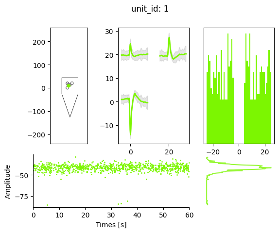

Build a full spike sorting pipeline with dicts
==============================================

When using ``SpikeInterface`` there are two phases. First, you should
play: try to figure out any special steps or parameters you need to play
with to get everything working with your data. Once you're happy, you then
need to build a sturdy, consistent pipeline to process all your ephys
sessions.

It is now possible to create a flexible spike sorting pipeline using
three simple dictionaries: one for preprocessing (and the
``PreprocessingPipeline``), another for sorting (and ``run_sorter``),
and a final one for postprocessing (and the ``compute`` method). Here’s
an example:

.. code:: ipython3

    import spikeinterface.full as si

    my_protocol = {
        'preprocessing': {
            'bandpass_filter': {},
            'common_reference': {'operator': 'average'},
            'detect_and_remove_bad_channels': {},
        },
        'sorting': {
            'sorter_name': 'mountainsort5',
            'verbose': False,
            'snippet_T2': 15,
            'remove_existing_folder': True,
            'progress_bar': False
        },
        'postprocessing': {
            'random_spikes': {},
            'noise_levels': {},
            'templates': {},
            'unit_locations': {'method': 'center_of_mass'},
            'spike_amplitudes': {},
            'correlograms': {},
        },
    }

    # Usually, you would read in your raw recording
    rec, _ = si.generate_ground_truth_recording(num_channels=4, durations=[60], seed=0)
    preprocessed_rec = si.apply_pipeline(rec, my_protocol['preprocessing'])
    sorting = si.run_sorter(recording=preprocessed_rec, **my_protocol['sorting'])
    analyzer = si.create_sorting_analyzer(recording=preprocessed_rec, sorting=sorting)
    analyzer.compute(my_protocol['postprocessing'])

This is a full and flexible spike sorting pipeline in 5 lines of code!

To try out a different pipeline, you only need to update your protocol
dicts.

Once you have an analyzer, you can then do things with it:

.. code:: ipython3

    analyzer.save_as(folder="my_analyzer")
    si.plot_unit_summary(analyzer, unit_id=1)

.. parsed-literal::

    /home/nolanlab/Work/Developing/fromgit/spikeinterface/src/spikeinterface/widgets/unit_waveforms.py:183: UserWarning: templates_percentile_shading can only be used if the 'waveforms' extension is available. Settimg templates_percentile_shading to None.
      warn(

.. parsed-literal::

    <spikeinterface.widgets.unit_summary.UnitSummaryWidget at 0x7b122f7419d0>

The main disadvantage of the dictionaties approach is that you don’t
know exactly what options and steps are available for you. You can
search the API for help. Or we store many dictionaries of tools and
parameters, as is shown below.

Get all preprocessing steps:

.. code:: ipython3

    from spikeinterface.preprocessing.pipeline import pp_names_to_functions
    print(pp_names_to_functions.keys())

.. parsed-literal::

    dict_keys(['filter', 'bandpass_filter', 'highpass_filter', 'notch_filter', 'gaussian_filter', 'normalize_by_quantile', 'scale', 'center', 'zscore', 'scale_to_physical_units', 'whiten', 'common_reference', 'phase_shift', 'detect_and_remove_bad_channels', 'detect_and_interpolate_bad_channels', 'rectify', 'clip', 'blank_saturation', 'silence_periods', 'remove_artifacts', 'zero_channel_pad', 'deepinterpolate', 'resample', 'decimate', 'highpass_spatial_filter', 'interpolate_bad_channels', 'depth_order', 'average_across_direction', 'directional_derivative', 'astype', 'unsigned_to_signed'])

You can then check the arguments of each preprocessing step using
e.g. their docstrings (in Jupyter you can run ``si.bandpass_filter?``
and in the terminal ``help(si.bandpass_fitler)``)

.. code:: ipython3

    print(si.bandpass_filter.__doc__)

.. parsed-literal::

        Bandpass filter of a recording

        Parameters
        ----------
        recording : Recording
            The recording extractor to be re-referenced
        freq_min : float
            The highpass cutoff frequency in Hz
        freq_max : float
            The lowpass cutoff frequency in Hz
        margin_ms : float
            Margin in ms on border to avoid border effect
        dtype : dtype or None
            The dtype of the returned traces. If None, the dtype of the parent recording is used
        \*\*filter_kwargs : dict
            Certain keyword arguments for `scipy.signal` filters:
                filter_order : order
                    The order of the filter. Note as filtering is applied with scipy's
                    `filtfilt` functions (i.e. acausal, zero-phase) the effective
                    order will be double the `filter_order`.
                filter_mode :  "sos" | "ba", default: "sos"
                    Filter form of the filter coefficients:
                    - second-order sections ("sos")
                    - numerator/denominator : ("ba")
                ftype : str, default: "butter"
                    Filter type for `scipy.signal.iirfilter` e.g. "butter", "cheby1".

        Returns
        -------
        filter_recording : BandpassFilterRecording
            The bandpass-filtered recording extractor object

Get the default sorter parameters of mountainsort5:

.. code:: ipython3

    print(si.get_default_sorter_params('mountainsort5'))

.. parsed-literal::

    {'scheme': '2', 'detect_threshold': 5.5, 'detect_sign': -1, 'detect_time_radius_msec': 0.5, 'snippet_T1': 20, 'snippet_T2': 20, 'npca_per_channel': 3, 'npca_per_subdivision': 10, 'snippet_mask_radius': 250, 'scheme1_detect_channel_radius': 150, 'scheme2_phase1_detect_channel_radius': 200, 'scheme2_detect_channel_radius': 50, 'scheme2_max_num_snippets_per_training_batch': 200, 'scheme2_training_duration_sec': 300, 'scheme2_training_recording_sampling_mode': 'uniform', 'scheme3_block_duration_sec': 1800, 'freq_min': 300, 'freq_max': 6000, 'filter': True, 'whiten': True, 'delete_temporary_recording': True, 'pool_engine': 'process', 'n_jobs': 1, 'chunk_duration': '1s', 'progress_bar': True, 'mp_context': None, 'max_threads_per_worker': 1}

Find the possible extensions you can compute

.. code:: ipython3

    print(analyzer.get_computable_extensions())

.. parsed-literal::

    ['random_spikes', 'waveforms', 'templates', 'noise_levels', 'amplitude_scalings', 'correlograms', 'isi_histograms', 'principal_components', 'spike_amplitudes', 'spike_locations', 'template_metrics', 'template_similarity', 'unit_locations', 'quality_metrics']

And the arguments for each extension ‘blah’ can be found in the
docstring of ‘compute_blah’, e.g.

.. code:: ipython3

    print(si.compute_spike_amplitudes.__doc__)

.. parsed-literal::

        AnalyzerExtension
        Computes the spike amplitudes.

        Needs "templates" to be computed first.
        Computes spike amplitudes from the template's peak channel for every spike.

        Parameters
        ----------
        sorting_analyzer : SortingAnalyzer
            A SortingAnalyzer object
        peak_sign : "neg" | "pos" | "both", default: "neg"
            Sign of the template to compute extremum channel used to retrieve spike amplitudes.

        Returns
        -------
        spike_amplitudes: np.array
            All amplitudes for all spikes and all units are concatenated (along time, like in spike vector)
