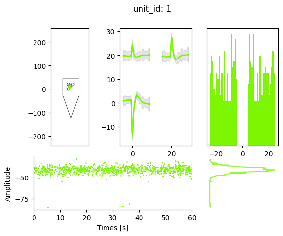

Build a full Sorting pipeline with dicts
========================================

When using ``SpikeInterface`` there are two phases. First, you should
play: try to figure out any special steps or parameters you need to play
with to get everything working with your data. Once you’re happy, you
then need to build a sturdy, consistent pipeline to process all your
ephys sessions.

It is now possible to create a flexible spike sorting pipeline using
three simple dictionaries: one for preprocessing (and the
``PreprocessingPipeline``), another for sorting (and ``run_sorter``),
and a final one for postprocessing (and the ``compute`` method). Here’s
an example:

.. code::

    import spikeinterface.full as si

    my_protocol = {
        'preprocessing': {
            'bandpass_filter': {},
            'common_reference': {'operator': 'average'},
            'detect_and_remove_bad_channels': {},
        },
        'sorting': {
            'sorter_name': 'mountainsort5',
            'verbose': False,
            'snippet_T2': 15,
            'remove_existing_folder': True,
            'progress_bar': False
        },
        'postprocessing': {
            'random_spikes': {},
            'noise_levels': {},
            'templates': {},
            'unit_locations': {'method': 'center_of_mass'},
            'spike_amplitudes': {},
            'correlograms': {},
        },
    }

    # Usually, you would read in your raw recording
    rec, _ = si.generate_ground_truth_recording(num_channels=4, durations=[60], seed=0)
    preprocessed_rec = si.apply_preprocessing_pipeline(rec, my_protocol['preprocessing'])
    sorting = si.run_sorter(recording=preprocessed_rec, **my_protocol['sorting'])
    analyzer = si.create_sorting_analyzer(recording=preprocessed_rec, sorting=sorting)
    analyzer.compute(my_protocol['postprocessing'])

.. parsed-literal::

    detect_bad_channels (no parallelization):   0%|          | 0/100 [00:00<?, ?it/s]

.. parsed-literal::

    write_binary
    engine=process - n_jobs=1 - samples_per_chunk=25,000 - chunk_memory=292.97 KiB - total_memory=292.97 KiB - chunk_duration=1.00s
    Using training recording of duration 300 sec with the sampling mode uniform
    *** MS5 Elapsed time for SCHEME2 get_sampled_recording_for_training: 0.000 seconds ***
    Running phase 1 sorting
    Number of channels: 3
    Number of timepoints: 1500000
    Sampling frequency: 25000.0 Hz
    Channel 0: [0. 0.]
    Channel 1: [ 0. 20.]
    Channel 2: [20. 20.]
    Loading traces
    *** MS5 Elapsed time for load_traces: 0.009 seconds ***
    Detecting spikes

    Adjacency for detect spikes with channel radius 200
    [[0, 1, 2], [0, 1, 2], [0, 1, 2]]

    m = 0 (nbhd size: 3)
    m = 1 (nbhd size: 3)
    m = 2 (nbhd size: 3)
    Detected 2638 spikes
    *** MS5 Elapsed time for detect_spikes: 0.025 seconds ***
    Removing duplicate times
    *** MS5 Elapsed time for remove_duplicate_times: 0.000 seconds ***
    Extracting 2638 snippets
    *** MS5 Elapsed time for extract_snippets: 0.005 seconds ***
    Computing PCA features with npca=9
    *** MS5 Elapsed time for compute_pca_features: 0.008 seconds ***
    Isosplit6 clustering with npca_per_subdivision=10
    Found 5 clusters
    *** MS5 Elapsed time for isosplit6_subdivision_method: 0.053 seconds ***
    Computing templates
    *** MS5 Elapsed time for compute_templates: 0.003 seconds ***
    Determining optimal alignment of templates
    Template alignment converged.
    Align templates offsets:  [ 5  4 -2 -4 -3]
    *** MS5 Elapsed time for align_templates: 0.003 seconds ***
    Aligning snippets
    *** MS5 Elapsed time for align_snippets: 0.000 seconds ***
    Clustering aligned snippets
    Computing PCA features with npca=9
    *** MS5 Elapsed time for compute_pca_features: 0.001 seconds ***
    Isosplit6 clustering with npca_per_subdivision=10
    *** MS5 Elapsed time for isosplit6_subdivision_method: 0.041 seconds ***
    Found 4 clusters after alignment
    Computing templates
    *** MS5 Elapsed time for compute_templates: 0.003 seconds ***
    Offsetting times to peak
    Offsets to peak: [ 5 -2 -4 -3]
    *** MS5 Elapsed time for determine_offsets_to_peak: 0.000 seconds ***
    Sorting times
    *** MS5 Elapsed time for sorting times: 0.000 seconds ***
    Removing out of bounds times
    *** MS5 Elapsed time for removing out of bounds times: 0.000 seconds ***
    Reordering units
    *** MS5 Elapsed time for reordering units: 0.000 seconds ***
    Creating sorting object
    *** MS5 Elapsed time for creating sorting object: 0.000 seconds ***
    *** MS5 Elapsed time for SCHEME2 sorting_scheme1: 0.151 seconds ***
    *** MS5 Elapsed time for SCHEME2 get_times_labels_from_sorting: 0.000 seconds ***
    Loading training traces
    *** MS5 Elapsed time for SCHEME2 training_recording.get_traces: 0.002 seconds ***
    Training classifier
    *** MS5 Elapsed time for SCHEME2 training classifier step 1: 0.001 seconds ***
    Adding snippets from phase 1 sorting
    Fitting models
    *** MS5 Elapsed time for SCHEME2 fitting models: 0.005 seconds ***
    Chunk size: 1333.33336 sec
    Time chunk 1 of 1
    Loading traces
    *** MS5 Elapsed time for SCHEME2 loading traces: 0.000 seconds ***
    Detecting spikes

    Adjacency for detect spikes with channel radius 50
    [[0, 1, 2], [0, 1, 2], [0, 1, 2]]

    Scheme 2 detected 2638 spikes in chunk 1 of 1
    *** MS5 Elapsed time for SCHEME2 detecting spikes: 0.020 seconds ***
    Extracting and classifying snippets
    *** MS5 Elapsed time for SCHEME2 extracting and classifying snippets: 0.009 seconds ***
    Updating events
    Removing duplicates
    *** MS5 Elapsed time for SCHEME2 updating events: 0.001 seconds ***
    Concatenating results
    *** MS5 Elapsed time for SCHEME2 concatenating results: 0.000 seconds ***
    Perorming label mapping
    *** MS5 Elapsed time for SCHEME2 label mapping: 0.000 seconds ***
    Creating sorting object
    *** MS5 Elapsed time for SCHEME2 creating sorting object: 0.000 seconds ***

.. parsed-literal::

    estimate_templates (no parallelization):   0%|          | 0/60 [00:00<?, ?it/s]

.. parsed-literal::

    noise_level (no parallelization):   0%|          | 0/20 [00:00<?, ?it/s]

.. parsed-literal::

    estimate_templates_with_accumulator (no parallelization):   0%|          | 0/60 [00:00<?, ?it/s]

.. parsed-literal::

    Compute : spike_amplitudes (no parallelization):   0%|          | 0/60 [00:00<?, ?it/s]

This is a full and flexible spike sorting pipeline in 5 lines of code!

To try out a different pipeline, you only need to update your protocol
dicts.

Once you have an analyzer, you can then do things with it:

.. code::

    analyzer.save_as(folder="my_analyzer")
    si.plot_unit_summary(analyzer, unit_id=1)

The main disadvantage of the dictionaties approach is that you don’t
know exactly what options and steps are available for you. You can
search the API for help. Or we store many dictionaries of tools and
parameters, as is shown below.

Get all preprocessing steps:

.. code::

    from spikeinterface.preprocessing.pipeline import pp_names_to_functions
    print(pp_names_to_functions.keys())

.. parsed-literal::

    dict_keys(['filter', 'bandpass_filter', 'highpass_filter', 'notch_filter', 'gaussian_filter', 'normalize_by_quantile', 'scale', 'center', 'zscore', 'scale_to_physical_units', 'whiten', 'common_reference', 'phase_shift', 'detect_and_remove_bad_channels', 'detect_and_interpolate_bad_channels', 'detect_and_remove_artifacts', 'rectify', 'clip', 'blank_saturation', 'silence_periods', 'remove_artifacts', 'zero_channel_pad', 'deepinterpolate', 'resample', 'decimate', 'highpass_spatial_filter', 'interpolate_bad_channels', 'depth_order', 'average_across_direction', 'directional_derivative', 'astype', 'unsigned_to_signed'])

You can then check the arguments of each preprocessing step using
e.g. their docstrings (in Jupyter you can run ``si.bandpass_filter?``
and in the terminal ``help(si.bandpass_fitler)``)

.. code::

    print(si.bandpass_filter.__doc__)

.. parsed-literal::

    Bandpass filter of a recording

    Parameters
    ----------
    recording : Recording
        The recording extractor to be re-referenced
    freq_min : float
        The highpass cutoff frequency in Hz
    freq_max : float
        The lowpass cutoff frequency in Hz
    margin_ms : float | str, default: "auto"
        Margin in ms on border to avoid border effect.
        If "auto", margin is computed as 3 times the filter highpass cutoff period.
    dtype : dtype or None
        The dtype of the returned traces. If None, the dtype of the parent recording is used
    ignore_low_freq_error : bool, default: False
        If True, does not raise an error if freq_min is too low for the sampling frequency.
    **filter_kwargs : dict
            Certain keyword arguments for `scipy.signal` filters:
                filter_order : order
                    The order of the filter. Note as filtering is applied with scipy's
                    `filtfilt` functions (i.e. acausal, zero-phase) the effective
                    order will be double the `filter_order`.
                filter_mode :  "sos" | "ba", default: "sos"
                    Filter form of the filter coefficients:
                    - second-order sections ("sos")
                    - numerator/denominator : ("ba")
                ftype : str, default: "butter"
                    Filter type for `scipy.signal.iirfilter` e.g. "butter", "cheby1".

    Returns
    -------
    filter_recording : BandpassFilterRecording
        The bandpass-filtered recording extractor object

Get the default sorter parameters of mountainsort5:

.. code::

    print(si.get_default_sorter_params('mountainsort5'))

.. parsed-literal::

    {'scheme': '2', 'detect_threshold': 5.5, 'detect_sign': -1, 'detect_time_radius_msec': 0.5, 'snippet_T1': 20, 'snippet_T2': 20, 'npca_per_channel': 3, 'npca_per_subdivision': 10, 'snippet_mask_radius': 250, 'scheme1_detect_channel_radius': 150, 'scheme2_phase1_detect_channel_radius': 200, 'scheme2_detect_channel_radius': 50, 'scheme2_max_num_snippets_per_training_batch': 200, 'scheme2_training_duration_sec': 300, 'scheme2_training_recording_sampling_mode': 'uniform', 'scheme3_block_duration_sec': 1800, 'freq_min': 300, 'freq_max': 6000, 'filter': True, 'whiten': True, 'whitening_seed': None, 'delete_temporary_recording': True, 'pool_engine': 'process', 'n_jobs': 1, 'chunk_duration': '1s', 'progress_bar': True, 'mp_context': None, 'max_threads_per_worker': 1}

Find the possible extensions you can compute

.. code::

    print(analyzer.get_computable_extensions())

.. parsed-literal::

    ['random_spikes', 'waveforms', 'templates', 'noise_levels', 'amplitude_scalings', 'correlograms', 'auto_correlograms', 'isi_histograms', 'principal_components', 'spike_amplitudes', 'spike_locations', 'template_similarity', 'unit_locations', 'valid_unit_periods', 'quality_metrics', 'template_metrics', 'spiketrain_metrics']

And the arguments for each extension ‘blah’ can be found in the
docstring of ‘compute_blah’, e.g.

.. code::

    print(si.compute_spike_amplitudes.__doc__)

.. parsed-literal::

    Computes the spike amplitudes.

    Needs "templates" to be computed first.
    Computes spike amplitudes from the template's peak channel for every spike.
