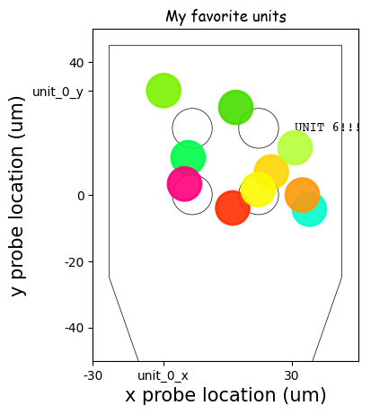

Customize a plot
================

The ``SpikeInterface`` widgets are designed to have reasonable default
plotting options, but sometimes you’ll want to make adjustments to the
plots. The plotting functions all return a ``Widget`` object. These
contain and give you access to the underlying matplotlib figure and
axis, which you can apply any matplotlib machinery to. Let’s see how to
do this in an example, by first making some synthetic data and computing
extensions which can be used for plotting.

.. code::

    import spikeinterface.full as si
    import matplotlib.pyplot as plt

    recording, sorting = si.generate_ground_truth_recording(seed=1205)
    sorting_analyzer = si.create_sorting_analyzer(sorting=sorting, recording=recording)
    sorting_analyzer.compute({"random_spikes": {'seed': 1205}, "templates": {}, "unit_locations": {}})

    unit_locations = sorting_analyzer.get_extension("unit_locations").get_data()

.. parsed-literal::

    estimate_sparsity (no parallelization):   0%|          | 0/10 [00:00<?, ?it/s]

.. parsed-literal::

    estimate_templates_with_accumulator (no parallelization):   0%|          | 0/10 [00:00<?, ?it/s]

Now we can plot the ``unit_locations`` and ``unit_templates`` using the
appropriate widgets (see the `full list of
widgets <https://spikeinterface.readthedocs.io/en/stable/modules/widgets.html#available-plotting-functions>`__
for more!). These functions output a ``Widget object``. We’ll assign the
unit locations widget to ``fig_units``.

.. code::

    fig_units = si.plot_unit_locations(sorting_analyzer)

    # Each widget contains a `matplotlib` figure and axis:
    print(type(fig_units.figure))
    print(type(fig_units.ax))

.. parsed-literal::

    <class 'matplotlib.figure.Figure'>
    <class 'matplotlib.axes._axes.Axes'>

By gaining access to the matplotlib objects, we are able to utilize the
full ``matplotlib`` machinery: adding custom titles, axis labels, ticks,
more plots etc. Let’s customize our unit locations plot. (Note: the
``SpikeInterface`` Team does not endorse the following style
conventions):

.. code::

    # Get the widget
    fig_units = si.plot_unit_locations(sorting_analyzer)

    # Modify the widget's `axis`` to set the title and axes labels
    fig_units.ax.set_title("My favorite units", fontname = "Comic Sans MS")
    fig_units.ax.set_xlabel("x probe location (um)")
    fig_units.ax.set_ylabel("y probe location (um)")

    # You can also set custom ticks
    fig_units.ax.set_xticks([-60,-30,unit_locations[0,0],30,60])
    fig_units.ax.set_xticklabels([-60,-30,"unit_0_x",30,60])
    fig_units.ax.set_yticks([-40,-20,0,unit_locations[0,1],40])
    fig_units.ax.set_yticklabels([-40,-20,0,"unit_0_y",40])

    # Change the limits of the plot
    fig_units.ax.set_xlim((-30,50))
    fig_units.ax.set_ylim((-50,50))

    # And add extra information on the plot
    fig_units.ax.text(unit_locations[6,0], unit_locations[6,1]+5, s="UNIT 6!!!", fontname="Courier")

    fig_units

.. parsed-literal::

    <spikeinterface.widgets.unit_locations.UnitLocationsWidget at 0x147a81520>

Beautiful!!!

You can also combine figures into a multi-figure plot. The easiest way
to do this is to set up your figure and axes first, then tell
``SpikeInterface`` which axes it should attach the widget plot to.
Here’s an example of making a unit summary plot.

.. code::

    import matplotlib.pyplot as plt
    fig, axs = plt.subplots(ncols=2, nrows=1)

    unit_id=8
    si.plot_unit_locations(sorting_analyzer=sorting_analyzer, ax=axs[0])
    si.plot_unit_templates(sorting_analyzer, axes=[axs[1]], unit_ids=[f'{unit_id}'])

    axs[0].plot([unit_locations[8,0], unit_locations[8,0]+50], [unit_locations[8,1], unit_locations[8,1]+50])
    axs[0].text(unit_locations[8,0]+52, unit_locations[8,1]+52, s=f"Unit {unit_id}")
    axs[0].set_title("Unit location", fontsize=10)

    fig.suptitle(f"Unit {unit_id} summary", fontfamily="Comic Sans MS", fontsize=20)

    fig.tight_layout()

For more details on what you can do using matplotlib, check out their
`extensive documentation <https://matplotlib.org/stable/>`__
