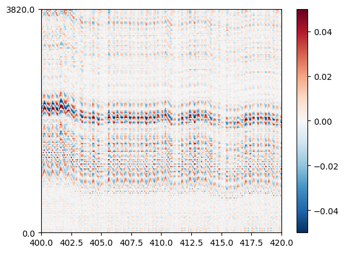
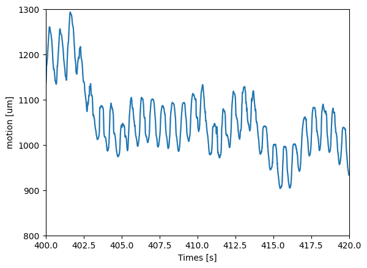

Estimate drift using the LFP traces
===================================

Drift is a well known issue for long shank probes. Some datasets, especially from primates and humans,
can experience very fast motion due to breathing and heart beats. In these cases, the standard motion
estimation methods that use detected spikes as a basis for motion inference will fail, because there
are not enough spikes to "follow" such fast drifts.

Charlie Windolf and colleagues from the Paninski Lab at Columbia have developed a method to estimate
the motion using the LFP signal: **DREDge**. (more details about the method in the paper
`DREDge: robust motion correction for high-density extracellular recordings across species <https://doi.org/10.1101/2023.10.24.563768>`_).

This method is particularly suited for the open dataset recorded at Massachusetts General Hospital by Angelique Paulk and colleagues in humans (more details in the [paper](https://doi.org/10.1038/s41593-021-00997-0)). The dataset can be dowloaed from [datadryad](https://datadryad.org/stash/dataset/doi:10.5061/dryad.d2547d840) and it contains recordings on human patients with a Neuropixels probe, some of which with very high and fast motion on the probe, which prevents accurate spike sorting without a proper and adequate motion correction

The **DREDge** method has two options: **dredge_lfp** and **dredge_ap**, which have both been ported inside `SpikeInterface`.

Here we will demonstrate the **dredge_lfp** method to estimate the fast and high drift on this recording.

For each patient, the dataset contains two streams:

* a highpass "action potential" (AP), sampled at 30kHz
* a lowpass "local field" (LF) sampled at 2.5kHz

For this demonstration, we will use the LF stream.

.. code:: ipython3

    %matplotlib inline
    %load_ext autoreload
    %autoreload 2

.. code:: ipython3

    from pathlib import Path
    import matplotlib.pyplot as plt

    import spikeinterface.full as si
    from spikeinterface.sortingcomponents.motion import estimate_motion

.. code:: ipython3

    # the dataset has been locally downloaded
    base_folder = Path("/mnt/data/sam/DataSpikeSorting/")
    np_data_drift = base_folder / 'human_neuropixel/Pt02/'

Read the spikeglx file
~~~~~~~~~~~~~~~~~~~~~~

.. code:: ipython3

    raw_rec = si.read_spikeglx(np_data_drift)
    print(raw_rec)

.. parsed-literal::

    SpikeGLXRecordingExtractor: 384 channels - 2.5kHz - 1 segments - 2,183,292 samples
                                873.32s (14.56 minutes) - int16 dtype - 1.56 GiB

Preprocessing
~~~~~~~~~~~~~

Contrary to the **dredge_ap** approach, which needs detected peaks and peak locations, the **dredge_lfp**
method is estimating the motion directly on traces.
Importantly, the method requires some additional pre-processing steps:
  * ``bandpass_filter``: to "focus" the signal on a particular band
  * ``phase_shift``: to compensate for the sampling misalignement
  * ``resample``: to further reduce the sampling fequency of the signal and speed up the computation. The sampling frequency of the estimated motion will be the same as the resampling frequency. Here we choose 250Hz, which corresponds to a sampling interval of 4ms.
  * ``directional_derivative``: this optional step applies a second order derivative in the spatial dimension to enhance edges on the traces.
    This is not a general rules and need to be tested case by case.
  * ``average_across_direction``: Neuropixels 1.0 probes have two contacts per depth. This steps averages them to obtain a unique virtual signal along the probe depth ("y" in ``spikeinterface``).

After appying this preprocessing chain, the motion can be estimated almost by eyes ont the traces plotted with the map mode.

.. code:: ipython3

    lfprec = si.bandpass_filter(
        raw_rec,
        freq_min=0.5,
        freq_max=250,

        margin_ms=1500.,
        filter_order=3,
        dtype="float32",
        add_reflect_padding=True,
    )
    lfprec = si.phase_shift(lfprec)
    lfprec = si.resample(lfprec, resample_rate=250, margin_ms=1000)

    lfprec = si.directional_derivative(lfprec, order=2, edge_order=1)
    lfprec = si.average_across_direction(lfprec)

    print(lfprec)

.. parsed-literal::

    AverageAcrossDirectionRecording: 192 channels - 0.2kHz - 1 segments - 218,329 samples
                                     873.32s (14.56 minutes) - float32 dtype - 159.91 MiB

.. code:: ipython3

    %matplotlib inline
    si.plot_traces(lfprec, backend="matplotlib", mode="map", clim=(-0.05, 0.05), time_range=(400, 420))

Run the method
~~~~~~~~~~~~~~

``estimate_motion()`` is the generic function to estimate motion with multiple
methods in ``spikeinterface``.

This function returns a ``Motion`` object and we can notice that the interval is exactly
the same as downsampled signal.

Here we use ``rigid=True``, which means that we have one unqiue signal to
describe the motion across the entire probe depth.

.. code:: ipython3

    motion = estimate_motion(lfprec, method='dredge_lfp', rigid=True, progress_bar=True)
    motion

.. parsed-literal::

    Online chunks [10.0s each]:   0%|          | 0/87 [00:00<?, ?it/s]

.. parsed-literal::

    Motion rigid - interval 0.004s - 1 segments

Plot the drift
~~~~~~~~~~~~~~

When plotting the drift, we can notice a very fast drift which corresponds to the heart rate.
The slower oscillations can be attributed to the breathing signal.

We can appreciate how the estimated motion signal matches the processed LFP traces plotted above.

.. code:: ipython3

    fig, ax = plt.subplots()
    si.plot_motion(motion, mode='line', ax=ax)
    ax.set_xlim(400, 420)
    ax.set_ylim(800, 1300)

.. parsed-literal::

    (800.0, 1300.0)

