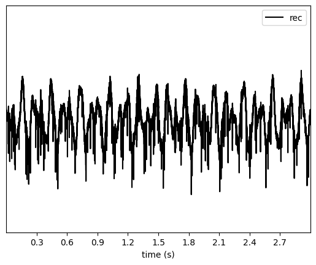
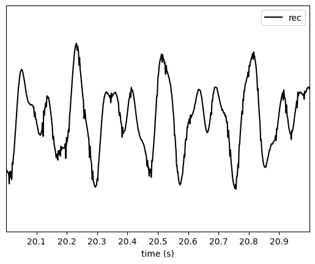
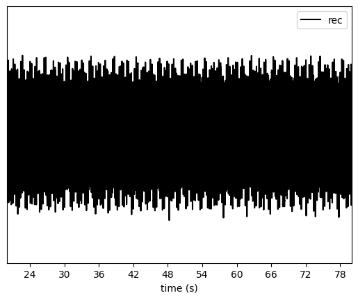
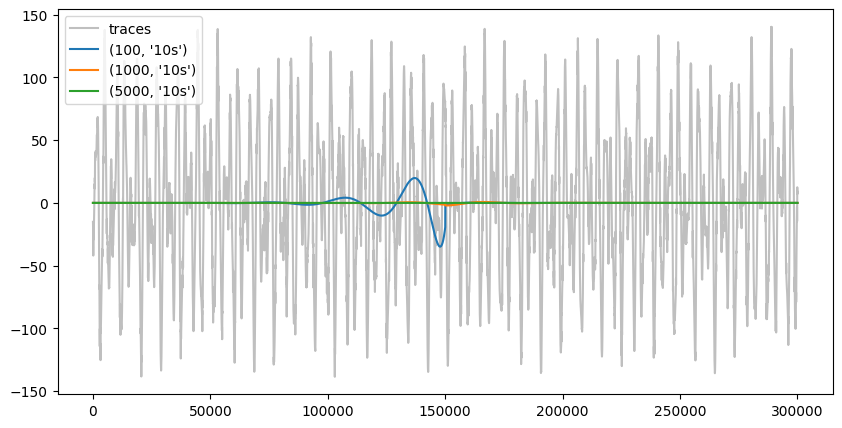
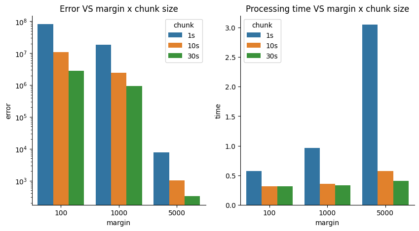

Extract LFPs
============

Understanding filtering artifacts and chunking when extracting LFPs
~~~~~~~~~~~~~~~~~~~~~~~~~~~~~~~~~~~~~~~~~~~~~~~~~~~~~~~~~~~~~~~~~~~

Local Field Potentials (LFPs) are low-frequency signals (<300 Hz) that
reflect the summed activity of many neurons. Extracting LFPs from
high-sampling-rate recordings requires bandpass filtering, but this can
introduce artifacts when not done carefully, especially when data is
processed in chunks (for memory efficiency).

This tutorial demonstrates: 1. How to generate simulated LFP data 2.
Common pitfalls when filtering with low cutoff frequencies 3. How
chunking and margins affect filtering artifacts 4. Summary

**Key takeaway**: For LFP extraction, use large chunks (30-60s) and
large margins (several seconds) to minimize edge artifacts, even though
this is less memory-efficient.

.. code:: ipython3

    import time
    import numpy as np
    import matplotlib.pyplot as plt
    from pathlib import Path
    import pandas as pd
    import seaborn as sns

    import spikeinterface as si
    import spikeinterface.extractors as se
    import spikeinterface.preprocessing as spre
    import spikeinterface.widgets as sw
    from spikeinterface.core import generate_ground_truth_recording

.. code:: ipython3

    %matplotlib inline

1. Generate simulated recording with low-frequency signals
----------------------------------------------------------

Let’s create a simulated recording and add some low-frequency sinusoids
that mimic LFP activity.

.. code:: ipython3

    # Generate a ground truth recording with spikes
    # Use a higher sampling rate (30 kHz) to simulate raw neural data
    recording, sorting = generate_ground_truth_recording(
        durations=[300.0],  # 300 s
        sampling_frequency=30000.0,
        num_channels=1,
        num_units=4,
        seed=2305,
    )

    print(f"Recording: {recording}")
    print(f"Duration: {recording.get_total_duration():.1f} s")
    print(f"Sampling frequency: {recording.sampling_frequency} Hz")
    print(f"Number of channels: {recording.get_num_channels()}")

.. parsed-literal::

    Recording: GroundTruthRecording (InjectTemplatesRecording): 1 channels - 30.0kHz - 1 segments
                          9,000,000 samples - 300.00s (5.00 minutes) - float32 dtype - 34.33 MiB
    Duration: 300.0 s
    Sampling frequency: 30000.0 Hz
    Number of channels: 1

Now let’s add some low-frequency sinusoidal components to simulate LFP
signals

.. code:: ipython3

    # Add low-frequency sinusoids with different frequencies and phases per channel
    np.random.seed(2305)
    num_channels = recording.get_num_channels()
    lfp_signals = np.zeros((recording.get_num_samples(), recording.get_num_channels()))
    time_vector = recording.get_times()

    for ch in range(num_channels):
        # Add multiple frequency components (theta, alpha, beta ranges)
        # Theta-like: 4-8 Hz
        freq_theta = 4 + np.random.rand() * 4
        phase_theta = np.random.rand() * 2 * np.pi
        amp_theta = 50 + np.random.rand() * 50

        # Alpha-like: 8-12 Hz
        freq_alpha = 8 + np.random.rand() * 4
        phase_alpha = np.random.rand() * 2 * np.pi
        amp_alpha = 30 + np.random.rand() * 30

        # Beta-like: 12-30 Hz
        freq_beta = 12 + np.random.rand() * 18
        phase_beta = np.random.rand() * 2 * np.pi
        amp_beta = 20 + np.random.rand() * 20

        lfp_signals[:, ch] = (
            amp_theta * np.sin(2 * np.pi * freq_theta * time_vector + phase_theta) +
            amp_alpha * np.sin(2 * np.pi * freq_alpha * time_vector + phase_alpha) +
            amp_beta * np.sin(2 * np.pi * freq_beta * time_vector + phase_beta)
        )

    # Create a recording with the added LFP signals
    recording_lfp = si.NumpyRecording(traces_list=[lfp_signals], sampling_frequency=recording.sampling_frequency,
                                      channel_ids=recording.channel_ids)
    recording_with_lfp = recording + recording_lfp

    print("Added low-frequency components to simulate LFP signals")

.. parsed-literal::

    Added low-frequency components to simulate LFP signals

Let’s visualize a short segment of the signal

.. code:: ipython3

    sw.plot_traces(recording_with_lfp, time_range=[0, 3])

.. parsed-literal::

    <spikeinterface.widgets.traces.TracesWidget at 0x7e3911dfdfd0>

2. Filtering with low cutoff frequencies: the problem
-----------------------------------------------------

Now let’s try to extract LFPs using a bandpass filter with a low
highpass cutoff (1 Hz). This will demonstrate a common issue.

.. code:: ipython3

    # Try to filter with 1 Hz highpass
    try:
        recording_lfp_1hz = spre.bandpass_filter(recording_with_lfp, freq_min=1.0, freq_max=300.0)
        print("Filtering succeeded!")
    except Exception as e:
        print(f"Error message:\n{str(e)}")

.. parsed-literal::

    Error message:
    The freq_min (1.0 Hz) is too low and may cause artifacts during chunk processing. You can set 'ignore_low_freq_error=True' to bypass this error, but make sure you understand the implications. It is recommended to use large chunks when processing/saving your filtered recording to minimize IO overhead.Refer to this documentation on LFP filtering and chunking artifacts for more details: https://spikeinterface.readthedocs.io/en/stable/how-to/extracting_lfps.html.

**Why does this fail?**

The error occurs because by default in SpikeInterface when highpass
filtering below 100 Hz. Filters with very low cutoff frequencies have
long impulse responses, which require larger margins to avoid edge
artifacts between chunks.

The filter length (and required margin) scales inversely with the
highpass frequency. A 1 Hz highpass filter requires a margin of several
seconds, while a 300 Hz highpass (for spike extraction) only needs a few
milliseconds.

3. Understanding chunking and margins
-------------------------------------

SpikeInterface processes recordings in chunks to handle large datasets
efficiently. Each chunk needs a “margin” (extra samples at the edges) to
avoid edge artifacts when filtering. Let’s demonstrate this by saving
the filtered data with different chunking strategies.

**This error is to inform the user that extra care should be used when
dealing with LFP signals!**

We can ignore this error, but let’s make sure we understand what it’s
happening.

.. code:: ipython3

    # We can ignore this error, but let's see what is happening
    recording_filt = spre.bandpass_filter(recording_with_lfp, freq_min=1.0, freq_max=300.0, ignore_low_freq_error=True)

When retrieving traces, extra samples will be retrieved at the left and
right edges. By default, the filter function will set a margin to 5x the
sampling period associated to ``freq_min``. So for a 1 Hz cutoff
frequency, the margin will be 5 seconds!

.. code:: ipython3

    margin_in_s = recording_filt.margin_samples / recording_lfp.sampling_frequency
    print(f"Margin: {margin_in_s} s")

.. parsed-literal::

    Margin: 5.0 s

This effectively means that if we plot 1-s snippet of traces, a total of
11 s will actually be read and filtered. Note that the margin can be
overridden with the ``margin_ms`` argument, but we do not recommend
changing it.

.. code:: ipython3

    sw.plot_traces(recording_filt, time_range=[20, 21])

.. parsed-literal::

    /home/alessio/Documents/Codes/spike_sorting/spikeinterface/spikeinterface/src/spikeinterface/preprocessing/filter.py:169: UserWarning: The margin size (150000 samples) is more than 20% of the chunk size 30000 samples. This may lead to performance bottlenecks when chunking. Consider increasing the chunk size to minimize margin overhead.
      warnings.warn(

.. parsed-literal::

    <spikeinterface.widgets.traces.TracesWidget at 0x7e3911c882d0>

A warning tells us that what we are doing is not optimized, since in
order to get the requested traces the marging “overhead” is very large.

If we ask or plot longer snippets, the warning is not displayed.

.. code:: ipython3

    sw.plot_traces(recording_filt, time_range=[20, 80])

.. parsed-literal::

    <spikeinterface.widgets.traces.TracesWidget at 0x7e3911cab750>

4. Quantification and visualization the artifacts
-------------------------------------------------

Let’s extract the traces and visualize the differences between chunking
strategies. We’ll focus on the chunk boundaries where artifacts appear.

.. code:: ipython3

    margins_ms = [100, 1000, 5000]
    chunk_durations = ["1s", "10s", "30s"]

The best we can do is to save the full recording in one chunk. This will
cause no artifacts and chunking effects, but in practice it’s not
possible due to the duration and number of channels of most setups.

Since in this toy case we have a single channel 5-min recording, we can
use this as “optimal”.

.. code:: ipython3

    recording_optimal = recording_filt.save(format="memory", chunk_duration="1000s")

.. parsed-literal::

    write_memory_recording (no parallelization):   0%|          | 0/1 [00:00<?, ?it/s]

.. code:: ipython3

    recording_optimal

.. raw:: html

    
<strong>SharedMemoryRecording: 1 channels - 30.0kHz - 1 segments - 9,000,000 samples - 300.00s (5.00 minutes) - float32 dtype - 34.33 MiB</strong>

  
<strong>Channel IDs</strong>
<ul>['0'] 

  
<strong>Annotations</strong>
<ul><li> <strong> is_filtered </strong>: True</li>

<strong>Properties</strong>
<ul></ul>

Now we can do the same with our various options:

.. code:: ipython3

    recordings_chunked = {}

    for margin_ms in margins_ms:
        for chunk_duration in chunk_durations:
            print(f"Margin ms: {margin_ms} - Chunk duration: {chunk_duration}")
            t_start = time.perf_counter()
            recording_chunk = spre.bandpass_filter(
                recording_with_lfp,
                freq_min=1.0,
                freq_max=300.0,
                margin_ms=margin_ms,
                ignore_low_freq_error=True
            )
            recording_chunk = recording_chunk.save(
                format="memory",
                chunk_duration=chunk_duration,
                verbose=False,
            )
            t_stop = time.perf_counter()
            result_dict = {
                "recording": recording_chunk,
                "time": t_stop - t_start
            }
            recordings_chunked[(margin_ms, chunk_duration)] = result_dict

.. parsed-literal::

    Margin ms: 100 - Chunk duration: 1s

.. parsed-literal::

    /home/alessio/Documents/Codes/spike_sorting/spikeinterface/spikeinterface/src/spikeinterface/preprocessing/filter.py:453: UserWarning: The provided margin_ms (100 ms) is smaller than the recommended margin for the given freq_min (1.0 Hz). This may lead to artifacts at the edges of chunks during processing. Consider increasing the margin_ms to at least 5000.0 ms.
      warnings.warn(

.. parsed-literal::

    write_memory_recording (no parallelization):   0%|          | 0/300 [00:00<?, ?it/s]

.. parsed-literal::

    Margin ms: 100 - Chunk duration: 10s

.. parsed-literal::

    write_memory_recording (no parallelization):   0%|          | 0/30 [00:00<?, ?it/s]

.. parsed-literal::

    Margin ms: 100 - Chunk duration: 30s

.. parsed-literal::

    write_memory_recording (no parallelization):   0%|          | 0/10 [00:00<?, ?it/s]

.. parsed-literal::

    Margin ms: 1000 - Chunk duration: 1s

.. parsed-literal::

    /home/alessio/Documents/Codes/spike_sorting/spikeinterface/spikeinterface/src/spikeinterface/preprocessing/filter.py:453: UserWarning: The provided margin_ms (1000 ms) is smaller than the recommended margin for the given freq_min (1.0 Hz). This may lead to artifacts at the edges of chunks during processing. Consider increasing the margin_ms to at least 5000.0 ms.
      warnings.warn(

.. parsed-literal::

    write_memory_recording (no parallelization):   0%|          | 0/300 [00:00<?, ?it/s]

.. parsed-literal::

    /home/alessio/Documents/Codes/spike_sorting/spikeinterface/spikeinterface/src/spikeinterface/preprocessing/filter.py:169: UserWarning: The margin size (30000 samples) is more than 20% of the chunk size 30000 samples. This may lead to performance bottlenecks when chunking. Consider increasing the chunk size to minimize margin overhead.
      warnings.warn(

.. parsed-literal::

    Margin ms: 1000 - Chunk duration: 10s

.. parsed-literal::

    write_memory_recording (no parallelization):   0%|          | 0/30 [00:00<?, ?it/s]

.. parsed-literal::

    Margin ms: 1000 - Chunk duration: 30s

.. parsed-literal::

    write_memory_recording (no parallelization):   0%|          | 0/10 [00:00<?, ?it/s]

.. parsed-literal::

    Margin ms: 5000 - Chunk duration: 1s

.. parsed-literal::

    write_memory_recording (no parallelization):   0%|          | 0/300 [00:00<?, ?it/s]

.. parsed-literal::

    Margin ms: 5000 - Chunk duration: 10s

.. parsed-literal::

    write_memory_recording (no parallelization):   0%|          | 0/30 [00:00<?, ?it/s]

.. parsed-literal::

    /home/alessio/Documents/Codes/spike_sorting/spikeinterface/spikeinterface/src/spikeinterface/preprocessing/filter.py:169: UserWarning: The margin size (150000 samples) is more than 20% of the chunk size 300000 samples. This may lead to performance bottlenecks when chunking. Consider increasing the chunk size to minimize margin overhead.
      warnings.warn(

.. parsed-literal::

    Margin ms: 5000 - Chunk duration: 30s

.. parsed-literal::

    write_memory_recording (no parallelization):   0%|          | 0/10 [00:00<?, ?it/s]

Let’s visualize the error for the “10s” chunks and different margins,
centered around 30s (which is a chunk edge):

.. code:: ipython3

    fig, ax = plt.subplots(figsize=(10, 5))
    trace_plotted = False
    for recording_key, recording_dict in recordings_chunked.items():
        recording_chunk = recording_dict["recording"]
        margin, chunk = recording_key
        start_frame = int(25 * recording_optimal.sampling_frequency)
        end_frame = int(35 * recording_optimal.sampling_frequency)
        traces_opt = recording_optimal.get_traces(start_frame=start_frame, end_frame=end_frame)
        if not trace_plotted:
            ax.plot(traces_opt, color="grey", label="traces", alpha=0.5)
            trace_plotted = True
        if chunk != "10s":
            continue
        diff = recording_optimal - recording_chunk
        traces_diff = diff.get_traces(start_frame=start_frame, end_frame=end_frame)
        ax.plot(traces_diff, label=recording_key)

    ax.legend()

.. parsed-literal::

    /tmp/ipykernel_141767/3554765238.py:16: MatplotlibDeprecationWarning: Passing label as a length 2 sequence when plotting a single dataset is deprecated in Matplotlib 3.9 and will error in 3.11.  To keep the current behavior, cast the sequence to string before passing.
      ax.plot(traces_diff, label=recording_key)

.. parsed-literal::

    <matplotlib.legend.Legend at 0x7e3909083ed0>

For smaller chunk sizes, these artifact will happen more often. In
addition, the margin “overhead” will make processing slower. Let’s
quantify these concepts by computing the overall absolute error with
respect to the optimal case and processing time.

.. code:: ipython3

    trace_plotted = False
    traces_optimal = recording_optimal.get_traces()
    data = {"margin": [], "chunk": [], "error": [], "time": []}
    for recording_key, recording_dict in recordings_chunked.items():
        recording_chunk = recording_dict["recording"]
        time = recording_dict["time"]
        margin, chunk = recording_key
        traces_chunk = recording_chunk.get_traces()
        error = np.sum(np.abs(traces_optimal - traces_chunk))
        data["margin"].append(margin)
        data["chunk"].append(chunk)
        data["error"].append(error)
        data["time"].append(time)

    df = pd.DataFrame(data=data)

.. code:: ipython3

    fig, axs = plt.subplots(ncols=2, figsize=(10, 5))
    sns.barplot(data=data, x="margin", y="error", hue="chunk", ax=axs[0])
    axs[0].set_yscale("log")
    sns.barplot(data=data, x="margin", y="time", hue="chunk", ax=axs[1])
    axs[0].set_title("Error VS margin x chunk size")
    axs[1].set_title("Processing time VS margin x chunk size")

    sns.despine(fig)

4. Summary
----------

1. **Low-frequency filters require special care**: Filters with low
   cutoff frequencies (< 10 Hz) have long impulse responses that require
   large margins to avoid edge artifacts.

2. **Chunking artifacts are real**: When processing data in chunks,
   insufficient margins lead to visible discontinuities and errors at
   chunk boundaries.

3. **The solution: large chunks and large margins**: For LFP extraction
   (1-300 Hz), use:

   -  Chunk size: 30-60 seconds
   -  Margin size: 5 seconds (for 1 Hz highpass) (**use defaults!**)
   -  This is less memory-efficient but more accurate

4. **Downsample after filtering**: After bandpass filtering, downsample
   to reduce data size (e.g., to 1-2.5 kHz for 300 Hz max frequency).

5. **Trade-offs**: There’s always a trade-off between computational
   efficiency (smaller chunks, less memory) and accuracy (larger chunks,
   fewer artifacts). For LFP analysis, accuracy should take priority.

**When processing your own data:** - If you have memory constraints, use
the largest chunk size your system can handle - Always verify your
filtering parameters on a small test segment first - Consider the lowest
frequency component you want to preserve when setting margins - Save the
processed LFP data to disk to avoid recomputing
