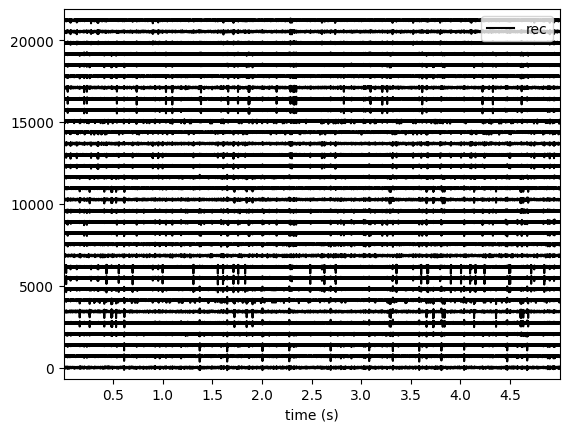
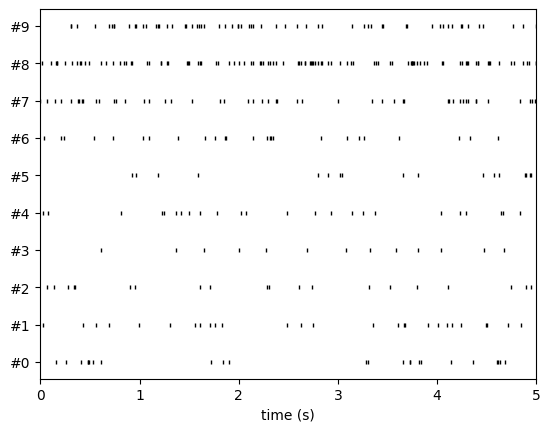
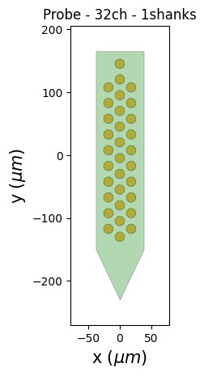
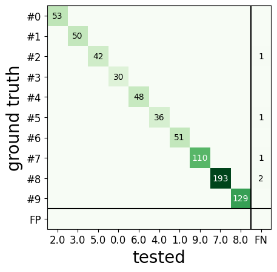
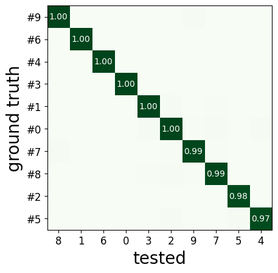
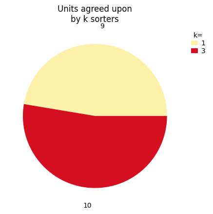
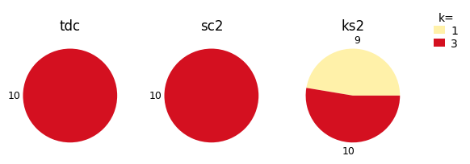

.. code:: ipython3

    %matplotlib inline

How to “get started”
====================

In this introductory example, you will see how to use the SpikeInterface
to perform a full electrophysiology analysis. We will download simulated
dataset, and we will then perform some pre-processing, run a spike
sorting algorithm, post-process the spike sorting output, perform
curation (manual and automatic), and compare spike sorting results.

.. code:: ipython3

    import matplotlib.pyplot as plt
    from pprint import pprint

The spikeinterface module by itself import only the spikeinterface.core
submodule which is not useful for end user

.. code:: ipython3

    import spikeinterface

We need to import one by one different submodules separately
(preferred). There several modules:

-  ``extractors`` : file IO
-  ``preprocessing`` : preprocessing
-  ``sorters`` : Python wrappers of spike sorters
-  ``postprocessing`` : postprocessing
-  ``qualitymetrics`` : quality metrics on units found by sorter
-  ``curation`` : automatic curation of spike sorting output
-  ``comparison`` : comparison of spike sorting output
-  ``widgets`` : visualization

.. code:: ipython3

    import spikeinterface as si  # import core only
    import spikeinterface.extractors as se
    import spikeinterface.preprocessing as spre
    import spikeinterface.sorters as ss
    import spikeinterface.postprocessing as spost
    import spikeinterface.qualitymetrics as sqm
    import spikeinterface.comparison as sc
    import spikeinterface.exporters as sexp
    import spikeinterface.curation as scur
    import spikeinterface.widgets as sw

We can also import all submodules at once with this this internally
import core+extractors+preprocessing+sorters+postprocessing+
qualitymetrics+comparison+widgets+exporters

This is useful for notebooks, but it is a heavier import because
internally many more dependencies are imported
(scipy/sklearn/networkx/matplotlib/h5py…)

.. code:: ipython3

    import spikeinterface.full as si

Before getting started, we can set some global arguments for parallel
processing. For this example, let’s use 4 jobs and time chunks of 1s:

.. code:: ipython3

    global_job_kwargs = dict(n_jobs=4, chunk_duration="1s")
    si.set_global_job_kwargs(**global_job_kwargs)

First, let’s download a simulated dataset from the
https://gin.g-node.org/NeuralEnsemble/ephy_testing_data repo

Then we can open it. Note that
`MEArec <https://mearec.readthedocs.io%3E>`__ simulated file contains
both “recording” and a “sorting” object.

.. code:: ipython3

    local_path = si.download_dataset(remote_path='mearec/mearec_test_10s.h5')
    recording, sorting_true = se.read_mearec(local_path)
    print(recording)
    print(sorting_true)


.. parsed-literal::

    MEArecRecordingExtractor: 32 channels - 1 segments - 32.0kHz - 10.000s
      file_path: /home/alessio/spikeinterface_datasets/ephy_testing_data/mearec/mearec_test_10s.h5
    MEArecSortingExtractor: 10 units - 1 segments - 32.0kHz
      file_path: /home/alessio/spikeinterface_datasets/ephy_testing_data/mearec/mearec_test_10s.h5


``recording`` is a ``BaseRecording`` object, which extracts information
about channel ids, channel locations (if present), the sampling
frequency of the recording, and the extracellular traces.
``sorting_true`` is a :``BaseSorting`` object, which contains
information about spike-sorting related information, including unit ids,
spike trains, etc. Since the data are simulated, ``sorting_true`` has
ground-truth information of the spiking activity of each unit.

Let’s use the ``spikeinterface.widgets`` module to visualize the traces
and the raster plots.

.. code:: ipython3

    w_ts = sw.plot_traces(recording, time_range=(0, 5))
    w_rs = sw.plot_rasters(sorting_true, time_range=(0, 5))








This is how you retrieve info from a ``BaseRecording``\ …

.. code:: ipython3

    channel_ids = recording.get_channel_ids()
    fs = recording.get_sampling_frequency()
    num_chan = recording.get_num_channels()
    num_seg = recording.get_num_segments()

    print('Channel ids:', channel_ids)
    print('Sampling frequency:', fs)
    print('Number of channels:', num_chan)
    print('Number of segments:', num_seg)


.. parsed-literal::

    Channel ids: ['1' '2' '3' '4' '5' '6' '7' '8' '9' '10' '11' '12' '13' '14' '15' '16'
     '17' '18' '19' '20' '21' '22' '23' '24' '25' '26' '27' '28' '29' '30'
     '31' '32']
    Sampling frequency: 32000.0
    Number of channels: 32
    Number of segments: 1


…and a ``BaseSorting``

.. code:: ipython3

    num_seg = recording.get_num_segments()
    unit_ids = sorting_true.get_unit_ids()
    spike_train = sorting_true.get_unit_spike_train(unit_id=unit_ids[0])

    print('Number of segments:', num_seg)
    print('Unit ids:', unit_ids)
    print('Spike train of first unit:', spike_train)


.. parsed-literal::

    Number of segments: 1
    Unit ids: ['#0' '#1' '#2' '#3' '#4' '#5' '#6' '#7' '#8' '#9']
    Spike train of first unit: [  5197   8413  13124  15420  15497  15668  16929  19607  55107  59060
      60958 105193 105569 117082 119243 119326 122293 122877 132413 139498
     147402 147682 148271 149857 165454 170569 174319 176237 183598 192278
     201535 217193 219715 221226 222967 223897 225338 243206 243775 248754
     253184 253308 265132 266197 266662 283149 284716 287592 304025 305286
     310438 310775 318460]


SpikeInterface internally uses the
```ProbeInterface`` <https://probeinterface.readthedocs.io/en/main/>`__
to handle ``probeinterface.Probe`` and ``probeinterface.ProbeGroup``. So
any probe in the probeinterface collections can be downloaded and set to
a ``Recording`` object. In this case, the MEArec dataset already handles
a ``Probe`` and we don’t need to set it *manually*.

.. code:: ipython3

    probe = recording.get_probe()
    print(probe)

    from probeinterface.plotting import plot_probe

    _ = plot_probe(probe)


.. parsed-literal::

    Probe - 32ch - 1shanks





Using the :``spikeinterface.preprocessing``, you can perform
preprocessing on the recordings. Each pre-processing function also
returns a ``BaseRecording``, which makes it easy to build pipelines.
Here, we filter the recording and apply common median reference (CMR).
All these preprocessing steps are “lazy”. The computation is done on
demand when we call ``recording.get_traces(...)`` or when we save the
object to disk.

.. code:: ipython3

    recording_cmr = recording
    recording_f = si.bandpass_filter(recording, freq_min=300, freq_max=6000)
    print(recording_f)
    recording_cmr = si.common_reference(recording_f, reference='global', operator='median')
    print(recording_cmr)

    # this computes and saves the recording after applying the preprocessing chain
    recording_preprocessed = recording_cmr.save(format='binary')
    print(recording_preprocessed)


.. parsed-literal::

    BandpassFilterRecording: 32 channels - 1 segments - 32.0kHz - 10.000s
    CommonReferenceRecording: 32 channels - 1 segments - 32.0kHz - 10.000s
    BinaryFolderRecording: 32 channels - 1 segments - 32.0kHz - 10.000s


Now you are ready to spike sort using the ``spikeinterface.sorters``
module! Let’s first check which sorters are implemented and which are
installed

.. code:: ipython3

    print('Available sorters', ss.available_sorters())
    print('Installed sorters', ss.installed_sorters())


.. parsed-literal::

    Available sorters ['combinato', 'hdsort', 'herdingspikes', 'ironclust', 'kilosort', 'kilosort2', 'kilosort2_5', 'kilosort3', 'klusta', 'mountainsort4', 'mountainsort5', 'pykilosort', 'spykingcircus', 'spykingcircus2', 'tridesclous', 'tridesclous2', 'waveclus', 'waveclus_snippets', 'yass']
    Installed sorters ['herdingspikes', 'kilosort2_5', 'mountainsort4', 'mountainsort5', 'pykilosort', 'spykingcircus2', 'tridesclous', 'tridesclous2']


The ``ss.installed_sorters()`` will list the sorters installed in the
machine. We can see we have HerdingSpikes and Tridesclous installed.
Spike sorters come with a set of parameters that users can change. The
available parameters are dictionaries and can be accessed with:

.. code:: ipython3

    print("Tridesclous params:")
    pprint(ss.get_default_sorter_params('tridesclous'))
    print("SpykingCircus2 params:")
    pprint(ss.get_default_sorter_params('spykingcircus2'))


.. parsed-literal::

    Tridesclous params:
    {'chunk_duration': '1s',
     'common_ref_removal': False,
     'detect_sign': -1,
     'detect_threshold': 5,
     'freq_max': 5000.0,
     'freq_min': 400.0,
     'n_jobs': 32,
     'nested_params': None,
     'progress_bar': True}
    SpykingCircus2 params:
    {'apply_preprocessing': True,
     'clustering': {},
     'detection': {'detect_threshold': 5, 'peak_sign': 'neg'},
     'filtering': {'dtype': 'float32'},
     'general': {'radius_um': 100, 'ms_after': 2, 'ms_before': 2},
     'job_kwargs': {},
     'localization': {},
     'matching': {},
     'registration': {},
     'selection': {'min_n_peaks': 20000, 'n_peaks_per_channel': 5000},
     'shared_memory': False,
     'waveforms': {'max_spikes_per_unit': 200, 'overwrite': True}}


Let’s run ``tridesclous`` and change one of the parameter, say, the
``detect_threshold``:

.. code:: ipython3

    sorting_TDC = ss.run_sorter(sorter_name="tridesclous", recording=recording_preprocessed, detect_threshold=4)
    print(sorting_TDC)


.. parsed-literal::

    TridesclousSortingExtractor: 10 units - 1 segments - 32.0kHz


Alternatively we can pass full dictionary containing the parameters:

.. code:: ipython3

    other_params = ss.get_default_sorter_params('tridesclous')
    other_params['detect_threshold'] = 6

    # parameters set by params dictionary
    sorting_TDC_2 = ss.run_sorter(sorter_name="tridesclous", recording=recording_preprocessed,
                                  output_folder="tdc_output2", **other_params)
    print(sorting_TDC_2)


.. parsed-literal::

    TridesclousSortingExtractor: 9 units - 1 segments - 32.0kHz


Let’s run ``spykingcircus2`` as well, with default parameters:

.. code:: ipython3

    sorting_SC2 = ss.run_sorter(sorter_name="spykingcircus2", recording=recording_preprocessed)
    print(sorting_SC2)


.. parsed-literal::

    NpzFolderSorting: 10 units - 1 segments - 32.0kHz


The ``sorting_TDC`` and ``sorting_SC2`` are ``BaseSorting`` objects. We
can print the units found using:

.. code:: ipython3

    print('Units found by tridesclous:', sorting_TDC.get_unit_ids())
    print('Units found by spyking-circus2:', sorting_SC2.get_unit_ids())


.. parsed-literal::

    Units found by tridesclous: [0 1 2 3 4 5 6 7 8 9]
    Units found by spyking-circus2: [0 1 2 3 4 5 6 7 8 9]


If a sorter is not installed locally, we can also avoid to install it
and run it anyways, using a container (Docker or Singularity). For
example, let’s run ``Kilosort2`` using Docker:

.. code:: ipython3

    sorting_KS2 = ss.run_sorter(sorter_name="kilosort2", recording=recording_preprocessed,
                                docker_image=True, verbose=True)
    print(sorting_KS2)


.. parsed-literal::

    Starting container
    Installing spikeinterface from sources in spikeinterface/kilosort2-compiled-base
    Installing dev spikeinterface from local machine
    Installing extra requirements: ['neo', 'mearec']
    Running kilosort2 sorter inside spikeinterface/kilosort2-compiled-base
    Stopping container

.. parsed-literal::

    KiloSortSortingExtractor: 19 units - 1 segments - 32.0kHz


SpikeInterface provides a efficient way to extract waveforms from paired
recording/sorting objects. The ``extract_waveforms`` function samples
some spikes (by default ``max_spikes_per_unit=500``) for each unit,
extracts, their waveforms, and stores them to disk. These waveforms are
helpful to compute the average waveform, or “template”, for each unit
and then to compute, for example, quality metrics.

.. code:: ipython3

    we_TDC = si.extract_waveforms(recording_preprocessed, sorting_TDC, 'waveforms_folder', overwrite=True)
    print(we_TDC)

    unit_id0 = sorting_TDC.unit_ids[0]
    wavefroms = we_TDC.get_waveforms(unit_id0)
    print(wavefroms.shape)

    template = we_TDC.get_template(unit_id0)
    print(template.shape)


.. parsed-literal::

    WaveformExtractor: 32 channels - 10 units - 1 segments
      before:96 after:128 n_per_units:500
    (30, 224, 32)
    (224, 32)


``we_TDC`` is a have the ``WaveformExtractor`` object we can
post-process, validate, and curate the results. With the
``spikeinterface.postprocessing`` submodule, one can, for example,
compute spike amplitudes, PCA projections, unit locations, and more.

Let’s compute some postprocessing information that will be needed later
for computing quality metrics, exporting, and visualization:

.. code:: ipython3

    amplitudes = spost.compute_spike_amplitudes(we_TDC)
    unit_locations = spost.compute_unit_locations(we_TDC)
    spike_locations = spost.compute_spike_locations(we_TDC)
    correlograms, bins = spost.compute_correlograms(we_TDC)
    similarity = spost.compute_template_similarity(we_TDC)


All of this postprocessing functions are saved in the waveforms folder
as extensions:

.. code:: ipython3

    print(we_TDC.get_available_extension_names())


.. parsed-literal::

    ['similarity', 'spike_amplitudes', 'correlograms', 'spike_locations', 'unit_locations']


Importantly, waveform extractors (and all extensions) can be reloaded at
later times:

.. code:: ipython3

    we_loaded = si.load_waveforms('waveforms_folder')
    print(we_loaded.get_available_extension_names())


.. parsed-literal::

    ['similarity', 'spike_amplitudes', 'correlograms', 'spike_locations', 'unit_locations']


Once we have computed all these postprocessing information, we can
compute quality metrics (different quality metrics require different
extensions - e.g., drift metrics resuire ``spike_locations``):

.. code:: ipython3

    qm_params = sqm.get_default_qm_params()
    pprint(qm_params)


.. parsed-literal::

    {'amplitude_cutoff': {'amplitudes_bins_min_ratio': 5,
                          'histogram_smoothing_value': 3,
                          'num_histogram_bins': 100,
                          'peak_sign': 'neg'},
     'amplitude_median': {'peak_sign': 'neg'},
     'drift': {'direction': 'y',
               'interval_s': 60,
               'min_num_bins': 2,
               'min_spikes_per_interval': 100},
     'isi_violation': {'isi_threshold_ms': 1.5, 'min_isi_ms': 0},
     'nearest_neighbor': {'max_spikes': 10000, 'n_neighbors': 5},
     'nn_isolation': {'max_spikes': 10000,
                      'min_spikes': 10,
                      'n_components': 10,
                      'n_neighbors': 4,
                      'peak_sign': 'neg',
                      'radius_um': 100},
     'nn_noise_overlap': {'max_spikes': 10000,
                          'min_spikes': 10,
                          'n_components': 10,
                          'n_neighbors': 4,
                          'peak_sign': 'neg',
                          'radius_um': 100},
     'presence_ratio': {'bin_duration_s': 60},
     'rp_violation': {'censored_period_ms': 0.0, 'refractory_period_ms': 1.0},
     'sliding_rp_violation': {'bin_size_ms': 0.25,
                              'contamination_values': None,
                              'exclude_ref_period_below_ms': 0.5,
                              'max_ref_period_ms': 10,
                              'window_size_s': 1},
     'snr': {'peak_mode': 'extremum',
             'peak_sign': 'neg',
             'random_chunk_kwargs_dict': None}}


Since the recording is very short, let’s change some parameters to
accomodate the duration:

.. code:: ipython3

    qm_params["presence_ratio"]["bin_duration_s"] = 1
    qm_params["amplitude_cutoff"]["num_histogram_bins"] = 5
    qm_params["drift"]["interval_s"] = 2
    qm_params["drift"]["min_spikes_per_interval"] = 2

.. code:: ipython3

    qm = sqm.compute_quality_metrics(we_TDC, qm_params=qm_params)
    display(qm)

.. parsed-literal::

    id	num_spikes	firing_rate	presence_ratio	        snr	isi_violations_ratio	isi_violations_count	rp_contamination	rp_violations	sliding_rp_violation	amplitude_cutoff	amplitude_median	drift_ptp	drift_std	drift_mad
     0	        30	        3.0	           0.9	  27.258799	                 0.0	                   0	             0.0	            0	                 NaN	        0.200717	      307.199036	 1.313088	 0.492143	 0.476104
     1	        51	        5.1	           1.0	  24.213808	                 0.0	                   0	             0.0	            0	                 NaN	        0.500000	      274.444977	 0.934371	 0.325045	 0.216362
     2	        53	        5.3	           0.9	  24.229277	                 0.0	                   0	             0.0	            0	                 NaN	        0.500000	      270.204590	 0.901922	 0.392344	 0.372247
     3	        50	        5.0	           1.0	  27.080778	                 0.0	                   0	             0.0	            0	                 NaN	        0.500000	      312.545715	 0.598991	 0.225554	 0.185147
     4	        36	        3.6	           1.0	  9.544292	                 0.0	                   0	             0.0	            0	                 NaN	        0.207231	      107.953278	 1.913661	 0.659317	 0.507955
     5	        42	        4.2	           1.0	  13.283191	                 0.0	                   0	             0.0	            0	                 NaN	        0.204838	      151.833191	 0.671453	 0.231825	 0.156004
     6	        48	        4.8	           1.0	  8.319447	                 0.0	                   0	             0.0	            0	                 NaN	        0.500000	       91.358444	 2.391275	 0.885580	 0.772367
     7	        193	       19.3	           1.0	  8.690839	                 0.0	                   0	             0.0	            0	               0.155	        0.500000	      103.491577	 0.710640	 0.300565 	 0.316645
     8	        129	       12.9	           1.0	  11.167040	                 0.0	                   0	             0.0	            0	               0.310	        0.500000	      128.252319	 0.985251	 0.375529	 0.301622
     9	        110	       11.0	           1.0	  8.377251	                 0.0	                   0	             0.0	            0	               0.270	        0.203415	       98.207291	 1.386857	 0.526532	 0.410644


Quality metrics are also extensions (and become part of the waveform
folder):

Next, we can use some of the powerful tools for spike sorting
visualization.

We can export a sorting summary and quality metrics plot using the
``sortingview`` backend. This will generate shareble links for web-based
visualization.

.. code:: ipython3

    w1 = sw.plot_quality_metrics(we_TDC, display=False, backend="sortingview")


https://figurl.org/f?v=gs://figurl/spikesortingview-10&d=sha1://901a11ba31ae9ab512a99bdf36a3874173249d87&label=SpikeInterface%20-%20Quality%20Metrics


.. code:: ipython3

    w2 = sw.plot_sorting_summary(we_TDC, display=False, curation=True, backend="sortingview")


https://figurl.org/f?v=gs://figurl/spikesortingview-10&d=sha1://cd190c64eeea6a0ceaf57d1153b6ab4eac351d70&label=SpikeInterface%20-%20Sorting%20Summary


The sorting summary plot can also be used for manual labeling and
curation. In the example above, we manually merged two units (0, 4) and
added accept labels (2, 6, 7). After applying our curation, we can click
on the “Save as snapshot (sha://)” and copy the URI:

.. code:: ipython3

    uri = "sha1://68cb54a9aaed2303fb82dedbc302c853e818f1b6"

    sorting_curated_sv = scur.apply_sortingview_curation(sorting_TDC, uri_or_json=uri)
    print(sorting_curated_sv)
    print(sorting_curated_sv.get_property("accept"))


.. parsed-literal::

    MergeUnitsSorting: 9 units - 1 segments - 32.0kHz
    [False  True False False  True  True False False False]


Alternatively, we can export the data locally to Phy.
`Phy <https://github.com/cortex-lab/phy>`_ is a GUI for manual
curation of the spike sorting output. To export to phy you can run:

.. code:: ipython3

    sexp.export_to_phy(we_TDC, 'phy_folder_for_TDC', verbose=True)


.. parsed-literal::

    Run:
    phy template-gui  /home/alessio/Documents/codes/spike_sorting/spikeinterface/spikeinterface/examples/how_to/phy_folder_for_TDC/params.py


Then you can run the template-gui with:
``phy template-gui phy_folder_for_TDC/params.py`` and manually curate
the results.

After curating with Phy, the curated sorting can be reloaded to
SpikeInterface. In this case, we exclude the units that have been
labeled as “noise”:

.. code:: ipython3

    sorting_curated_phy = se.read_phy('phy_folder_for_TDC', exclude_cluster_groups=["noise"])

Quality metrics can be also used to automatically curate the spike
sorting output. For example, you can select sorted units with a SNR
above a certain threshold:

.. code:: ipython3

    keep_mask = (qm['snr'] > 10) & (qm['isi_violations_ratio'] < 0.01)
    print("Mask:", keep_mask.values)

    sorting_curated_auto = sorting_TDC.select_units(sorting_TDC.unit_ids[keep_mask])
    print(sorting_curated_auto)


.. parsed-literal::

    Mask: [ True  True  True  True False  True False False  True False]
    UnitsSelectionSorting: 6 units - 1 segments - 32.0kHz


The final part of this tutorial deals with comparing spike sorting
outputs. We can either:

1. compare the spike sorting results with the ground-truth sorting
   ``sorting_true``

2. compare the output of two (Tridesclous and SpykingCircus2)

3. compare the output of multiple sorters (Tridesclous, SpykingCircus2,
   Kilosort2)

.. code:: ipython3

    comp_gt = sc.compare_sorter_to_ground_truth(gt_sorting=sorting_true, tested_sorting=sorting_TDC)
    comp_pair = sc.compare_two_sorters(sorting1=sorting_TDC, sorting2=sorting_SC2)
    comp_multi = sc.compare_multiple_sorters(sorting_list=[sorting_TDC, sorting_SC2, sorting_KS2],
                                             name_list=['tdc', 'sc2', 'ks2'])

When comparing with a ground-truth sorting (1,), you can get the sorting
performance and plot a confusion matrix

.. code:: ipython3

    print(comp_gt.get_performance())
    w_conf = sw.plot_confusion_matrix(comp_gt)
    w_agr = sw.plot_agreement_matrix(comp_gt)


.. parsed-literal::

                accuracy    recall precision false_discovery_rate miss_rate
    gt_unit_id
    #0               1.0       1.0       1.0                  0.0       0.0
    #1               1.0       1.0       1.0                  0.0       0.0
    #2          0.976744  0.976744       1.0                  0.0  0.023256
    #3               1.0       1.0       1.0                  0.0       0.0
    #4               1.0       1.0       1.0                  0.0       0.0
    #5          0.972973  0.972973       1.0                  0.0  0.027027
    #6               1.0       1.0       1.0                  0.0       0.0
    #7          0.990991  0.990991       1.0                  0.0  0.009009
    #8          0.989744  0.989744       1.0                  0.0  0.010256
    #9               1.0       1.0       1.0                  0.0       0.0








When comparing two sorters (2.), we can see the matching of units
between sorters. Units which are not matched has -1 as unit id:

.. code:: ipython3

    comp_pair.hungarian_match_12


.. parsed-literal::

    0    0
    1    6
    2    2
    3    7
    4    5
    5    8
    6    1
    7    4
    8    3
    9    9


or the reverse:

.. code:: ipython3

    comp_pair.hungarian_match_21


.. parsed-literal::

    0    0
    1    6
    2    2
    3    8
    4    7
    5    4
    6    1
    7    3
    8    5
    9    9


When comparing multiple sorters (3.), you can extract a ``BaseSorting``
object with units in agreement between sorters. You can also plot a
graph showing how the units are matched between the sorters.

.. code:: ipython3

    sorting_agreement = comp_multi.get_agreement_sorting(minimum_agreement_count=2)

    print('Units in agreement between TDC, SC2, and KS2:', sorting_agreement.get_unit_ids())

    w_multi = sw.plot_multicomp_agreement(comp_multi)
    w_multi = sw.plot_multicomp_agreement_by_sorter(comp_multi)


.. parsed-literal::

    Units in agreement between TDC, SC2, and KS2: [0 1 2 3 4 5 6 7 8 9]








We see that 10 unit were found by all sorters (note that this simulated
dataset is a very simple example, and usually sorters do not do such a
great job)!

However, Kilosort2 found 9 additional units that are not matched to
ground-truth!

**That’s all for this “How to get started” tutorial! Enjoy
SpikeInterface!**
