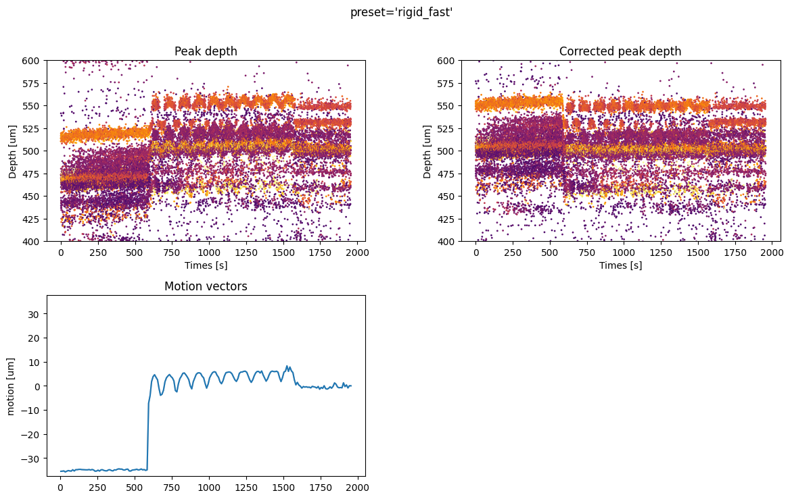
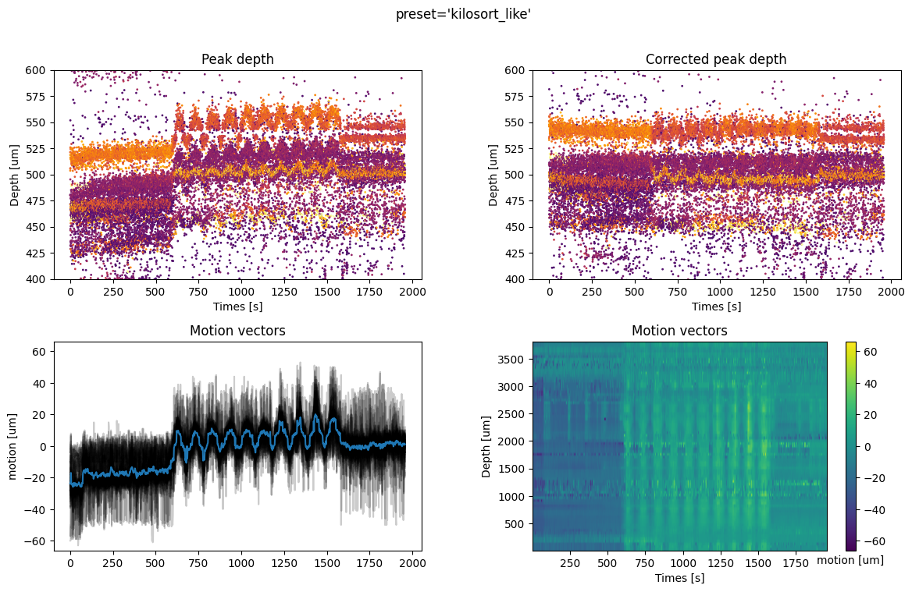
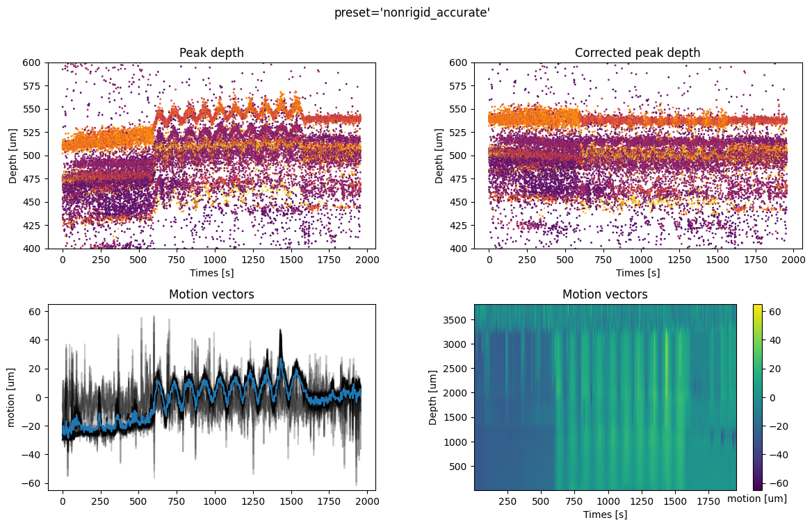
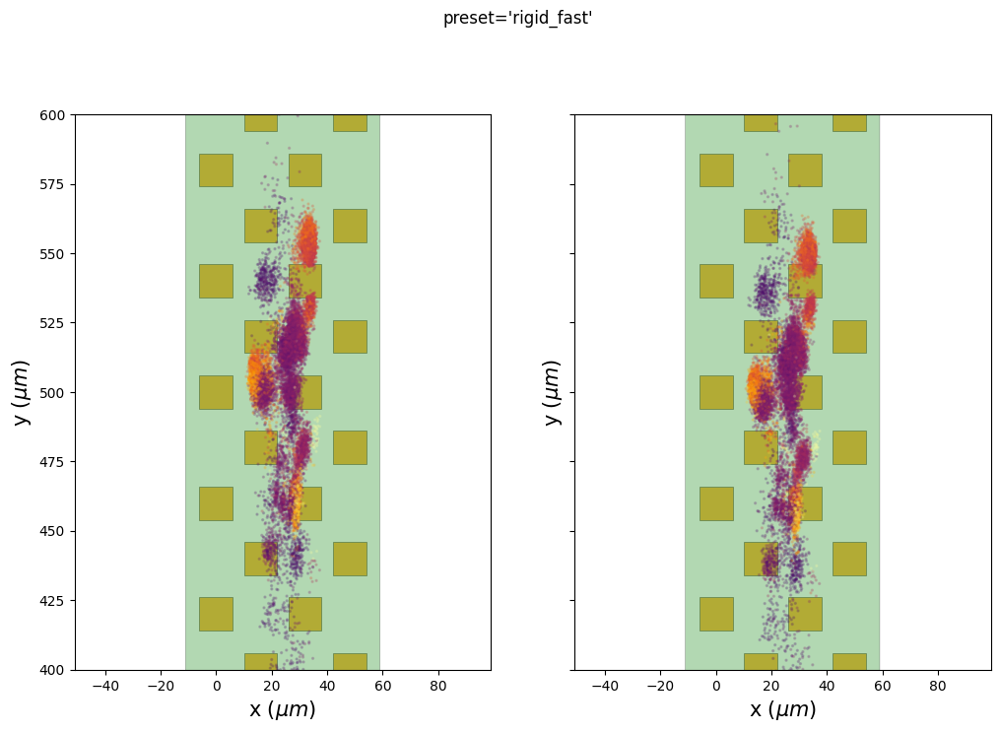
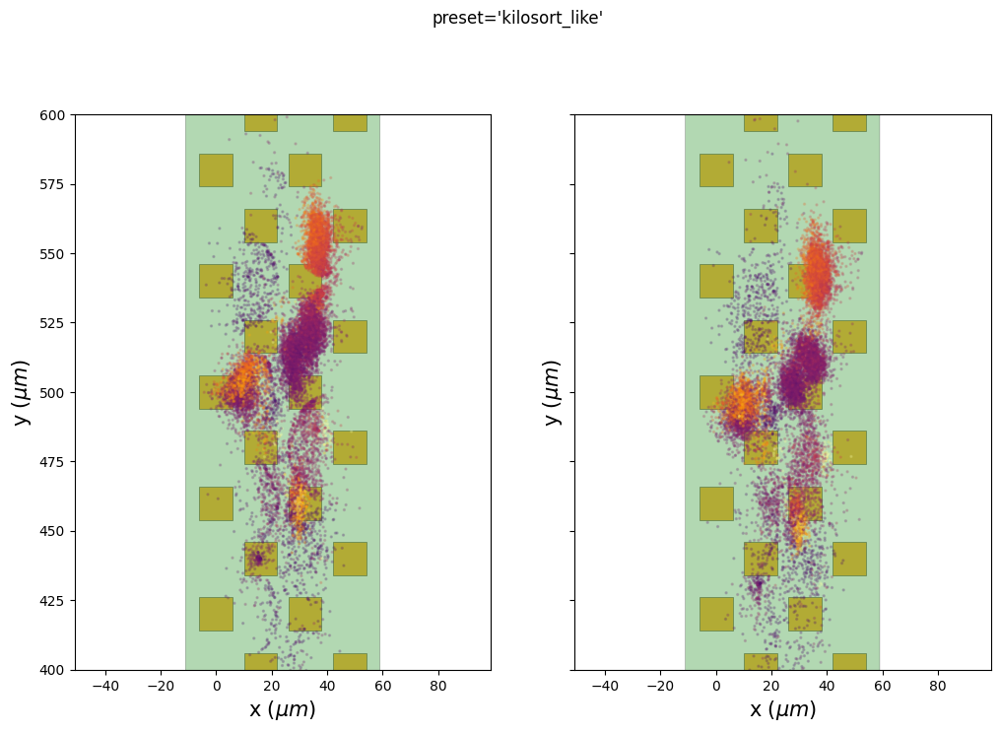
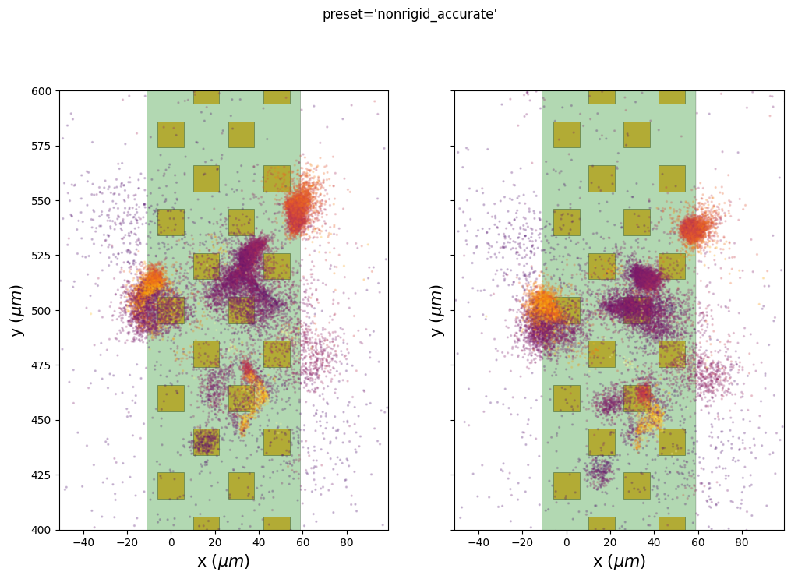
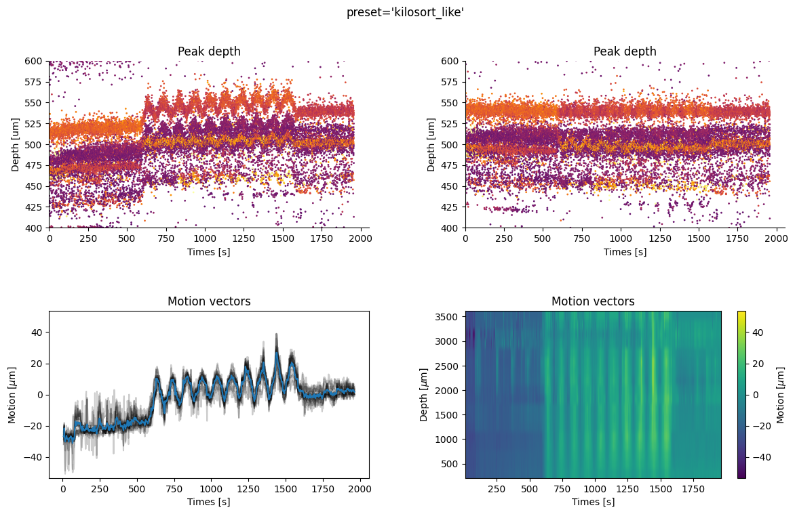

.. code:: ipython

    %matplotlib inline
    %load_ext autoreload
    %autoreload 2

Handle motion/drift with spikeinterface
=======================================

SpikeInterface offers a very flexible framework to handle drift as a
preprocessing step. If you want to know more, please read the
:ref:`motion_correction` section of the documentation.

Here is a short demo on how to handle drift using the high-level
function :py:func:`~spikeinterface.preprocessing.correct_motion()`.

This function takes a preprocessed recording as input and then
internally runs several steps (it can be slow!) and returns a lazy
recording that interpolates the traces on-the-fly to compensate for the
motion.

Internally this function runs the following steps:

::

    1. localize_peaks()
    2. select_peaks() (optional)
    3. estimate_motion()
    4. interpolate_motion()

All these sub-steps can be run with different methods and have many
parameters.

The high-level function suggests 3 predifined “presets” and we will
explore them using a very well known public dataset recorded by Nick
Steinmetz: `Imposed motion
datasets <https://figshare.com/articles/dataset/_Imposed_motion_datasets_from_Steinmetz_et_al_Science_2021/14024495>`_

This dataset contains 3 recordings and each recording contains a
Neuropixels 1 and a Neuropixels 2 probe.

Here we will use *dataset1* with *neuropixel1*. This dataset is the
*“hello world”* for drift correction in the spike sorting community!

.. code:: ipython

    from pathlib import Path
    import matplotlib.pyplot as plt
    import numpy as np

    import shutil

    import spikeinterface.full as si

.. code:: ipython

    base_folder = Path('/mnt/data/sam/DataSpikeSorting/imposed_motion_nick')
    dataset_folder = base_folder / 'dataset1/NP1'

.. code:: ipython

    # read the file
    raw_rec = si.read_spikeglx(dataset_folder)
    raw_rec

.. parsed-literal::

    SpikeGLXRecordingExtractor: 384 channels - 30.0kHz - 1 segments - 58,715,724 samples
                                1,957.19s (32.62 minutes) - int16 dtype - 42.00 GiB

We preprocess the recording with bandpass filter and a common median
reference. Note, that it is better to not whiten the recording before
motion estimation to get a better estimate of peak locations!

.. code:: ipython

    def preprocess_chain(rec):
        rec = si.bandpass_filter(rec, freq_min=300., freq_max=6000.)
        rec = si.common_reference(rec, reference='global', operator='median')
        return rec
    rec = preprocess_chain(raw_rec)

.. code:: ipython

    job_kwargs = dict(n_jobs=40, chunk_duration='1s', progress_bar=True)

Run motion correction with one function!
~~~~~~~~~~~~~~~~~~~~~~~~~~~~~~~~~~~~~~~~

Correcting for drift is easy! You just need to run a single function. We
will try this function with 3 presets.

Internally a preset is a dictionary of dictionaries containing all
parameters for each step.

Here we also save the motion correction results into a folder to be able
to load them later.

.. code:: ipython

    # internally, we can explore a preset like this
    # every parameter can be overwritten at runtime
    from spikeinterface.preprocessing.motion import motion_options_preset
    motion_options_preset['kilosort_like']

.. parsed-literal::

    {'doc': 'Mimic the drift correction of kilosrt (grid_convolution + iterative_template)',
     'detect_kwargs': {'method': 'locally_exclusive',
      'peak_sign': 'neg',
      'detect_threshold': 8.0,
      'exclude_sweep_ms': 0.1,
      'radius_um': 50},
     'select_kwargs': None,
     'localize_peaks_kwargs': {'method': 'grid_convolution',
      'radius_um': 30.0,
      'upsampling_um': 3.0,
      'sigma_um': array([ 5. , 12.5, 20. ]),
      'sigma_ms': 0.25,
      'margin_um': 30.0,
      'prototype': None,
      'percentile': 5.0},
     'estimate_motion_kwargs': {'method': 'iterative_template',
      'bin_duration_s': 2.0,
      'rigid': False,
      'win_step_um': 50.0,
      'win_sigma_um': 150.0,
      'margin_um': 0,
      'win_shape': 'rect'},
     'interpolate_motion_kwargs': {'direction': 1,
      'border_mode': 'force_extrapolate',
      'spatial_interpolation_method': 'kriging',
      'sigma_um': [20.0, 30],
      'p': 1}}

.. code:: ipython

    # lets try theses 3 presets
    some_presets = ('rigid_fast',  'kilosort_like', 'nonrigid_accurate')
    # some_presets = ('nonrigid_accurate',  )

.. code:: ipython

    # compute motion with 3 presets
    for preset in some_presets:
        print('Computing with', preset)
        folder = base_folder / 'motion_folder_dataset1' / preset
        if folder.exists():
            shutil.rmtree(folder)
        recording_corrected, motion_info = si.correct_motion(rec, preset=preset,
                                                             folder=folder,
                                                             output_motion_info=True, **job_kwargs)

Plot the results
~~~~~~~~~~~~~~~~

We load back the results and use the widgets module to explore the
estimated drift motion.

For all methods we have 4 plots:

  * top left: time vs estimated peak depth
  * top right: time vs peak depth after motion correction
  * bottom left: the average motion vector across depths and all motion across
    spatial depths (for non-rigid estimation)
  * bottom right: if motion correction is non rigid, the motion vector across depths is plotted as a
    map, with the color code representing the motion in micrometers.

A few comments on the figures:
  * the preset **‘rigid_fast’** has only one motion vector for the entire probe because it is a “rigid” case. The
    motion amplitude is globally underestimated because it averages across
    depths. However, the corrected peaks are flatter than the non-corrected
    ones, so the job is partially done. The big jump at=600s when the probe
    start moving is recovered quite well.
  * The preset **kilosort_like** gives better results because it is a non-rigid case. The motion vector
    is computed for different depths. The corrected peak locations are
    flatter than the rigid case. The motion vector map is still a bit
    noisy at some depths (e.g. around 1000um).
  * The preset **nonrigid_accurate** seems to give the best results on this recording.
    The motion vector seems less noisy globally, but it is not “perfect”
    (see at the top of the probe 3200um to 3800um). Also note that in the first part
    of the recording before the imposed motion (0-600s) we
    clearly have a non-rigid motion: the upper part of the probe
    (2000-3000um) experience some drift, but the lower part (0-1000um) is
    relatively stable. The method defined by this preset is able to capture this.

.. code:: ipython

    for preset in some_presets:
        # load
        folder = base_folder / 'motion_folder_dataset1' / preset
        motion_info = si.load_motion_info(folder)

        # and plot
        fig = plt.figure(figsize=(14, 8))
        si.plot_motion(motion_info, figure=fig, depth_lim=(400, 600),
                       color_amplitude=True, amplitude_cmap='inferno', scatter_decimate=10)
        fig.suptitle(f"{preset=}")

Plot peak localization
~~~~~~~~~~~~~~~~~~~~~~

We can also use the internal extra results (peaks and peaks location) to
check if putative clusters have a lower spatial spread after the motion
correction.

Here we plot the estimated peak locations (left) and the corrected peak
locations (on right) on top of the probe. The color codes for the peak
amplitudes.

We can see here that some clusters seem to be more compact on the ‘y’
axis, especially for the preset “nonrigid_accurate”.

Be aware that there are two ways to correct for the motion: 1.
Interpolate traces and detect/localize peaks again
(:py:func:`interpolate_recording()`) 2. Compensate for drift directly on peak
locations (:py:func:`correct_motion_on_peaks()`)

Case 1 is used before running a spike sorter and the case 2 is used here
to display the results.

.. code:: ipython

    from spikeinterface.sortingcomponents.motion import correct_motion_on_peaks

    for preset in some_presets:
        folder = base_folder / 'motion_folder_dataset1' / preset
        motion_info = si.load_motion_info(folder)

        fig, axs = plt.subplots(ncols=2, figsize=(12, 8), sharey=True)

        ax = axs[0]
        si.plot_probe_map(rec, ax=ax)

        peaks = motion_info['peaks']
        sr = rec.get_sampling_frequency()
        time_lim0 = 750.
        time_lim1 = 1500.
        mask = (peaks['sample_index'] > int(sr * time_lim0)) & (peaks['sample_index'] < int(sr * time_lim1))
        sl = slice(None, None, 5)
        amps = np.abs(peaks['amplitude'][mask][sl])
        amps /= np.quantile(amps, 0.95)
        c = plt.get_cmap('inferno')(amps)

        color_kargs = dict(alpha=0.2, s=2, c=c)

        loc = motion_info['peak_locations']
        #color='black',
        ax.scatter(loc['x'][mask][sl], loc['y'][mask][sl], **color_kargs)

        loc2 = correct_motion_on_peaks(motion_info['peaks'], motion_info['peak_locations'], rec.sampling_frequency,
                                       motion_info['motion'], motion_info['temporal_bins'], motion_info['spatial_bins'], direction="y")

        ax = axs[1]
        si.plot_probe_map(rec, ax=ax)
        #  color='black',
        ax.scatter(loc2['x'][mask][sl], loc2['y'][mask][sl], **color_kargs)

        ax.set_ylim(400, 600)
        fig.suptitle(f"{preset=}")

run times
---------

Presets and related methods have differents accuracies but also
computation speeds. It is good to have this in mind!

.. code:: ipython

    run_times = []
    for preset in some_presets:
        folder = base_folder / 'motion_folder_dataset1' / preset
        motion_info = si.load_motion_info(folder)
        run_times.append(motion_info['run_times'])
    keys = run_times[0].keys()

    bottom = np.zeros(len(run_times))
    fig, ax = plt.subplots()
    for k in keys:
        rtimes = np.array([rt[k] for rt in run_times])
        if np.any(rtimes>0.):
            ax.bar(some_presets, rtimes, bottom=bottom, label=k)
        bottom += rtimes
    ax.legend()

.. parsed-literal::

    <matplotlib.legend.Legend at 0x7f0178a0ada0>

