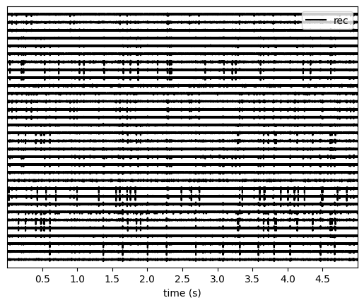
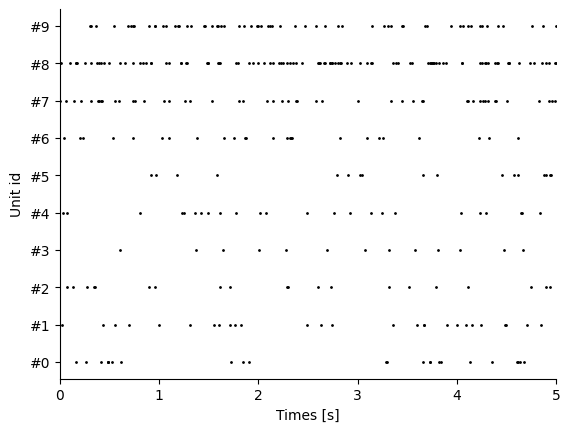

.. code:: ipython3

    %matplotlib inline

Read various format into SpikeInterface
=======================================

SpikeInterface can read various formats of “recording” (traces) and
“sorting” (spike train) data.

Internally, to read different formats, SpikeInterface either uses: \* a
wrapper to ``neo <https://github.com/NeuralEnsemble/python-neo>``\ \_
rawio classes \* or a direct implementation

Note that:

- file formats contain a “recording”, a “sorting”, or “both”
- file formats can be file-based (NWB, …) or folder based (SpikeGLX,
  OpenEphys, …)

In this example we demonstrate how to read different file formats into
SI

.. code:: ipython3

    import matplotlib.pyplot as plt

    import spikeinterface.core as si
    import spikeinterface.extractors as se

Let’s download some datasets in different formats from the
``ephy_testing_data <https://gin.g-node.org/NeuralEnsemble/ephy_testing_data>``\ \_
repo:

- MEArec: a simulator format which is hdf5-based. It contains both a
  “recording” and a “sorting” in the same file.
- Spike2: file from spike2 devices. It contains “recording” information
  only.

.. code:: ipython3

    spike2_file_path = si.download_dataset(remote_path="spike2/130322-1LY.smr")
    print(spike2_file_path)

    mearec_folder_path = si.download_dataset(remote_path="mearec/mearec_test_10s.h5")
    print(mearec_folder_path)

.. parsed-literal::

    Downloading data from 'https://gin.g-node.org/NeuralEnsemble/ephy_testing_data/raw/master/mearec/mearec_test_10s.h5' to file '/Users/christopherhalcrow/spikeinterface_datasets/ephy_testing_data/mearec/mearec_test_10s.h5'.

.. parsed-literal::

     modified: spike2/130322-1LY.smr (file)
    1 annex'd file (15.8 MB recorded total size)
    /Users/christopherhalcrow/spikeinterface_datasets/ephy_testing_data/spike2/130322-1LY.smr
    1 annex'd file (59.4 MB recorded total size)
    nothing to save, working tree clean

.. parsed-literal::

    100%|█████████████████████████████████████| 62.3M/62.3M [00:00<00:00, 76.7GB/s]

.. parsed-literal::

    /Users/christopherhalcrow/spikeinterface_datasets/ephy_testing_data/mearec/mearec_test_10s.h5

Now that we have downloaded the files, let’s load them into SI.

The :py:func:``~spikeinterface.extractors.read_spike2`` function returns
one object, a :py:class:``~spikeinterface.core.BaseRecording``.

Note that internally this file contains 2 data streams (‘0’ and ‘1’), so
we need to specify which one we want to retrieve (‘0’ in our case). the
stream information can be retrieved by using the
:py:func:``~spikeinterface.extractors.get_neo_streams`` function.

.. code:: ipython3

    stream_names, stream_ids = se.get_neo_streams("spike2", spike2_file_path)
    print(stream_names)
    print(stream_ids)
    stream_id = stream_ids[0]
    print("stream_id", stream_id)

    recording = se.read_spike2(spike2_file_path, stream_id="0")
    print(recording)
    print(type(recording))
    print(isinstance(recording, si.BaseRecording))

.. parsed-literal::

    ['Signal stream 0', 'Signal stream 1']
    ['0', '1']
    stream_id 0
    Spike2RecordingExtractor: 1 channels - 20833.333333 Hz - 1 segments - 4,126,365 samples
                              198.07s (3.30 minutes) - int16 dtype - 7.87 MiB
      file_path: /Users/christopherhalcrow/spikeinterface_datasets/ephy_testing_data/spike2/130322-1LY.smr
    <class 'spikeinterface.extractors.neoextractors.spike2.Spike2RecordingExtractor'>
    True

The
:py:func::literal:`~spikeinterface.extractors.read_spike2`\` function is equivalent to instantiating a :py:class:`\ ~spikeinterface.extractors.Spike2RecordingExtractor\`
object:

.. code:: ipython3

    recording = se.read_spike2(spike2_file_path, stream_id="0")
    print(recording)

.. parsed-literal::

    Spike2RecordingExtractor: 1 channels - 20833.333333 Hz - 1 segments - 4,126,365 samples
                              198.07s (3.30 minutes) - int16 dtype - 7.87 MiB
      file_path: /Users/christopherhalcrow/spikeinterface_datasets/ephy_testing_data/spike2/130322-1LY.smr

The :py:func:``~spikeinterface.extractors.read_mearec`` function returns
two objects, a :py:class:``~spikeinterface.core.BaseRecording`` and a
:py:class:``~spikeinterface.core.BaseSorting``:

.. code:: ipython3

    recording, sorting = se.read_mearec(mearec_folder_path)
    print(recording)
    print(type(recording))
    print()
    print(sorting)
    print(type(sorting))

.. parsed-literal::

    MEArecRecordingExtractor: 32 channels - 32.0kHz - 1 segments - 320,000 samples - 10.00s
                              float32 dtype - 39.06 MiB
      file_path: /Users/christopherhalcrow/spikeinterface_datasets/ephy_testing_data/mearec/mearec_test_10s.h5
    <class 'spikeinterface.extractors.neoextractors.mearec.MEArecRecordingExtractor'>

    MEArecSortingExtractor: 10 units - 1 segments - 32.0kHz
      file_path: /Users/christopherhalcrow/spikeinterface_datasets/ephy_testing_data/mearec/mearec_test_10s.h5
    <class 'spikeinterface.extractors.neoextractors.mearec.MEArecSortingExtractor'>

SI objects (:py:class:``~spikeinterface.core.BaseRecording`` and
:py:class:``~spikeinterface.core.BaseSorting``) can be plotted quickly
with the :py:mod:``spikeinterface.widgets`` submodule:

.. code:: ipython3

    import spikeinterface.widgets as sw

    w_ts = sw.plot_traces(recording, time_range=(0, 5))
    w_rs = sw.plot_rasters(sorting, time_range=(0, 5))

    plt.show()

