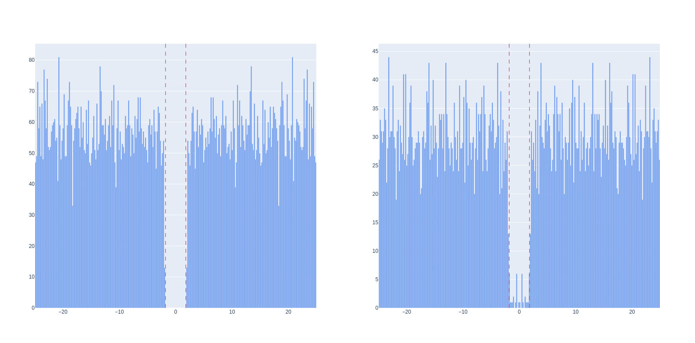

.. _ISI:

Inter-spike-interval (ISI) violations (:code:`isi_violation`, :code:`rp_violation`)
===================================================================================

Calculation
-----------

Neurons have a refractory period after a spiking event during which they cannot fire again.
Inter-spike-interval (ISI) violations refers to the rate of refractory period violations (as described by [Hill]_).

The calculation works under the assumption that the contaminant events happen randomly or come from another neuron that is not correlated with our unit.
A correlation will lead to an overestimation of the contamination, whereas an anti-correlation will lead to an underestimation.

Different formulas have been developed over the years.

Calculation from the [Hill]_ paper
----------------------------------

The following quantities are required:

- :math:`ISI_t` : biological threshold for ISI violation.
- :math:`ISI_{min}`: minimum ISI threshold enforced by the data recording system used.
- :math:`ISI_s` : the array of ISI violations which are observed in the unit's spike train.
- :math:`\#`: denotes count.

The threshold for ISI violations is the biological ISI threshold, :math:`ISI_t`, minus the minimum ISI threshold, :math:`ISI_{min}` enforced by the data recording system used.
The array of inter-spike-intervals observed in the unit's spike train, :math:`ISI_s`, is used to identify the count (:math:`\#`) of observed ISI's below this threshold.
For a recording with a duration of :math:`T_r` seconds, and a unit with :math:`N_s` spikes, the rate of ISI violations is:

.. math::

    \textrm{ISI violations} = \frac{ \#( ISI_s < ISI_t) T_r  }{ 2  N_s^2  (ISI_t - ISI_{min}) }

Calculation from the [Llobet]_ paper
------------------------------------

The following quantities are required:

- :math:`T` the duration of the recording.
- :math:`N` the number of spikes in the unit's spike train.
- :math:`t_r` the duration of the unit's refractory period.
- :math:`n_v` the number of violations of the refractory period.

The estimated contamination :math:`C` can be calculated with 2 extreme scenarios. In the first one, the contaminant spikes are completely random (or come from an infinite number of other neurons). In the second one, the contaminant spikes come from a single other neuron:

.. math::

    C = \frac{FP}{TP + FP} \approx \begin{cases}
        1 - \sqrt{1 - \frac{n_v T}{N^2 t_r}} \text{ for the case of random contamination} \\
        \frac{1}{2} \left( 1 - \sqrt{1 - \frac{2 n_v T}{N^2 t_r}} \right) \text{ for the case of 1 contaminant neuron}
    \end{cases}

Where :math:`TP` is the number of true positives (detected spikes that come from the neuron) and :math:`FP` is the number of false positives (detected spikes that don't come from the neuron).

Expectation and use
-------------------

ISI violations identifies unit contamination - a high value indicates a highly contaminated unit.
Despite being a ratio, ISI violations can exceed 1 (or become a complex number in the [Llobet]_ formula). This is usually due to the contaminant events being correlated with our neuron, and their number is greater than a purely random spike train.

Example code
------------

Without SpikeInterface:

.. code-block:: python

    spike_train = ...   # The spike train of our unit
    t_r = ...           # The refractory period of our unit
    n_v = np.sum(np.diff(spike_train) < t_r)

    # Use the formula you want here

With SpikeInterface:

.. code-block:: python

    import spikeinterface.qualitymetrics as sqm

    # Combine sorting and recording into sorting_analyzer

    isi_violations_ratio, isi_violations_count = sqm.compute_isi_violations(sorting_analyzer=sorting_analyzer, isi_threshold_ms=1.0)

References
----------

Hill implementation (:code:`isi_violation`)
^^^^^^^^^^^^^^^^^^^^^^^^^^^^^^^^^^^^^^^^^^^

.. autofunction:: spikeinterface.qualitymetrics.misc_metrics.compute_isi_violations

LLobet implementation (:code:`rp_violation`)
^^^^^^^^^^^^^^^^^^^^^^^^^^^^^^^^^^^^^^^^^^^^

.. autofunction:: spikeinterface.qualitymetrics.misc_metrics.compute_refrac_period_violations

Examples with plots
-------------------

Here is shown the auto-correlogram of two units, with the dashed lines representing the refractory period.

- On the left, we have a unit with no refractory period violations, meaning that this unit is probably not contaminated.
- On the right, we have a unit with some refractory period violations. It means that it is contaminated, but probably not that much.

This figure can be generated with the following code:

.. code-block:: python

    import plotly.graph_objects as go
    from spikeinterface.postprocessing import compute_correlograms

    # Create your sorting object
    unit_ids = ... # Units you are interested in vizulazing.
    sorting = sorting.select_units(unit_ids)
    t_r = 1.5   # Refractory period (in ms).

    correlograms, bins = compute_correlograms(sorting, window_ms=50.0, bin_ms=0.2, symmetrize=True)

    fig = go.Figure().set_subplots(rows=1, cols=2)

    fig.add_trace(go.Bar(
        x=bins[:-1] + (bins[1]-bins[0])/2,
        y=correlograms[0, 0],
        width=bins[1] - bins[0],
        marker_color="CornflowerBlue",
        name="Non-contaminated unit",
        showlegend=False
    ), row=1, col=1)
    fig.add_trace(go.Bar(
        x=bins[:-1] + (bins[1]-bins[0])/2,
        y=correlograms[1, 1],
        width=bins[1] - bins[0],
        marker_color="CornflowerBlue",
        name="Contaminated unit",
        showlegend=False
    ), row=1, col=2)

    fig.add_vline(x=-t_r, row=1, col=1, line=dict(dash="dash", color="Crimson", width=1))
    fig.add_vline(x=t_r, row=1, col=1, line=dict(dash="dash", color="Crimson", width=1))
    fig.add_vline(x=-t_r, row=1, col=2, line=dict(dash="dash", color="Crimson", width=1))
    fig.add_vline(x=t_r, row=1, col=2, line=dict(dash="dash", color="Crimson", width=1))

    fig.show()

Links to original implementations
---------------------------------

* From `Lussac <https://github.com/BarbourLab/lussac/blob/main/postprocessing/utils.pyx#L365>`_

* From the `AllenSDK <https://allensdk.readthedocs.io/en/latest/_static/examples/nb/ecephys_quality_metrics.html#ISI-violations>`_

Literature
----------

Introduced by [Hill]_ (2011).
Also described by [Llobet]_ (2022)
