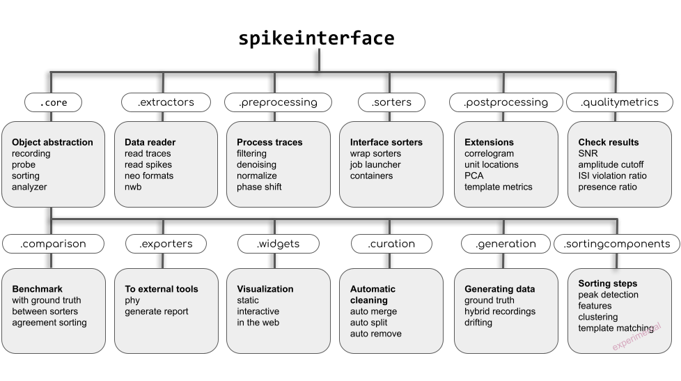

Welcome to SpikeInterface's documentation!
==========================================

.. image:: images/logo.png
  :scale: 100 %
  :align: center

SpikeInterface is a Python module to analyze extracellular electrophysiology data.

With a few lines of code, SpikeInterface enables you to load and pre-process the recording, run several
state-of-the-art spike sorters, post-process and curate the output, compute quality metrics, and visualize the results.

.. warning::

    **New features under construction!** 🚧🚧🚧: after the 0.100.0 release (and related bug fixes), the next release will contain
    a major API improvement: the :code:`SortingAnalyzer`. To read more about this, checkout the
    `enhancement proposal <https://github.com/SpikeInterface/spikeinterface/issues/2282>`_.
    Please refer to the stable documentation `here <https://spikeinterface.readthedocs.io/en/0.100.4>`_.
    Learn how to update your code `here <how_to/waveform_extractor_to_sorting_analyzer.html>`_ and read more about the
    :code:`SortingAnalyzer` `here <modules/postprocessing.html>`_.

Overview of SpikeInterface modules
----------------------------------

SpikeInterface is made of several modules to deal with different aspects of the analysis pipeline:

- read/write many extracellular file formats.
- pre-process extracellular recordings.
- run many popular, semi-automatic spike sorters (also in Docker/Singularity containers).
- post-process spike sorted data.
- compare and benchmark spike sorting outputs.
- compute quality metrics to validate and curate spike sorting outputs.
- visualize recordings and spike sorting outputs.
- export a report and/or export to Phy.
- offer a powerful Qt-based viewer in a separate package `spikeinterface-gui <https://github.com/SpikeInterface/spikeinterface-gui>`_
- have some powerful sorting components to build your own sorter.
- have a full motion/drift correction framework (See :ref:`motion_correction`)

.. toctree::
    :maxdepth: 1
    :caption: Contents:

    overview
    installation
    import
    modules/index
    how_to/index
    modules_gallery/index
    install_sorters
    viewers
    development/development
    api
    whatisnew
    authors

Other resources
---------------

To get started with SpikeInterface, you can take a look at the following additional resources:

- | `spiketutorials <https://github.com/SpikeInterface/spiketutorials>`_ is a collection of basic and advanced
  | tutorials. It includes links to videos to dive into the SpikeInterface framework.

- | `SpikeInterface Reports <https://spikeinterface.github.io/>`_ contains several notebooks to reproduce analysis
  | figures of SpikeInterface-based papers and to showcase the latest features of SpikeInterface.

- | The `2020 eLife paper <https://elifesciences.org/articles/61834>`_ introduces the concept and motivation and
  | performs an in-depth comparison of multiple sorters (spoiler alert: they strongly disagree with each other!).
  | **Note**: the code-base and implementation have changed a lot since the "paper" version published in 2020.
  | For detailed documentation we therefore suggest more recent resources, like this documentation and :code:`spiketutorials`.

.. Indices and tables
.. ==================
..
.. * :ref:`genindex`
.. * :ref:`modindex`
.. * :ref:`search`
