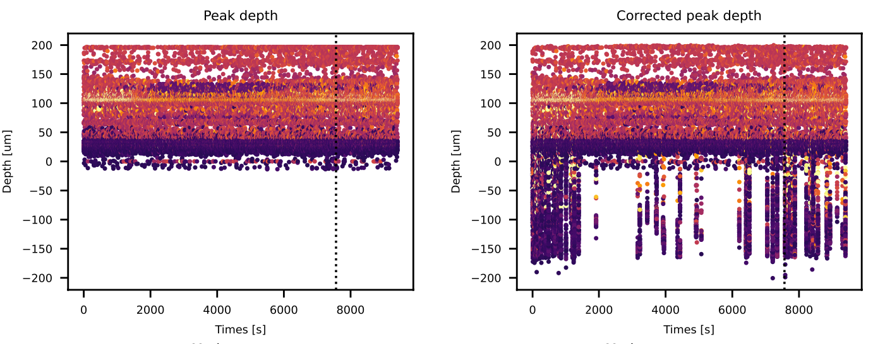

.. DO NOT EDIT.
.. THIS FILE WAS AUTOMATICALLY GENERATED BY SPHINX-GALLERY.
.. TO MAKE CHANGES, EDIT THE SOURCE PYTHON FILE:
.. "long_tutorials/handle_drift/plot_handle_drift.py"
.. LINE NUMBERS ARE GIVEN BELOW.

.. only:: html

    .. note::
        :class: sphx-glr-download-link-note

        :ref:`Go to the end <sphx_glr_download_long_tutorials_handle_drift_plot_handle_drift.py>`
        to download the full example code.

.. rst-class:: sphx-glr-example-title

.. _sphx_glr_long_tutorials_handle_drift_plot_handle_drift.py:

===========================================
Handle probe drift with spikeinterface NEW
===========================================

Probe movement is an inevitability when running
*in vivo* electrophysiology recordings. Motion, caused by physical
movement of the probe or the sliding of brain tissue
deforming across the probe, can complicate the sorting
and analysis of units.

SpikeInterface offers a flexible framework to handle motion correction
as a preprocessing step. In this tutorial we will cover the three main
drift-correction algorithms implemented in SpikeInterface
(**rigid_fast**, **kilosort_like** and **nonrigid_accurate**) with
a focus on running the methods and interpreting the output.

For more information on the theory and implementation of these methods,
see the :ref:`motion_correction` section of the documentation and
the `kilosort4 page <https://kilosort.readthedocs.io/en/latest/drift.html>`_
on drift correction. Drift correction may not always work as expected
(for example, if the probe has a small number of channels), see the
`When do I need to apply drift correction?`_ section for assessing
drift correction output.

---------------------
What is probe drift?
---------------------

The inserted probe can move from side-to-side (*'x' direction*),
up-or-down (*'y' direction*) or forwards-or-backwards (*'z' direction*).
Movement in the 'x' and 'z' direction is harder to model than vertical
drift (i.e. along the probe depth), and are not handled by most motion
correction algorithms. Fortunately, vertical drift which is most easily
handled is most pronounced as the probe is most likely to move along the path
of insertion.

Vertical drift can come in two forms, *'rigid'* and *'non-rigid'*. Rigid drift
is drift caused by movement of the entire probe, and the motion is
similar across all channels along the probe depth. In contrast,
non-rigid drift is instead caused by local movements of neuronal tissue along the
probe, and can selectively affect subsets of channels.

--------------------------
The drift correction steps
--------------------------

The easiest way to run drift correction in SpikeInterface is with the
high-level :py:func:`~spikeinterface.preprocessing.correct_motion()` function.
This function takes a recording as input and returns a motion-corrected
recording object. As with all other preprocessing steps, the correction (in this
case interpolation of the data to correct the detected motion) is lazy and applied on-the-fly when data is needed).

The :py:func:`~spikeinterface.preprocessing.correct_motion()`
function implements motion correction algorithms in a modular way
wrapping a number of subfunctions that together implement the
full drift correction algorithm.

These drift-correction modules are:

| **1.** ``localize_peaks()`` (detect spikes and localize their position on the probe)
| **2.** ``select_peaks()`` (optional, select a subset of peaks to use to estimate motion)
| **3.** ``estimate_motion()`` (estimate motion using the detected spikes)
| **4.** ``interpolate_motion()`` (perform interpolation on the raw data to account for the estimated drift).

All these sub-steps have many parameters which dictate the
speed and effectiveness of motion correction. As such, ``correct_motion``
provides three setting 'presets' which configure the motion correct
to proceed either as:

* **rigid_fast** - a fast, not particularly accurate correction assuming rigid drift.
* **kilosort-like** - Mimics what is done in Kilosort.
* **nonrigid_accurate** - A decentralized drift correction (DREDGE), introduced by the Paninski group.

When using motion correction in your analysis, please make sure to
:ref:`cite the appropriate paper for your chosen method<cite-motion-correction>`.

**Now, let's dive into running motion correction with these three
methods on a simulated dataset.**

.. GENERATED FROM PYTHON SOURCE LINES 85-90

-------------------------------------------
Setting up and preprocessing the recording
-------------------------------------------

First, we will import the modules we will need for this tutorial:

.. GENERATED FROM PYTHON SOURCE LINES 90-98

.. code-block:: Python

    import matplotlib.pyplot as plt
    import spikeinterface.full as si
    from spikeinterface.generation.drifting_generator import generate_drifting_recording
    from spikeinterface.preprocessing.motion import motion_options_preset
    from spikeinterface.sortingcomponents.motion_interpolation import correct_motion_on_peaks
    from spikeinterface.widgets import plot_peaks_on_probe

.. GENERATED FROM PYTHON SOURCE LINES 99-107

Next, we will generate a synthetic, drifting recording. This recording will
have 100 separate units with firing rates randomly distributed between
15 and 25 Hz.

We will create a zigzag drift pattern on the recording, starting at
100 seconds and with a peak-to-peak period of 100 seconds (so we will
have 9 zigzags through our recording). We also add some non-linearity
to the imposed motion.

.. GENERATED FROM PYTHON SOURCE LINES 109-116

.. note::
    This tutorial can take a long time to run with the default arguments.
    If you would like to run this locally, you may want to edit ``num_units``
    and ``duration`` to smaller values (e.g. 25 and 100 respectively).

    Also note, the below code uses multiprocessing. If you are on Windows, you may
    need to place the code within a  ``if __name__ == "__main__":`` block.

.. GENERATED FROM PYTHON SOURCE LINES 116-139

.. code-block:: Python

    num_units = 200  # 250 still too many I think!
    duration = 1000

    _, raw_recording, _ = generate_drifting_recording(
        num_units=num_units,
        duration=duration,
        generate_sorting_kwargs=dict(firing_rates=(15, 25), refractory_period_ms=4.0),
        seed=42,
        generate_displacement_vector_kwargs=dict(motion_list=[
                dict(
                    drift_mode="zigzag",
                    non_rigid_gradient=0.01,
                    t_start_drift=int(duration/10),
                    t_end_drift=None,
                    period_s=int(duration/10),
                ),
            ],
        )
    )
    print(raw_recording)

.. rst-class:: sphx-glr-script-out

 .. code-block:: none

    InjectDriftingTemplatesRecording: 128 channels - 30.0kHz - 1 segments - 30,000,000 samples
                                      1,000.00s (16.67 minutes) - float32 dtype - 14.31 GiB

.. GENERATED FROM PYTHON SOURCE LINES 140-142

Before performing motion correction, we will **preprocess** the recording
with a bandpass filter and a common median reference.

.. GENERATED FROM PYTHON SOURCE LINES 142-146

.. code-block:: Python

    filtered_recording = si.bandpass_filter(raw_recording, freq_min=300.0, freq_max=6000.0)
    preprocessed_recording = si.common_reference(filtered_recording, reference="global", operator="median")

.. GENERATED FROM PYTHON SOURCE LINES 147-151

.. warning::
    It is better to not whiten the recording before motion estimation, as this
    will give a better estimate of the peak locations. Whitening should
    be performed after motion correction.

.. GENERATED FROM PYTHON SOURCE LINES 153-166

----------------------------------------
Run motion correction with one function!
----------------------------------------

Correcting for drift is easy! You just need to run a single function.
We will now run motion correction on our recording using the three
presets described above - **rigid_fast**, **kilosort_like** and
**nonrigid_accurate**.

We can run these presents with the ``preset`` argument of
:py:func:`~spikeinterface.preprocessing.correct_motion()`. Under the
hood, the presets define a set of parameters by set how to run the
4 submodules that make up motion correction (described above).

.. GENERATED FROM PYTHON SOURCE LINES 166-168

.. code-block:: Python

    print(motion_options_preset["kilosort_like"])

.. rst-class:: sphx-glr-script-out

 .. code-block:: none

    {'doc': 'Mimic the drift correction of kilosort (grid_convolution + iterative_template)', 'detect_kwargs': {'method': 'locally_exclusive', 'peak_sign': 'neg', 'detect_threshold': 8.0, 'exclude_sweep_ms': 0.1, 'radius_um': 50}, 'select_kwargs': {}, 'localize_peaks_kwargs': {'method': 'grid_convolution', 'radius_um': 40.0, 'upsampling_um': 5.0, 'weight_method': {'mode': 'gaussian_2d', 'sigma_list_um': array([ 5., 10., 15., 20., 25.])}, 'sigma_ms': 0.25, 'margin_um': 30.0, 'prototype': None, 'percentile': 5.0}, 'estimate_motion_kwargs': {'method': 'iterative_template', 'bin_duration_s': 2.0, 'rigid': False, 'win_step_um': 50.0, 'win_sigma_um': 150.0, 'margin_um': 0, 'win_shape': 'rect'}, 'interpolate_motion_kwargs': {'border_mode': 'force_extrapolate', 'spatial_interpolation_method': 'kriging', 'sigma_um': 20.0, 'p': 2}}

.. GENERATED FROM PYTHON SOURCE LINES 169-172

Now, lets run motion correction with our three presets. We will
set the ``job_kwargs`` to parallelize the job over a number of CPU cores—motion
correction is computationally intensive and will run faster with parallelization.

.. GENERATED FROM PYTHON SOURCE LINES 172-185

.. code-block:: Python

    presets_to_run = ("rigid_fast", "kilosort_like", "nonrigid_accurate")

    job_kwargs = dict(n_jobs=40, chunk_duration="1s", progress_bar=True)

    results = {preset: {} for preset in presets_to_run}
    for preset in presets_to_run:

        corrected_recording, motion_info = si.correct_motion(
            preprocessed_recording, preset=preset,  output_motion_info=True, **job_kwargs
        )
        results[preset]["motion_info"] = motion_info

.. rst-class:: sphx-glr-script-out

 .. code-block:: none


    detect and localize:   0%|          | 0/1000 [00:00<?, ?it/s]
    detect and localize:   1%|          | 12/1000 [00:00<01:12, 13.65it/s]
    detect and localize:   2%|▏         | 21/1000 [00:01<00:44, 22.16it/s]
    detect and localize:   3%|▎         | 26/1000 [00:01<00:51, 19.08it/s]
    detect and localize:   3%|▎         | 29/1000 [00:01<00:47, 20.38it/s]
    detect and localize:   3%|▎         | 32/1000 [00:01<00:47, 20.24it/s]
    detect and localize:   4%|▎         | 35/1000 [00:01<01:01, 15.80it/s]
    detect and localize:   4%|▍         | 38/1000 [00:02<00:55, 17.26it/s]
    detect and localize:   4%|▍         | 42/1000 [00:02<01:06, 14.30it/s]
    detect and localize:   5%|▍         | 46/1000 [00:02<00:56, 16.82it/s]
    detect and localize:   5%|▌         | 50/1000 [00:03<01:06, 14.28it/s]
    detect and localize:   5%|▌         | 54/1000 [00:03<00:54, 17.42it/s]
    detect and localize:   6%|▌         | 57/1000 [00:03<00:48, 19.41it/s]
    detect and localize:   6%|▌         | 60/1000 [00:03<01:03, 14.92it/s]
    detect and localize:   6%|▋         | 64/1000 [00:03<00:55, 16.78it/s]
    detect and localize:   7%|▋         | 67/1000 [00:04<01:07, 13.82it/s]
    detect and localize:   7%|▋         | 70/1000 [00:04<00:59, 15.74it/s]
    detect and localize:   7%|▋         | 74/1000 [00:04<01:05, 14.07it/s]
    detect and localize:   8%|▊         | 78/1000 [00:04<00:53, 17.27it/s]
    detect and localize:   8%|▊         | 81/1000 [00:04<00:50, 18.16it/s]
    detect and localize:   8%|▊         | 84/1000 [00:05<01:06, 13.82it/s]
    detect and localize:   9%|▉         | 88/1000 [00:05<00:53, 16.93it/s]
    detect and localize:   9%|▉         | 91/1000 [00:05<01:04, 14.12it/s]
    detect and localize:  10%|▉         | 95/1000 [00:05<00:57, 15.75it/s]
    detect and localize:  10%|▉         | 98/1000 [00:06<01:08, 13.13it/s]
    detect and localize:  10%|█         | 103/1000 [00:06<00:55, 16.03it/s]
    detect and localize:  10%|█         | 105/1000 [00:06<00:54, 16.42it/s]
    detect and localize:  11%|█         | 107/1000 [00:06<01:17, 11.52it/s]
    detect and localize:  11%|█         | 111/1000 [00:06<01:03, 14.02it/s]
    detect and localize:  11%|█▏        | 114/1000 [00:07<01:08, 12.99it/s]
    detect and localize:  12%|█▏        | 118/1000 [00:07<00:55, 15.77it/s]
    detect and localize:  12%|█▏        | 120/1000 [00:07<00:58, 15.03it/s]
    detect and localize:  12%|█▏        | 122/1000 [00:07<01:06, 13.30it/s]
    detect and localize:  12%|█▏        | 124/1000 [00:07<01:02, 14.08it/s]
    detect and localize:  13%|█▎        | 126/1000 [00:08<01:00, 14.51it/s]
    detect and localize:  13%|█▎        | 130/1000 [00:08<01:08, 12.61it/s]
    detect and localize:  13%|█▎        | 132/1000 [00:08<01:06, 13.11it/s]
    detect and localize:  14%|█▎        | 136/1000 [00:08<00:49, 17.53it/s]
    detect and localize:  14%|█▍        | 139/1000 [00:09<01:10, 12.16it/s]
    detect and localize:  14%|█▍        | 141/1000 [00:09<01:05, 13.19it/s]
    detect and localize:  14%|█▍        | 143/1000 [00:09<01:07, 12.77it/s]
    detect and localize:  15%|█▍        | 146/1000 [00:09<01:07, 12.61it/s]
    detect and localize:  15%|█▍        | 148/1000 [00:09<01:07, 12.63it/s]
    detect and localize:  15%|█▌        | 152/1000 [00:09<00:53, 15.99it/s]
    detect and localize:  15%|█▌        | 154/1000 [00:10<01:00, 13.94it/s]
    detect and localize:  16%|█▌        | 156/1000 [00:10<01:04, 13.05it/s]
    detect and localize:  16%|█▌        | 161/1000 [00:10<00:47, 17.67it/s]
    detect and localize:  16%|█▋        | 163/1000 [00:10<01:08, 12.26it/s]
    detect and localize:  17%|█▋        | 169/1000 [00:10<00:45, 18.21it/s]
    detect and localize:  17%|█▋        | 172/1000 [00:11<01:02, 13.20it/s]
    detect and localize:  18%|█▊        | 175/1000 [00:11<00:53, 15.32it/s]
    detect and localize:  18%|█▊        | 178/1000 [00:11<00:51, 15.81it/s]
    detect and localize:  18%|█▊        | 180/1000 [00:11<01:01, 13.43it/s]
    detect and localize:  18%|█▊        | 183/1000 [00:12<00:54, 15.00it/s]
    detect and localize:  18%|█▊        | 185/1000 [00:12<00:52, 15.52it/s]
    detect and localize:  19%|█▊        | 187/1000 [00:12<01:36,  8.41it/s]
    detect and localize:  19%|█▉        | 190/1000 [00:13<02:11,  6.15it/s]
    detect and localize:  19%|█▉        | 194/1000 [00:13<01:36,  8.39it/s]
    detect and localize:  20%|█▉        | 196/1000 [00:14<02:13,  6.02it/s]
    detect and localize:  20%|█▉        | 198/1000 [00:14<02:24,  5.55it/s]
    detect and localize:  20%|█▉        | 199/1000 [00:15<02:32,  5.26it/s]
    detect and localize:  20%|██        | 201/1000 [00:15<02:16,  5.87it/s]
    detect and localize:  20%|██        | 203/1000 [00:16<03:15,  4.07it/s]
    detect and localize:  20%|██        | 205/1000 [00:16<02:35,  5.11it/s]
    detect and localize:  21%|██        | 206/1000 [00:16<02:27,  5.38it/s]
    detect and localize:  21%|██        | 207/1000 [00:16<02:25,  5.46it/s]
    detect and localize:  21%|██        | 209/1000 [00:16<02:00,  6.55it/s]
    detect and localize:  21%|██        | 211/1000 [00:17<02:03,  6.40it/s]
    detect and localize:  21%|██▏       | 213/1000 [00:17<01:37,  8.04it/s]
    detect and localize:  22%|██▏       | 215/1000 [00:17<01:29,  8.76it/s]
    detect and localize:  22%|██▏       | 218/1000 [00:17<01:09, 11.26it/s]
    detect and localize:  22%|██▏       | 220/1000 [00:18<01:39,  7.83it/s]
    detect and localize:  22%|██▏       | 223/1000 [00:18<01:19,  9.83it/s]
    detect and localize:  23%|██▎       | 226/1000 [00:18<01:05, 11.74it/s]
    detect and localize:  23%|██▎       | 228/1000 [00:18<01:36,  8.03it/s]
    detect and localize:  23%|██▎       | 231/1000 [00:19<01:17,  9.86it/s]
    detect and localize:  23%|██▎       | 234/1000 [00:19<01:03, 12.08it/s]
    detect and localize:  24%|██▎       | 236/1000 [00:19<01:21,  9.41it/s]
    detect and localize:  24%|██▍       | 239/1000 [00:19<01:10, 10.83it/s]
    detect and localize:  24%|██▍       | 242/1000 [00:19<00:56, 13.47it/s]
    detect and localize:  24%|██▍       | 244/1000 [00:20<01:11, 10.53it/s]
    detect and localize:  25%|██▍       | 247/1000 [00:20<01:08, 10.92it/s]
    detect and localize:  25%|██▌       | 251/1000 [00:20<01:01, 12.22it/s]
    detect and localize:  25%|██▌       | 253/1000 [00:20<00:59, 12.50it/s]
    detect and localize:  26%|██▌       | 255/1000 [00:20<00:55, 13.37it/s]
    detect and localize:  26%|██▌       | 258/1000 [00:21<00:50, 14.64it/s]
    detect and localize:  26%|██▌       | 260/1000 [00:21<01:05, 11.37it/s]
    detect and localize:  26%|██▋       | 263/1000 [00:21<00:56, 13.07it/s]
    detect and localize:  26%|██▋       | 265/1000 [00:21<00:52, 14.12it/s]
    detect and localize:  27%|██▋       | 267/1000 [00:21<00:56, 13.07it/s]
    detect and localize:  27%|██▋       | 269/1000 [00:22<00:55, 13.15it/s]
    detect and localize:  27%|██▋       | 271/1000 [00:22<00:54, 13.42it/s]
    detect and localize:  27%|██▋       | 274/1000 [00:22<00:47, 15.36it/s]
    detect and localize:  28%|██▊       | 276/1000 [00:22<01:02, 11.57it/s]
    detect and localize:  28%|██▊       | 280/1000 [00:22<00:47, 15.06it/s]
    detect and localize:  28%|██▊       | 282/1000 [00:22<00:47, 15.03it/s]
    detect and localize:  28%|██▊       | 284/1000 [00:23<01:03, 11.25it/s]
    detect and localize:  29%|██▉       | 289/1000 [00:23<00:40, 17.56it/s]
    detect and localize:  29%|██▉       | 292/1000 [00:23<00:59, 11.95it/s]
    detect and localize:  30%|██▉       | 296/1000 [00:23<00:44, 15.73it/s]
    detect and localize:  30%|██▉       | 299/1000 [00:24<00:52, 13.39it/s]
    detect and localize:  30%|███       | 302/1000 [00:24<00:45, 15.32it/s]
    detect and localize:  30%|███       | 305/1000 [00:24<00:40, 17.11it/s]
    detect and localize:  31%|███       | 308/1000 [00:24<00:52, 13.11it/s]
    detect and localize:  31%|███       | 311/1000 [00:24<00:46, 14.75it/s]
    detect and localize:  31%|███▏      | 314/1000 [00:25<00:54, 12.50it/s]
    detect and localize:  32%|███▏      | 316/1000 [00:25<00:51, 13.34it/s]
    detect and localize:  32%|███▏      | 319/1000 [00:25<00:44, 15.27it/s]
    detect and localize:  32%|███▏      | 322/1000 [00:25<00:47, 14.41it/s]
    detect and localize:  32%|███▏      | 324/1000 [00:25<00:48, 13.88it/s]
    detect and localize:  33%|███▎      | 327/1000 [00:26<00:41, 16.04it/s]
    detect and localize:  33%|███▎      | 330/1000 [00:26<00:46, 14.33it/s]
    detect and localize:  33%|███▎      | 332/1000 [00:26<00:49, 13.54it/s]
    detect and localize:  34%|███▍      | 338/1000 [00:26<00:41, 15.97it/s]
    detect and localize:  34%|███▍      | 340/1000 [00:26<00:46, 14.34it/s]
    detect and localize:  34%|███▍      | 343/1000 [00:27<00:39, 16.48it/s]
    detect and localize:  35%|███▍      | 346/1000 [00:27<00:49, 13.11it/s]
    detect and localize:  35%|███▍      | 348/1000 [00:27<00:47, 13.71it/s]
    detect and localize:  35%|███▌      | 351/1000 [00:27<00:41, 15.71it/s]
    detect and localize:  35%|███▌      | 354/1000 [00:27<00:44, 14.62it/s]
    detect and localize:  36%|███▌      | 356/1000 [00:28<00:48, 13.20it/s]
    detect and localize:  36%|███▌      | 359/1000 [00:28<00:41, 15.59it/s]
    detect and localize:  36%|███▌      | 362/1000 [00:28<00:44, 14.39it/s]
    detect and localize:  36%|███▋      | 364/1000 [00:28<00:47, 13.52it/s]
    detect and localize:  37%|███▋      | 367/1000 [00:28<00:41, 15.31it/s]
    detect and localize:  37%|███▋      | 370/1000 [00:29<00:45, 13.94it/s]
    detect and localize:  37%|███▋      | 372/1000 [00:29<00:47, 13.23it/s]
    detect and localize:  38%|███▊      | 375/1000 [00:29<00:52, 11.93it/s]
    detect and localize:  38%|███▊      | 378/1000 [00:29<00:48, 12.87it/s]
    detect and localize:  38%|███▊      | 380/1000 [00:29<00:50, 12.36it/s]
    detect and localize:  38%|███▊      | 384/1000 [00:30<00:40, 15.28it/s]
    detect and localize:  39%|███▊      | 386/1000 [00:30<00:40, 15.16it/s]
    detect and localize:  39%|███▉      | 388/1000 [00:30<00:43, 14.03it/s]
    detect and localize:  39%|███▉      | 390/1000 [00:30<00:41, 14.77it/s]
    detect and localize:  39%|███▉      | 394/1000 [00:30<00:36, 16.55it/s]
    detect and localize:  40%|███▉      | 396/1000 [00:30<00:39, 15.21it/s]
    detect and localize:  40%|███▉      | 398/1000 [00:31<00:40, 14.79it/s]
    detect and localize:  40%|████      | 402/1000 [00:31<00:35, 16.89it/s]
    detect and localize:  40%|████      | 404/1000 [00:31<00:38, 15.48it/s]
    detect and localize:  41%|████      | 406/1000 [00:31<00:37, 15.83it/s]
    detect and localize:  41%|████      | 410/1000 [00:31<00:34, 16.91it/s]
    detect and localize:  41%|████      | 412/1000 [00:31<00:37, 15.51it/s]
    detect and localize:  41%|████▏     | 414/1000 [00:32<00:40, 14.64it/s]
    detect and localize:  42%|████▏     | 418/1000 [00:32<00:36, 15.88it/s]
    detect and localize:  42%|████▏     | 420/1000 [00:32<00:36, 15.85it/s]
    detect and localize:  42%|████▏     | 422/1000 [00:32<00:38, 14.89it/s]
    detect and localize:  42%|████▎     | 425/1000 [00:32<00:38, 14.77it/s]
    detect and localize:  43%|████▎     | 427/1000 [00:32<00:43, 13.32it/s]
    detect and localize:  43%|████▎     | 429/1000 [00:33<00:48, 11.68it/s]
    detect and localize:  43%|████▎     | 433/1000 [00:33<00:37, 15.31it/s]
    detect and localize:  44%|████▎     | 435/1000 [00:33<00:40, 13.95it/s]
    detect and localize:  44%|████▎     | 437/1000 [00:33<00:46, 12.18it/s]
    detect and localize:  44%|████▍     | 441/1000 [00:33<00:33, 16.57it/s]
    detect and localize:  44%|████▍     | 443/1000 [00:33<00:35, 15.85it/s]
    detect and localize:  44%|████▍     | 445/1000 [00:34<00:43, 12.64it/s]
    detect and localize:  45%|████▍     | 449/1000 [00:34<00:31, 17.60it/s]
    detect and localize:  45%|████▌     | 452/1000 [00:34<00:45, 12.03it/s]
    detect and localize:  45%|████▌     | 454/1000 [00:34<00:45, 11.94it/s]
    detect and localize:  46%|████▌     | 457/1000 [00:35<00:36, 14.84it/s]
    detect and localize:  46%|████▌     | 459/1000 [00:35<00:38, 14.18it/s]
    detect and localize:  46%|████▌     | 461/1000 [00:35<00:47, 11.41it/s]
    detect and localize:  46%|████▋     | 465/1000 [00:35<00:33, 16.11it/s]
    detect and localize:  47%|████▋     | 468/1000 [00:35<00:35, 15.10it/s]
    detect and localize:  47%|████▋     | 470/1000 [00:35<00:37, 14.19it/s]
    detect and localize:  47%|████▋     | 472/1000 [00:36<00:39, 13.53it/s]
    detect and localize:  48%|████▊     | 476/1000 [00:36<00:34, 15.08it/s]
    detect and localize:  48%|████▊     | 478/1000 [00:36<00:34, 15.33it/s]
    detect and localize:  48%|████▊     | 480/1000 [00:36<00:33, 15.68it/s]
    detect and localize:  48%|████▊     | 483/1000 [00:36<00:28, 18.14it/s]
    detect and localize:  48%|████▊     | 485/1000 [00:36<00:36, 14.18it/s]
    detect and localize:  49%|████▊     | 487/1000 [00:37<00:34, 15.01it/s]
    detect and localize:  49%|████▉     | 489/1000 [00:37<00:33, 15.13it/s]
    detect and localize:  49%|████▉     | 492/1000 [00:37<00:37, 13.53it/s]
    detect and localize:  50%|████▉     | 495/1000 [00:37<00:31, 15.88it/s]
    detect and localize:  50%|████▉     | 497/1000 [00:37<00:33, 15.18it/s]
    detect and localize:  50%|█████     | 500/1000 [00:38<00:36, 13.72it/s]
    detect and localize:  50%|█████     | 503/1000 [00:38<00:29, 16.62it/s]
    detect and localize:  50%|█████     | 505/1000 [00:38<00:32, 15.11it/s]
    detect and localize:  51%|█████     | 508/1000 [00:38<00:33, 14.53it/s]
    detect and localize:  51%|█████     | 510/1000 [00:38<00:35, 13.76it/s]
    detect and localize:  51%|█████▏    | 513/1000 [00:38<00:30, 15.90it/s]
    detect and localize:  52%|█████▏    | 516/1000 [00:39<00:42, 11.42it/s]
    detect and localize:  52%|█████▏    | 519/1000 [00:39<00:37, 12.88it/s]
    detect and localize:  52%|█████▏    | 521/1000 [00:39<00:38, 12.29it/s]
    detect and localize:  52%|█████▏    | 524/1000 [00:39<00:33, 14.25it/s]
    detect and localize:  53%|█████▎    | 526/1000 [00:39<00:34, 13.60it/s]
    detect and localize:  53%|█████▎    | 529/1000 [00:40<00:33, 14.18it/s]
    detect and localize:  53%|█████▎    | 532/1000 [00:40<00:33, 13.99it/s]
    detect and localize:  53%|█████▎    | 534/1000 [00:40<00:35, 13.06it/s]
    detect and localize:  54%|█████▎    | 537/1000 [00:40<00:30, 14.94it/s]
    detect and localize:  54%|█████▍    | 540/1000 [00:40<00:31, 14.82it/s]
    detect and localize:  54%|█████▍    | 542/1000 [00:40<00:31, 14.64it/s]
    detect and localize:  55%|█████▍    | 545/1000 [00:41<00:29, 15.56it/s]
    detect and localize:  55%|█████▍    | 548/1000 [00:41<00:28, 15.84it/s]
    detect and localize:  55%|█████▌    | 550/1000 [00:41<00:28, 15.61it/s]
    detect and localize:  55%|█████▌    | 553/1000 [00:41<00:28, 15.59it/s]
    detect and localize:  56%|█████▌    | 556/1000 [00:41<00:28, 15.61it/s]
    detect and localize:  56%|█████▌    | 558/1000 [00:42<00:29, 15.23it/s]
    detect and localize:  56%|█████▌    | 561/1000 [00:42<00:28, 15.51it/s]
    detect and localize:  56%|█████▋    | 564/1000 [00:42<00:25, 17.01it/s]
    detect and localize:  57%|█████▋    | 566/1000 [00:42<00:29, 14.77it/s]
    detect and localize:  57%|█████▋    | 569/1000 [00:42<00:28, 15.17it/s]
    detect and localize:  57%|█████▋    | 572/1000 [00:42<00:29, 14.31it/s]
    detect and localize:  57%|█████▋    | 574/1000 [00:43<00:34, 12.45it/s]
    detect and localize:  58%|█████▊    | 577/1000 [00:43<00:29, 14.37it/s]
    detect and localize:  58%|█████▊    | 580/1000 [00:43<00:29, 14.40it/s]
    detect and localize:  58%|█████▊    | 582/1000 [00:43<00:30, 13.91it/s]
    detect and localize:  58%|█████▊    | 584/1000 [00:43<00:29, 14.13it/s]
    detect and localize:  59%|█████▊    | 587/1000 [00:43<00:25, 16.35it/s]
    detect and localize:  59%|█████▉    | 589/1000 [00:44<00:31, 13.21it/s]
    detect and localize:  59%|█████▉    | 591/1000 [00:44<00:28, 14.28it/s]
    detect and localize:  59%|█████▉    | 593/1000 [00:44<00:26, 15.34it/s]
    detect and localize:  60%|█████▉    | 597/1000 [00:44<00:24, 16.62it/s]
    detect and localize:  60%|█████▉    | 599/1000 [00:44<00:28, 14.14it/s]
    detect and localize:  60%|██████    | 601/1000 [00:44<00:26, 15.10it/s]
    detect and localize:  60%|██████    | 605/1000 [00:45<00:25, 15.43it/s]
    detect and localize:  61%|██████    | 607/1000 [00:45<00:27, 14.42it/s]
    detect and localize:  61%|██████    | 610/1000 [00:45<00:25, 15.24it/s]
    detect and localize:  61%|██████▏   | 613/1000 [00:45<00:25, 15.08it/s]
    detect and localize:  62%|██████▏   | 615/1000 [00:45<00:26, 14.52it/s]
    detect and localize:  62%|██████▏   | 619/1000 [00:46<00:22, 17.25it/s]
    detect and localize:  62%|██████▏   | 621/1000 [00:46<00:24, 15.22it/s]
    detect and localize:  62%|██████▏   | 623/1000 [00:46<00:26, 14.04it/s]
    detect and localize:  63%|██████▎   | 626/1000 [00:46<00:23, 15.61it/s]
    detect and localize:  63%|██████▎   | 629/1000 [00:46<00:24, 15.02it/s]
    detect and localize:  63%|██████▎   | 631/1000 [00:46<00:25, 14.27it/s]
    detect and localize:  63%|██████▎   | 634/1000 [00:47<00:25, 14.37it/s]
    detect and localize:  64%|██████▎   | 637/1000 [00:47<00:25, 14.32it/s]
    detect and localize:  64%|██████▍   | 639/1000 [00:47<00:27, 12.99it/s]
    detect and localize:  64%|██████▍   | 642/1000 [00:47<00:25, 13.88it/s]
    detect and localize:  64%|██████▍   | 645/1000 [00:48<00:29, 12.10it/s]
    detect and localize:  65%|██████▍   | 647/1000 [00:48<00:36,  9.59it/s]
    detect and localize:  65%|██████▍   | 649/1000 [00:48<00:32, 10.89it/s]
    detect and localize:  65%|██████▌   | 651/1000 [00:48<00:28, 12.05it/s]
    detect and localize:  65%|██████▌   | 653/1000 [00:48<00:30, 11.45it/s]
    detect and localize:  66%|██████▌   | 655/1000 [00:49<00:33, 10.45it/s]
    detect and localize:  66%|██████▌   | 658/1000 [00:49<00:30, 11.19it/s]
    detect and localize:  66%|██████▌   | 661/1000 [00:49<00:24, 14.05it/s]
    detect and localize:  66%|██████▋   | 663/1000 [00:49<00:28, 11.68it/s]
    detect and localize:  67%|██████▋   | 666/1000 [00:49<00:27, 12.03it/s]
    detect and localize:  67%|██████▋   | 669/1000 [00:50<00:23, 14.00it/s]
    detect and localize:  67%|██████▋   | 671/1000 [00:50<00:26, 12.42it/s]
    detect and localize:  67%|██████▋   | 674/1000 [00:50<00:27, 11.70it/s]
    detect and localize:  68%|██████▊   | 678/1000 [00:50<00:25, 12.81it/s]
    detect and localize:  68%|██████▊   | 680/1000 [00:51<00:26, 12.06it/s]
    detect and localize:  68%|██████▊   | 682/1000 [00:51<00:25, 12.55it/s]
    detect and localize:  68%|██████▊   | 684/1000 [00:51<00:23, 13.35it/s]
    detect and localize:  69%|██████▊   | 686/1000 [00:51<00:23, 13.15it/s]
    detect and localize:  69%|██████▉   | 688/1000 [00:51<00:26, 11.85it/s]
    detect and localize:  69%|██████▉   | 690/1000 [00:51<00:24, 12.82it/s]
    detect and localize:  69%|██████▉   | 692/1000 [00:51<00:22, 13.50it/s]
    detect and localize:  69%|██████▉   | 694/1000 [00:52<00:22, 13.37it/s]
    detect and localize:  70%|██████▉   | 696/1000 [00:52<00:26, 11.63it/s]
    detect and localize:  70%|██████▉   | 698/1000 [00:52<00:23, 13.05it/s]
    detect and localize:  70%|███████   | 700/1000 [00:52<00:21, 14.23it/s]
    detect and localize:  70%|███████   | 702/1000 [00:52<00:25, 11.53it/s]
    detect and localize:  70%|███████   | 704/1000 [00:53<00:29, 10.02it/s]
    detect and localize:  71%|███████   | 707/1000 [00:53<00:25, 11.54it/s]
    detect and localize:  71%|███████   | 710/1000 [00:53<00:21, 13.25it/s]
    detect and localize:  71%|███████   | 712/1000 [00:53<00:27, 10.55it/s]
    detect and localize:  71%|███████▏  | 714/1000 [00:53<00:24, 11.89it/s]
    detect and localize:  72%|███████▏  | 717/1000 [00:53<00:20, 14.07it/s]
    detect and localize:  72%|███████▏  | 719/1000 [00:54<00:30,  9.09it/s]
    detect and localize:  72%|███████▏  | 721/1000 [00:54<00:26, 10.45it/s]
    detect and localize:  72%|███████▎  | 725/1000 [00:54<00:20, 13.30it/s]
    detect and localize:  73%|███████▎  | 727/1000 [00:55<00:28,  9.56it/s]
    detect and localize:  73%|███████▎  | 732/1000 [00:55<00:18, 14.12it/s]
    detect and localize:  74%|███████▎  | 735/1000 [00:55<00:21, 12.55it/s]
    detect and localize:  74%|███████▎  | 737/1000 [00:55<00:24, 10.67it/s]
    detect and localize:  74%|███████▍  | 742/1000 [00:55<00:17, 15.09it/s]
    detect and localize:  74%|███████▍  | 744/1000 [00:56<00:25, 10.02it/s]
    detect and localize:  75%|███████▍  | 747/1000 [00:56<00:20, 12.37it/s]
    detect and localize:  75%|███████▌  | 750/1000 [00:56<00:16, 14.75it/s]
    detect and localize:  75%|███████▌  | 753/1000 [00:57<00:22, 11.16it/s]
    detect and localize:  76%|███████▌  | 758/1000 [00:57<00:15, 15.68it/s]
    detect and localize:  76%|███████▌  | 761/1000 [00:57<00:20, 11.68it/s]
    detect and localize:  76%|███████▋  | 763/1000 [00:57<00:20, 11.59it/s]
    detect and localize:  77%|███████▋  | 767/1000 [00:58<00:22, 10.45it/s]
    detect and localize:  77%|███████▋  | 769/1000 [00:58<00:19, 11.57it/s]
    detect and localize:  77%|███████▋  | 772/1000 [00:58<00:16, 13.63it/s]
    detect and localize:  78%|███████▊  | 775/1000 [00:58<00:20, 10.98it/s]
    detect and localize:  78%|███████▊  | 778/1000 [00:59<00:17, 12.70it/s]
    detect and localize:  78%|███████▊  | 783/1000 [00:59<00:17, 12.60it/s]
    detect and localize:  78%|███████▊  | 785/1000 [00:59<00:16, 13.25it/s]
    detect and localize:  79%|███████▉  | 789/1000 [00:59<00:12, 17.02it/s]
    detect and localize:  79%|███████▉  | 792/1000 [01:00<00:16, 12.45it/s]
    detect and localize:  79%|███████▉  | 794/1000 [01:00<00:15, 13.00it/s]
    detect and localize:  80%|███████▉  | 799/1000 [01:00<00:15, 12.73it/s]
    detect and localize:  80%|████████  | 802/1000 [01:00<00:14, 13.57it/s]
    detect and localize:  81%|████████  | 807/1000 [01:01<00:17, 10.83it/s]
    detect and localize:  81%|████████  | 809/1000 [01:01<00:16, 11.72it/s]
    detect and localize:  81%|████████▏ | 813/1000 [01:01<00:12, 14.79it/s]
    detect and localize:  82%|████████▏ | 815/1000 [01:02<00:16, 11.13it/s]
    detect and localize:  82%|████████▏ | 819/1000 [01:02<00:12, 14.97it/s]
    detect and localize:  82%|████████▏ | 822/1000 [01:02<00:10, 16.80it/s]
    detect and localize:  82%|████████▎ | 825/1000 [01:02<00:14, 11.91it/s]
    detect and localize:  83%|████████▎ | 829/1000 [01:02<00:11, 15.28it/s]
    detect and localize:  83%|████████▎ | 832/1000 [01:03<00:14, 11.84it/s]
    detect and localize:  83%|████████▎ | 834/1000 [01:03<00:13, 12.36it/s]
    detect and localize:  84%|████████▍ | 838/1000 [01:03<00:10, 15.78it/s]
    detect and localize:  84%|████████▍ | 841/1000 [01:03<00:13, 11.52it/s]
    detect and localize:  85%|████████▍ | 847/1000 [01:04<00:11, 13.43it/s]
    detect and localize:  85%|████████▍ | 849/1000 [01:04<00:11, 12.78it/s]
    detect and localize:  85%|████████▌ | 854/1000 [01:04<00:08, 17.38it/s]
    detect and localize:  86%|████████▌ | 857/1000 [01:05<00:11, 12.14it/s]
    detect and localize:  86%|████████▌ | 861/1000 [01:05<00:08, 15.58it/s]
    detect and localize:  86%|████████▋ | 864/1000 [01:05<00:11, 12.18it/s]
    detect and localize:  87%|████████▋ | 866/1000 [01:05<00:10, 12.80it/s]
    detect and localize:  87%|████████▋ | 870/1000 [01:05<00:07, 16.62it/s]
    detect and localize:  87%|████████▋ | 873/1000 [01:06<00:10, 11.94it/s]
    detect and localize:  88%|████████▊ | 878/1000 [01:06<00:07, 15.39it/s]
    detect and localize:  88%|████████▊ | 881/1000 [01:06<00:08, 13.66it/s]
    detect and localize:  88%|████████▊ | 884/1000 [01:06<00:07, 15.34it/s]
    detect and localize:  89%|████████▊ | 886/1000 [01:07<00:08, 13.37it/s]
    detect and localize:  89%|████████▉ | 888/1000 [01:07<00:10, 11.11it/s]
    detect and localize:  89%|████████▉ | 891/1000 [01:07<00:08, 12.30it/s]
    detect and localize:  89%|████████▉ | 894/1000 [01:07<00:07, 13.73it/s]
    detect and localize:  90%|████████▉ | 896/1000 [01:07<00:07, 13.43it/s]
    detect and localize:  90%|████████▉ | 899/1000 [01:08<00:06, 15.81it/s]
    detect and localize:  90%|█████████ | 902/1000 [01:08<00:06, 14.40it/s]
    detect and localize:  90%|█████████ | 904/1000 [01:08<00:07, 12.76it/s]
    detect and localize:  91%|█████████ | 907/1000 [01:08<00:06, 15.45it/s]
    detect and localize:  91%|█████████ | 910/1000 [01:08<00:06, 14.60it/s]
    detect and localize:  91%|█████████ | 912/1000 [01:08<00:06, 13.95it/s]
    detect and localize:  92%|█████████▏| 915/1000 [01:09<00:05, 14.79it/s]
    detect and localize:  92%|█████████▏| 918/1000 [01:09<00:05, 14.81it/s]
    detect and localize:  92%|█████████▏| 920/1000 [01:09<00:05, 14.71it/s]
    detect and localize:  92%|█████████▏| 922/1000 [01:09<00:05, 15.40it/s]
    detect and localize:  92%|█████████▏| 924/1000 [01:09<00:05, 14.52it/s]
    detect and localize:  93%|█████████▎| 926/1000 [01:09<00:05, 12.90it/s]
    detect and localize:  93%|█████████▎| 928/1000 [01:10<00:05, 13.58it/s]
    detect and localize:  93%|█████████▎| 931/1000 [01:10<00:05, 13.62it/s]
    detect and localize:  93%|█████████▎| 934/1000 [01:10<00:04, 13.49it/s]
    detect and localize:  94%|█████████▎| 936/1000 [01:10<00:04, 13.88it/s]
    detect and localize:  94%|█████████▍| 939/1000 [01:10<00:04, 12.86it/s]
    detect and localize:  94%|█████████▍| 941/1000 [01:11<00:04, 14.07it/s]
    detect and localize:  94%|█████████▍| 943/1000 [01:11<00:04, 12.10it/s]
    detect and localize:  95%|█████████▍| 946/1000 [01:11<00:03, 15.02it/s]
    detect and localize:  95%|█████████▍| 948/1000 [01:11<00:03, 13.35it/s]
    detect and localize:  95%|█████████▌| 950/1000 [01:11<00:03, 14.17it/s]
    detect and localize:  95%|█████████▌| 952/1000 [01:12<00:04, 10.47it/s]
    detect and localize:  96%|█████████▌| 956/1000 [01:12<00:02, 14.82it/s]
    detect and localize:  96%|█████████▌| 958/1000 [01:12<00:02, 15.34it/s]
    detect and localize:  96%|█████████▌| 960/1000 [01:12<00:03, 13.23it/s]
    detect and localize:  96%|█████████▌| 962/1000 [01:12<00:02, 13.21it/s]
    detect and localize:  96%|█████████▋| 964/1000 [01:12<00:02, 13.43it/s]
    detect and localize:  97%|█████████▋| 966/1000 [01:12<00:02, 13.53it/s]
    detect and localize:  97%|█████████▋| 968/1000 [01:13<00:02, 12.46it/s]
    detect and localize:  97%|█████████▋| 970/1000 [01:13<00:02, 11.11it/s]
    detect and localize:  97%|█████████▋| 972/1000 [01:13<00:02, 12.58it/s]
    detect and localize:  97%|█████████▋| 974/1000 [01:13<00:01, 14.05it/s]
    detect and localize:  98%|█████████▊| 976/1000 [01:13<00:01, 12.11it/s]
    detect and localize:  98%|█████████▊| 978/1000 [01:14<00:02, 10.60it/s]
    detect and localize:  98%|█████████▊| 981/1000 [01:14<00:01, 12.02it/s]
    detect and localize:  98%|█████████▊| 983/1000 [01:14<00:01, 12.69it/s]
    detect and localize:  98%|█████████▊| 985/1000 [01:14<00:01, 12.62it/s]
    detect and localize:  99%|█████████▉| 988/1000 [01:14<00:00, 14.35it/s]
    detect and localize:  99%|█████████▉| 990/1000 [01:14<00:00, 13.09it/s]
    detect and localize:  99%|█████████▉| 993/1000 [01:15<00:00, 14.19it/s]
    detect and localize: 100%|█████████▉| 996/1000 [01:15<00:00, 16.08it/s]
    detect and localize: 100%|█████████▉| 998/1000 [01:15<00:00, 15.16it/s]
    detect and localize: 100%|██████████| 1000/1000 [01:15<00:00, 11.34it/s]
    detect and localize: 100%|██████████| 1000/1000 [01:15<00:00, 13.22it/s]

    detect and localize:   0%|          | 0/1000 [00:00<?, ?it/s]
    detect and localize:   1%|          | 12/1000 [00:01<01:27, 11.33it/s]
    detect and localize:   2%|▏         | 20/1000 [00:01<01:04, 15.12it/s]
    detect and localize:   3%|▎         | 26/1000 [00:01<01:02, 15.67it/s]
    detect and localize:   3%|▎         | 28/1000 [00:02<01:11, 13.52it/s]
    detect and localize:   3%|▎         | 31/1000 [00:02<01:02, 15.40it/s]
    detect and localize:   3%|▎         | 34/1000 [00:02<01:09, 13.92it/s]
    detect and localize:   4%|▎         | 36/1000 [00:02<01:26, 11.18it/s]
    detect and localize:   4%|▍         | 39/1000 [00:02<01:12, 13.32it/s]
    detect and localize:   4%|▍         | 42/1000 [00:03<01:16, 12.53it/s]
    detect and localize:   4%|▍         | 44/1000 [00:03<01:44,  9.18it/s]
    detect and localize:   5%|▍         | 46/1000 [00:03<01:35, 10.02it/s]
    detect and localize:   5%|▌         | 50/1000 [00:04<01:25, 11.15it/s]
    detect and localize:   5%|▌         | 52/1000 [00:04<01:37,  9.71it/s]
    detect and localize:   5%|▌         | 54/1000 [00:04<01:30, 10.50it/s]
    detect and localize:   6%|▌         | 58/1000 [00:04<01:12, 12.95it/s]
    detect and localize:   6%|▌         | 60/1000 [00:04<01:31, 10.31it/s]
    detect and localize:   6%|▋         | 63/1000 [00:05<01:11, 13.02it/s]
    detect and localize:   7%|▋         | 66/1000 [00:05<01:14, 12.56it/s]
    detect and localize:   7%|▋         | 68/1000 [00:05<01:36,  9.67it/s]
    detect and localize:   7%|▋         | 72/1000 [00:05<01:07, 13.68it/s]
    detect and localize:   7%|▋         | 74/1000 [00:06<01:14, 12.50it/s]
    detect and localize:   8%|▊         | 76/1000 [00:06<01:36,  9.54it/s]
    detect and localize:   8%|▊         | 81/1000 [00:06<01:10, 13.03it/s]
    detect and localize:   8%|▊         | 83/1000 [00:06<01:08, 13.32it/s]
    detect and localize:   8%|▊         | 85/1000 [00:07<01:25, 10.70it/s]
    detect and localize:   9%|▉         | 89/1000 [00:07<01:11, 12.71it/s]
    detect and localize:   9%|▉         | 91/1000 [00:07<01:07, 13.38it/s]
    detect and localize:   9%|▉         | 93/1000 [00:07<01:23, 10.80it/s]
    detect and localize:  10%|▉         | 97/1000 [00:07<01:06, 13.65it/s]
    detect and localize:  10%|▉         | 99/1000 [00:08<01:09, 12.97it/s]
    detect and localize:  10%|█         | 101/1000 [00:08<01:29, 10.09it/s]
    detect and localize:  10%|█         | 105/1000 [00:08<01:10, 12.69it/s]
    detect and localize:  11%|█         | 107/1000 [00:08<01:12, 12.32it/s]
    detect and localize:  11%|█         | 109/1000 [00:09<01:27, 10.17it/s]
    detect and localize:  11%|█         | 111/1000 [00:09<01:16, 11.65it/s]
    detect and localize:  11%|█▏        | 114/1000 [00:09<01:13, 12.04it/s]
    detect and localize:  12%|█▏        | 116/1000 [00:09<01:34,  9.33it/s]
    detect and localize:  12%|█▏        | 121/1000 [00:09<01:06, 13.26it/s]
    detect and localize:  12%|█▏        | 123/1000 [00:10<01:08, 12.83it/s]
    detect and localize:  12%|█▎        | 125/1000 [00:10<01:26, 10.09it/s]
    detect and localize:  13%|█▎        | 129/1000 [00:10<01:04, 13.46it/s]
    detect and localize:  13%|█▎        | 131/1000 [00:10<01:03, 13.59it/s]
    detect and localize:  13%|█▎        | 133/1000 [00:11<01:32,  9.36it/s]
    detect and localize:  14%|█▎        | 136/1000 [00:11<01:13, 11.80it/s]
    detect and localize:  14%|█▍        | 138/1000 [00:11<01:16, 11.29it/s]
    detect and localize:  14%|█▍        | 140/1000 [00:11<01:36,  8.96it/s]
    detect and localize:  14%|█▍        | 144/1000 [00:12<01:07, 12.68it/s]
    detect and localize:  15%|█▍        | 147/1000 [00:12<01:10, 12.15it/s]
    detect and localize:  15%|█▍        | 149/1000 [00:12<01:29,  9.56it/s]
    detect and localize:  15%|█▌        | 153/1000 [00:12<01:02, 13.49it/s]
    detect and localize:  16%|█▌        | 155/1000 [00:13<01:15, 11.15it/s]
    detect and localize:  16%|█▌        | 157/1000 [00:13<01:35,  8.84it/s]
    detect and localize:  16%|█▌        | 159/1000 [00:13<01:31,  9.22it/s]
    detect and localize:  16%|█▋        | 163/1000 [00:14<01:28,  9.46it/s]
    detect and localize:  16%|█▋        | 165/1000 [00:14<01:38,  8.48it/s]
    detect and localize:  17%|█▋        | 168/1000 [00:14<01:19, 10.44it/s]
    detect and localize:  17%|█▋        | 171/1000 [00:14<01:29,  9.30it/s]
    detect and localize:  17%|█▋        | 173/1000 [00:15<01:40,  8.23it/s]
    detect and localize:  18%|█▊        | 176/1000 [00:15<01:23,  9.91it/s]
    detect and localize:  18%|█▊        | 179/1000 [00:15<01:26,  9.52it/s]
    detect and localize:  18%|█▊        | 181/1000 [00:16<01:39,  8.24it/s]
    detect and localize:  18%|█▊        | 183/1000 [00:16<01:26,  9.49it/s]
    detect and localize:  19%|█▊        | 187/1000 [00:16<01:16, 10.68it/s]
    detect and localize:  19%|█▉        | 189/1000 [00:16<01:23,  9.76it/s]
    detect and localize:  19%|█▉        | 192/1000 [00:16<01:08, 11.78it/s]
    detect and localize:  20%|█▉        | 195/1000 [00:17<01:14, 10.85it/s]
    detect and localize:  20%|█▉        | 197/1000 [00:17<01:23,  9.67it/s]
    detect and localize:  20%|██        | 200/1000 [00:17<01:10, 11.30it/s]
    detect and localize:  20%|██        | 203/1000 [00:18<01:17, 10.31it/s]
    detect and localize:  20%|██        | 205/1000 [00:18<01:29,  8.84it/s]
    detect and localize:  21%|██        | 208/1000 [00:18<01:09, 11.32it/s]
    detect and localize:  21%|██        | 211/1000 [00:18<01:12, 10.81it/s]
    detect and localize:  21%|██▏       | 213/1000 [00:19<01:19,  9.88it/s]
    detect and localize:  22%|██▏       | 216/1000 [00:19<01:11, 10.97it/s]
    detect and localize:  22%|██▏       | 219/1000 [00:19<01:21,  9.59it/s]
    detect and localize:  22%|██▏       | 221/1000 [00:19<01:21,  9.58it/s]
    detect and localize:  22%|██▏       | 224/1000 [00:20<01:07, 11.43it/s]
    detect and localize:  23%|██▎       | 227/1000 [00:20<01:23,  9.28it/s]
    detect and localize:  23%|██▎       | 229/1000 [00:20<01:14, 10.32it/s]
    detect and localize:  23%|██▎       | 231/1000 [00:20<01:07, 11.31it/s]
    detect and localize:  23%|██▎       | 234/1000 [00:20<00:55, 13.71it/s]
    detect and localize:  24%|██▎       | 236/1000 [00:21<01:24,  9.01it/s]
    detect and localize:  24%|██▍       | 239/1000 [00:21<01:09, 11.00it/s]
    detect and localize:  24%|██▍       | 242/1000 [00:21<01:00, 12.48it/s]
    detect and localize:  24%|██▍       | 244/1000 [00:22<01:22,  9.20it/s]
    detect and localize:  25%|██▍       | 246/1000 [00:22<01:13, 10.27it/s]
    detect and localize:  25%|██▍       | 249/1000 [00:22<01:02, 11.95it/s]
    detect and localize:  25%|██▌       | 251/1000 [00:22<01:19,  9.43it/s]
    detect and localize:  25%|██▌       | 253/1000 [00:22<01:12, 10.36it/s]
    detect and localize:  26%|██▌       | 255/1000 [00:22<01:04, 11.61it/s]
    detect and localize:  26%|██▌       | 257/1000 [00:23<00:57, 13.02it/s]
    detect and localize:  26%|██▌       | 259/1000 [00:23<01:12, 10.22it/s]
    detect and localize:  26%|██▌       | 261/1000 [00:23<01:13, 10.05it/s]
    detect and localize:  26%|██▋       | 263/1000 [00:23<01:05, 11.22it/s]
    detect and localize:  26%|██▋       | 265/1000 [00:23<00:59, 12.25it/s]
    detect and localize:  27%|██▋       | 267/1000 [00:24<01:13,  9.93it/s]
    detect and localize:  27%|██▋       | 269/1000 [00:24<01:19,  9.25it/s]
    detect and localize:  27%|██▋       | 273/1000 [00:24<01:02, 11.69it/s]
    detect and localize:  28%|██▊       | 275/1000 [00:24<00:59, 12.12it/s]
    detect and localize:  28%|██▊       | 277/1000 [00:25<01:19,  9.05it/s]
    detect and localize:  28%|██▊       | 281/1000 [00:25<01:01, 11.73it/s]
    detect and localize:  28%|██▊       | 283/1000 [00:25<01:01, 11.59it/s]
    detect and localize:  28%|██▊       | 285/1000 [00:25<01:15,  9.50it/s]
    detect and localize:  29%|██▊       | 287/1000 [00:25<01:05, 10.89it/s]
    detect and localize:  29%|██▉       | 289/1000 [00:26<00:57, 12.32it/s]
    detect and localize:  29%|██▉       | 291/1000 [00:26<00:58, 12.12it/s]
    detect and localize:  29%|██▉       | 293/1000 [00:26<01:10, 10.09it/s]
    detect and localize:  30%|██▉       | 295/1000 [00:26<00:59, 11.77it/s]
    detect and localize:  30%|██▉       | 297/1000 [00:26<00:53, 13.13it/s]
    detect and localize:  30%|██▉       | 299/1000 [00:26<00:55, 12.74it/s]
    detect and localize:  30%|███       | 301/1000 [00:27<01:08, 10.15it/s]
    detect and localize:  30%|███       | 303/1000 [00:27<01:00, 11.55it/s]
    detect and localize:  31%|███       | 306/1000 [00:27<00:46, 14.97it/s]
    detect and localize:  31%|███       | 308/1000 [00:27<00:59, 11.55it/s]
    detect and localize:  31%|███       | 310/1000 [00:27<01:10,  9.75it/s]
    detect and localize:  31%|███▏      | 313/1000 [00:28<00:53, 12.89it/s]
    detect and localize:  32%|███▏      | 315/1000 [00:28<00:51, 13.38it/s]
    detect and localize:  32%|███▏      | 317/1000 [00:28<01:07, 10.14it/s]
    detect and localize:  32%|███▏      | 319/1000 [00:28<01:05, 10.36it/s]
    detect and localize:  32%|███▏      | 323/1000 [00:28<00:49, 13.73it/s]
    detect and localize:  32%|███▎      | 325/1000 [00:29<01:05, 10.25it/s]
    detect and localize:  33%|███▎      | 327/1000 [00:29<01:05, 10.26it/s]
    detect and localize:  33%|███▎      | 331/1000 [00:29<00:48, 13.94it/s]
    detect and localize:  33%|███▎      | 333/1000 [00:29<01:01, 10.77it/s]
    detect and localize:  34%|███▎      | 336/1000 [00:30<00:56, 11.65it/s]
    detect and localize:  34%|███▍      | 339/1000 [00:30<00:47, 13.81it/s]
    detect and localize:  34%|███▍      | 341/1000 [00:30<01:09,  9.50it/s]
    detect and localize:  35%|███▍      | 346/1000 [00:30<00:45, 14.45it/s]
    detect and localize:  35%|███▍      | 349/1000 [00:31<01:05, 10.00it/s]
    detect and localize:  35%|███▌      | 354/1000 [00:31<00:44, 14.45it/s]
    detect and localize:  36%|███▌      | 357/1000 [00:32<01:04, 10.01it/s]
    detect and localize:  36%|███▌      | 362/1000 [00:32<00:44, 14.22it/s]
    detect and localize:  36%|███▋      | 365/1000 [00:32<01:00, 10.42it/s]
    detect and localize:  37%|███▋      | 368/1000 [00:32<00:51, 12.33it/s]
    detect and localize:  37%|███▋      | 371/1000 [00:33<00:49, 12.58it/s]
    detect and localize:  37%|███▋      | 373/1000 [00:33<01:00, 10.38it/s]
    detect and localize:  38%|███▊      | 376/1000 [00:33<00:48, 12.75it/s]
    detect and localize:  38%|███▊      | 379/1000 [00:33<00:51, 12.06it/s]
    detect and localize:  38%|███▊      | 381/1000 [00:34<00:59, 10.44it/s]
    detect and localize:  38%|███▊      | 383/1000 [00:34<00:53, 11.47it/s]
    detect and localize:  39%|███▊      | 387/1000 [00:34<00:47, 12.91it/s]
    detect and localize:  39%|███▉      | 389/1000 [00:34<00:56, 10.80it/s]
    detect and localize:  39%|███▉      | 391/1000 [00:34<00:50, 11.96it/s]
    detect and localize:  40%|███▉      | 395/1000 [00:35<00:45, 13.24it/s]
    detect and localize:  40%|███▉      | 397/1000 [00:35<00:56, 10.61it/s]
    detect and localize:  40%|████      | 400/1000 [00:35<00:45, 13.33it/s]
    detect and localize:  40%|████      | 403/1000 [00:35<00:46, 12.88it/s]
    detect and localize:  40%|████      | 405/1000 [00:35<00:53, 11.03it/s]
    detect and localize:  41%|████      | 407/1000 [00:36<00:50, 11.69it/s]
    detect and localize:  41%|████      | 411/1000 [00:36<00:45, 12.97it/s]
    detect and localize:  41%|████▏     | 413/1000 [00:36<00:50, 11.59it/s]
    detect and localize:  42%|████▏     | 415/1000 [00:36<00:47, 12.38it/s]
    detect and localize:  42%|████▏     | 419/1000 [00:37<00:43, 13.25it/s]
    detect and localize:  42%|████▏     | 421/1000 [00:37<00:51, 11.30it/s]
    detect and localize:  42%|████▏     | 424/1000 [00:37<00:43, 13.23it/s]
    detect and localize:  43%|████▎     | 427/1000 [00:37<00:42, 13.63it/s]
    detect and localize:  43%|████▎     | 429/1000 [00:37<00:48, 11.69it/s]
    detect and localize:  43%|████▎     | 431/1000 [00:38<00:47, 12.08it/s]
    detect and localize:  43%|████▎     | 434/1000 [00:38<00:38, 14.54it/s]
    detect and localize:  44%|████▎     | 436/1000 [00:38<00:41, 13.71it/s]
    detect and localize:  44%|████▍     | 438/1000 [00:38<00:49, 11.37it/s]
    detect and localize:  44%|████▍     | 441/1000 [00:38<00:42, 13.16it/s]
    detect and localize:  44%|████▍     | 443/1000 [00:38<00:48, 11.59it/s]
    detect and localize:  44%|████▍     | 445/1000 [00:39<00:54, 10.19it/s]
    detect and localize:  45%|████▍     | 447/1000 [00:39<00:47, 11.61it/s]
    detect and localize:  45%|████▌     | 451/1000 [00:39<00:46, 11.82it/s]
    detect and localize:  45%|████▌     | 453/1000 [00:39<00:49, 10.98it/s]
    detect and localize:  46%|████▌     | 455/1000 [00:40<00:44, 12.29it/s]
    detect and localize:  46%|████▌     | 459/1000 [00:40<00:42, 12.83it/s]
    detect and localize:  46%|████▌     | 461/1000 [00:40<00:51, 10.41it/s]
    detect and localize:  46%|████▋     | 465/1000 [00:40<00:40, 13.14it/s]
    detect and localize:  47%|████▋     | 467/1000 [00:40<00:42, 12.45it/s]
    detect and localize:  47%|████▋     | 469/1000 [00:41<00:43, 12.19it/s]
    detect and localize:  47%|████▋     | 471/1000 [00:41<00:44, 11.86it/s]
    detect and localize:  47%|████▋     | 474/1000 [00:41<00:37, 13.99it/s]
    detect and localize:  48%|████▊     | 476/1000 [00:41<00:43, 11.91it/s]
    detect and localize:  48%|████▊     | 478/1000 [00:42<00:51, 10.23it/s]
    detect and localize:  48%|████▊     | 482/1000 [00:42<00:37, 13.71it/s]
    detect and localize:  48%|████▊     | 484/1000 [00:42<00:40, 12.60it/s]
    detect and localize:  49%|████▊     | 486/1000 [00:42<00:53,  9.63it/s]
    detect and localize:  49%|████▉     | 491/1000 [00:42<00:36, 14.06it/s]
    detect and localize:  49%|████▉     | 493/1000 [00:43<00:42, 11.83it/s]
    detect and localize:  50%|████▉     | 495/1000 [00:43<00:42, 11.76it/s]
    detect and localize:  50%|████▉     | 499/1000 [00:43<00:35, 13.97it/s]
    detect and localize:  50%|█████     | 501/1000 [00:43<00:44, 11.20it/s]
    detect and localize:  50%|█████     | 503/1000 [00:44<00:46, 10.68it/s]
    detect and localize:  51%|█████     | 508/1000 [00:44<00:32, 14.92it/s]
    detect and localize:  51%|█████     | 510/1000 [00:44<00:52,  9.32it/s]
    detect and localize:  52%|█████▏    | 516/1000 [00:44<00:34, 13.92it/s]
    detect and localize:  52%|█████▏    | 518/1000 [00:45<00:47, 10.20it/s]
    detect and localize:  52%|█████▏    | 522/1000 [00:45<00:35, 13.57it/s]
    detect and localize:  52%|█████▎    | 525/1000 [00:45<00:42, 11.20it/s]
    detect and localize:  53%|█████▎    | 527/1000 [00:46<00:41, 11.43it/s]
    detect and localize:  53%|█████▎    | 531/1000 [00:46<00:30, 15.24it/s]
    detect and localize:  53%|█████▎    | 534/1000 [00:46<00:41, 11.14it/s]
    detect and localize:  54%|█████▎    | 536/1000 [00:46<00:39, 11.70it/s]
    detect and localize:  54%|█████▍    | 540/1000 [00:46<00:30, 14.96it/s]
    detect and localize:  54%|█████▍    | 542/1000 [00:47<00:43, 10.60it/s]
    detect and localize:  54%|█████▍    | 544/1000 [00:47<00:38, 11.85it/s]
    detect and localize:  55%|█████▍    | 548/1000 [00:47<00:29, 15.40it/s]
    detect and localize:  55%|█████▌    | 550/1000 [00:47<00:42, 10.61it/s]
    detect and localize:  55%|█████▌    | 552/1000 [00:48<00:38, 11.74it/s]
    detect and localize:  56%|█████▌    | 555/1000 [00:48<00:30, 14.55it/s]
    detect and localize:  56%|█████▌    | 557/1000 [00:48<00:43, 10.08it/s]
    detect and localize:  56%|█████▌    | 559/1000 [00:48<00:41, 10.56it/s]
    detect and localize:  56%|█████▌    | 562/1000 [00:48<00:32, 13.33it/s]
    detect and localize:  56%|█████▋    | 564/1000 [00:49<00:37, 11.48it/s]
    detect and localize:  57%|█████▋    | 566/1000 [00:49<00:52,  8.32it/s]
    detect and localize:  57%|█████▋    | 569/1000 [00:49<00:38, 11.20it/s]
    detect and localize:  57%|█████▋    | 571/1000 [00:49<00:40, 10.57it/s]
    detect and localize:  57%|█████▋    | 573/1000 [00:50<00:52,  8.13it/s]
    detect and localize:  57%|█████▊    | 575/1000 [00:50<00:49,  8.50it/s]
    detect and localize:  58%|█████▊    | 579/1000 [00:50<00:36, 11.56it/s]
    detect and localize:  58%|█████▊    | 581/1000 [00:50<00:42,  9.86it/s]
    detect and localize:  58%|█████▊    | 583/1000 [00:51<00:43,  9.66it/s]
    detect and localize:  58%|█████▊    | 585/1000 [00:51<00:37, 11.08it/s]
    detect and localize:  59%|█████▉    | 588/1000 [00:51<00:42,  9.67it/s]
    detect and localize:  59%|█████▉    | 590/1000 [00:51<00:49,  8.31it/s]
    detect and localize:  59%|█████▉    | 594/1000 [00:52<00:37, 10.87it/s]
    detect and localize:  60%|█████▉    | 596/1000 [00:52<00:42,  9.49it/s]
    detect and localize:  60%|█████▉    | 598/1000 [00:52<00:44,  9.02it/s]
    detect and localize:  60%|██████    | 602/1000 [00:52<00:36, 10.91it/s]
    detect and localize:  60%|██████    | 604/1000 [00:53<00:43,  9.17it/s]
    detect and localize:  61%|██████    | 606/1000 [00:53<00:46,  8.50it/s]
    detect and localize:  61%|██████    | 610/1000 [00:53<00:37, 10.40it/s]
    detect and localize:  61%|██████    | 612/1000 [00:54<00:41,  9.26it/s]
    detect and localize:  61%|██████▏   | 614/1000 [00:54<00:39,  9.79it/s]
    detect and localize:  62%|██████▏   | 617/1000 [00:54<00:30, 12.45it/s]
    detect and localize:  62%|██████▏   | 619/1000 [00:54<00:36, 10.32it/s]
    detect and localize:  62%|██████▏   | 621/1000 [00:54<00:38,  9.74it/s]
    detect and localize:  62%|██████▏   | 623/1000 [00:55<00:37, 10.19it/s]
    detect and localize:  63%|██████▎   | 626/1000 [00:55<00:31, 12.06it/s]
    detect and localize:  63%|██████▎   | 628/1000 [00:55<00:37,  9.92it/s]
    detect and localize:  63%|██████▎   | 630/1000 [00:55<00:34, 10.66it/s]
    detect and localize:  63%|██████▎   | 634/1000 [00:55<00:27, 13.16it/s]
    detect and localize:  64%|██████▎   | 636/1000 [00:56<00:31, 11.54it/s]
    detect and localize:  64%|██████▍   | 638/1000 [00:56<00:32, 11.05it/s]
    detect and localize:  64%|██████▍   | 640/1000 [00:56<00:30, 11.79it/s]
    detect and localize:  64%|██████▍   | 642/1000 [00:56<00:27, 12.80it/s]
    detect and localize:  64%|██████▍   | 644/1000 [00:56<00:34, 10.45it/s]
    detect and localize:  65%|██████▍   | 646/1000 [00:57<00:30, 11.43it/s]
    detect and localize:  65%|██████▍   | 648/1000 [00:57<00:32, 10.98it/s]
    detect and localize:  65%|██████▌   | 650/1000 [00:57<00:29, 11.73it/s]
    detect and localize:  65%|██████▌   | 652/1000 [00:57<00:32, 10.75it/s]
    detect and localize:  65%|██████▌   | 654/1000 [00:57<00:30, 11.44it/s]
    detect and localize:  66%|██████▌   | 656/1000 [00:58<00:34,  9.93it/s]
    detect and localize:  66%|██████▌   | 659/1000 [00:58<00:30, 11.36it/s]
    detect and localize:  66%|██████▌   | 661/1000 [00:58<00:28, 11.89it/s]
    detect and localize:  66%|██████▋   | 663/1000 [00:58<00:31, 10.70it/s]
    detect and localize:  67%|██████▋   | 666/1000 [00:58<00:26, 12.73it/s]
    detect and localize:  67%|██████▋   | 668/1000 [00:59<00:29, 11.20it/s]
    detect and localize:  67%|██████▋   | 670/1000 [00:59<00:27, 12.08it/s]
    detect and localize:  67%|██████▋   | 672/1000 [00:59<00:26, 12.32it/s]
    detect and localize:  68%|██████▊   | 675/1000 [00:59<00:26, 12.48it/s]
    detect and localize:  68%|██████▊   | 677/1000 [00:59<00:31, 10.31it/s]
    detect and localize:  68%|██████▊   | 680/1000 [00:59<00:23, 13.48it/s]
    detect and localize:  68%|██████▊   | 682/1000 [01:00<00:26, 11.90it/s]
    detect and localize:  68%|██████▊   | 684/1000 [01:00<00:28, 11.13it/s]
    detect and localize:  69%|██████▊   | 686/1000 [01:00<00:28, 10.89it/s]
    detect and localize:  69%|██████▉   | 689/1000 [01:00<00:22, 13.97it/s]
    detect and localize:  69%|██████▉   | 691/1000 [01:01<00:27, 11.15it/s]
    detect and localize:  69%|██████▉   | 693/1000 [01:01<00:30, 10.01it/s]
    detect and localize:  70%|██████▉   | 698/1000 [01:01<00:26, 11.38it/s]
    detect and localize:  70%|███████   | 701/1000 [01:01<00:28, 10.54it/s]
    detect and localize:  71%|███████   | 706/1000 [01:02<00:24, 12.21it/s]
    detect and localize:  71%|███████   | 709/1000 [01:02<00:23, 12.50it/s]
    detect and localize:  71%|███████   | 711/1000 [01:02<00:21, 13.21it/s]
    detect and localize:  71%|███████▏  | 714/1000 [01:02<00:25, 11.21it/s]
    detect and localize:  72%|███████▏  | 716/1000 [01:03<00:23, 12.21it/s]
    detect and localize:  72%|███████▏  | 718/1000 [01:03<00:27, 10.26it/s]
    detect and localize:  72%|███████▏  | 722/1000 [01:03<00:27, 10.24it/s]
    detect and localize:  72%|███████▎  | 725/1000 [01:03<00:23, 11.64it/s]
    detect and localize:  73%|███████▎  | 727/1000 [01:04<00:21, 12.64it/s]
    detect and localize:  73%|███████▎  | 730/1000 [01:04<00:26, 10.09it/s]
    detect and localize:  73%|███████▎  | 733/1000 [01:04<00:22, 11.99it/s]
    detect and localize:  74%|███████▎  | 735/1000 [01:04<00:22, 12.04it/s]
    detect and localize:  74%|███████▍  | 738/1000 [01:05<00:23, 11.00it/s]
    detect and localize:  74%|███████▍  | 740/1000 [01:05<00:24, 10.58it/s]
    detect and localize:  74%|███████▍  | 742/1000 [01:05<00:28,  8.94it/s]
    detect and localize:  74%|███████▍  | 743/1000 [01:05<00:29,  8.67it/s]
    detect and localize:  75%|███████▍  | 746/1000 [01:06<00:27,  9.09it/s]
    detect and localize:  75%|███████▍  | 747/1000 [01:06<00:28,  8.73it/s]
    detect and localize:  75%|███████▌  | 750/1000 [01:06<00:24, 10.13it/s]
    detect and localize:  75%|███████▌  | 752/1000 [01:06<00:22, 11.02it/s]
    detect and localize:  75%|███████▌  | 754/1000 [01:07<00:29,  8.27it/s]
    detect and localize:  76%|███████▌  | 758/1000 [01:07<00:23, 10.40it/s]
    detect and localize:  76%|███████▌  | 760/1000 [01:07<00:21, 11.22it/s]
    detect and localize:  76%|███████▌  | 762/1000 [01:07<00:27,  8.58it/s]
    detect and localize:  77%|███████▋  | 766/1000 [01:08<00:21, 10.93it/s]
    detect and localize:  77%|███████▋  | 769/1000 [01:08<00:16, 13.60it/s]
    detect and localize:  77%|███████▋  | 771/1000 [01:08<00:22, 10.39it/s]
    detect and localize:  77%|███████▋  | 774/1000 [01:08<00:21, 10.65it/s]
    detect and localize:  78%|███████▊  | 776/1000 [01:08<00:18, 11.79it/s]
    detect and localize:  78%|███████▊  | 778/1000 [01:09<00:24,  9.10it/s]
    detect and localize:  78%|███████▊  | 782/1000 [01:09<00:19, 11.04it/s]
    detect and localize:  78%|███████▊  | 785/1000 [01:09<00:16, 13.29it/s]
    detect and localize:  79%|███████▊  | 787/1000 [01:09<00:20, 10.27it/s]
    detect and localize:  79%|███████▉  | 790/1000 [01:10<00:19, 10.52it/s]
    detect and localize:  79%|███████▉  | 794/1000 [01:10<00:19, 10.69it/s]
    detect and localize:  80%|███████▉  | 798/1000 [01:10<00:18, 11.07it/s]
    detect and localize:  80%|████████  | 801/1000 [01:11<00:15, 13.25it/s]
    detect and localize:  80%|████████  | 803/1000 [01:11<00:19, 10.36it/s]
    detect and localize:  81%|████████  | 806/1000 [01:11<00:17, 11.12it/s]
    detect and localize:  81%|████████  | 808/1000 [01:11<00:17, 11.04it/s]
    detect and localize:  81%|████████  | 810/1000 [01:12<00:17, 10.57it/s]
    detect and localize:  81%|████████  | 812/1000 [01:12<00:16, 11.28it/s]
    detect and localize:  81%|████████▏ | 814/1000 [01:12<00:17, 10.52it/s]
    detect and localize:  82%|████████▏ | 816/1000 [01:12<00:17, 10.29it/s]
    detect and localize:  82%|████████▏ | 818/1000 [01:12<00:15, 11.41it/s]
    detect and localize:  82%|████████▏ | 820/1000 [01:13<00:20,  8.67it/s]
    detect and localize:  82%|████████▏ | 822/1000 [01:13<00:19,  9.01it/s]
    detect and localize:  82%|████████▏ | 824/1000 [01:13<00:20,  8.72it/s]
    detect and localize:  83%|████████▎ | 827/1000 [01:13<00:20,  8.51it/s]
    detect and localize:  83%|████████▎ | 829/1000 [01:14<00:19,  8.91it/s]
    detect and localize:  83%|████████▎ | 831/1000 [01:14<00:17,  9.82it/s]
    detect and localize:  83%|████████▎ | 834/1000 [01:14<00:13, 12.45it/s]
    detect and localize:  84%|████████▎ | 836/1000 [01:14<00:14, 11.24it/s]
    detect and localize:  84%|████████▍ | 838/1000 [01:14<00:15, 10.45it/s]
    detect and localize:  84%|████████▍ | 840/1000 [01:15<00:16,  9.65it/s]
    detect and localize:  84%|████████▍ | 843/1000 [01:15<00:14, 11.15it/s]
    detect and localize:  84%|████████▍ | 845/1000 [01:15<00:15, 10.33it/s]
    detect and localize:  85%|████████▍ | 847/1000 [01:15<00:13, 11.27it/s]
    detect and localize:  85%|████████▍ | 849/1000 [01:15<00:11, 12.58it/s]
    detect and localize:  85%|████████▌ | 851/1000 [01:15<00:12, 12.20it/s]
    detect and localize:  85%|████████▌ | 853/1000 [01:16<00:14,  9.82it/s]
    detect and localize:  86%|████████▌ | 855/1000 [01:16<00:14, 10.34it/s]
    detect and localize:  86%|████████▌ | 857/1000 [01:16<00:12, 11.90it/s]
    detect and localize:  86%|████████▌ | 859/1000 [01:16<00:13, 10.39it/s]
    detect and localize:  86%|████████▌ | 861/1000 [01:17<00:17,  7.94it/s]
    detect and localize:  86%|████████▋ | 864/1000 [01:17<00:13, 10.39it/s]
    detect and localize:  87%|████████▋ | 867/1000 [01:17<00:12, 10.82it/s]
    detect and localize:  87%|████████▋ | 869/1000 [01:17<00:14,  9.29it/s]
    detect and localize:  87%|████████▋ | 871/1000 [01:17<00:12, 10.34it/s]
    detect and localize:  87%|████████▋ | 873/1000 [01:18<00:10, 11.83it/s]
    detect and localize:  88%|████████▊ | 875/1000 [01:18<00:10, 11.59it/s]
    detect and localize:  88%|████████▊ | 877/1000 [01:18<00:13,  9.22it/s]
    detect and localize:  88%|████████▊ | 880/1000 [01:18<00:09, 12.43it/s]
    detect and localize:  88%|████████▊ | 882/1000 [01:18<00:09, 11.92it/s]
    detect and localize:  88%|████████▊ | 884/1000 [01:19<00:10, 10.65it/s]
    detect and localize:  89%|████████▊ | 886/1000 [01:19<00:12,  9.49it/s]
    detect and localize:  89%|████████▉ | 889/1000 [01:19<00:10, 10.63it/s]
    detect and localize:  89%|████████▉ | 891/1000 [01:19<00:09, 11.12it/s]
    detect and localize:  89%|████████▉ | 893/1000 [01:20<00:11,  9.21it/s]
    detect and localize:  90%|████████▉ | 895/1000 [01:20<00:10, 10.33it/s]
    detect and localize:  90%|████████▉ | 897/1000 [01:20<00:09, 10.41it/s]
    detect and localize:  90%|█████████ | 900/1000 [01:20<00:08, 11.29it/s]
    detect and localize:  90%|█████████ | 902/1000 [01:20<00:10,  9.47it/s]
    detect and localize:  90%|█████████ | 905/1000 [01:21<00:08, 10.75it/s]
    detect and localize:  91%|█████████ | 908/1000 [01:21<00:07, 12.51it/s]
    detect and localize:  91%|█████████ | 910/1000 [01:21<00:09,  9.72it/s]
    detect and localize:  91%|█████████▏| 913/1000 [01:21<00:08, 10.27it/s]
    detect and localize:  92%|█████████▏| 916/1000 [01:22<00:07, 11.89it/s]
    detect and localize:  92%|█████████▏| 918/1000 [01:22<00:08,  9.79it/s]
    detect and localize:  92%|█████████▏| 920/1000 [01:22<00:07, 10.33it/s]
    detect and localize:  92%|█████████▏| 922/1000 [01:22<00:07, 10.90it/s]
    detect and localize:  92%|█████████▏| 924/1000 [01:22<00:06, 12.40it/s]
    detect and localize:  93%|█████████▎| 926/1000 [01:23<00:07,  9.76it/s]
    detect and localize:  93%|█████████▎| 928/1000 [01:23<00:06, 10.40it/s]
    detect and localize:  93%|█████████▎| 930/1000 [01:23<00:05, 12.04it/s]
    detect and localize:  93%|█████████▎| 932/1000 [01:23<00:05, 13.26it/s]
    detect and localize:  93%|█████████▎| 934/1000 [01:23<00:06, 10.15it/s]
    detect and localize:  94%|█████████▎| 936/1000 [01:24<00:06, 10.16it/s]
    detect and localize:  94%|█████████▍| 940/1000 [01:24<00:04, 12.71it/s]
    detect and localize:  94%|█████████▍| 942/1000 [01:24<00:05,  9.82it/s]
    detect and localize:  94%|█████████▍| 945/1000 [01:24<00:05, 10.25it/s]
    detect and localize:  95%|█████████▍| 948/1000 [01:25<00:04, 12.14it/s]
    detect and localize:  95%|█████████▌| 950/1000 [01:25<00:04, 10.06it/s]
    detect and localize:  95%|█████████▌| 952/1000 [01:25<00:04, 10.76it/s]
    detect and localize:  95%|█████████▌| 954/1000 [01:25<00:04, 10.80it/s]
    detect and localize:  96%|█████████▌| 956/1000 [01:25<00:03, 11.65it/s]
    detect and localize:  96%|█████████▌| 958/1000 [01:26<00:04,  9.47it/s]
    detect and localize:  96%|█████████▌| 960/1000 [01:26<00:03, 11.14it/s]
    detect and localize:  96%|█████████▌| 962/1000 [01:26<00:03, 11.11it/s]
    detect and localize:  96%|█████████▋| 964/1000 [01:26<00:02, 12.41it/s]
    detect and localize:  97%|█████████▋| 966/1000 [01:26<00:03,  9.65it/s]
    detect and localize:  97%|█████████▋| 968/1000 [01:26<00:02, 11.08it/s]
    detect and localize:  97%|█████████▋| 970/1000 [01:27<00:02, 10.11it/s]
    detect and localize:  97%|█████████▋| 973/1000 [01:27<00:02,  9.07it/s]
    detect and localize:  98%|█████████▊| 975/1000 [01:27<00:02, 10.57it/s]
    detect and localize:  98%|█████████▊| 977/1000 [01:27<00:02, 10.97it/s]
    detect and localize:  98%|█████████▊| 979/1000 [01:27<00:01, 11.75it/s]
    detect and localize:  98%|█████████▊| 981/1000 [01:28<00:02,  9.48it/s]
    detect and localize:  98%|█████████▊| 984/1000 [01:28<00:01, 12.65it/s]
    detect and localize:  99%|█████████▊| 986/1000 [01:28<00:01, 10.51it/s]
    detect and localize:  99%|█████████▉| 989/1000 [01:28<00:01, 10.25it/s]
    detect and localize:  99%|█████████▉| 992/1000 [01:29<00:00, 12.55it/s]
    detect and localize:  99%|█████████▉| 994/1000 [01:29<00:00, 11.72it/s]
    detect and localize: 100%|█████████▉| 997/1000 [01:29<00:00, 11.96it/s]
    detect and localize: 100%|██████████| 1000/1000 [01:29<00:00, 12.39it/s]
    detect and localize: 100%|██████████| 1000/1000 [01:29<00:00, 11.14it/s]

    detect and localize:   0%|          | 0/1000 [00:00<?, ?it/s]
    detect and localize:   1%|          | 9/1000 [00:00<01:41,  9.72it/s]
    detect and localize:   1%|          | 11/1000 [00:04<09:11,  1.79it/s]
    detect and localize:   2%|▏         | 18/1000 [00:05<04:24,  3.71it/s]
    detect and localize:   2%|▏         | 20/1000 [00:08<07:59,  2.04it/s]
    detect and localize:   2%|▏         | 22/1000 [00:08<07:25,  2.20it/s]
    detect and localize:   2%|▏         | 24/1000 [00:09<06:18,  2.58it/s]
    detect and localize:   2%|▎         | 25/1000 [00:09<05:41,  2.86it/s]
    detect and localize:   3%|▎         | 26/1000 [00:09<05:15,  3.08it/s]
    detect and localize:   3%|▎         | 27/1000 [00:12<13:15,  1.22it/s]
    detect and localize:   3%|▎         | 28/1000 [00:12<10:50,  1.49it/s]
    detect and localize:   3%|▎         | 29/1000 [00:12<09:19,  1.74it/s]
    detect and localize:   3%|▎         | 30/1000 [00:13<08:44,  1.85it/s]
    detect and localize:   3%|▎         | 32/1000 [00:13<05:30,  2.93it/s]
    detect and localize:   3%|▎         | 33/1000 [00:13<04:51,  3.32it/s]
    detect and localize:   3%|▎         | 34/1000 [00:13<05:07,  3.14it/s]
    detect and localize:   4%|▎         | 35/1000 [00:16<14:59,  1.07it/s]
    detect and localize:   4%|▎         | 36/1000 [00:16<11:24,  1.41it/s]
    detect and localize:   4%|▎         | 37/1000 [00:16<09:29,  1.69it/s]
    detect and localize:   4%|▍         | 38/1000 [00:17<08:42,  1.84it/s]
    detect and localize:   4%|▍         | 40/1000 [00:17<05:50,  2.74it/s]
    detect and localize:   4%|▍         | 42/1000 [00:17<04:53,  3.26it/s]
    detect and localize:   4%|▍         | 43/1000 [00:20<13:04,  1.22it/s]
    detect and localize:   4%|▍         | 45/1000 [00:21<09:41,  1.64it/s]
    detect and localize:   5%|▍         | 46/1000 [00:21<08:43,  1.82it/s]
    detect and localize:   5%|▍         | 48/1000 [00:21<05:53,  2.69it/s]
    detect and localize:   5%|▌         | 50/1000 [00:22<05:09,  3.07it/s]
    detect and localize:   5%|▌         | 51/1000 [00:24<12:50,  1.23it/s]
    detect and localize:   5%|▌         | 53/1000 [00:25<09:36,  1.64it/s]
    detect and localize:   5%|▌         | 54/1000 [00:25<08:13,  1.92it/s]
    detect and localize:   6%|▌         | 55/1000 [00:25<06:51,  2.29it/s]
    detect and localize:   6%|▌         | 58/1000 [00:26<04:52,  3.22it/s]
    detect and localize:   6%|▌         | 59/1000 [00:28<11:41,  1.34it/s]
    detect and localize:   6%|▌         | 60/1000 [00:29<09:40,  1.62it/s]
    detect and localize:   6%|▌         | 61/1000 [00:29<09:16,  1.69it/s]
    detect and localize:   6%|▌         | 62/1000 [00:29<07:52,  1.98it/s]
    detect and localize:   6%|▋         | 63/1000 [00:29<06:15,  2.49it/s]
    detect and localize:   6%|▋         | 65/1000 [00:30<04:21,  3.58it/s]
    detect and localize:   7%|▋         | 66/1000 [00:30<04:04,  3.82it/s]
    detect and localize:   7%|▋         | 67/1000 [00:33<15:12,  1.02it/s]
    detect and localize:   7%|▋         | 68/1000 [00:33<12:04,  1.29it/s]
    detect and localize:   7%|▋         | 69/1000 [00:33<10:00,  1.55it/s]
    detect and localize:   7%|▋         | 70/1000 [00:34<08:47,  1.76it/s]
    detect and localize:   7%|▋         | 72/1000 [00:34<05:50,  2.65it/s]
    detect and localize:   7%|▋         | 73/1000 [00:34<04:56,  3.13it/s]
    detect and localize:   7%|▋         | 74/1000 [00:34<04:39,  3.31it/s]
    detect and localize:   8%|▊         | 75/1000 [00:37<14:44,  1.05it/s]
    detect and localize:   8%|▊         | 77/1000 [00:37<09:08,  1.68it/s]
    detect and localize:   8%|▊         | 78/1000 [00:38<09:06,  1.69it/s]
    detect and localize:   8%|▊         | 80/1000 [00:38<05:50,  2.63it/s]
    detect and localize:   8%|▊         | 81/1000 [00:39<05:37,  2.72it/s]
    detect and localize:   8%|▊         | 82/1000 [00:39<05:03,  3.03it/s]
    detect and localize:   8%|▊         | 83/1000 [00:41<14:25,  1.06it/s]
    detect and localize:   8%|▊         | 85/1000 [00:42<10:31,  1.45it/s]
    detect and localize:   9%|▊         | 86/1000 [00:42<09:20,  1.63it/s]
    detect and localize:   9%|▉         | 88/1000 [00:43<06:33,  2.32it/s]
    detect and localize:   9%|▉         | 89/1000 [00:43<06:16,  2.42it/s]
    detect and localize:   9%|▉         | 90/1000 [00:43<05:44,  2.64it/s]
    detect and localize:   9%|▉         | 91/1000 [00:46<14:39,  1.03it/s]
    detect and localize:   9%|▉         | 93/1000 [00:47<10:11,  1.48it/s]
    detect and localize:  10%|▉         | 95/1000 [00:47<07:42,  1.96it/s]
    detect and localize:  10%|▉         | 96/1000 [00:47<06:29,  2.32it/s]
    detect and localize:  10%|▉         | 97/1000 [00:48<05:52,  2.56it/s]
    detect and localize:  10%|▉         | 98/1000 [00:48<05:25,  2.77it/s]
    detect and localize:  10%|▉         | 99/1000 [00:50<14:08,  1.06it/s]
    detect and localize:  10%|█         | 100/1000 [00:51<10:50,  1.38it/s]
    detect and localize:  10%|█         | 101/1000 [00:51<10:15,  1.46it/s]
    detect and localize:  10%|█         | 103/1000 [00:52<08:01,  1.86it/s]
    detect and localize:  10%|█         | 105/1000 [00:52<05:38,  2.65it/s]
    detect and localize:  11%|█         | 106/1000 [00:52<05:28,  2.72it/s]
    detect and localize:  11%|█         | 107/1000 [00:55<14:04,  1.06it/s]
    detect and localize:  11%|█         | 108/1000 [00:55<11:35,  1.28it/s]
    detect and localize:  11%|█         | 109/1000 [00:56<09:30,  1.56it/s]
    detect and localize:  11%|█         | 110/1000 [00:56<07:20,  2.02it/s]
    detect and localize:  11%|█         | 111/1000 [00:56<07:29,  1.98it/s]
    detect and localize:  11%|█         | 112/1000 [00:57<06:25,  2.30it/s]
    detect and localize:  11%|█▏        | 113/1000 [00:57<05:25,  2.72it/s]
    detect and localize:  11%|█▏        | 114/1000 [00:57<05:28,  2.69it/s]
    detect and localize:  12%|█▏        | 115/1000 [01:00<16:00,  1.09s/it]
    detect and localize:  12%|█▏        | 116/1000 [01:00<11:55,  1.24it/s]
    detect and localize:  12%|█▏        | 117/1000 [01:01<11:12,  1.31it/s]
    detect and localize:  12%|█▏        | 118/1000 [01:01<08:17,  1.77it/s]
    detect and localize:  12%|█▏        | 119/1000 [01:02<10:10,  1.44it/s]
    detect and localize:  12%|█▏        | 120/1000 [01:02<07:34,  1.94it/s]
    detect and localize:  12%|█▏        | 122/1000 [01:02<04:50,  3.02it/s]
    detect and localize:  12%|█▏        | 123/1000 [01:05<14:44,  1.01s/it]
    detect and localize:  12%|█▏        | 124/1000 [01:06<12:19,  1.18it/s]
    detect and localize:  12%|█▎        | 125/1000 [01:06<12:01,  1.21it/s]
    detect and localize:  13%|█▎        | 126/1000 [01:07<09:50,  1.48it/s]
    detect and localize:  13%|█▎        | 127/1000 [01:08<12:51,  1.13it/s]
    detect and localize:  13%|█▎        | 128/1000 [01:08<10:28,  1.39it/s]
    detect and localize:  13%|█▎        | 130/1000 [01:09<07:52,  1.84it/s]
    detect and localize:  13%|█▎        | 131/1000 [01:12<14:38,  1.01s/it]
    detect and localize:  13%|█▎        | 132/1000 [01:12<12:21,  1.17it/s]
    detect and localize:  13%|█▎        | 133/1000 [01:13<12:05,  1.20it/s]
    detect and localize:  14%|█▎        | 135/1000 [01:14<09:58,  1.45it/s]
    detect and localize:  14%|█▎        | 136/1000 [01:14<07:56,  1.81it/s]
    detect and localize:  14%|█▍        | 138/1000 [01:15<06:39,  2.16it/s]
    detect and localize:  14%|█▍        | 139/1000 [01:17<12:02,  1.19it/s]
    detect and localize:  14%|█▍        | 141/1000 [01:18<09:38,  1.48it/s]
    detect and localize:  14%|█▍        | 142/1000 [01:18<08:07,  1.76it/s]
    detect and localize:  14%|█▍        | 143/1000 [01:18<08:39,  1.65it/s]
    detect and localize:  15%|█▍        | 146/1000 [01:19<06:21,  2.24it/s]
    detect and localize:  15%|█▍        | 147/1000 [01:21<10:15,  1.39it/s]
    detect and localize:  15%|█▍        | 149/1000 [01:22<08:45,  1.62it/s]
    detect and localize:  15%|█▌        | 151/1000 [01:23<07:58,  1.78it/s]
    detect and localize:  15%|█▌        | 153/1000 [01:23<05:36,  2.52it/s]
    detect and localize:  15%|█▌        | 154/1000 [01:24<07:30,  1.88it/s]
    detect and localize:  16%|█▌        | 155/1000 [01:26<11:46,  1.20it/s]
    detect and localize:  16%|█▌        | 157/1000 [01:26<07:43,  1.82it/s]
    detect and localize:  16%|█▌        | 158/1000 [01:27<07:07,  1.97it/s]
    detect and localize:  16%|█▌        | 159/1000 [01:27<07:46,  1.80it/s]
    detect and localize:  16%|█▌        | 160/1000 [01:28<07:24,  1.89it/s]
    detect and localize:  16%|█▌        | 162/1000 [01:29<07:22,  1.89it/s]
    detect and localize:  16%|█▋        | 163/1000 [01:30<09:18,  1.50it/s]
    detect and localize:  16%|█▋        | 164/1000 [01:31<09:11,  1.52it/s]
    detect and localize:  17%|█▋        | 166/1000 [01:31<06:40,  2.08it/s]
    detect and localize:  17%|█▋        | 167/1000 [01:32<06:43,  2.06it/s]
    detect and localize:  17%|█▋        | 169/1000 [01:32<06:09,  2.25it/s]
    detect and localize:  17%|█▋        | 170/1000 [01:33<07:42,  1.80it/s]
    detect and localize:  17%|█▋        | 171/1000 [01:35<10:25,  1.32it/s]
    detect and localize:  17%|█▋        | 172/1000 [01:35<10:35,  1.30it/s]
    detect and localize:  17%|█▋        | 174/1000 [01:36<07:01,  1.96it/s]
    detect and localize:  18%|█▊        | 175/1000 [01:36<06:45,  2.03it/s]
    detect and localize:  18%|█▊        | 177/1000 [01:37<05:31,  2.48it/s]
    detect and localize:  18%|█▊        | 178/1000 [01:38<06:53,  1.99it/s]
    detect and localize:  18%|█▊        | 179/1000 [01:39<08:55,  1.53it/s]
    detect and localize:  18%|█▊        | 180/1000 [01:39<08:11,  1.67it/s]
    detect and localize:  18%|█▊        | 181/1000 [01:39<06:43,  2.03it/s]
    detect and localize:  18%|█▊        | 182/1000 [01:40<06:16,  2.18it/s]
    detect and localize:  18%|█▊        | 183/1000 [01:40<06:14,  2.18it/s]
    detect and localize:  18%|█▊        | 185/1000 [01:41<04:49,  2.81it/s]
    detect and localize:  19%|█▊        | 186/1000 [01:42<06:52,  1.98it/s]
    detect and localize:  19%|█▊        | 187/1000 [01:43<08:35,  1.58it/s]
    detect and localize:  19%|█▉        | 188/1000 [01:43<08:08,  1.66it/s]
    detect and localize:  19%|█▉        | 189/1000 [01:43<06:29,  2.08it/s]
    detect and localize:  19%|█▉        | 190/1000 [01:44<05:24,  2.49it/s]
    detect and localize:  19%|█▉        | 191/1000 [01:44<07:13,  1.87it/s]
    detect and localize:  19%|█▉        | 193/1000 [01:45<05:04,  2.65it/s]
    detect and localize:  19%|█▉        | 194/1000 [01:46<07:42,  1.74it/s]
    detect and localize:  20%|█▉        | 195/1000 [01:47<08:47,  1.53it/s]
    detect and localize:  20%|█▉        | 196/1000 [01:47<07:50,  1.71it/s]
    detect and localize:  20%|█▉        | 197/1000 [01:47<06:16,  2.13it/s]
    detect and localize:  20%|█▉        | 198/1000 [01:48<05:55,  2.25it/s]
    detect and localize:  20%|█▉        | 199/1000 [01:48<06:40,  2.00it/s]
    detect and localize:  20%|██        | 200/1000 [01:49<05:28,  2.43it/s]
    detect and localize:  20%|██        | 201/1000 [01:49<04:37,  2.88it/s]
    detect and localize:  20%|██        | 202/1000 [01:50<09:28,  1.40it/s]
    detect and localize:  20%|██        | 203/1000 [01:51<08:44,  1.52it/s]
    detect and localize:  20%|██        | 204/1000 [01:52<08:55,  1.49it/s]
    detect and localize:  20%|██        | 205/1000 [01:52<06:43,  1.97it/s]
    detect and localize:  21%|██        | 206/1000 [01:52<06:01,  2.19it/s]
    detect and localize:  21%|██        | 207/1000 [01:53<06:16,  2.11it/s]
    detect and localize:  21%|██        | 208/1000 [01:53<06:33,  2.01it/s]
    detect and localize:  21%|██        | 210/1000 [01:55<07:59,  1.65it/s]
    detect and localize:  21%|██        | 211/1000 [01:55<06:46,  1.94it/s]
    detect and localize:  21%|██        | 212/1000 [01:56<08:06,  1.62it/s]
    detect and localize:  21%|██▏       | 213/1000 [01:56<07:30,  1.75it/s]
    detect and localize:  22%|██▏       | 215/1000 [01:57<06:08,  2.13it/s]
    detect and localize:  22%|██▏       | 216/1000 [01:57<05:49,  2.24it/s]
    detect and localize:  22%|██▏       | 218/1000 [01:59<07:25,  1.76it/s]
    detect and localize:  22%|██▏       | 219/1000 [01:59<06:14,  2.08it/s]
    detect and localize:  22%|██▏       | 220/1000 [02:00<08:30,  1.53it/s]
    detect and localize:  22%|██▏       | 222/1000 [02:00<05:30,  2.35it/s]
    detect and localize:  22%|██▏       | 223/1000 [02:01<06:28,  2.00it/s]
    detect and localize:  22%|██▏       | 224/1000 [02:01<05:32,  2.34it/s]
    detect and localize:  22%|██▎       | 225/1000 [02:02<05:39,  2.28it/s]
    detect and localize:  23%|██▎       | 226/1000 [02:03<08:48,  1.46it/s]
    detect and localize:  23%|██▎       | 228/1000 [02:04<08:25,  1.53it/s]
    detect and localize:  23%|██▎       | 229/1000 [02:05<07:14,  1.77it/s]
    detect and localize:  23%|██▎       | 230/1000 [02:05<07:08,  1.80it/s]
    detect and localize:  23%|██▎       | 232/1000 [02:05<04:56,  2.59it/s]
    detect and localize:  23%|██▎       | 233/1000 [02:06<04:57,  2.58it/s]
    detect and localize:  23%|██▎       | 234/1000 [02:07<07:29,  1.70it/s]
    detect and localize:  24%|██▎       | 235/1000 [02:07<05:58,  2.13it/s]
    detect and localize:  24%|██▎       | 236/1000 [02:09<09:28,  1.34it/s]
    detect and localize:  24%|██▍       | 238/1000 [02:09<07:30,  1.69it/s]
    detect and localize:  24%|██▍       | 241/1000 [02:10<05:12,  2.43it/s]
    detect and localize:  24%|██▍       | 242/1000 [02:11<06:42,  1.88it/s]
    detect and localize:  24%|██▍       | 243/1000 [02:11<05:48,  2.18it/s]
    detect and localize:  24%|██▍       | 244/1000 [02:13<08:28,  1.49it/s]
    detect and localize:  25%|██▍       | 246/1000 [02:14<07:14,  1.73it/s]
    detect and localize:  25%|██▍       | 249/1000 [02:14<04:50,  2.59it/s]
    detect and localize:  25%|██▌       | 250/1000 [02:15<06:18,  1.98it/s]
    detect and localize:  25%|██▌       | 251/1000 [02:15<05:22,  2.32it/s]
    detect and localize:  25%|██▌       | 252/1000 [02:17<08:27,  1.47it/s]
    detect and localize:  25%|██▌       | 254/1000 [02:18<07:08,  1.74it/s]
    detect and localize:  26%|██▌       | 257/1000 [02:18<05:03,  2.45it/s]
    detect and localize:  26%|██▌       | 258/1000 [02:19<05:49,  2.12it/s]
    detect and localize:  26%|██▌       | 259/1000 [02:19<05:18,  2.33it/s]
    detect and localize:  26%|██▌       | 260/1000 [02:21<08:20,  1.48it/s]
    detect and localize:  26%|██▌       | 262/1000 [02:21<06:36,  1.86it/s]
    detect and localize:  26%|██▋       | 263/1000 [02:22<05:27,  2.25it/s]
    detect and localize:  26%|██▋       | 265/1000 [02:22<04:16,  2.86it/s]
    detect and localize:  27%|██▋       | 266/1000 [02:23<05:54,  2.07it/s]
    detect and localize:  27%|██▋       | 267/1000 [02:23<04:55,  2.48it/s]
    detect and localize:  27%|██▋       | 268/1000 [02:24<07:28,  1.63it/s]
    detect and localize:  27%|██▋       | 269/1000 [02:25<06:53,  1.77it/s]
    detect and localize:  27%|██▋       | 270/1000 [02:25<06:51,  1.77it/s]
    detect and localize:  27%|██▋       | 273/1000 [02:26<03:46,  3.21it/s]
    detect and localize:  27%|██▋       | 274/1000 [02:27<05:24,  2.24it/s]
    detect and localize:  28%|██▊       | 275/1000 [02:27<04:35,  2.63it/s]
    detect and localize:  28%|██▊       | 276/1000 [02:28<07:48,  1.55it/s]
    detect and localize:  28%|██▊       | 277/1000 [02:28<06:39,  1.81it/s]
    detect and localize:  28%|██▊       | 278/1000 [02:29<06:58,  1.73it/s]
    detect and localize:  28%|██▊       | 281/1000 [02:29<03:28,  3.46it/s]
    detect and localize:  28%|██▊       | 282/1000 [02:30<05:23,  2.22it/s]
    detect and localize:  28%|██▊       | 283/1000 [02:30<04:32,  2.63it/s]
    detect and localize:  28%|██▊       | 284/1000 [02:32<07:47,  1.53it/s]
    detect and localize:  28%|██▊       | 285/1000 [02:32<06:16,  1.90it/s]
    detect and localize:  29%|██▊       | 286/1000 [02:33<06:01,  1.97it/s]
    detect and localize:  29%|██▊       | 287/1000 [02:33<05:04,  2.34it/s]
    detect and localize:  29%|██▉       | 288/1000 [02:33<04:10,  2.85it/s]
    detect and localize:  29%|██▉       | 290/1000 [02:34<05:18,  2.23it/s]
    detect and localize:  29%|██▉       | 291/1000 [02:34<04:30,  2.62it/s]
    detect and localize:  29%|██▉       | 292/1000 [02:36<08:10,  1.44it/s]
    detect and localize:  29%|██▉       | 293/1000 [02:36<06:58,  1.69it/s]
    detect and localize:  29%|██▉       | 294/1000 [02:37<06:49,  1.73it/s]
    detect and localize:  30%|██▉       | 295/1000 [02:37<05:35,  2.10it/s]
    detect and localize:  30%|██▉       | 297/1000 [02:37<03:34,  3.28it/s]
    detect and localize:  30%|██▉       | 298/1000 [02:38<05:16,  2.22it/s]
    detect and localize:  30%|██▉       | 299/1000 [02:39<05:22,  2.18it/s]
    detect and localize:  30%|███       | 300/1000 [02:40<08:14,  1.42it/s]
    detect and localize:  30%|███       | 301/1000 [02:40<07:12,  1.62it/s]
    detect and localize:  30%|███       | 302/1000 [02:41<08:14,  1.41it/s]
    detect and localize:  31%|███       | 306/1000 [02:42<04:47,  2.42it/s]
    detect and localize:  31%|███       | 307/1000 [02:43<04:57,  2.33it/s]
    detect and localize:  31%|███       | 308/1000 [02:44<07:44,  1.49it/s]
    detect and localize:  31%|███       | 310/1000 [02:45<07:20,  1.56it/s]
    detect and localize:  31%|███       | 312/1000 [02:46<05:03,  2.27it/s]
    detect and localize:  31%|███▏      | 314/1000 [02:46<05:04,  2.25it/s]
    detect and localize:  32%|███▏      | 315/1000 [02:47<05:17,  2.16it/s]
    detect and localize:  32%|███▏      | 316/1000 [02:49<08:30,  1.34it/s]
    detect and localize:  32%|███▏      | 318/1000 [02:50<07:25,  1.53it/s]
    detect and localize:  32%|███▏      | 320/1000 [02:50<05:16,  2.15it/s]
    detect and localize:  32%|███▏      | 322/1000 [02:51<04:56,  2.29it/s]
    detect and localize:  32%|███▏      | 323/1000 [02:52<05:46,  1.96it/s]
    detect and localize:  32%|███▏      | 324/1000 [02:53<08:15,  1.36it/s]
    detect and localize:  32%|███▎      | 325/1000 [02:53<06:54,  1.63it/s]
    detect and localize:  33%|███▎      | 326/1000 [02:54<08:07,  1.38it/s]
    detect and localize:  33%|███▎      | 327/1000 [02:55<06:21,  1.76it/s]
    detect and localize:  33%|███▎      | 329/1000 [02:55<04:10,  2.68it/s]
    detect and localize:  33%|███▎      | 330/1000 [02:55<04:07,  2.71it/s]
    detect and localize:  33%|███▎      | 331/1000 [02:56<05:57,  1.87it/s]
    detect and localize:  33%|███▎      | 332/1000 [02:58<08:17,  1.34it/s]
    detect and localize:  33%|███▎      | 333/1000 [02:58<07:03,  1.58it/s]
    detect and localize:  33%|███▎      | 334/1000 [02:59<08:12,  1.35it/s]
    detect and localize:  34%|███▎      | 336/1000 [02:59<05:30,  2.01it/s]
    detect and localize:  34%|███▍      | 338/1000 [03:00<04:20,  2.54it/s]
    detect and localize:  34%|███▍      | 339/1000 [03:01<05:41,  1.94it/s]
    detect and localize:  34%|███▍      | 340/1000 [03:02<07:25,  1.48it/s]
    detect and localize:  34%|███▍      | 341/1000 [03:02<06:00,  1.83it/s]
    detect and localize:  34%|███▍      | 342/1000 [03:03<07:09,  1.53it/s]
    detect and localize:  34%|███▍      | 343/1000 [03:03<05:46,  1.89it/s]
    detect and localize:  34%|███▍      | 345/1000 [03:03<03:51,  2.83it/s]
    detect and localize:  35%|███▍      | 346/1000 [03:04<03:23,  3.21it/s]
    detect and localize:  35%|███▍      | 347/1000 [03:05<05:49,  1.87it/s]
    detect and localize:  35%|███▍      | 348/1000 [03:06<07:31,  1.44it/s]
    detect and localize:  35%|███▍      | 349/1000 [03:06<06:15,  1.73it/s]
    detect and localize:  35%|███▌      | 350/1000 [03:07<07:12,  1.50it/s]
    detect and localize:  35%|███▌      | 351/1000 [03:07<05:51,  1.85it/s]
    detect and localize:  35%|███▌      | 353/1000 [03:08<03:40,  2.94it/s]
    detect and localize:  35%|███▌      | 354/1000 [03:08<04:07,  2.61it/s]
    detect and localize:  36%|███▌      | 355/1000 [03:09<05:05,  2.11it/s]
    detect and localize:  36%|███▌      | 356/1000 [03:10<07:16,  1.48it/s]
    detect and localize:  36%|███▌      | 357/1000 [03:10<06:13,  1.72it/s]
    detect and localize:  36%|███▌      | 358/1000 [03:11<06:43,  1.59it/s]
    detect and localize:  36%|███▌      | 359/1000 [03:11<05:53,  1.81it/s]
    detect and localize:  36%|███▌      | 361/1000 [03:12<03:28,  3.06it/s]
    detect and localize:  36%|███▌      | 362/1000 [03:12<04:00,  2.65it/s]
    detect and localize:  36%|███▋      | 363/1000 [03:13<04:52,  2.17it/s]
    detect and localize:  36%|███▋      | 364/1000 [03:14<06:15,  1.69it/s]
    detect and localize:  36%|███▋      | 365/1000 [03:14<05:31,  1.92it/s]
    detect and localize:  37%|███▋      | 366/1000 [03:15<06:29,  1.63it/s]
    detect and localize:  37%|███▋      | 367/1000 [03:15<04:56,  2.14it/s]
    detect and localize:  37%|███▋      | 368/1000 [03:15<04:30,  2.34it/s]
    detect and localize:  37%|███▋      | 370/1000 [03:16<03:46,  2.78it/s]
    detect and localize:  37%|███▋      | 371/1000 [03:17<04:39,  2.25it/s]
    detect and localize:  37%|███▋      | 372/1000 [03:17<05:23,  1.94it/s]
    detect and localize:  37%|███▋      | 373/1000 [03:18<05:15,  1.99it/s]
    detect and localize:  37%|███▋      | 374/1000 [03:19<06:07,  1.70it/s]
    detect and localize:  38%|███▊      | 375/1000 [03:19<05:15,  1.98it/s]
    detect and localize:  38%|███▊      | 376/1000 [03:19<04:10,  2.49it/s]
    detect and localize:  38%|███▊      | 378/1000 [03:20<03:26,  3.01it/s]
    detect and localize:  38%|███▊      | 379/1000 [03:20<04:26,  2.33it/s]
    detect and localize:  38%|███▊      | 380/1000 [03:21<05:25,  1.91it/s]
    detect and localize:  38%|███▊      | 381/1000 [03:22<05:40,  1.82it/s]
    detect and localize:  38%|███▊      | 382/1000 [03:23<06:36,  1.56it/s]
    detect and localize:  38%|███▊      | 383/1000 [03:23<05:21,  1.92it/s]
    detect and localize:  38%|███▊      | 385/1000 [03:23<04:04,  2.52it/s]
    detect and localize:  39%|███▊      | 387/1000 [03:24<04:16,  2.39it/s]
    detect and localize:  39%|███▉      | 388/1000 [03:25<05:03,  2.01it/s]
    detect and localize:  39%|███▉      | 389/1000 [03:25<04:45,  2.14it/s]
    detect and localize:  39%|███▉      | 390/1000 [03:26<06:29,  1.57it/s]
    detect and localize:  39%|███▉      | 391/1000 [03:27<05:16,  1.92it/s]
    detect and localize:  39%|███▉      | 392/1000 [03:27<04:20,  2.33it/s]
    detect and localize:  39%|███▉      | 393/1000 [03:27<03:48,  2.66it/s]
    detect and localize:  39%|███▉      | 394/1000 [03:27<03:19,  3.03it/s]
    detect and localize:  40%|███▉      | 395/1000 [03:28<04:35,  2.20it/s]
    detect and localize:  40%|███▉      | 396/1000 [03:29<06:27,  1.56it/s]
    detect and localize:  40%|███▉      | 397/1000 [03:29<05:25,  1.85it/s]
    detect and localize:  40%|███▉      | 398/1000 [03:31<07:06,  1.41it/s]
    detect and localize:  40%|███▉      | 399/1000 [03:31<05:52,  1.70it/s]
    detect and localize:  40%|████      | 400/1000 [03:31<04:55,  2.03it/s]
    detect and localize:  40%|████      | 401/1000 [03:31<03:56,  2.53it/s]
    detect and localize:  40%|████      | 402/1000 [03:31<03:05,  3.22it/s]
    detect and localize:  40%|████      | 403/1000 [03:32<04:00,  2.48it/s]
    detect and localize:  40%|████      | 404/1000 [03:34<07:33,  1.31it/s]
    detect and localize:  41%|████      | 406/1000 [03:35<06:27,  1.53it/s]
    detect and localize:  41%|████      | 407/1000 [03:35<05:41,  1.74it/s]
    detect and localize:  41%|████      | 408/1000 [03:35<05:20,  1.85it/s]
    detect and localize:  41%|████      | 409/1000 [03:36<04:19,  2.28it/s]
    detect and localize:  41%|████      | 411/1000 [03:36<03:41,  2.65it/s]
    detect and localize:  41%|████      | 412/1000 [03:38<06:03,  1.62it/s]
    detect and localize:  41%|████▏     | 413/1000 [03:38<05:00,  1.96it/s]
    detect and localize:  41%|████▏     | 414/1000 [03:39<06:05,  1.60it/s]
    detect and localize:  42%|████▏     | 415/1000 [03:39<05:50,  1.67it/s]
    detect and localize:  42%|████▏     | 416/1000 [03:40<05:14,  1.86it/s]
    detect and localize:  42%|████▏     | 417/1000 [03:40<04:17,  2.26it/s]
    detect and localize:  42%|████▏     | 419/1000 [03:40<03:26,  2.81it/s]
    detect and localize:  42%|████▏     | 420/1000 [03:42<05:35,  1.73it/s]
    detect and localize:  42%|████▏     | 421/1000 [03:42<05:00,  1.93it/s]
    detect and localize:  42%|████▏     | 422/1000 [03:43<06:19,  1.52it/s]
    detect and localize:  42%|████▏     | 423/1000 [03:43<05:22,  1.79it/s]
    detect and localize:  42%|████▏     | 424/1000 [03:44<05:23,  1.78it/s]
    detect and localize:  42%|████▎     | 425/1000 [03:44<04:27,  2.15it/s]
    detect and localize:  43%|████▎     | 427/1000 [03:45<03:29,  2.74it/s]
    detect and localize:  43%|████▎     | 428/1000 [03:46<05:30,  1.73it/s]
    detect and localize:  43%|████▎     | 429/1000 [03:46<04:59,  1.91it/s]
    detect and localize:  43%|████▎     | 430/1000 [03:47<05:51,  1.62it/s]
    detect and localize:  43%|████▎     | 431/1000 [03:48<05:51,  1.62it/s]
    detect and localize:  43%|████▎     | 432/1000 [03:48<05:42,  1.66it/s]
    detect and localize:  43%|████▎     | 434/1000 [03:48<03:23,  2.79it/s]
    detect and localize:  44%|████▎     | 435/1000 [03:49<03:49,  2.47it/s]
    detect and localize:  44%|████▎     | 436/1000 [03:50<05:31,  1.70it/s]
    detect and localize:  44%|████▎     | 437/1000 [03:50<04:49,  1.94it/s]
    detect and localize:  44%|████▍     | 438/1000 [03:51<05:46,  1.62it/s]
    detect and localize:  44%|████▍     | 439/1000 [03:52<06:08,  1.52it/s]
    detect and localize:  44%|████▍     | 440/1000 [03:52<05:24,  1.73it/s]
    detect and localize:  44%|████▍     | 443/1000 [03:53<03:22,  2.75it/s]
    detect and localize:  44%|████▍     | 444/1000 [03:54<04:47,  1.94it/s]
    detect and localize:  44%|████▍     | 445/1000 [03:55<04:42,  1.96it/s]
    detect and localize:  45%|████▍     | 446/1000 [03:55<05:03,  1.83it/s]
    detect and localize:  45%|████▍     | 447/1000 [03:56<05:44,  1.61it/s]
    detect and localize:  45%|████▍     | 448/1000 [03:57<05:24,  1.70it/s]
    detect and localize:  45%|████▌     | 451/1000 [03:57<03:18,  2.76it/s]
    detect and localize:  45%|████▌     | 452/1000 [03:58<04:32,  2.01it/s]
    detect and localize:  45%|████▌     | 453/1000 [03:59<04:33,  2.00it/s]
    detect and localize:  45%|████▌     | 454/1000 [03:59<04:40,  1.95it/s]
    detect and localize:  46%|████▌     | 455/1000 [04:00<05:57,  1.52it/s]
    detect and localize:  46%|████▌     | 456/1000 [04:00<05:04,  1.79it/s]
    detect and localize:  46%|████▌     | 458/1000 [04:01<03:15,  2.77it/s]
    detect and localize:  46%|████▌     | 459/1000 [04:01<03:05,  2.91it/s]
    detect and localize:  46%|████▌     | 460/1000 [04:02<04:42,  1.91it/s]
    detect and localize:  46%|████▌     | 461/1000 [04:03<04:41,  1.91it/s]
    detect and localize:  46%|████▌     | 462/1000 [04:03<04:19,  2.07it/s]
    detect and localize:  46%|████▋     | 463/1000 [04:04<05:57,  1.50it/s]
    detect and localize:  46%|████▋     | 464/1000 [04:05<05:21,  1.67it/s]
    detect and localize:  47%|████▋     | 467/1000 [04:05<02:44,  3.23it/s]
    detect and localize:  47%|████▋     | 468/1000 [04:06<04:04,  2.18it/s]
    detect and localize:  47%|████▋     | 469/1000 [04:06<04:11,  2.11it/s]
    detect and localize:  47%|████▋     | 470/1000 [04:07<03:54,  2.26it/s]
    detect and localize:  47%|████▋     | 471/1000 [04:08<05:32,  1.59it/s]
    detect and localize:  47%|████▋     | 472/1000 [04:08<05:12,  1.69it/s]
    detect and localize:  48%|████▊     | 475/1000 [04:09<02:53,  3.02it/s]
    detect and localize:  48%|████▊     | 476/1000 [04:09<03:53,  2.24it/s]
    detect and localize:  48%|████▊     | 477/1000 [04:10<03:56,  2.21it/s]
    detect and localize:  48%|████▊     | 478/1000 [04:10<03:48,  2.28it/s]
    detect and localize:  48%|████▊     | 479/1000 [04:11<05:14,  1.66it/s]
    detect and localize:  48%|████▊     | 480/1000 [04:12<04:49,  1.79it/s]
    detect and localize:  48%|████▊     | 482/1000 [04:12<03:24,  2.54it/s]
    detect and localize:  48%|████▊     | 484/1000 [04:13<03:57,  2.18it/s]
    detect and localize:  48%|████▊     | 485/1000 [04:14<04:04,  2.10it/s]
    detect and localize:  49%|████▊     | 486/1000 [04:14<03:28,  2.47it/s]
    detect and localize:  49%|████▊     | 487/1000 [04:15<05:10,  1.65it/s]
    detect and localize:  49%|████▉     | 488/1000 [04:16<04:34,  1.87it/s]
    detect and localize:  49%|████▉     | 489/1000 [04:16<03:36,  2.36it/s]
    detect and localize:  49%|████▉     | 490/1000 [04:16<03:18,  2.56it/s]
    detect and localize:  49%|████▉     | 492/1000 [04:17<03:51,  2.20it/s]
    detect and localize:  49%|████▉     | 493/1000 [04:18<04:20,  1.95it/s]
    detect and localize:  49%|████▉     | 494/1000 [04:18<03:27,  2.44it/s]
    detect and localize:  50%|████▉     | 495/1000 [04:19<05:21,  1.57it/s]
    detect and localize:  50%|████▉     | 496/1000 [04:20<04:53,  1.72it/s]
    detect and localize:  50%|████▉     | 498/1000 [04:20<03:49,  2.19it/s]
    detect and localize:  50%|█████     | 500/1000 [04:21<03:49,  2.18it/s]
    detect and localize:  50%|█████     | 501/1000 [04:22<04:21,  1.91it/s]
    detect and localize:  50%|█████     | 502/1000 [04:22<03:43,  2.23it/s]
    detect and localize:  50%|█████     | 503/1000 [04:23<04:43,  1.75it/s]
    detect and localize:  50%|█████     | 504/1000 [04:24<05:16,  1.57it/s]
    detect and localize:  51%|█████     | 506/1000 [04:24<03:33,  2.32it/s]
    detect and localize:  51%|█████     | 507/1000 [04:24<02:54,  2.82it/s]
    detect and localize:  51%|█████     | 508/1000 [04:25<04:01,  2.04it/s]
    detect and localize:  51%|█████     | 509/1000 [04:26<04:26,  1.84it/s]
    detect and localize:  51%|█████     | 510/1000 [04:26<04:08,  1.97it/s]
    detect and localize:  51%|█████     | 511/1000 [04:27<05:05,  1.60it/s]
    detect and localize:  51%|█████     | 512/1000 [04:28<05:30,  1.47it/s]
    detect and localize:  51%|█████▏    | 514/1000 [04:29<03:56,  2.05it/s]
    detect and localize:  52%|█████▏    | 516/1000 [04:29<03:50,  2.10it/s]
    detect and localize:  52%|█████▏    | 517/1000 [04:30<03:57,  2.04it/s]
    detect and localize:  52%|█████▏    | 518/1000 [04:31<04:14,  1.90it/s]
    detect and localize:  52%|█████▏    | 519/1000 [04:32<05:02,  1.59it/s]
    detect and localize:  52%|█████▏    | 520/1000 [04:32<05:21,  1.49it/s]
    detect and localize:  52%|█████▏    | 522/1000 [04:33<03:56,  2.02it/s]
    detect and localize:  52%|█████▏    | 524/1000 [04:33<03:16,  2.42it/s]
    detect and localize:  52%|█████▎    | 525/1000 [04:34<04:07,  1.92it/s]
    detect and localize:  53%|█████▎    | 526/1000 [04:35<04:23,  1.80it/s]
    detect and localize:  53%|█████▎    | 527/1000 [04:36<04:50,  1.63it/s]
    detect and localize:  53%|█████▎    | 528/1000 [04:37<05:00,  1.57it/s]
    detect and localize:  53%|█████▎    | 529/1000 [04:37<04:10,  1.88it/s]
    detect and localize:  53%|█████▎    | 530/1000 [04:37<03:46,  2.08it/s]
    detect and localize:  53%|█████▎    | 532/1000 [04:37<02:37,  2.96it/s]
    detect and localize:  53%|█████▎    | 533/1000 [04:39<04:01,  1.93it/s]
    detect and localize:  53%|█████▎    | 534/1000 [04:39<04:09,  1.86it/s]
    detect and localize:  54%|█████▎    | 535/1000 [04:40<04:39,  1.66it/s]
    detect and localize:  54%|█████▎    | 536/1000 [04:41<05:00,  1.54it/s]
    detect and localize:  54%|█████▎    | 537/1000 [04:41<04:07,  1.87it/s]
    detect and localize:  54%|█████▍    | 538/1000 [04:41<03:46,  2.04it/s]
    detect and localize:  54%|█████▍    | 540/1000 [04:42<02:39,  2.89it/s]
    detect and localize:  54%|█████▍    | 541/1000 [04:43<03:53,  1.96it/s]
    detect and localize:  54%|█████▍    | 542/1000 [04:44<04:40,  1.64it/s]
    detect and localize:  54%|█████▍    | 543/1000 [04:44<04:12,  1.81it/s]
    detect and localize:  54%|█████▍    | 544/1000 [04:45<04:45,  1.59it/s]
    detect and localize:  55%|█████▍    | 545/1000 [04:45<04:01,  1.88it/s]
    detect and localize:  55%|█████▍    | 546/1000 [04:45<03:34,  2.11it/s]
    detect and localize:  55%|█████▍    | 548/1000 [04:46<02:38,  2.85it/s]
    detect and localize:  55%|█████▍    | 549/1000 [04:47<03:59,  1.89it/s]
    detect and localize:  55%|█████▌    | 550/1000 [04:48<04:22,  1.71it/s]
    detect and localize:  55%|█████▌    | 551/1000 [04:48<04:22,  1.71it/s]
    detect and localize:  55%|█████▌    | 552/1000 [04:49<04:24,  1.69it/s]
    detect and localize:  55%|█████▌    | 553/1000 [04:49<03:53,  1.92it/s]
    detect and localize:  55%|█████▌    | 554/1000 [04:49<03:19,  2.24it/s]
    detect and localize:  56%|█████▌    | 556/1000 [04:50<02:54,  2.54it/s]
    detect and localize:  56%|█████▌    | 557/1000 [04:51<03:47,  1.95it/s]
    detect and localize:  56%|█████▌    | 558/1000 [04:52<04:17,  1.72it/s]
    detect and localize:  56%|█████▌    | 559/1000 [04:52<04:11,  1.75it/s]
    detect and localize:  56%|█████▌    | 560/1000 [04:53<03:48,  1.93it/s]
    detect and localize:  56%|█████▌    | 561/1000 [04:53<03:32,  2.06it/s]
    detect and localize:  56%|█████▌    | 562/1000 [04:53<03:03,  2.39it/s]
    detect and localize:  56%|█████▋    | 563/1000 [04:54<02:42,  2.69it/s]
    detect and localize:  56%|█████▋    | 564/1000 [04:54<02:47,  2.60it/s]
    detect and localize:  56%|█████▋    | 565/1000 [04:55<03:53,  1.86it/s]
    detect and localize:  57%|█████▋    | 566/1000 [04:56<04:33,  1.59it/s]
    detect and localize:  57%|█████▋    | 567/1000 [04:56<03:51,  1.87it/s]
    detect and localize:  57%|█████▋    | 568/1000 [04:57<03:53,  1.85it/s]
    detect and localize:  57%|█████▋    | 569/1000 [04:57<03:18,  2.18it/s]
    detect and localize:  57%|█████▋    | 570/1000 [04:57<02:52,  2.49it/s]
    detect and localize:  57%|█████▋    | 571/1000 [04:58<02:52,  2.49it/s]
    detect and localize:  57%|█████▋    | 572/1000 [04:58<02:23,  2.98it/s]
    detect and localize:  57%|█████▋    | 573/1000 [04:59<03:23,  2.10it/s]
    detect and localize:  57%|█████▋    | 574/1000 [04:59<04:25,  1.60it/s]
    detect and localize:  57%|█████▊    | 575/1000 [05:00<03:19,  2.13it/s]
    detect and localize:  58%|█████▊    | 576/1000 [05:00<03:41,  1.92it/s]
    detect and localize:  58%|█████▊    | 577/1000 [05:01<03:08,  2.24it/s]
    detect and localize:  58%|█████▊    | 578/1000 [05:01<02:55,  2.40it/s]
    detect and localize:  58%|█████▊    | 579/1000 [05:01<03:08,  2.24it/s]
    detect and localize:  58%|█████▊    | 581/1000 [05:02<03:11,  2.19it/s]
    detect and localize:  58%|█████▊    | 582/1000 [05:03<04:11,  1.66it/s]
    detect and localize:  58%|█████▊    | 584/1000 [05:04<03:27,  2.00it/s]
    detect and localize:  58%|█████▊    | 585/1000 [05:04<02:50,  2.43it/s]
    detect and localize:  59%|█████▊    | 586/1000 [05:05<03:05,  2.23it/s]
    detect and localize:  59%|█████▊    | 587/1000 [05:05<03:13,  2.14it/s]
    detect and localize:  59%|█████▉    | 589/1000 [05:06<03:30,  1.96it/s]
    detect and localize:  59%|█████▉    | 590/1000 [05:07<04:22,  1.56it/s]
    detect and localize:  59%|█████▉    | 592/1000 [05:08<03:28,  1.96it/s]
    detect and localize:  59%|█████▉    | 594/1000 [05:09<02:53,  2.34it/s]
    detect and localize:  60%|█████▉    | 595/1000 [05:09<03:04,  2.19it/s]
    detect and localize:  60%|█████▉    | 596/1000 [05:09<02:47,  2.42it/s]
    detect and localize:  60%|█████▉    | 597/1000 [05:10<03:43,  1.80it/s]
    detect and localize:  60%|█████▉    | 598/1000 [05:11<04:09,  1.61it/s]
    detect and localize:  60%|█████▉    | 599/1000 [05:12<03:39,  1.83it/s]
    detect and localize:  60%|██████    | 600/1000 [05:12<03:26,  1.93it/s]
    detect and localize:  60%|██████    | 602/1000 [05:13<02:55,  2.26it/s]
    detect and localize:  60%|██████    | 603/1000 [05:13<02:58,  2.22it/s]
    detect and localize:  60%|██████    | 604/1000 [05:14<02:57,  2.23it/s]
    detect and localize:  60%|██████    | 605/1000 [05:14<03:33,  1.85it/s]
    detect and localize:  61%|██████    | 606/1000 [05:15<04:14,  1.55it/s]
    detect and localize:  61%|██████    | 607/1000 [05:16<03:28,  1.89it/s]
    detect and localize:  61%|██████    | 608/1000 [05:16<03:12,  2.04it/s]
    detect and localize:  61%|██████    | 609/1000 [05:16<02:30,  2.60it/s]
    detect and localize:  61%|██████    | 610/1000 [05:17<03:05,  2.10it/s]
    detect and localize:  61%|██████    | 611/1000 [05:17<03:11,  2.03it/s]
    detect and localize:  61%|██████    | 612/1000 [05:18<03:14,  1.99it/s]
    detect and localize:  61%|██████▏   | 613/1000 [05:19<03:48,  1.69it/s]
    detect and localize:  61%|██████▏   | 614/1000 [05:20<04:25,  1.45it/s]
    detect and localize:  62%|██████▏   | 615/1000 [05:20<03:45,  1.71it/s]
    detect and localize:  62%|██████▏   | 616/1000 [05:20<03:09,  2.02it/s]
    detect and localize:  62%|██████▏   | 617/1000 [05:20<02:38,  2.42it/s]
    detect and localize:  62%|██████▏   | 618/1000 [05:21<03:07,  2.04it/s]
    detect and localize:  62%|██████▏   | 619/1000 [05:22<03:04,  2.06it/s]
    detect and localize:  62%|██████▏   | 620/1000 [05:22<03:19,  1.91it/s]
    detect and localize:  62%|██████▏   | 621/1000 [05:23<03:49,  1.65it/s]
    detect and localize:  62%|██████▏   | 622/1000 [05:24<04:12,  1.50it/s]
    detect and localize:  62%|██████▏   | 623/1000 [05:24<03:32,  1.77it/s]
    detect and localize:  62%|██████▏   | 624/1000 [05:24<02:53,  2.17it/s]
    detect and localize:  62%|██████▎   | 625/1000 [05:25<02:17,  2.72it/s]
    detect and localize:  63%|██████▎   | 626/1000 [05:26<03:24,  1.83it/s]
    detect and localize:  63%|██████▎   | 627/1000 [05:26<02:58,  2.09it/s]
    detect and localize:  63%|██████▎   | 628/1000 [05:27<03:25,  1.81it/s]
    detect and localize:  63%|██████▎   | 629/1000 [05:27<03:32,  1.74it/s]
    detect and localize:  63%|██████▎   | 630/1000 [05:28<04:19,  1.43it/s]
    detect and localize:  63%|██████▎   | 631/1000 [05:28<03:25,  1.79it/s]
    detect and localize:  63%|██████▎   | 632/1000 [05:29<02:52,  2.14it/s]
    detect and localize:  63%|██████▎   | 634/1000 [05:30<02:59,  2.04it/s]
    detect and localize:  64%|██████▎   | 635/1000 [05:30<02:35,  2.35it/s]
    detect and localize:  64%|██████▎   | 636/1000 [05:31<03:12,  1.89it/s]
    detect and localize:  64%|██████▎   | 637/1000 [05:31<03:21,  1.80it/s]
    detect and localize:  64%|██████▍   | 638/1000 [05:32<03:55,  1.53it/s]
    detect and localize:  64%|██████▍   | 640/1000 [05:33<02:54,  2.06it/s]
    detect and localize:  64%|██████▍   | 642/1000 [05:33<02:30,  2.38it/s]
    detect and localize:  64%|██████▍   | 643/1000 [05:34<02:44,  2.17it/s]
    detect and localize:  64%|██████▍   | 644/1000 [05:35<03:10,  1.87it/s]
    detect and localize:  64%|██████▍   | 645/1000 [05:35<03:19,  1.78it/s]
    detect and localize:  65%|██████▍   | 646/1000 [05:36<03:36,  1.64it/s]
    detect and localize:  65%|██████▍   | 648/1000 [05:37<02:41,  2.18it/s]
    detect and localize:  65%|██████▍   | 649/1000 [05:37<02:29,  2.35it/s]
    detect and localize:  65%|██████▌   | 650/1000 [05:38<03:02,  1.92it/s]
    detect and localize:  65%|██████▌   | 651/1000 [05:38<02:39,  2.18it/s]
    detect and localize:  65%|██████▌   | 652/1000 [05:39<03:01,  1.91it/s]
    detect and localize:  65%|██████▌   | 653/1000 [05:39<03:09,  1.83it/s]
    detect and localize:  65%|██████▌   | 654/1000 [05:40<03:42,  1.56it/s]
    detect and localize:  66%|██████▌   | 656/1000 [05:41<02:51,  2.01it/s]
    detect and localize:  66%|██████▌   | 658/1000 [05:42<02:39,  2.14it/s]
    detect and localize:  66%|██████▌   | 659/1000 [05:42<02:29,  2.29it/s]
    detect and localize:  66%|██████▌   | 660/1000 [05:43<02:39,  2.13it/s]
    detect and localize:  66%|██████▌   | 661/1000 [05:43<02:59,  1.89it/s]
    detect and localize:  66%|██████▌   | 662/1000 [05:44<03:37,  1.55it/s]
    detect and localize:  66%|██████▋   | 664/1000 [05:45<02:40,  2.09it/s]
    detect and localize:  67%|██████▋   | 666/1000 [05:46<02:22,  2.34it/s]
    detect and localize:  67%|██████▋   | 667/1000 [05:46<02:24,  2.30it/s]
    detect and localize:  67%|██████▋   | 668/1000 [05:46<02:12,  2.50it/s]
    detect and localize:  67%|██████▋   | 669/1000 [05:47<03:02,  1.81it/s]
    detect and localize:  67%|██████▋   | 670/1000 [05:48<03:16,  1.68it/s]
    detect and localize:  67%|██████▋   | 671/1000 [05:48<02:32,  2.16it/s]
    detect and localize:  67%|██████▋   | 672/1000 [05:49<02:26,  2.23it/s]
    detect and localize:  67%|██████▋   | 673/1000 [05:49<01:57,  2.78it/s]
    detect and localize:  67%|██████▋   | 674/1000 [05:49<02:06,  2.57it/s]
    detect and localize:  68%|██████▊   | 675/1000 [05:50<02:39,  2.04it/s]
    detect and localize:  68%|██████▊   | 676/1000 [05:50<02:01,  2.66it/s]
    detect and localize:  68%|██████▊   | 677/1000 [05:51<03:14,  1.66it/s]
    detect and localize:  68%|██████▊   | 678/1000 [05:52<03:13,  1.67it/s]
    detect and localize:  68%|██████▊   | 680/1000 [05:53<02:45,  1.93it/s]
    detect and localize:  68%|██████▊   | 681/1000 [05:53<02:12,  2.40it/s]
    detect and localize:  68%|██████▊   | 682/1000 [05:53<01:55,  2.76it/s]
    detect and localize:  68%|██████▊   | 683/1000 [05:54<02:35,  2.03it/s]
    detect and localize:  68%|██████▊   | 684/1000 [05:54<02:13,  2.36it/s]
    detect and localize:  68%|██████▊   | 685/1000 [05:55<02:57,  1.78it/s]
    detect and localize:  69%|██████▊   | 686/1000 [05:56<03:05,  1.70it/s]
    detect and localize:  69%|██████▉   | 688/1000 [05:56<02:38,  1.97it/s]
    detect and localize:  69%|██████▉   | 690/1000 [05:57<02:08,  2.40it/s]
    detect and localize:  69%|██████▉   | 691/1000 [05:58<02:28,  2.09it/s]
    detect and localize:  69%|██████▉   | 692/1000 [05:58<02:11,  2.34it/s]
    detect and localize:  69%|██████▉   | 693/1000 [05:59<03:05,  1.66it/s]
    detect and localize:  69%|██████▉   | 694/1000 [05:59<02:51,  1.79it/s]
    detect and localize:  70%|██████▉   | 695/1000 [06:00<02:29,  2.04it/s]
    detect and localize:  70%|██████▉   | 696/1000 [06:00<02:48,  1.81it/s]
    detect and localize:  70%|██████▉   | 698/1000 [06:01<02:02,  2.46it/s]
    detect and localize:  70%|██████▉   | 699/1000 [06:02<02:33,  1.96it/s]
    detect and localize:  70%|███████   | 700/1000 [06:02<02:13,  2.25it/s]
    detect and localize:  70%|███████   | 701/1000 [06:03<03:00,  1.66it/s]
    detect and localize:  70%|███████   | 702/1000 [06:04<02:56,  1.69it/s]
    detect and localize:  70%|███████   | 703/1000 [06:04<02:20,  2.11it/s]
    detect and localize:  70%|███████   | 704/1000 [06:05<03:06,  1.59it/s]
    detect and localize:  71%|███████   | 706/1000 [06:05<02:02,  2.39it/s]
    detect and localize:  71%|███████   | 707/1000 [06:06<02:26,  2.00it/s]
    detect and localize:  71%|███████   | 708/1000 [06:06<02:01,  2.41it/s]
    detect and localize:  71%|███████   | 709/1000 [06:07<03:12,  1.51it/s]
    detect and localize:  71%|███████   | 710/1000 [06:08<02:41,  1.79it/s]
    detect and localize:  71%|███████   | 711/1000 [06:08<02:09,  2.24it/s]
    detect and localize:  71%|███████   | 712/1000 [06:09<02:56,  1.63it/s]
    detect and localize:  71%|███████▏  | 714/1000 [06:09<02:05,  2.27it/s]
    detect and localize:  72%|███████▏  | 715/1000 [06:10<02:25,  1.95it/s]
    detect and localize:  72%|███████▏  | 716/1000 [06:10<02:05,  2.26it/s]
    detect and localize:  72%|███████▏  | 717/1000 [06:12<03:12,  1.47it/s]
    detect and localize:  72%|███████▏  | 718/1000 [06:12<02:45,  1.71it/s]
    detect and localize:  72%|███████▏  | 720/1000 [06:13<02:54,  1.60it/s]
    detect and localize:  72%|███████▏  | 722/1000 [06:13<01:56,  2.38it/s]
    detect and localize:  72%|███████▏  | 723/1000 [06:14<02:24,  1.92it/s]
    detect and localize:  72%|███████▏  | 724/1000 [06:14<01:57,  2.35it/s]
    detect and localize:  72%|███████▎  | 725/1000 [06:16<02:59,  1.53it/s]
    detect and localize:  73%|███████▎  | 726/1000 [06:16<02:30,  1.82it/s]
    detect and localize:  73%|███████▎  | 727/1000 [06:16<02:17,  1.99it/s]
    detect and localize:  73%|███████▎  | 728/1000 [06:18<02:57,  1.53it/s]
    detect and localize:  73%|███████▎  | 730/1000 [06:18<01:46,  2.53it/s]
    detect and localize:  73%|███████▎  | 731/1000 [06:19<02:21,  1.90it/s]
    detect and localize:  73%|███████▎  | 733/1000 [06:20<02:41,  1.66it/s]
    detect and localize:  73%|███████▎  | 734/1000 [06:20<02:13,  1.99it/s]
    detect and localize:  74%|███████▎  | 735/1000 [06:21<02:13,  1.98it/s]
    detect and localize:  74%|███████▎  | 736/1000 [06:22<02:37,  1.68it/s]
    detect and localize:  74%|███████▍  | 738/1000 [06:22<01:50,  2.37it/s]
    detect and localize:  74%|███████▍  | 739/1000 [06:23<02:10,  2.01it/s]
    detect and localize:  74%|███████▍  | 741/1000 [06:24<02:29,  1.74it/s]
    detect and localize:  74%|███████▍  | 742/1000 [06:24<02:02,  2.10it/s]
    detect and localize:  74%|███████▍  | 743/1000 [06:25<01:58,  2.17it/s]
    detect and localize:  74%|███████▍  | 744/1000 [06:26<02:34,  1.65it/s]
    detect and localize:  74%|███████▍  | 745/1000 [06:26<02:09,  1.96it/s]
    detect and localize:  75%|███████▍  | 746/1000 [06:26<01:47,  2.37it/s]
    detect and localize:  75%|███████▍  | 747/1000 [06:27<02:11,  1.93it/s]
    detect and localize:  75%|███████▍  | 748/1000 [06:27<01:48,  2.31it/s]
    detect and localize:  75%|███████▍  | 749/1000 [06:28<02:43,  1.54it/s]
    detect and localize:  75%|███████▌  | 751/1000 [06:29<01:49,  2.28it/s]
    detect and localize:  75%|███████▌  | 752/1000 [06:30<02:22,  1.74it/s]
    detect and localize:  75%|███████▌  | 753/1000 [06:30<02:16,  1.80it/s]
    detect and localize:  76%|███████▌  | 755/1000 [06:31<02:11,  1.87it/s]
    detect and localize:  76%|███████▌  | 757/1000 [06:32<02:18,  1.75it/s]
    detect and localize:  76%|███████▌  | 760/1000 [06:34<01:58,  2.02it/s]
    detect and localize:  76%|███████▌  | 761/1000 [06:34<01:59,  2.00it/s]
    detect and localize:  76%|███████▋  | 763/1000 [06:35<01:55,  2.05it/s]
    detect and localize:  76%|███████▋  | 765/1000 [06:36<02:01,  1.93it/s]
    detect and localize:  77%|███████▋  | 766/1000 [06:36<01:44,  2.24it/s]
    detect and localize:  77%|███████▋  | 768/1000 [06:37<01:49,  2.11it/s]
    detect and localize:  77%|███████▋  | 769/1000 [06:38<02:05,  1.84it/s]
    detect and localize:  77%|███████▋  | 771/1000 [06:39<01:46,  2.16it/s]
    detect and localize:  77%|███████▋  | 773/1000 [06:40<01:49,  2.08it/s]
    detect and localize:  77%|███████▋  | 774/1000 [06:40<01:34,  2.40it/s]
    detect and localize:  78%|███████▊  | 776/1000 [06:41<01:32,  2.43it/s]
    detect and localize:  78%|███████▊  | 777/1000 [06:41<01:42,  2.18it/s]
    detect and localize:  78%|███████▊  | 778/1000 [06:42<01:38,  2.25it/s]
    detect and localize:  78%|███████▊  | 779/1000 [06:43<01:58,  1.87it/s]
    detect and localize:  78%|███████▊  | 781/1000 [06:44<01:56,  1.89it/s]
    detect and localize:  78%|███████▊  | 782/1000 [06:44<01:37,  2.23it/s]
    detect and localize:  78%|███████▊  | 784/1000 [06:45<01:34,  2.29it/s]
    detect and localize:  78%|███████▊  | 785/1000 [06:45<01:44,  2.05it/s]
    detect and localize:  79%|███████▊  | 786/1000 [06:46<01:33,  2.28it/s]
    detect and localize:  79%|███████▊  | 787/1000 [06:46<01:54,  1.86it/s]
    detect and localize:  79%|███████▉  | 789/1000 [06:48<01:54,  1.84it/s]
    detect and localize:  79%|███████▉  | 790/1000 [06:48<01:36,  2.18it/s]
    detect and localize:  79%|███████▉  | 792/1000 [06:49<01:42,  2.02it/s]
    detect and localize:  79%|███████▉  | 793/1000 [06:49<01:42,  2.03it/s]
    detect and localize:  79%|███████▉  | 794/1000 [06:50<01:29,  2.29it/s]
    detect and localize:  80%|███████▉  | 795/1000 [06:51<02:09,  1.58it/s]
    detect and localize:  80%|███████▉  | 797/1000 [06:52<01:52,  1.80it/s]
    detect and localize:  80%|███████▉  | 798/1000 [06:52<01:31,  2.21it/s]
    detect and localize:  80%|████████  | 800/1000 [06:53<01:39,  2.01it/s]
    detect and localize:  80%|████████  | 801/1000 [06:54<01:49,  1.82it/s]
    detect and localize:  80%|████████  | 802/1000 [06:54<01:33,  2.12it/s]
    detect and localize:  80%|████████  | 803/1000 [06:55<01:53,  1.74it/s]
    detect and localize:  80%|████████  | 805/1000 [06:56<01:53,  1.72it/s]
    detect and localize:  81%|████████  | 807/1000 [06:56<01:21,  2.37it/s]
    detect and localize:  81%|████████  | 808/1000 [06:57<01:33,  2.05it/s]
    detect and localize:  81%|████████  | 809/1000 [06:58<01:48,  1.75it/s]
    detect and localize:  81%|████████  | 810/1000 [06:58<01:31,  2.08it/s]
    detect and localize:  81%|████████  | 811/1000 [06:59<01:48,  1.75it/s]
    detect and localize:  81%|████████  | 812/1000 [06:59<01:32,  2.02it/s]
    detect and localize:  81%|████████▏ | 813/1000 [07:00<01:49,  1.70it/s]
    detect and localize:  81%|████████▏ | 814/1000 [07:00<01:31,  2.04it/s]
    detect and localize:  82%|████████▏ | 816/1000 [07:01<01:29,  2.06it/s]
    detect and localize:  82%|████████▏ | 817/1000 [07:02<01:42,  1.79it/s]
    detect and localize:  82%|████████▏ | 818/1000 [07:02<01:29,  2.04it/s]
    detect and localize:  82%|████████▏ | 819/1000 [07:03<01:45,  1.72it/s]
    detect and localize:  82%|████████▏ | 820/1000 [07:04<01:36,  1.86it/s]
    detect and localize:  82%|████████▏ | 821/1000 [07:04<01:43,  1.74it/s]
    detect and localize:  82%|████████▏ | 823/1000 [07:05<01:13,  2.42it/s]
    detect and localize:  82%|████████▏ | 824/1000 [07:05<01:28,  1.99it/s]
    detect and localize:  82%|████████▎ | 825/1000 [07:06<01:47,  1.63it/s]
    detect and localize:  83%|████████▎ | 826/1000 [07:07<01:26,  2.02it/s]
    detect and localize:  83%|████████▎ | 827/1000 [07:07<01:46,  1.63it/s]
    detect and localize:  83%|████████▎ | 828/1000 [07:08<01:30,  1.89it/s]
    detect and localize:  83%|████████▎ | 829/1000 [07:09<01:44,  1.63it/s]
    detect and localize:  83%|████████▎ | 831/1000 [07:09<01:10,  2.39it/s]
    detect and localize:  83%|████████▎ | 832/1000 [07:10<01:19,  2.12it/s]
    detect and localize:  83%|████████▎ | 833/1000 [07:10<01:34,  1.78it/s]
    detect and localize:  83%|████████▎ | 834/1000 [07:11<01:30,  1.84it/s]
    detect and localize:  84%|████████▎ | 835/1000 [07:12<01:38,  1.68it/s]
    detect and localize:  84%|████████▎ | 836/1000 [07:12<01:19,  2.06it/s]
    detect and localize:  84%|████████▎ | 837/1000 [07:13<01:41,  1.60it/s]
    detect and localize:  84%|████████▍ | 839/1000 [07:13<01:05,  2.46it/s]
    detect and localize:  84%|████████▍ | 840/1000 [07:14<01:13,  2.18it/s]
    detect and localize:  84%|████████▍ | 841/1000 [07:15<01:25,  1.86it/s]
    detect and localize:  84%|████████▍ | 842/1000 [07:15<01:21,  1.95it/s]
    detect and localize:  84%|████████▍ | 843/1000 [07:16<01:36,  1.63it/s]
    detect and localize:  84%|████████▍ | 844/1000 [07:16<01:16,  2.04it/s]
    detect and localize:  84%|████████▍ | 845/1000 [07:17<01:21,  1.90it/s]
    detect and localize:  85%|████████▍ | 846/1000 [07:17<01:04,  2.39it/s]
    detect and localize:  85%|████████▍ | 847/1000 [07:17<00:57,  2.65it/s]
    detect and localize:  85%|████████▍ | 848/1000 [07:18<01:18,  1.94it/s]
    detect and localize:  85%|████████▍ | 849/1000 [07:19<01:24,  1.78it/s]
    detect and localize:  85%|████████▌ | 850/1000 [07:19<01:33,  1.61it/s]
    detect and localize:  85%|████████▌ | 851/1000 [07:20<01:42,  1.45it/s]
    detect and localize:  85%|████████▌ | 853/1000 [07:21<01:12,  2.02it/s]
    detect and localize:  85%|████████▌ | 854/1000 [07:21<01:04,  2.25it/s]
    detect and localize:  86%|████████▌ | 855/1000 [07:21<00:55,  2.61it/s]
    detect and localize:  86%|████████▌ | 856/1000 [07:22<01:08,  2.11it/s]
    detect and localize:  86%|████████▌ | 857/1000 [07:23<01:25,  1.68it/s]
    detect and localize:  86%|████████▌ | 858/1000 [07:23<01:25,  1.66it/s]
    detect and localize:  86%|████████▌ | 859/1000 [07:24<01:21,  1.73it/s]
    detect and localize:  86%|████████▌ | 860/1000 [07:24<01:06,  2.12it/s]
    detect and localize:  86%|████████▌ | 861/1000 [07:25<01:00,  2.31it/s]
    detect and localize:  86%|████████▌ | 862/1000 [07:25<00:54,  2.52it/s]
    detect and localize:  86%|████████▋ | 863/1000 [07:25<00:47,  2.91it/s]
    detect and localize:  86%|████████▋ | 864/1000 [07:26<01:03,  2.15it/s]
    detect and localize:  86%|████████▋ | 865/1000 [07:27<01:26,  1.57it/s]
    detect and localize:  87%|████████▋ | 866/1000 [07:27<01:13,  1.82it/s]
    detect and localize:  87%|████████▋ | 867/1000 [07:28<01:15,  1.75it/s]
    detect and localize:  87%|████████▋ | 869/1000 [07:28<00:49,  2.64it/s]
    detect and localize:  87%|████████▋ | 870/1000 [07:29<00:56,  2.28it/s]
    detect and localize:  87%|████████▋ | 872/1000 [07:30<00:53,  2.38it/s]
    detect and localize:  87%|████████▋ | 873/1000 [07:31<01:09,  1.84it/s]
    detect and localize:  87%|████████▋ | 874/1000 [07:31<01:04,  1.97it/s]
    detect and localize:  88%|████████▊ | 875/1000 [07:32<01:09,  1.80it/s]
    detect and localize:  88%|████████▊ | 877/1000 [07:32<00:45,  2.69it/s]
    detect and localize:  88%|████████▊ | 878/1000 [07:32<00:52,  2.30it/s]
    detect and localize:  88%|████████▊ | 880/1000 [07:33<00:49,  2.41it/s]
    detect and localize:  88%|████████▊ | 881/1000 [07:35<01:12,  1.64it/s]
    detect and localize:  88%|████████▊ | 882/1000 [07:35<01:04,  1.83it/s]
    detect and localize:  88%|████████▊ | 883/1000 [07:36<01:06,  1.75it/s]
    detect and localize:  88%|████████▊ | 885/1000 [07:36<00:44,  2.58it/s]
    detect and localize:  89%|████████▊ | 886/1000 [07:36<00:47,  2.38it/s]
    detect and localize:  89%|████████▉ | 888/1000 [07:37<00:46,  2.41it/s]
    detect and localize:  89%|████████▉ | 889/1000 [07:38<01:06,  1.67it/s]
    detect and localize:  89%|████████▉ | 890/1000 [07:39<01:02,  1.75it/s]
    detect and localize:  89%|████████▉ | 891/1000 [07:39<01:01,  1.76it/s]
    detect and localize:  89%|████████▉ | 893/1000 [07:40<00:42,  2.49it/s]
    detect and localize:  89%|████████▉ | 894/1000 [07:40<00:43,  2.43it/s]
    detect and localize:  90%|████████▉ | 896/1000 [07:41<00:46,  2.23it/s]
    detect and localize:  90%|████████▉ | 897/1000 [07:42<01:03,  1.61it/s]
    detect and localize:  90%|████████▉ | 898/1000 [07:43<01:01,  1.67it/s]
    detect and localize:  90%|████████▉ | 899/1000 [07:44<01:00,  1.66it/s]
    detect and localize:  90%|█████████ | 901/1000 [07:44<00:38,  2.59it/s]
    detect and localize:  90%|█████████ | 902/1000 [07:44<00:43,  2.26it/s]
    detect and localize:  90%|█████████ | 904/1000 [07:46<00:46,  2.07it/s]
    detect and localize:  90%|█████████ | 905/1000 [07:47<00:57,  1.65it/s]
    detect and localize:  91%|█████████ | 906/1000 [07:47<00:57,  1.63it/s]
    detect and localize:  91%|█████████ | 907/1000 [07:48<00:55,  1.67it/s]
    detect and localize:  91%|█████████ | 908/1000 [07:48<00:45,  2.04it/s]
    detect and localize:  91%|█████████ | 910/1000 [07:48<00:32,  2.76it/s]
    detect and localize:  91%|█████████ | 911/1000 [07:49<00:33,  2.62it/s]
    detect and localize:  91%|█████████ | 912/1000 [07:50<00:42,  2.05it/s]
    detect and localize:  91%|█████████▏| 913/1000 [07:51<01:03,  1.36it/s]
    detect and localize:  91%|█████████▏| 914/1000 [07:51<00:57,  1.51it/s]
    detect and localize:  92%|█████████▏| 915/1000 [07:52<00:51,  1.66it/s]
    detect and localize:  92%|█████████▏| 916/1000 [07:52<00:45,  1.84it/s]
    detect and localize:  92%|█████████▏| 918/1000 [07:53<00:29,  2.79it/s]
    detect and localize:  92%|█████████▏| 919/1000 [07:53<00:28,  2.85it/s]
    detect and localize:  92%|█████████▏| 920/1000 [07:54<00:39,  2.03it/s]
    detect and localize:  92%|█████████▏| 921/1000 [07:55<00:57,  1.38it/s]
    detect and localize:  92%|█████████▏| 922/1000 [07:56<00:54,  1.44it/s]
    detect and localize:  92%|█████████▏| 923/1000 [07:56<00:47,  1.63it/s]
    detect and localize:  92%|█████████▏| 924/1000 [07:56<00:36,  2.07it/s]
    detect and localize:  92%|█████████▎| 925/1000 [07:56<00:28,  2.63it/s]
    detect and localize:  93%|█████████▎| 926/1000 [07:57<00:22,  3.33it/s]
    detect and localize:  93%|█████████▎| 927/1000 [07:57<00:25,  2.88it/s]
    detect and localize:  93%|█████████▎| 928/1000 [07:58<00:41,  1.75it/s]
    detect and localize:  93%|█████████▎| 929/1000 [07:59<00:55,  1.28it/s]
    detect and localize:  93%|█████████▎| 930/1000 [08:00<00:50,  1.38it/s]
    detect and localize:  93%|█████████▎| 931/1000 [08:01<00:46,  1.50it/s]
    detect and localize:  93%|█████████▎| 932/1000 [08:01<00:34,  1.99it/s]
    detect and localize:  93%|█████████▎| 933/1000 [08:01<00:27,  2.43it/s]
    detect and localize:  94%|█████████▎| 935/1000 [08:01<00:18,  3.45it/s]
    detect and localize:  94%|█████████▎| 936/1000 [08:02<00:32,  1.95it/s]
    detect and localize:  94%|█████████▎| 937/1000 [08:04<00:43,  1.46it/s]
    detect and localize:  94%|█████████▍| 938/1000 [08:04<00:41,  1.50it/s]
    detect and localize:  94%|█████████▍| 939/1000 [08:05<00:39,  1.55it/s]
    detect and localize:  94%|█████████▍| 941/1000 [08:05<00:24,  2.42it/s]
    detect and localize:  94%|█████████▍| 942/1000 [08:05<00:19,  2.95it/s]
    detect and localize:  94%|█████████▍| 944/1000 [08:07<00:28,  1.98it/s]
    detect and localize:  94%|█████████▍| 945/1000 [08:08<00:33,  1.66it/s]
    detect and localize:  95%|█████████▍| 946/1000 [08:08<00:35,  1.53it/s]
    detect and localize:  95%|█████████▍| 947/1000 [08:09<00:31,  1.69it/s]
    detect and localize:  95%|█████████▍| 948/1000 [08:09<00:24,  2.09it/s]
    detect and localize:  95%|█████████▍| 949/1000 [08:09<00:20,  2.54it/s]
    detect and localize:  95%|█████████▌| 950/1000 [08:09<00:16,  2.98it/s]
    detect and localize:  95%|█████████▌| 952/1000 [08:10<00:21,  2.23it/s]
    detect and localize:  95%|█████████▌| 953/1000 [08:11<00:27,  1.70it/s]
    detect and localize:  95%|█████████▌| 954/1000 [08:12<00:32,  1.42it/s]
    detect and localize:  96%|█████████▌| 955/1000 [08:13<00:26,  1.67it/s]
    detect and localize:  96%|█████████▌| 957/1000 [08:13<00:15,  2.73it/s]
    detect and localize:  96%|█████████▌| 958/1000 [08:13<00:12,  3.23it/s]
    detect and localize:  96%|█████████▌| 959/1000 [08:13<00:10,  3.81it/s]
    detect and localize:  96%|█████████▌| 960/1000 [08:14<00:19,  2.05it/s]
    detect and localize:  96%|█████████▌| 961/1000 [08:15<00:24,  1.61it/s]
    detect and localize:  96%|█████████▌| 962/1000 [08:16<00:28,  1.31it/s]
    detect and localize:  96%|█████████▋| 963/1000 [08:17<00:22,  1.62it/s]
    detect and localize:  96%|█████████▋| 965/1000 [08:17<00:13,  2.62it/s]
    detect and localize:  97%|█████████▋| 966/1000 [08:17<00:11,  2.92it/s]
    detect and localize:  97%|█████████▋| 967/1000 [08:17<00:09,  3.40it/s]
    detect and localize:  97%|█████████▋| 968/1000 [08:18<00:13,  2.38it/s]
    detect and localize:  97%|█████████▋| 969/1000 [08:19<00:19,  1.58it/s]
    detect and localize:  97%|█████████▋| 970/1000 [08:20<00:22,  1.34it/s]
    detect and localize:  97%|█████████▋| 972/1000 [08:20<00:13,  2.13it/s]
    detect and localize:  97%|█████████▋| 973/1000 [08:21<00:11,  2.45it/s]
    detect and localize:  98%|█████████▊| 976/1000 [08:22<00:08,  2.82it/s]
    detect and localize:  98%|█████████▊| 977/1000 [08:23<00:12,  1.88it/s]
    detect and localize:  98%|█████████▊| 978/1000 [08:24<00:14,  1.55it/s]
    detect and localize:  98%|█████████▊| 979/1000 [08:24<00:11,  1.80it/s]
    detect and localize:  98%|█████████▊| 982/1000 [08:24<00:05,  3.08it/s]
    detect and localize:  98%|█████████▊| 983/1000 [08:25<00:05,  3.20it/s]
    detect and localize:  98%|█████████▊| 984/1000 [08:25<00:06,  2.62it/s]
    detect and localize:  98%|█████████▊| 985/1000 [08:27<00:08,  1.68it/s]
    detect and localize:  99%|█████████▊| 986/1000 [08:28<00:09,  1.40it/s]
    detect and localize:  99%|█████████▊| 987/1000 [08:28<00:07,  1.67it/s]
    detect and localize:  99%|█████████▉| 989/1000 [08:28<00:04,  2.69it/s]
    detect and localize:  99%|█████████▉| 990/1000 [08:28<00:03,  3.17it/s]
    detect and localize:  99%|█████████▉| 991/1000 [08:29<00:03,  2.80it/s]
    detect and localize:  99%|█████████▉| 992/1000 [08:29<00:03,  2.27it/s]
    detect and localize:  99%|█████████▉| 993/1000 [08:31<00:04,  1.61it/s]
    detect and localize:  99%|█████████▉| 994/1000 [08:32<00:04,  1.31it/s]
    detect and localize: 100%|█████████▉| 995/1000 [08:32<00:03,  1.63it/s]
    detect and localize: 100%|█████████▉| 997/1000 [08:32<00:01,  2.74it/s]
    detect and localize: 100%|█████████▉| 998/1000 [08:32<00:00,  3.28it/s]
    detect and localize: 100%|█████████▉| 999/1000 [08:32<00:00,  3.34it/s]
    detect and localize: 100%|██████████| 1000/1000 [08:33<00:00,  2.80it/s]
    detect and localize: 100%|██████████| 1000/1000 [08:33<00:00,  1.95it/s]

.. GENERATED FROM PYTHON SOURCE LINES 186-193

.. seealso::
   It is often very useful to save ``motion_info`` to a
   file, so it can be loaded and visualized later. This can be done by setting
   the ``folder`` argument of
   :py:func:`~spikeinterface.preprocessing.correct_motion()` to a path to write
   all motion outputs to. The ``motion_info`` can be loaded back with
   ``si.load_motion_info``.

.. GENERATED FROM PYTHON SOURCE LINES 195-206

--------------------
Plotting the results
--------------------

Next, let's plot the results of our motion estimation using the ``plot_motion_info()``
function. The plot contains 4 panels, on the x-axis of all plots we have
the (binned time). The plots display:
  * **top left:** The estimated peak depth for every detected peak.
  * **top right:** The estimated peak depths after motion correction.
  * **bottom left:** The average motion vector across depths and all motion across spatial depths (for non-rigid estimation).
  * **bottom right:** if motion correction is non-rigid, the motion vector across depths is plotted as a map, with the color code representing the motion in micrometers.

.. GENERATED FROM PYTHON SOURCE LINES 206-222

.. code-block:: Python

    for preset in presets_to_run:

        fig = plt.figure(figsize=(7, 7))

        si.plot_motion_info(
            results[preset]["motion_info"],
            recording=corrected_recording,  # the recording is only used to get the real times
            figure=fig,
            depth_lim=(400, 600),
            color_amplitude=True,
            amplitude_cmap="inferno",
            scatter_decimate=10,            # Only plot every 10th peak
        )
        fig.suptitle(f"{preset=}")

.. rst-class:: sphx-glr-horizontal

    *

      .. image-sg:: /long_tutorials/handle_drift/images/sphx_glr_plot_handle_drift_001.png
         :alt: preset='rigid_fast', Peak depth, Corrected peak depth, Motion vectors
         :srcset: /long_tutorials/handle_drift/images/sphx_glr_plot_handle_drift_001.png
         :class: sphx-glr-multi-img

    *

      .. image-sg:: /long_tutorials/handle_drift/images/sphx_glr_plot_handle_drift_002.png
         :alt: preset='kilosort_like', Peak depth, Corrected peak depth, Motion vectors, Motion vectors
         :srcset: /long_tutorials/handle_drift/images/sphx_glr_plot_handle_drift_002.png
         :class: sphx-glr-multi-img

    *

      .. image-sg:: /long_tutorials/handle_drift/images/sphx_glr_plot_handle_drift_003.png
         :alt: preset='nonrigid_accurate', Peak depth, Corrected peak depth, Motion vectors, Motion vectors
         :srcset: /long_tutorials/handle_drift/images/sphx_glr_plot_handle_drift_003.png
         :class: sphx-glr-multi-img

.. GENERATED FROM PYTHON SOURCE LINES 223-241

These plots are quite complicated, so it is worth covering them in detail.
For every detected spike in our recording, we first estimate
its depth (first panel) using a method from
:py:func:`~spikeinterface.postprocessing.compute_unit_locations()`.

Then, the probe motion is estimated and the location of the
spikes are adjusted to account for the motion (second panel).

The motion estimation produces
a measure of how much and in what direction the probe is moving at any given
time bin (third panel). For non-rigid motion correction, the probe is divided
into subsections - the motion vectors displayed are per subsection (i.e. per
'binned spatial depth') as well as the average.

On the fourth panel, we see a
more detailed representation of the motion vectors. We can see the motion plotted
as a heatmap at each binned spatial depth across all time bins. It captures
the zigzag pattern (alternating light and dark colors) of the injected motion.

.. GENERATED FROM PYTHON SOURCE LINES 243-257

A few comments on the figures:
  * The preset **'rigid_fast'** has only one motion vector for the entire probe because it is a 'rigid' case.
    The motion amplitude is globally underestimated because it averages across depths.
    However, the corrected peaks are flatter than the non-corrected ones, so the job is partially done.
    The big jump at 600s when the probe start moving is recovered quite well.
  * The preset **kilosort_like** gives better results because it is a non-rigid case.
    The motion vector is computed for different depths.
    The corrected peak locations are flatter than the rigid case.
    The motion vector map is still a bit noisy at some depths (e.g around 1000um).
  * The preset **nonrigid_accurate** seems to give the best results on this recording.
    The motion vector seems less noisy globally, but it is not 'perfect' (see at the top of the probe 3200um to 3800um).
    Also note that in the first part of the recording before the imposed motion (0-600s) we clearly have a non-rigid motion:
    the upper part of the probe (2000-3000um) experience some drifts, but the lower part (0-1000um) is relatively stable.
    The method defined by this preset is able to capture this.

.. GENERATED FROM PYTHON SOURCE LINES 259-275

-------------------------------------------------
Correcting Peak Locations after Motion Correction
-------------------------------------------------

The result of motion correction can be applied to the data in two ways.
The first is by interpolating the raw traces to correct for the estimated drift.
This changes the data in the
recording by shifting the signal across channels, and is given in the
`corrected_recording` output from :py:func:`~spikeinterface.preprocessing.correct_motion()`.
This is useful in most cases, for continuing
with preprocessing and sorting with the corrected recording.

The second way is to apply the results of motion correction directly
to the ``peak_locations`` object. If you are not familiar with
SpikeInterface's ``peak`` and ``peak_locations`` objects,
these are explored further in the below dropdown.

.. GENERATED FROM PYTHON SOURCE LINES 277-294

.. dropdown:: 'Peaks' and 'Peak Locations' in SpikeInterface

  Information about detected spikes is represented in
  SpikeInterface's ``peaks`` and ``peak_locations`` objects. The
  ``peaks`` object is an array for containing the
  sample index, channel index (where its signal
  is strongest), amplitude and recording segment index for every detected spike
  in the dataset. It is created by the
  :py:func:`~spikeinterface.sortingcomponents.peak_detection.detect_peaks()`
  function.

  The ``peak_locations`` is a partner object to the ``peaks`` object,
  and contains the estimated location (``"x"``, ``"y"``) of the spike. For every spike in
  ``peaks`` there is a corresponding location in ``peak_locations``.
  The peak locations is estimated using the
  :py:func:`~spikeinterface.sortingcomponents.peak_localization.localise_peaks()`
  function.

.. GENERATED FROM PYTHON SOURCE LINES 296-304

The other way to apply the motion correction is to the ``peaks`` and
``peaks_location`` objects directly. This is done using the function
``correct_motion_on_peaks()``. Given a set of peaks, peak locations and
the ``motion`` object output from :py:func:`~spikeinterface.preprocessing.correct_motion()`,
it will shift the location of the peaks according to the motion estimate, outputting a new
``peak_locations`` object. This is done to plot the peak locations in
the next section.

.. GENERATED FROM PYTHON SOURCE LINES 307-312

.. warning::
   Note that the ``peak_locations`` output by
   :py:func:`~spikeinterface.preprocessing.correct_motion()`
   (in the ``motion_info`` object) is the original (uncorrected) peak locations.
   To get the corrected peak locations, ``correct_motion_on_peaks()`` must be used!

.. GENERATED FROM PYTHON SOURCE LINES 312-326

.. code-block:: Python

    for preset in presets_to_run:

        motion_info = results[preset]["motion_info"]

        peaks = motion_info["peaks"]

        original_peak_locations = motion_info["peak_locations"]

        corrected_peak_locations = correct_motion_on_peaks(peaks, original_peak_locations, motion_info['motion'], corrected_recording)

        widget = plot_peaks_on_probe(corrected_recording, [peaks, peaks], [original_peak_locations, corrected_peak_locations], ylim=(300,600))
        widget.figure.suptitle(preset)

.. rst-class:: sphx-glr-horizontal

    *

      .. image-sg:: /long_tutorials/handle_drift/images/sphx_glr_plot_handle_drift_004.png
         :alt: rigid_fast
         :srcset: /long_tutorials/handle_drift/images/sphx_glr_plot_handle_drift_004.png
         :class: sphx-glr-multi-img

    *

      .. image-sg:: /long_tutorials/handle_drift/images/sphx_glr_plot_handle_drift_005.png
         :alt: kilosort_like
         :srcset: /long_tutorials/handle_drift/images/sphx_glr_plot_handle_drift_005.png
         :class: sphx-glr-multi-img

    *

      .. image-sg:: /long_tutorials/handle_drift/images/sphx_glr_plot_handle_drift_006.png
         :alt: nonrigid_accurate
         :srcset: /long_tutorials/handle_drift/images/sphx_glr_plot_handle_drift_006.png
         :class: sphx-glr-multi-img

.. GENERATED FROM PYTHON SOURCE LINES 327-334

-------------------------
Comparing the  Run Times
-------------------------

The different methods also have different speeds, the 'nonrigid_accurate'
requires more computation time, in particular at the ``estimate_motion`` phase,
as seen in the run times:

.. GENERATED FROM PYTHON SOURCE LINES 334-339

.. code-block:: Python

    for preset in presets_to_run:
        print(preset)
        print(results[preset]["motion_info"]["run_times"])

.. rst-class:: sphx-glr-script-out

 .. code-block:: none

    rigid_fast
    {'detect_and_localize': 100.22506950004026, 'estimate_motion': 0.23123116604983807}
    kilosort_like
    {'detect_and_localize': 113.2835065422114, 'estimate_motion': 0.6853064578026533}
    nonrigid_accurate
    {'detect_and_localize': 535.047342750011, 'estimate_motion': 57.18715245788917}

.. GENERATED FROM PYTHON SOURCE LINES 340-358

-----------------------------------------
When do I need to apply drift correction?
-----------------------------------------

Drift correction may not always be necessary for your data, for
example, for example when there is not much drift in the data to begin with.
Further, in some cases (e.g. when the probe has a smaller number of channels,
e.g. 64 or less) the drift correction algorithms may not perfect well.

To check whether drift correction is required and how it is performing,
it is necessary to run drift correction as above and then check the output plots.
In the below example, the 'Peak depth' plot shows minimal drift in the peak position.
In this example, it does not look like drift correction is that necessary. Further,
because there are only 16 channels in this recording, the drift correction is failing.
The 'Correct Peak Depth' as erroenously shifted peaks to the wrong position, spreading
them across the probe. In this instance, drift correction could be skipped.

.. GENERATED FROM PYTHON SOURCE LINES 360-369

------------------------
Summary
------------------------

That's it for our tour of motion correction in
SpikeInterface. Remember that correcting motion makes some
assumptions on your data (e.g. number of channels, noise in the recording)—always
plot the motion correction information for your
recordings, to make sure the correction is behaving as expected!

.. rst-class:: sphx-glr-timing

   **Total running time of the script:** (13 minutes 46.579 seconds)

.. _sphx_glr_download_long_tutorials_handle_drift_plot_handle_drift.py:

.. only:: html

  .. container:: sphx-glr-footer sphx-glr-footer-example

    .. container:: sphx-glr-download sphx-glr-download-jupyter

      :download:`Download Jupyter notebook: plot_handle_drift.ipynb <plot_handle_drift.ipynb>`

    .. container:: sphx-glr-download sphx-glr-download-python

      :download:`Download Python source code: plot_handle_drift.py <plot_handle_drift.py>`

.. only:: html

 .. rst-class:: sphx-glr-signature

    `Gallery generated by Sphinx-Gallery <https://sphinx-gallery.github.io>`_
