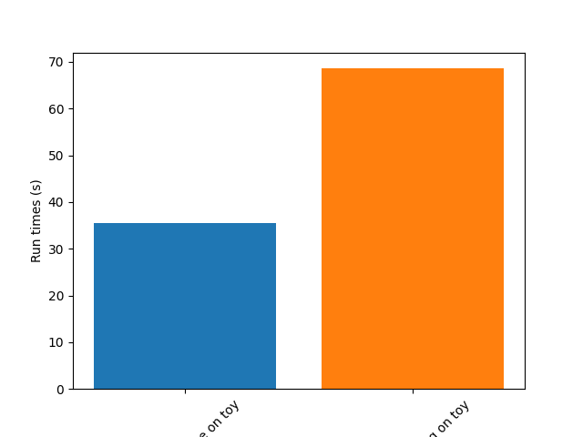

Benchmark module
================

Historically, this module was used to compare/benchmark sorters against ground truth
With this, sorters can be challenge in multiple situations (noise, drift, small/high snr,
small/high spike rate, high/small probe density, ...).

The main idea is to generate a synthetic recording using the internal generators
:py:func:`~spikeinterface.generation.generate_drifting_recording` or external tools
like ***mearec**. And then to compare the output of each sorter to the ground truth sorting.
Then, theses comparisons can be plotted in various ways to explore all strengths and weakness of
sorters tools. The very first paper of spikeinterface was about that, see [Buccino]_.

Since version, 0.102.0 the concept of *benchmark* has been extended to challenge/study specific 
steps of the sorting pipeline, for instance the motion estimation methods has been carrfully studied
in [Garcia2024]_ or some localisation methods has been compared in [Scopin2024]_.
Also, very specific details (the ability for a sorting to recover collision spike) has been
studied in [Garcia2022]_.

Now, almost all steps of the spike sorting step has implemented in spikeinterface and then
all this steps can be benchmarked more or less the same way with dedicated classes:

  * :py:func:`~spikeinterface.sortingcomponents.peak_detection.detect_peaks()`
    methods can be compared with :py:class:`~spikeinterface.benchmark.benchmark_peak_detection.PeakDetectionStudy`
  * :py:func:`~spikeinterface.sortingcomponents.peak_localization.localize_peaks()`
    methods can be compared with :py:class:`~spikeinterface.benchmark.benchmark_peak_localization.PeakLocalizationStudy`
  * :py:func:`~spikeinterface.sortingcomponents.motion.estimate_motion()`
    methods can be compared with :py:class:`~spikeinterface.benchmark.benchmark_motion_estimation.MotionEstimationStudyStudy`
  * :py:func:`~spikeinterface.sortingcomponents.clustering.find_clusters_from_peaks()`
    methods can be compared with :py:class:`~spikeinterface.benchmark.benchmark_clustering.ClusteringStudy`
  * :py:func:`~spikeinterface.sortingcomponents.matching.find_spikes_from_templates()`
    methods can be compared with :py:class:`~spikeinterface.benchmark.benchmark_matching.MatchingStudy`

And of course:

  * :py:func:`~spikeinterface.sorters.run_sorter()` with differents sorters (internal or external)
    can be compared with :py:class:`~spikeinterface.benchmark.benchmark_sorter.SorterStudy`

All theses benchmark study classes share the same design :

  * They accept as input a dict of "cases". A case being a mix of **one method** (or one sorter)
    in a **particular situation** (drift or not, low/high snr, ...) with **some parameters**.
    With this in mind, this is very easy to test either algorithm but also there parameters.
  * Study classes has 4 steps : create cases, run methods, compute results and plot results.
  * Study classes have dedicated plot functions or more general plotting (for instance accuracy vs snr)
  * Study classes also cases handle the concept of "levels" : this allows you to compare several
    complexities at the same time. For instance, compare kilosort4 vs kilsort2.5 (level 0) for
    different noises amplitudes (level 1) combined with several motion vectors (level 2).
  * When plotting levels can be grouped to make averages.
  * Internally, they almost all use the :py:mod:`~spikeinterface.comparison` module.
    In short this module can compare a set of spiketrains against ground truth spiketrains.
    The van diagram (True Posistive, False positive, False negative) against each ground truth units is
    performed.
    An internal agreement matrix is also constructed. With this machinery many metrics can be taken
    to estimate the quality of a methods : accuracy, recall, precision
  * Study classes are persistent on disk. The mechanism is based on an intrinsic
    organization into a "study_folder" with several subfolders: results, sorting_analyzer, run_logs, 
    cases...
  * By design a **Study** class has an associated **Benchmark** class to delegated the storage and the
    :code:`compute_result()`

**Example 1: compare some sorters : a ground truth study**

The most high level class is to compare sorters against ground truth: :py:func:`~spikeinterface.benchmark.SorterStudy()`

Here a simple code block to generate

.. code-block:: python

    import spikeinterface as si
    import spikeinterface.widgets as sw
    from spikeinterface.benchmark import SorterStudy

    # generate 2 simulated datasets (could be also mearec files)
    rec0, gt_sorting0 = si.generate_ground_truth_recording(num_channels=4, durations=[30.], seed=2205)
    rec1, gt_sorting1 = si.generate_ground_truth_recording(num_channels=4, durations=[30.], seed=91)

    # step 1 : create cases and datasets
    datasets = {
        "toy0": (rec0, gt_sorting0),
        "toy1": (rec1, gt_sorting1),
    }

    # define some "cases". Here we want to test tridesclous2 on 2 datasets and spykingcircus2 on one dataset
    # so it is a two level study (sorter_name, dataset)
    # this could be more complicated like (sorter_name, dataset, params)
    cases = {
        ("tdc2", "toy0"): {
            "label": "tridesclous2 on tetrode0",
            "dataset": "toy0",
            "params": {"sorter_name": "tridesclous2"}
        },
        ("tdc2", "toy1"): {
            "label": "tridesclous2 on tetrode1",
            "dataset": "toy1",
            "params": {"sorter_name": "tridesclous2"}
        },
        ("sc2", "toy0"): {
            "label": "spykingcircus2 on tetrode0",
            "dataset": "toy0",
            "params": {
                "sorter_name": "spykingcircus2",
                "docker_image": True
            },
        },
    }
    # this initializes a folder
    study_folder = "~/my_study_sorters"
    study = SorterStudy.create(study_folder=study_folder, datasets=datasets, cases=cases,
                                    levels=["sorter_name", "dataset"])

    # Step 2 : run
    # This internally does run_sorter() for all cases in one function
    study.run()
    
    # Step 3 : compute results
    # Run the benchmark : this internally does compare_sorter_to_ground_truth() for all cases
    study.compute_results()

    # Step 4 : plots
    study.plot_performances_vs_snr()
    study.plot_performances_ordered()    
    study.plot_agreement_matrix()
    study.plot_unit_counts()

    # we can also go more internally and retrieve the comparison internal object like this
    for case_key in study.cases:
        print('*' * 10)
        print(case_key)
        # raw counting of tp/fp/...
        comp = study.get_result(case_key)["gt_comparison"]
        # summary
        comp.print_summary()
        # some plots
        m = comp.get_confusion_matrix()
        w_comp = sw.plot_agreement_matrix(sorting_comparison=comp)

    # We can also collect internal dataframes
    # As shown previously, the performance is returned as a pandas dataframe.
    # The spikeinterface.comparison.get_performance_by_unit() function
    # gathers all the outputs in the study folder and merges them into a single dataframe.
    # Same idea for spikeinterface.comparison.get_count_units()

    # this is a dataframe
    perfs = study.get_performance_by_unit()

    # this is a dataframe
    unit_counts = study.get_count_units()

    # Study also has several plotting methods for plotting the result

**Example 2: compare peak detections**

The :py:func:`~spikeinterface.sortingcomponents.peak_detection.detect_peaks()` function
propose mainly (with some variants) 2 main methods : 
 
  * "locally_exclussive" : a multichannel peak detection by threhold crossing that taken
    in account the neighbor channels
  * "matched_filtering" : a method based on convolution by a kernel that "looks like a spike"
    at several spatial scales.

Here a very simple code to compare this 2 methods.

.. code-block:: python

    import spikeinterface.full as si
    from spikeinterface.benchmark.benchmark_peak_detection import PeakDetectionStudy

    si.set_global_job_kwargs(n_jobs=-1, progress_bar=True)

    # generate
    rec_static, rec_drifting, gt_sorting, extra_infos = si.generate_drifting_recording(
        probe_name="Neuropixels1-128",
        num_units=200,
        duration=300.,
        seed=2205,
        extra_outputs=True,
    )

    # small trick to get the ground truth peaks and max channels
    extremum_channel_inds = dict(zip(gt_sorting.unit_ids, gt_sorting.get_property("max_channel_index")))
    spikes = gt_sorting.to_spike_vector(extremum_channel_inds=extremum_channel_inds)
    gt_peak = spikes

    # step 1 : create dataset and cases dicts
    datasets = {
        "data1": (rec_static, gt_sorting),
    }

    cases = {}
    cases["locally_exclusive"] = {
        "label": "locally_exclusive on toy",
        "dataset": "data1",
        "init_kwargs": {"gt_peaks": gt_peak},
        "params": {
        "method": "locally_exclusive", "method_kwargs": {}},
    }

    # matched_filtering need a "waveform prototype"
    ms_before, ms_after = 1.5, 2.5
    from spikeinterface.sortingcomponents.tools import get_prototype_and_waveforms_from_recording
    prototype, _, _ = get_prototype_and_waveforms_from_recording(rec_static, 5000, ms_before, ms_after)
    cases["matched_filtering"] = {
        "label": "matched_filtering on toy",
        "dataset": "data1",
        "init_kwargs": {"gt_peaks": gt_peak},
        "params": {
        "method": "matched_filtering", "method_kwargs": {"prototype": prototype, "ms_before": ms_before}},
    }

    study_folder = "my_study_peak_detection"
    study = PeakDetectionStudy.create(study_folder, datasets=datasets, cases=cases)
    print(study)

    # Step 2 : run
    study.run()
    # Step 3 : compute results
    study.compute_analyzer_extension( {"templates":{}, "quality_metrics":{"metric_names": ["snr"]} } )
    study.compute_results()
    print(study)

    # study can be re loaded
    study_folder = "my_study_peak_detection"

    study = PeakDetectionStudy(study_folder)

    # Step 4 : plots
    fig = study.plot_detected_amplitude_distributions()
    fig = study.plot_performances_vs_snr(performance_names=["accuracy"])
    fig = study.plot_run_times()

**Example 3: compare motion estimation methods**

This paper [Garcia2024]_ was comparing sevral methods to estimate the motion in recordings.
This was a proof of concept of the modularity and benchmarks in spikeinterface.
In summary, motion estimation is done in 3 steps : detect peaks, localize peaks and motion inference.
For theses steps there are sevral possible methods, so combining and comparing performance was the main
topic of this niche paper.

This paper was using on the :code:`mearec` package for generation and a previous
version of spikeinterface for benchmark but re-generating the same figures should be pretty easy in the
new version of spikeinterface.

Note that since this puplication, new methods has been published (DREDGe and MEDiCINe) and implemented in spikeinterface
so runnning a new comparison could make sens.

Lets be *open-and-reproducible-science*, this is so trendy. This 120 lines script will make the same
job done [Garcia2024]_.

.. code-block:: python

    # If a random reader reach this line of documentation, I hope that this reader will be impressed by the
    # quality of method implementation but also by the smart design of the benchmark framework!
    # In any case, this reader be must be a very spike sorting fanatic person or insomniac.

    import spikeinterface.full as si
    from spikeinterface.benchmark.benchmark_motion_estimation import MotionEstimationStudy

    si.set_global_job_kwargs(n_jobs=0.8, chunk_duration="1s")

    probe_name = 'Neuropixels1-128':
    num_units = 250
    
    datasets = {}
    drift_info = {}
    static, drifting, sorting, info = si.generate_drifting_recording(
        num_units=num_units,
        duration=300.,
        probe_name=probe_name, 
        generate_sorting_kwargs=dict(
            firing_rates=(2.0, 8.0),
            refractory_period_ms=4.0
        ),
        generate_displacement_vector_kwargs=dict(
            displacement_sampling_frequency=5.0,
            drift_start_um=[0, 20],
            drift_stop_um=[0, -20],
            drift_step_um=1,
            motion_list=[
                dict(
                    drift_mode="zigzag",
                    non_rigid_gradient=None,
                    t_start_drift=60.0,
                    t_end_drift=None,
                    period_s=200,
                ),
            ],
        ),
        extra_outputs=True,
        seed=2205,
    )
    datasets["zigzag"] = (drifting, sorting)
    drift_info["zigzag"]  = info

    static, drifting, sorting, info = si.generate_drifting_recording(
        num_units=num_units,
        duration=300.,
        probe_name=probe_name, 
        generate_sorting_kwargs=dict(
            firing_rates=(2.0, 8.0),
            refractory_period_ms=4.0
        ),
        generate_displacement_vector_kwargs=dict(
            displacement_sampling_frequency=5.0,
            drift_start_um=[0, 20],
            drift_stop_um=[0, -20],
            drift_step_um=1,
            motion_list=[
                dict(
                    drift_mode="bump",
                    non_rigid_gradient=None,
                    t_start_drift=60.0,
                    t_end_drift=None,
                    bump_interval_s=(30, 80.),
                ),
            ],
        ),
        extra_outputs=True,
        seed=2205,
    )
    datasets["bump"] = (drifting, sorting)
    drift_info["bump"]  = info

    cases = {}
    for dataset_name in datasets:
        for method_label, loc_method, est_method in [
            ("CoM + Iter", "center_of_mass", "iterative_template"),
            ("Mono + Dec", "monopolar_triangulation", "decentralized"),
            ("Grid + Dec", "grid_convolution", "decentralized"),
            ("Mono + dredge", "monopolar_triangulation", "dredge_ap"),

        ]:
            label = f"{dataset_name}: {method_label}"
            key = (dataset_name, method_label)

            estimate_motion_kwargs=dict(
                method=est_method,
                bin_s=1.0,
                bin_um=5.0,
                rigid=False,
                win_step_um=50.0,
                win_scale_um=200.0,
            )

            cases[key] = dict(
                label=label,
                dataset=dataset_name,
                init_kwargs=dict(
                    unit_locations=drift_info[dataset_name]["unit_locations"],
                    # displacement on Y
                    unit_displacements=drift_info[dataset_name]["unit_displacements"],
                    displacement_sampling_frequency=drift_info[dataset_name]["displacement_sampling_frequency"],
                    direction="y",
                ),
                params=dict(
                    detect_kwargs=dict(method="locally_exclusive", detect_threshold=7.0),
                    select_kwargs=None,
                    localize_kwargs=dict(method=loc_method),
                    estimate_motion_kwargs=estimate_motion_kwargs,
                ),
            )
    
    study = MotionEstimationStudy(study_folder)
    study.run(verbose=True)
    study.compute_results()

    study.plot_summary_errors()
    study.plot_drift(raster=True, case_keys=[('zigzag', 'Mono + dredge')])
    study.plot_errors(case_keys=[('zigzag', 'Mono + dredge')])

**Other examples**

With some imagination and by exploring a bit
this `repo <https://github.com/samuelgarcia/sorting_components_benchmark_paper>`_, testing new methods for spike sorting steps
is now an easy task : clustering, template matching, motion estimation, peak detection, ...

