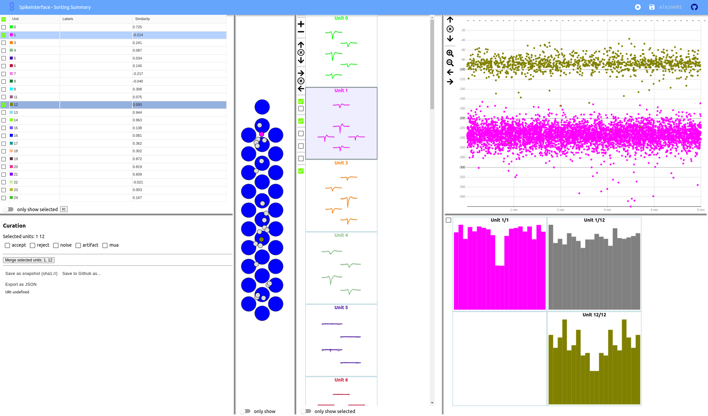

Curation module
===============

**Note:** As of February 2023, this module is still under construction and quite experimental.
The API of some of the functions could be changed/improved from time to time.

Manual curation
---------------

SpikeInterface offers machinery to manually curate a sorting output and keep track of the curation history.
The curation has several "steps" that can be repeated and chained:

  * remove/select units
  * split units
  * merge units

This functionality is done with :py:class:`~spikeinterface.curation.CurationSorting` class.
Internally, this class keeps the history of curation as a graph.
The merging and splitting operations are handled by the :py:class:`~spikeinterface.curation.MergeUnitsSorting` and
:py:class:`~spikeinterface.curation.SplitUnitSorting`. These two classes can also be used independently.

.. code-block:: python

    from spikeinterface.curation import CurationSorting

    sorting = run_sorter(sorter_name='kilosort2', recording=recording)

    cs = CurationSorting(parent_sorting=sorting)

    # make a first merge
    cs.merge(units_to_merge=['#1', '#5', '#15'])

    # make a second merge
    cs.merge(units_to_merge=['#11', '#21'])

    # make a split
    split_index = ... # some criteria on spikes
    cs.split(split_unit_id='#20', indices_list=split_index)

    # here is the final clean sorting
    clean_sorting = cs.sorting

Manual curation format
----------------------

SpikeInterface internally supports a JSON-based manual curation format.
When manual curation is necessary, modifying a dataset in place is a bad practice.
Instead, to ensure the reproducibility of the spike sorting pipelines, we have introduced a simple and JSON-based manual curation format.
This format defines at the moment : merges + deletions + manual tags.
The simple file can be kept along side the output of a sorter and applied on the result to have a "clean" result.

This format has two part:

  * **definition** with the folowing keys:

    * "format_version" : format specification
    * "unit_ids" : the list of unit_ds
    * "label_definitions" : list of label categories and possible labels per category.
                            Every category can be *exclusive=True* onely one label or *exclusive=False* several labels possible

  * **manual output** curation with the folowing keys:

    * "manual_labels"
    * "merged_unit_groups"
    * "removed_units"

Here is the description of the format with a simple example (the first part of the
format is the definition; the second part of the format is manual action):

.. code-block:: json

    {
        "format_version": "1",
        "unit_ids": [
            "u1",
            "u2",
            "u3",
            "u6",
            "u10",
            "u14",
            "u20",
            "u31",
            "u42"
        ],
        "label_definitions": {
            "quality": {
                "label_options": [
                    "good",
                    "noise",
                    "MUA",
                    "artifact"
                ],
                "exclusive": "true"
            },
            "putative_type": {
                "label_options": [
                    "excitatory",
                    "inhibitory",
                    "pyramidal",
                    "mitral"
                ],
                "exclusive": "false"
            }
        },

        "manual_labels": [
            {
                "unit_id": "u1",
                "quality": [
                    "good"
                ]
            },
            {
                "unit_id": "u2",
                "quality": [
                    "noise"
                ],
                "putative_type": [
                    "excitatory",
                    "pyramidal"
                ]
            },
            {
                "unit_id": "u3",
                "putative_type": [
                    "inhibitory"
                ]
            }
        ],
        "merged_unit_groups": [
            [
                "u3",
                "u6"
            ],
            [
                "u10",
                "u14",
                "u20"
            ]
        ],
        "removed_units": [
            "u31",
            "u42"
        ]
    }

Automatic curation tools
------------------------

`Lussac <https://www.biorxiv.org/content/10.1101/2022.02.08.479192v1>`_ is an external package with several strategies
for automatic curation of a spike sorting output.

Some of them, like the auto-merging, have been ported to SpikeInterface.
The :py:func:`~spikeinterface.curation.get_potential_auto_merge` function returns a list of potential merges.
The list of potential merges can be then applied to the sorting output.
:py:func:`~spikeinterface.curation.get_potential_auto_merge` has many internal tricks and steps to identify potential
merges. Therefore, it has many parameters and options.
**Read the function documentation carefully and do not apply it blindly!**

.. code-block:: python

    from spikeinterface.curation import MergeUnitsSorting, get_potential_auto_merge

    sorting = run_sorter(sorter_name='kilosort', recording=recording)

    we = extract_waveforms(recording=recording, sorting=sorting, folder='wf_folder')

    # merges is a list of lists, with unit_ids to be merged.
    merges = get_potential_auto_merge(waveform_extractor=we, minimum_spikes=1000,  maximum_distance_um=150.,
                                      peak_sign="neg", bin_ms=0.25, window_ms=100.,
                                      corr_diff_thresh=0.16, template_diff_thresh=0.25,
                                      censored_period_ms=0., refractory_period_ms=1.0,
                                      contamination_threshold=0.2, num_channels=5, num_shift=5,
                                      firing_contamination_balance=1.5)

    # here we apply the merges
    clean_sorting = MergeUnitsSorting(parent_sorting=sorting, units_to_merge=merges)

Manual curation with sortingview
---------------------------------

Within the :code:`sortingview` widgets backend (see :ref:`sorting_view`), the
:py:func:`~spikeinterface.widgets.plot_sorting_summary` produces a powerful web-based GUI that enables manual curation
of the spike sorting output.

The manual curation (including merges and labels) can be applied to a SpikeInterface
:py:class:`~spikeinterface.core.BaseSorting` object:

.. code-block:: python

    from spikeinterface.curation import apply_sortingview_curation
    from spikeinterface.postprocessing import (compute_spike_amplitudes, compute_unit_locations,
                                               compute_template_similarity, compute_correlograms)
    from spikeinterface.widgets import plot_sorting_summary

    # run a sorter and export waveforms
    sorting = run_sorter(sorter_name='kilosort2', recording=recording)
    we = extract_waveforms(recording=recording, sorting=sorting, folder='wf_folder')

    # some postprocessing is required
    _ = compute_spike_amplitudes(waveform_extractor=we)
    _ = compute_unit_locations(waveform_extractor=we)
    _ = compute_template_similarity(waveform_extractor=we)
    _ = compute_correlograms(waveform_extractor=we)

    # This loads the data to the cloud for web-based plotting and sharing
    # curation=True required for allowing curation in the sortingview gui
    plot_sorting_summary(waveform_extractor=we, curation=True, backend='sortingview')
    # we open the printed link URL in a browser
    # - make manual merges and labeling
    # - from the curation box, click on "Save as snapshot (sha1://)"

    # copy the uri
    sha_uri = "sha1://59feb326204cf61356f1a2eb31f04d8e0177c4f1"
    clean_sorting = apply_sortingview_curation(sorting=sorting, uri_or_json=sha_uri)

Note that you can also "Export as JSON" and pass the json file as :code:`uri_or_json` parameter.

The curation JSON file can be also pushed to a user-defined GitHub repository ("Save to GitHub as...")

Other curation tools
--------------------

We have other tools for cleaning spike sorting outputs:

 * :py:func:`~spikeinterface.curation.find_duplicated_spikes` : find duplicated spikes in the spike trains
 * | :py:func:`~spikeinterface.curation.remove_duplicated_spikes` : remove all duplicated spikes from the spike trains
   | :py:class:`~spikeinterface.core.BaseSorting` object (internally using the previous function)
 * | :py:func:`~spikeinterface.curation.remove_excess_spikes` : remove spikes whose times are greater than the
   | recording's number of samples (by segment)
