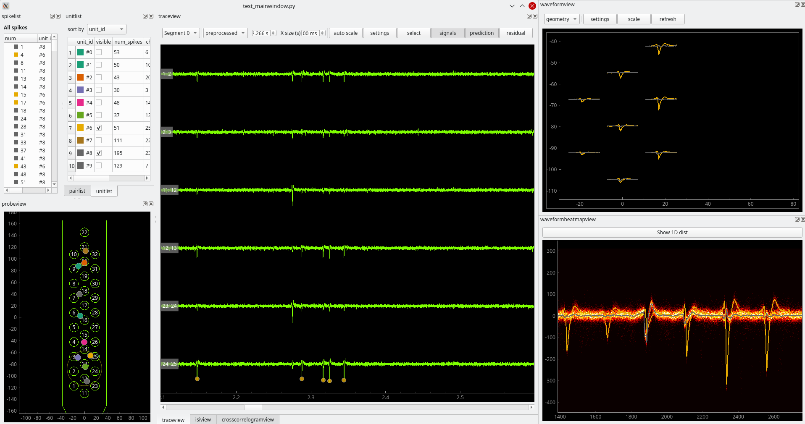

.. _curation:

Curation module
===============

.. note::
    As of July 2024, this module is still under construction and quite experimental.
    The API of some of the functions could be changed/improved from time to time.

Curation with the ``SortingAnalyzer``
-------------------------------------

The :py:class:`~spikeinterface.core.SortingAnalyzer`, as seen in previous modules,
is a powerful tool to posprocess the spike sorting output, as it can compute many
extensions and metrics to further characterize the spike sorting results.

To facilitate the spike sorting workflow, the :py:class:`~spikeinterface.core.SortingAnalyzer`
can also be used to perform curation tasks, such as removing bad units or merging similar units.

Here's an example of how to use the :py:class:`~spikeinterface.core.SortingAnalyzer` to remove
a subset of units from a spike sorting output and to perform some merges:

.. code-block:: python

    from spikeinterface import create_sorting_analyzer

    sorting_analyzer = create_sorting_analyzer(sorting=sorting, recording=recording)

    # compute some extensions
    sorting_analyzer.compute(["random_spikes", "templates", "template_similarity", "correlograms"])

    # remove some units
    remove_unit_ids = [1, 2]
    sorting_analyzer2 = sorting_analyzer.remove_units(remove_unit_ids=remove_unit_ids)

    # merge some units
    merge_unit_groups = [[4, 5], [7, 8, 12]]
    sorting_analyzer3 = sorting_analyzer2.merge_units(
        merge_unit_groups=merge_unit_groups,
        censored_period_ms=0.5,
        merging_mode="soft"
    )

Importantly, all the extensions that were computed on the original :py:class:`~spikeinterface.core.SortingAnalyzer`
(``sorting_analyzer``) are automatically propagated to the returned new
:py:class:`~spikeinterface.core.SortingAnalyzer` objects (``sorting_analyzer2``, ``sorting_analyzer3``).

In particular, the merging steps supports a few interesting and useful functions.
If ``censored_period_ms`` is set, the function will remove spikes that are too close in time after the merge
(in the case above, closer than 0.5 ms).
The ``merging_mode`` parameter can be set to ``"soft"`` (default) or ``"hard"``. The ``"soft"`` mode will
try to smartly combine the existing extension data (e.g. templates, template similarity, etc.)
to estimate the merged units' data, when possible. This is the fastest mode, but it can be less accurate.
The ``"hard"`` mode will simply merge the spike trains of the units and recompute the extensions on the
merged spike train. This is more accurate but slower, especially for the extensions that need to traverse the
raw data (e.g., spike amplitudes, spike locations, amplitude scalings, etc.).

Automatic curation tools
------------------------

The :code:`spikeinterface.curation` module provides several automatic curation tools to clean spike sorting outputs.
Many of them are ported, adapted, or inspired by `Lussac <https://www.biorxiv.org/content/10.1101/2022.02.08.479192v1>`_
([Llobet]_).

Remove duplicated spikes and redundant units
^^^^^^^^^^^^^^^^^^^^^^^^^^^^^^^^^^^^^^^^^^^^

There are some convenient functions of the curation module allows you to remove redundant
units and duplicated spikes from the sorting output.

The :py:func:`~spikeinterface.curation.remove_duplicated_spikes` function removes
duplicated spikes from the sorting output. Duplicated spikes are spikes that are
occur within a certain time window for the same unit.

.. code-block:: python

    from spikeinterface.curation import remove_duplicated_spikes

    # remove duplicated spikes from BaseSorting object
    clean_sorting = remove_duplicated_spikes(sorting, censored_period_ms=0.1)

The ``censored_period_ms`` parameter is the time window in milliseconds to consider two spikes as duplicated.

The :py:func:`~spikeinterface.curation.remove_redundand_units` function removes
redundant units from the sorting output. Redundant units are units that share over
a certain percentage of spikes, by default 80%.
The function can acto both on a ``BaseSorting`` or a ``SortingAnalyzer`` object.

.. code-block:: python

    from spikeinterface.curation import remove_redundant_units

    # remove redundant units from BaseSorting object
    clean_sorting = remove_redundant_units(
        sorting,
        duplicate_threshold=0.9,
        remove_strategy="max_spikes"
    )

    # remove redundant units from SortingAnalyzer object
    clean_sorting_analyzer = remove_redundant_units(
        sorting_analyzer,
        duplicate_threshold=0.9,
        remove_strategy="min_shift"
    )

We recommend usinf the ``SortingAnalyzer`` approach, since the ``min_shift`` strategy keeps
the unit (among the redundant ones), with a better template alignment.

Auto-merging units
^^^^^^^^^^^^^^^^^^

The :py:func:`~spikeinterface.curation.get_potential_auto_merge` function returns a list of potential merges.
The list of potential merges can be then applied to the sorting output.
:py:func:`~spikeinterface.curation.get_potential_auto_merge` has many internal tricks and steps to identify potential
merges. It offers multiple "presets" and the flexibility to apply individual steps, with different parameters.
**Read the function documentation carefully and do not apply it blindly!**

.. code-block:: python

    from spikeinterface import create_sorting_analyzer
    from spikeinterface.curation import get_potential_auto_merge

    analyzer = create_sorting_analyzer(sorting=sorting, recording=recording)

    # some extensions are required
    analyzer.compute(["random_spikes", "templates", "template_similarity", "correlograms"])

    # merges is a list of unit pairs, with unit_ids to be merged.
    merge_unit_pairs = get_potential_auto_merge(
        analyzer=analyzer,
        preset="similarity_correlograms",
    )
    # with resolve_graph=True, merges_resolved is a list of merge groups,
    # which can contain more than two units
    merge_unit_groups = get_potential_auto_merge(
        analyzer=analyzer,
        preset="similarity_correlograms",
        resolve_graph=True
    )

    # here we apply the merges
    analyzer_merged = analyzer.merge_units(merge_unit_groups=merge_unit_groups)

Manual curation
---------------

While automatic curation tools can be very useful, manual curation is still widely used to
clean spike sorting outputs and it is sometoimes necessary to have a human in the loop.

Curation format
^^^^^^^^^^^^^^^

SpikeInterface internally supports a JSON-based manual curation format.
When manual curation is necessary, modifying a dataset in place is a bad practice.
Instead, to ensure the reproducibility of the spike sorting pipelines, we have introduced a simple and JSON-based manual curation format.
This format defines at the moment : merges + deletions + manual tags.
The simple file can be kept along side the output of a sorter and applied on the result to have a "clean" result.

This format has two part:

  * **definition** with the folowing keys:

    * "format_version" : format specification
    * "unit_ids" : the list of unit_ds
    * "label_definitions" : list of label categories and possible labels per category.
                            Every category can be *exclusive=True* onely one label or *exclusive=False* several labels possible

  * **manual output** curation with the folowing keys:

    * "manual_labels"
    * "merge_unit_groups"
    * "removed_units"

Here is the description of the format with a simple example (the first part of the
format is the definition; the second part of the format is manual action):

.. code-block:: json

    {
        "format_version": "1",
        "unit_ids": [
            "u1",
            "u2",
            "u3",
            "u6",
            "u10",
            "u14",
            "u20",
            "u31",
            "u42"
        ],
        "label_definitions": {
            "quality": {
                "label_options": [
                    "good",
                    "noise",
                    "MUA",
                    "artifact"
                ],
                "exclusive": "true"
            },
            "putative_type": {
                "label_options": [
                    "excitatory",
                    "inhibitory",
                    "pyramidal",
                    "mitral"
                ],
                "exclusive": "false"
            }
        },

        "manual_labels": [
            {
                "unit_id": "u1",
                "quality": [
                    "good"
                ]
            },
            {
                "unit_id": "u2",
                "quality": [
                    "noise"
                ],
                "putative_type": [
                    "excitatory",
                    "pyramidal"
                ]
            },
            {
                "unit_id": "u3",
                "putative_type": [
                    "inhibitory"
                ]
            }
        ],
        "merge_unit_groups": [
            [
                "u3",
                "u6"
            ],
            [
                "u10",
                "u14",
                "u20"
            ]
        ],
        "removed_units": [
            "u31",
            "u42"
        ]
    }

.. note::
    The curation format was recently introduced (v0.101.0), and we are still working on
    properly integrating it into the SpikeInterface ecosystem.
    Soon there will be functions vailable, in the curation module, to apply this
    standardized curation format to ``SortingAnalyzer`` and a ``BaseSorting`` objects.

Using the ``SpikeInterface GUI``
^^^^^^^^^^^^^^^^^^^^^^^^^^^^^^^^

We support several tools to perform manual curation of spike sorting outputs.

The first one is the `SpikeInterface-GUI <https://github.com/SpikeInterface/spikeinterface-gui>`_, a QT-based GUI that allows you to
visualize and curate the spike sorting output.

To launch the GUI, you can use the :py:func:`~spikeinterface.widgets.plot_sorting_summary` function
and select the ``backend='spikeinterface_gui'``.

.. code-block:: python

    from spikeinterface import create_sorting_analyzer
    from spikeinterface.curation import apply_sortingview_curation
    from spikeinterface.widgets import plot_sorting_summary

    sorting_analyzer = create_sorting_analyzer(sorting=sorting, recording=recording)

    # some extensions are required
    sorting_analyzer.compute([
        "random_spikes",
        "noise_levels",
        "templates",
        "template_similarity",
        "unit_locations",
        "spike_amplitudes",
        "principal_components",
        "correlograms"
        ]
    )
    sorting_analyzer.compute("quality_metrics", metric_names=["snr"])

    # this will open the GUI in a different window
    plot_sorting_summary(sorting_analyzer=sorting_analyzer, curation=True, backend='spikeinterface_gui')

Using the ``sortingview`` web-app
^^^^^^^^^^^^^^^^^^^^^^^^^^^^^^^^^

Within the :code:`sortingview` widgets backend (see :ref:`sorting_view`), the
:py:func:`~spikeinterface.widgets.plot_sorting_summary` produces a powerful web-based GUI that enables manual curation
of the spike sorting output.

.. image:: ../images/sv_summary.png

The manual curation (including merges and labels) can be applied to a SpikeInterface
:py:class:`~spikeinterface.core.BaseSorting` object:

.. code-block:: python

    from spikeinterface import create_sorting_analyzer
    from spikeinterface.curation import apply_sortingview_curation
    from spikeinterface.widgets import plot_sorting_summary

    sorting_analyzer = create_sorting_analyzer(sorting=sorting, recording=recording)

    # some extensions are required
    sorting_analyzer.compute([
        "random_spikes",
        "templates",
        "template_similarity",
        "unit_locations",
        "spike_amplitudes",
        "correlograms"]
    )

    # This loads the data to the cloud for web-based plotting and sharing
    # curation=True required for allowing curation in the sortingview gui
    plot_sorting_summary(sorting_analyzer=sorting_analyzer, curation=True, backend='sortingview')
    # we open the printed link URL in a browser
    # - make manual merges and labeling
    # - from the curation box, click on "Save as snapshot (sha1://)"

    # copy the uri
    sha_uri = "sha1://59feb326204cf61356f1a2eb31f04d8e0177c4f1"
    clean_sorting = apply_sortingview_curation(sorting=sorting_analyzer.sorting, uri_or_json=sha_uri)

Note that you can also "Export as JSON" and pass the json file as :code:`uri_or_json` parameter.

The curation JSON file can be also pushed to a user-defined GitHub repository ("Save to GitHub as...")

Other curation tools
--------------------

We have other tools for cleaning spike sorting outputs:

 * :py:func:`~spikeinterface.curation.find_duplicated_spikes` : find duplicated spikes in the spike trains
 * | :py:func:`~spikeinterface.curation.remove_excess_spikes` : remove spikes whose times are greater than the
   | recording's number of samples (by segment)

The `CurationSorting` class (deprecated)
----------------------------------------

SpikeInterface offers machinery to manually curate a sorting output and keep track of the curation history.
The curation has several "steps" that can be repeated and chained:

  * remove/select units
  * split units
  * merge units

This functionality is done with :py:class:`~spikeinterface.curation.CurationSorting` class.
Internally, this class keeps the history of curation as a graph.
The merging and splitting operations are handled by the :py:class:`~spikeinterface.curation.MergeUnitsSorting` and
:py:class:`~spikeinterface.curation.SplitUnitSorting`. These two classes can also be used independently.

.. code-block:: python

    from spikeinterface.curation import CurationSorting

    sorting = run_sorter(sorter_name='kilosort2', recording=recording)

    cs = CurationSorting(parent_sorting=sorting)

    # make a first merge
    cs.merge(units_to_merge=['#1', '#5', '#15'])

    # make a second merge
    cs.merge(units_to_merge=['#11', '#21'])

    # make a split
    split_index = ... # some criteria on spikes
    cs.split(split_unit_id='#20', indices_list=split_index)

    # here is the final clean sorting
    clean_sorting = cs.sorting
