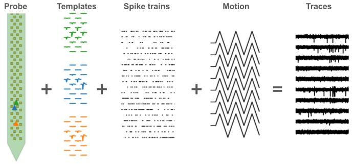
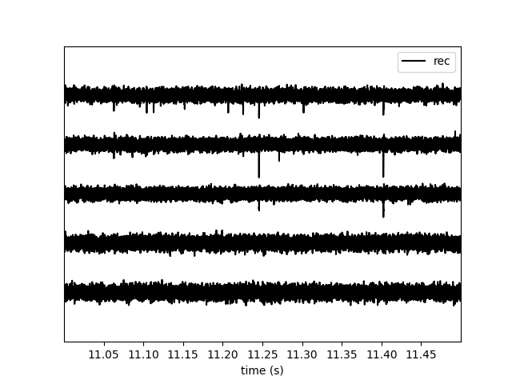
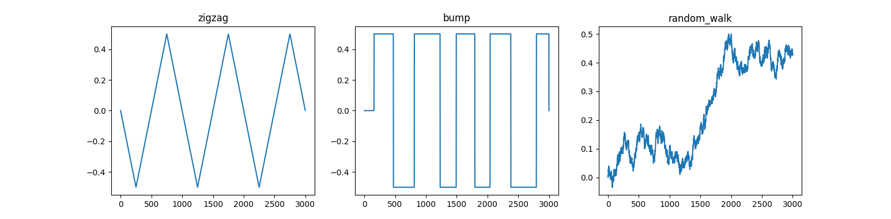

Generation module
=================

The :py:mod:`spikeinterface.generation` module provides functions to generate recordings containing spikes,
which can be used as "ground-truth" for benchmarking spike sorting algorithms.

There are several approaches to generating such recordings.
One possibility is to generate purely synthetic recordings. Another approach is to use real
recordings and add synthetic spikes to them, to make "hybrid" recordings.
The advantage of the former is that the ground-truth is known exactly, which is useful for benchmarking.
The advantage of the latter is that the spikes are added to real noise, which can be more realistic.

For hybrid recordings, the main challenge is to generate realistic spike templates.
We therefore built an open database of templates that we have constructed from the International
Brain Laboratory - Brain Wide Map (available on
`DANDI <https://dandiarchive.org/dandiset/000409?search=IBL&page=2&sortOption=0&sortDir=-1&showDrafts=true&showEmpty=false&pos=9>`_).
You can check out this collection of over 600 templates from this `web app <https://spikeinterface.github.io/hybrid_template_library/>`_.

The :py:mod:`spikeinterface.generation` module offers tools to interact with this database to select and download templates,
manupulating (e.g. rescaling and relocating them), and construct hybrid recordings with them.
Importantly, recordings from long-shank probes, such as Neuropixels, usually experience drifts.
Such drifts can be taken into account in order to smoothly inject spikes into the recording.

The :py:mod:`spikeinterface.generation` also includes functions to generate different kinds of drift signals and drifting
recordings, as well as generating synthetic noise profiles of various types.

Some of the generation functions are defined in the :py:mod:`spikeinterface.core.generate` module, but also exposed at the
:py:mod:`spikeinterface.generation` level for convenience.

Synthetic recordings
--------------------

The top level function is :py:func:`~spikeinterface.generate.generate_drifting_recording`.
This function generates both a static recording and a drifting recording with
exactly the same units and spikes.

The module handles many details:

  * any probe layout available in :py:mod:`probeinterface`.
  * many possible motion vectors (zigzag, bumps, random_walk) or combination of them.
  * non-rigid drift, the motion vector is handled at the level of the units.
  * control on units' location : 'uniform' or 'by layer' (aka multi modal).
  * templates are generated step by step (typically 1um) along the motion axis using simple
    spatial rules.
  * templates shape are quite simple but can be controlled by many parameters (spheric/elliptical,
    time dynamic, spatial propagation).
  * spike trains have a Poisson-like distribution but can optionally be externally given by the user.
  * there are helper functions to inject overly synchronous spikes.
  * noise has a  Gaussian distribution with an optional covariance using noise spatial decay.
  * The static and drifting recording are *'lazy'* : traces are generated on the fly (aka on demand).
    The only computation is the generation of the templates which is performed at the start.
  * Parameters (firing, templates, locations, ...) can be controlled using ranges of values or can be
    explicitly given unit by unit.
  * All parameters are carefully seeded to ensure reproducibility (at least on the same system and NumPy version).

The simplest way to generate a synthetic recording is:

.. code-block:: python

    import spikeinterface.full as si

    rec_static, rec_drifting, gt_sorting, extra_infos = si.generate_drifting_recording(
        probe_name="Neuropixels1-128",
        num_units=200,
        duration=300.,
        seed=2205,
        extra_outputs=True,
    )

Note the 4 outputs: the 2 recordings (static and drifting), the ground-truth sorting and a dictionary
with more outputs (unit motion, unit position, templates, ...)

But for finer control of the outputs one can input additional optional parameters:

.. code-block:: python

    rec_static, rec_drifting, gt_sorting, extra_infos = generate_drifting_recording(
        num_units=250,
        duration=600.0,
        sampling_frequency=30000.0,
        probe_name="Neuropixels1-384",
        # here we want a multimodal aka multi layers
        generate_unit_locations_kwargs=dict(
            margin_um=20.0,
            minimum_z=5.0,
            maximum_z=45.0,
            minimum_distance=18.0,
            max_iteration=100,
            distance_strict=False,
            distribution="multimodal",
            num_modes=3,
        ),
        # here we want to combine zizag (with a gradient in space) and bumps motion vector
        generate_displacement_vector_kwargs=dict(
            displacement_sampling_frequency=5.0,
            drift_start_um=[0, 30],
            drift_stop_um=[0, -30],
            drift_step_um=1,
            motion_list=[
                dict(
                    drift_mode="zigzag",
                    non_rigid_gradient=0.5,
                    t_start_drift=60.0,
                    t_end_drift=None,
                    period_s=200,
                    amplitude_factor=.5,
                ),
                dict(
                    drift_mode="bumps",
                    non_rigid_gradient=None,
                    t_start_drift=60.0,
                    t_end_drift=None,
                    bump_interval_s=(30, 90.0),
                    amplitude_factor=.5,
                ),
            ],
        ),
        # here we can control the parameters of the templates using ranges
        # many more parameters are available like : depolarization_ms, repolarization_ms, recovery_ms
        # positive_amplitude, smooth_ms, propagation_speed, and ellipsoid orientation...
        generate_templates_kwargs=dict(
            ms_before=1.5,
            ms_after=3.0,
            mode="ellipsoid",
            unit_params=dict(
                alpha=(150.0, 500.0),
                spatial_decay=(10, 45),
            ),
        ),
        # control the firing of the spiketrains
        generate_sorting_kwargs=dict(firing_rates=(2.0, 8.0), refractory_period_ms=4.0),
        # control the noise and covariance (spatial_decay)
        generate_noise_kwargs=dict(noise_levels=(12.0, 15.0), spatial_decay=25.0),
        # give (or not) the extra_infos dictionary
        extra_outputs=True,
        # and of course the seed :
        #  * if no idea and want to mimic geeks put 42
        #  * if you are more ego centric put your birthday
        #  * if you recently became parent put the birthday of your child
        seed=2205,
    )

    si.plot_traces(rec_static, channel_ids=rec_static.channel_ids[10:15], time_range=(11, 11.5))

The generated traces can look a bit toyish, but this generation module has proven to be very useful to the development :py:mod:`sortingcomponents` module.

Control the drift vector
------------------------

In this example we inject different drift modes to see how they influence the final motion vectors.

.. code-block:: python

    import matplotlib.pyplot as plt
    from spikeinterface.generation import make_one_displacement_vector
    fig, axs = plt.subplots(ncols=3)
    for i, drift_mode in enumerate(["zigzag", "bump", "random_walk"]):
        ax = axs[i]
        motion_vector = make_one_displacement_vector(drift_mode=drift_mode, duration=600.0)
        ax.plot(motion_vector)
        ax.set_title(drift_mode)

