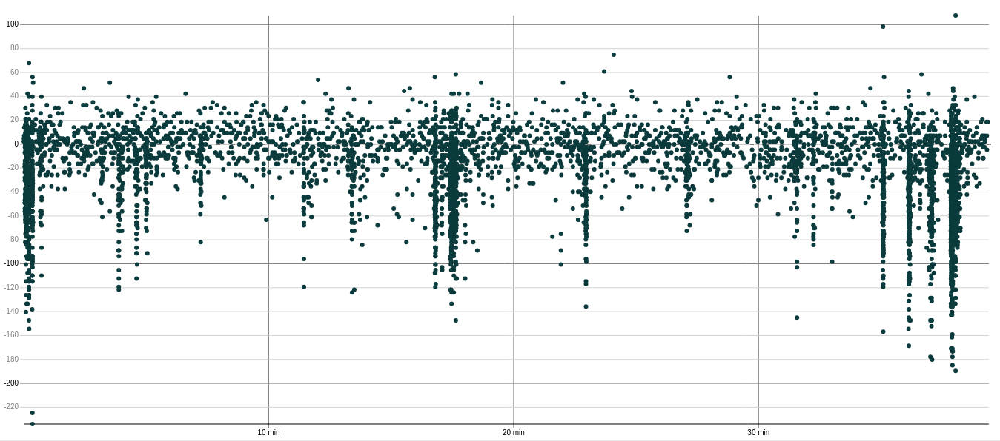

Amplitude CV (:code:`amplitude_cv_median`, :code:`amplitude_cv_range`)
======================================================================

Calculation
-----------

The amplitude CV (coefficient of variation) is a measure of the amplitude variability.
It is computed as the ratio between the standard deviation and the amplitude mean.
To obtain a better estimate of this measure, it is first computed separately for several temporal bins.
Out of these values, the median and the range (percentile distance, by default between the
5th and 95th percentiles) are computed.

The computation requires either spike amplitudes (see :py:func:`~spikeinterface.postprocessing.compute_spike_amplitudes()`)
or amplitude scalings (see :py:func:`~spikeinterface.postprocessing.compute_amplitude_scalings()`) to be pre-computed.

Expectation and use
-------------------

The amplitude CV median is expected to be relatively low for well-isolated units, indicating a "stereotypical" spike shape.

The amplitude CV range can be high in the presence of noise contamination, due to amplitude outliers like in
the example below.

Example code
------------

.. code-block:: python

    import spikeinterface.qualitymetrics as sqm

    # Combine a sorting and recording into a sorting_analyzer
	# It is required to run sorting_analyzer.compute(input="spike_amplitudes") or
	# sorting_analyzer.compute(input="amplitude_scalings") (if missing, values will be NaN)
    amplitude_cv_median, amplitude_cv_range = sqm.compute_amplitude_cv_metrics(sorting_analyzer=sorting_analyzer)
    # amplitude_cv_median and  amplitude_cv_range are dicts containing the unit ids as keys,
    # and their amplitude_cv metrics as values.

References
----------

.. autofunction:: spikeinterface.qualitymetrics.misc_metrics.compute_amplitude_cv_metrics

Literature
----------

Designed by Simon Musall and adapted to SpikeInterface by Alessio Buccino.
