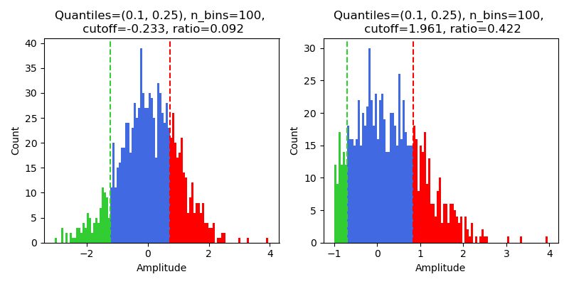

Noise cutoff (:code:`noise_cutoff`)
===================================

Calculation
-----------

Metric describing whether an amplitude distribution is cut off as it approaches zero, similar to  :ref:`amplitude cutoff <amp_cutoff>` but without a Gaussian assumption.

The **noise cutoff** metric assesses whether a unit’s spike‐amplitude distribution is truncated
at the low-end, which may be due to the high amplitude detection threshold in the deconvolution step,
i.e., if low‐amplitude spikes were missed.  It does not assume a Gaussian shape;
instead, it directly compares counts in the low‐amplitude bins to counts in high‐amplitude bins.

1. **Build a histogram**

   For each unit, divide all amplitudes into ``n_bins`` equally spaced bins over the range of the amplitude.
   If the number of spikes is large, you may consider using a larger ``n_bins``. For a small number of spikes, consider a smaller ``n_bins``.
   Let :math:`n_i` denote the count in the :math:`i`-th bin.

2. **Identify the “low” region**
    - Compute the amplitude value at the specified ``low_quantile`` (for example, 0.10 = 10th percentile), denoted as :math:`\text{amp}_{low}`.
    - Find all histogram bins whose upper edge is below that quantile value.  These bins form the "low‐quantile region".
    - Compute

    .. math::
        L_{\mathrm{bins}} = \bigl\{i : \text{upper_edge}_i \le \text{amp}_{low}\bigr\}, \quad
        \mu_{\mathrm{low}} = \frac{1}{|L_{\mathrm{bins}}|}\sum_{i\in L_{\mathrm{bins}}} n_i.

3. **Identify the “high” region**

   - Compute the amplitude value at the specified ``high_quantile`` (for example, 0.25 = top 25th percentile), denoted as :math:`\text{amp}_{high}`.
   - Find all histogram bins whose lower edge is greater than that quantile value.  These bins form the "high‐quantile region".
   - Compute

    .. math::
        H_{\mathrm{bins}} &= \bigl\{i : \text{lower_edge}_i \ge \text{amp}_{high}\bigr\}, \\
        \mu_{\mathrm{high}} &= \frac{1}{|H_{\mathrm{bins}}|}\sum_{i\in H_{\mathrm{bins}}} n_i, \quad
        \sigma_{\mathrm{high}} = \sqrt{\frac{1}{|H_{\mathrm{bins}}|-1}\sum_{i\in H_{\mathrm{bins}}}\bigl(n_i-\mu_{\mathrm{high}} \bigr)^2}.

4. **Compute cutoff**

   The *cutoff* is given by how many standard deviations away the low-amplitude bins are from the high-amplitude bins, defined as

    .. math::
     \mathrm{cutoff} = \frac{\mu_{\mathrm{low}} - \mu_{\mathrm{high}}}{\sigma_{\mathrm{high}}}.

   - If no low‐quantile bins exist, a warning is issued and ``cutoff = NaN``.
   - If no high‐quantile bins exist or :math:`\sigma_{\mathrm{high}} = 0`, a warning is issued and ``cutoff = NaN``.

5. **Compute the low-to-peak ratio**

   - Let :math:`M = \max_i\,n_i` be the height of the largest bin in the histogram.
   - Define

   .. math::
        \mathrm{ratio} = \frac{\mu_{\mathrm{low}}}{M}.

   - If there are no low bins, :math:`\mathrm{ratio} = NaN`.

Together, ``(cutoff, ratio)`` quantify how suppressed the low‐end of the amplitude distribution is relative to the top quantile and to the peak.

Expectation and use
-------------------

Noise cutoff attempts to describe whether an amplitude distribution is cut off.
Larger values of ``cutoff`` and ``ratio`` suggest that the distribution is cut-off.
IBL uses the default value of 1 (equivalent to e.g. ``low_quantile=0.01, n_bins=100``) to choose the number of
lower bins, with a suggested threshold of 5 for ``cutoff`` to determine whether a unit is cut off or not.
In practice, the IBL threshold is quite conservative, and a lower threshold might work better for your data.
We suggest plotting the data using the  :py:func:`~spikeinterface.widgets.plot_amplitudes` widget to view your data when choosing your threshold.
It is suggested to use this metric when the amplitude histogram is **unimodal**.

The metric is loosely based on [Hill]_'s amplitude cutoff, but is here adapted (originally by [IBL2024]_) to avoid making the Gaussian assumption on spike distributions.

Example code
------------

.. code-block:: python

    import numpy as np
    import matplotlib.pyplot as plt
    from spikeinterface.full as si

    # Suppose `sorting_analyzer` has been computed with spike amplitudes:
    # Select units you are interested in visualizing
    unit_ids = ...

    # Compute noise_cutoff:
    summary_dict = compute_noise_cutoffs(
        sorting_analyzer=sorting_analyzer
        high_quantile=0.25,
        low_quantile=0.10,
        n_bins=100,
        unit_ids=unit_ids
    )

Reference
---------

.. autofunction:: spikeinterface.metrics.quality.misc_metrics.compute_noise_cutoffs

Examples with plots
-------------------

Here is shown the histogram of two units, with the vertical lines separating low- and high-amplitude regions.

- On the left, we have a unit with no truncation at the left end, and the cutoff and ratio are small.
- On the right, we have a unit with truncation at -1, and the cutoff and ratio are much larger.

Links to original implementations
---------------------------------

* From `IBL implementation <https://github.com/int-brain-lab/ibllib/blob/2e1f91c622ba8dbd04fc53946c185c99451ce5d6/brainbox/metrics/single_units.py>`_

Note: Compared to the original implementation, we have added a comparison between the low-amplitude bins to the largest bin (``noise_ratio``).
The selection of low-amplitude bins is based on the ``low_quantile`` rather than the number of bins.

Literature
----------

Metric introduced by [IBL2024]_.
