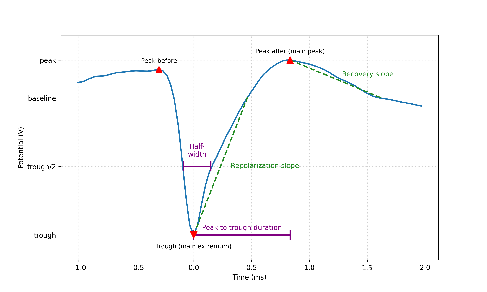

Template Metrics
================

This extension computes commonly used template metrics. A *template* is the
average (or median) spike waveform for each unit.

First, the templates are upsampled (optionally, default 10) to increase the temporal
resolution for more precise metric computation. Then they are (optionally) smoothed
(using a Savitzky-Golay filter) to reduce high-frequency noise that could interfere
with peak/trough detection.

Then the negative and positive peaks are detected on the channel with the largest
absolute peak (the "main channel"). From these peaks, several metrics are computed.

Peaks are divided into "peaks before trough" and "peaks after trough", depending on
their temporal location with respect to the main trough.

    Visualization of trough, peaks, and a few metrics.

Here is a list of metrics computed using the template on the main extremum channel:

half_width
-----------

Duration in seconds at half the amplitude of the largest trough (minimum) and peak of the template.
It generates two columns: :code:`trough_half_width` and :code:`peak_half_width`.

peak_to_trough_duration
-----------------------

Duration in seconds between the main trough and the main peak after the trough.

main_to_next_extremum_duration
------------------------------

Duration in seconds from the main extremum (peak or trough) to the next (in time) extremum.
If no next extremum is found, it returns NaN.

repolarization_slope
--------------------

Slope of the repolarization phase of the template, between the trough (minimum) and return to baseline in uV/s.
If there is no trough,it returns NaN. If the absolute maximum is a peak, it still uses largest trough to compute.

recovery_slope
--------------

Slope of the recovery phase of the template, from the first peak following the largest trough, returning to baseline in uV/s.
If there is no trough, it returns NaN. If there is no peak after the main trough, it returns NaN.

waveform_ratios
---------------

This metric includes several ratios between peaks and troughs:

main_peak_to_trough_ratio
^^^^^^^^^^^^^^^^^^^^^^^^^^
Ratio between the amplitude of the main peak (before or after trough) and the absolute amplitude of the largest trough.
If no troughs, or no peaks are found, it returns NaN.

peak_before_to_trough_ratio
^^^^^^^^^^^^^^^^^^^^^^^^^^^
Ratio between the amplitude of the peak before the main trough and the absolute amplitude of the largest trough.
If no troughs, or no peaks before trough are found, it returns NaN.

peak_after_to_trough_ratio
^^^^^^^^^^^^^^^^^^^^^^^^^^
Ratio between the amplitude of the peak after the main trough and the absolute amplitude of the largest trough.
If no troughs, or no peaks after trough are found, it returns NaN.

peak_before_to_peak_after_ratio
^^^^^^^^^^^^^^^^^^^^^^^^^^^^^^^
Ratio between the amplitude of the peak before the main trough and the amplitude of the peak after the main trough.
If no troughs, or no peaks before trough or no peaks after trough, it returns NaN.

waveform_widths
---------------

This metric includes the widths of peaks and troughs, given by the ``scipy.signal.find_peaks`` function.

trough_width
^^^^^^^^^^^^

Width in seconds of largest trough.

peak_before_width
^^^^^^^^^^^^^^^^^

Width in seconds of peak before largest trough.

peak_after_width
^^^^^^^^^^^^^^^^

Width in seconds of peak after largest trough.

number_of_peaks
---------------

This metric includes the number of positive and negative peaks in the waveform:
:code:`num_positive_peaks` and :code:`num_negative_peaks`.

.. note::

    The units of :code:`recovery_slope` and :code:`repolarization_slope` depend on the
    input. Voltages are based on the units of the template. By default this is µV
    but can be the raw output from the recording device (this depends on the
    :code:`return_in_uV` parameter, read more here: :ref:`modules/core:SortingAnalyzer`).
    Distances are in µm and times are in seconds. So, for example, if the
    templates are in units of µV then :code:`recovery_slope` :code:`repolarization_slope` is in
    µV/s.

For recordings with a large number of channels, it can be useful to compute
multi-channel metrics that take into account the spatial distribution of the
template across the probe (these are computed by default if the number of channels
is greater than 64, but can be forced on or off with the :code:`include_multi_channel_metrics`
parameter).

These are the multi-channel metrics that can be computed:

velocity_fits
-------------

Computes the velocity of the template propagation along the probe using a linear fit of the time delays of the
troughs across channels versus the distance from the channel with the largest amplitude.
It returns two columns: :code:`velocity_above` and :code:`velocity_below`, which are the velocities in µm/ms above and
below the max channel of the template, respectively.

exp_decay
---------

Exponential decay in 1/µm of the template amplitude over distance from the channel with the largest amplitude.
Optionally, the fit can also be linear (default is exponential).

spread
------

Spread in µm of the template amplitudes, defined as the distance between the channels "observing" a template
above 20% of the maximum amplitude (default). Template amplitudes are normalized to the maximum amplitude
and optionally smoothed over space using a Gaussian filter (default sigma is 20µm).

.. code-block:: python

    tm = sorting_analyzer.compute(input="template_metrics", include_multi_channel_metrics=True)

For more information, see :py:func:`~spikeinterface.postprocessing.compute_template_metrics`
