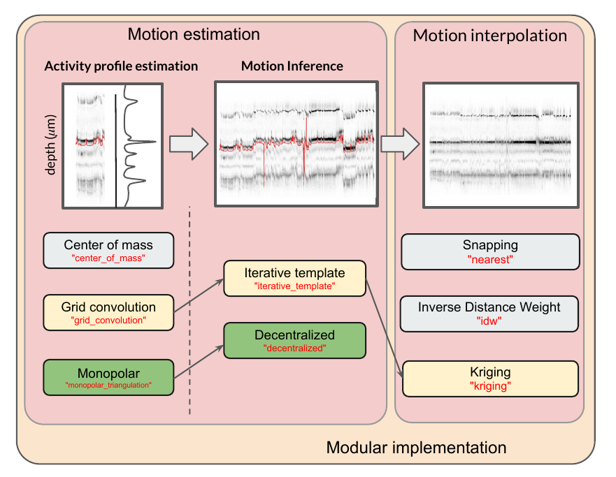

.. _motion_correction:

Motion/drift correction
=======================

Overview
--------

Mechanical drift, often observed in recordings, is currently a major issue for spike sorting. This is especially striking
with the new generation of high-density devices used for in-vivo electrophysiology such as the neuropixel electrodes.
The first sorter that introduced motion/drift correction as a prepossessing step was Kilosort2.5 (see [Steinmetz2021]_ [SteinmetzDataset]_)

Long story short, the main idea is the same as the one used for non-rigid image registration, for example with calcium
imaging. However, because with extracellular recording we do not have a proper image to use as a reference, the main idea
of the algorithm is create an "image" via the activity profile of the cells during a given time window. Assuming this
activity profile should be kept constant over time, the motion can be estimated, by blocks, along the probe's insertion axis
(i.e. depth) so that we can interpolate the traces to compensate for this estimated motion.
Users with a need to handle drift were currently forced to stick to the use of Kilosort2.5 or pyKilosort (see [Pachitariu2023]_). Recently, the Paninski
group from Columbia University introduced a possibly more accurate method to estimate the drift (see [Varol2021]_
and [Windolf2023]_), but this new method has not yet been integrated into any sorter.

Because motion registration is a hard topic, with numerous hypotheses and/or implementations details that might have a large
impact on the spike sorting performances (see [Garcia2023]_), in SpikeInterface, we developed a full motion estimation
and interpolation framework to make all these methods accessible in one place. This modular approach offers a major benefit:
**the drift correction can be applied to a recording as a preprocessing step, and
then used for any sorter!** In short, the motion correction is decoupled from the sorter itself.

This gives the user an incredible flexibility to check/test and correct the drift before the sorting process.

Here is an overview of motion correction as part of preprocessing a recording:

The motion correction process can be split into 3 steps:

  1. **activity profile** : detect peaks and localize them along time and depth
  2. **motion inference**: estimate the drift motion (by spatial blocks for non-rigid motion)
  3. **motion interpolation**: interpolate traces using the estimated motion

For each step, we have implemented several methods. The combination of the yellow boxes should give more or less what
Kilosort2.5/3 is doing. Similarly, the combination of the green boxes gives the method developed by the Paninski group.
Of course the end user can combine any of these methods to get the best motion correction possible.
This also makes an incredible framework for testing new ideas.

For a better overview, checkout our recent paper to validate, benchmark, and compare these motion
correction methods (see [Garcia2023]_).

SpikeInterface offers two levels for motion correction:
  1. A high level with a unique function and predefined parameter presets
  2. A low level where the user needs to call one by one all functions for better control

High-level API
--------------

One challenging task for motion correction is to determine the parameters.
The high level :py:func:`~spikeinterface.preprocessing.correct_motion()` proposes the concept of a **"preset"** that already
has predefined parameters, in order to achieve a calibrated behavior.

We currently have 3 presets:

  * **"nonrigid_accurate"**: It consists of *monopolar triangulation + decentralized + inverse distance weighted*
                             This is the slowest combination but maybe the most accurate. The main bottleneck of this preset is the monopolar
                             triangulation for the estimation of the peaks positions. To speed it up, one could think about subsampling the
                             space of all the detected peaks. Introduced by the Paninski group ([Varol2021]_, [Windolf2023]_)
  * **"rigid_fast"**: a fast, but not very accurate method. It uses *center of mass + decentralized + inverse distance weighted*
                      To be used as check and/or control on a recording to check the presence of drift.
                      Note that, in this case the drift is considered as "rigid" over the electrode.
  * **"kilosort_like"**: It consists of *grid convolution + iterative_template + kriging*, to mimic what is done in Kilosort (see [Pachitariu2023]_).
                         Note that this is not exactly 100% what Kilosort is doing, because the peak detection is done with a template matching
                         in Kilosort, while in SpikeInterface we use a threshold-based method. However, this "preset" gives similar
                         results to Kilosort2.5.

.. code-block:: python

  # read and preprocess
  rec = read_spikeglx(folder_path='/my/Neuropixel/recording')
  rec = bandpass_filter(recording=rec)
  rec = common_reference(recording=rec)

  # then correction is one line of code
  rec_corrected = correct_motion(recording=rec, preset="nonrigid_accurate")

The process is quite long due the two first steps (activity profile + motion inference)
But the return :code:`rec_corrected` is a lazy recording object that will interpolate traces on the
fly (step 3 motion interpolation).

If you want to user other presets, this is as easy as:

.. code-block:: python

  # mimic kilosort motion
  rec_corrected = correct_motion(recording=rec, preset="kilosort_like")

  # super but less accurate and rigid
  rec_corrected = correct_motion(recording=rec, preset="rigid_fast")

Optionally any parameter from the preset can be overwritten:

.. code-block:: python

    rec_corrected = correct_motion(recording=rec, preset="nonrigid_accurate",
                                   detect_kwargs=dict(
                                       detect_threshold=10.),
                                   estimate_motion_kwargs=dict(
                                       histogram_depth_smooth_um=8.,
                                       time_horizon_s=120.,
                                   ),
                                   correct_motion_kwargs=dict(
                                        spatial_interpolation_method="kriging",
                                   )
                                   )

Importantly, all the result and intermediate computations can be saved into a folder for further loading
and verification. The folder will contain the motion vector itself of course but also detected peaks, peak location, and more.

.. code-block:: python

    motion_folder = '/somewhere/to/save/the/motion'
    rec_corrected = correct_motion(recording=rec, preset="nonrigid_accurate", folder=motion_folder)

    # and then
    motion_info = load_motion_info(motion_folder)

Low-level API
-------------

All steps (**activity profile**, **motion inference**, **motion interpolation**) can be launched with distinct functions.
This can be useful to find the best method and finely tune/optimize parameters at each step.
All functions are implemented in the :py:mod:`~spikeinterface.sortingcomponents` module.
They all have a simple API with SpikeInterface objects or numpy arrays as inputs.
Since motion correction is a hot topic, these functions have many possible methods and also many possible parameters.
Finding the best combination of method/parameters is not that easy, but it should be doable, assuming the presets are not
working properly for your particular case.

The high-level :py:func:`~spikeinterface.preprocessing.correct_motion()` is internally equivalent to this:

.. code-block:: python

    # each import is needed
    from spikeinterface.sortingcomponents.peak_detection import detect_peaks
    from spikeinterface.sortingcomponents.peak_selection import select_peaks
    from spikeinterface.sortingcomponents.peak_localization import localize_peaks
    from spikeinterface.sortingcomponents.motion import estimate_motion, interpolate_motion

    job_kwargs = dict(chunk_duration="1s", n_jobs=20, progress_bar=True)
    # Step 1 : activity profile
    peaks = detect_peaks(recording=rec, method="locally_exclusive", detect_threshold=8.0, **job_kwargs)
    # (optional) sub-select some peaks to speed up the localization
    peaks = select_peaks(peaks=peaks, ...)
    peak_locations = localize_peaks(recording=rec, peaks=peaks, method="monopolar_triangulation",radius_um=75.0,
                                    max_distance_um=150.0, **job_kwargs)

    # Step 2: motion inference
    motion = estimate_motion(recording=rec,
                             peaks=peaks,
                             peak_locations=peak_locations,
                             method="decentralized",
                             direction="y",
                             bin_duration_s=2.0,
                             bin_um=5.0,
                             win_step_um=50.0,
                             win_sigma_um=150.0)

    # Step 3: motion interpolation
    # this step is lazy
    rec_corrected = interpolate_motion(recording=rec, motion=motion,
                                       border_mode="remove_channels",
                                       spatial_interpolation_method="kriging",
                                       sigma_um=30.)

Preprocessing details
---------------------

The function :py:func:`~spikeinterface.preprocessing.correct_motion()` requires an already preprocessed recording.

It is important to keep in mind that the preprocessing can have a strong impact on the motion estimation.

In the context of motion correction we advise:
  * to not use whitening before motion estimation (as it interferes with spatial amplitude information)
  * to remove high frequencies in traces, to reduce noise in peak location (e.g. using a bandpass filter)
  * if you use Neuropixels, then use :py:func:`~spikeinterface.preprocessing.phase_shift()` in preprocessing

Note that given the flexibility and lazy preprocessing layer of SpikeInterface, it is very easy to implement two
different preprocessing chains: one for motion correction and one for spike sorting. See the following example:

.. code-block:: python

    raw_rec = read_spikeglx(folder_path='/spikeglx_folder')

    # preprocessing 1 : bandpass (this is smoother) + cmr
    rec1 = si.bandpass_filter(recording=raw_rec, freq_min=300., freq_max=5000.)
    rec1 = si.common_reference(recording=rec1, reference='global', operator='median')

    # here the corrected recording is done on the preprocessing 1
    # rec_corrected1 will not be used for sorting!
    motion_folder = '/my/folder'
    rec_corrected1 = correct_motion(recording=rec1, preset="nonrigid_accurate", folder=motion_folder)

    # preprocessing 2 : highpass + cmr
    rec2 = si.highpass_filter(recording=raw_rec, freq_min=300.)
    rec2 = si.common_reference(recording=rec2, reference='global', operator='median')

    # we use another preprocessing for the final interpolation
    motion_info = load_motion_info(motion_folder)
    rec_corrected2 = interpolate_motion(
                      recording=rec2,
                      motion=motion_info['motion'],
                      **motion_info['parameters']['interpolate_motion_kwargs'])

    sorting = run_sorter(sorter_name="montainsort5", recording=rec_corrected2)

References
----------

.. [Steinmetz2021] `Neuropixels 2.0: A miniaturized high-density probe for stable, long-term brain recordings <https://www.science.org/doi/10.1126/science.abf4588>`_

.. [SteinmetzDataset] `Imposed motion datasets <https://figshare.com/articles/dataset/_Imposed_motion_datasets_from_Steinmetz_et_al_Science_2021/14024495>`_

.. [Windolf2023] `Robust Online Multiband Drift Estimation in Electrophysiology Data <https://www.biorxiv.org/content/10.1101/2022.12.04.519043v2>`_

.. [Varol2021] `Decentralized Motion Inference and Registration of Neuropixel Data <https://ieeexplore.ieee.org/document/9414145>`_

.. [Pachitariu2023] `Solving the spike sorting problem with Kilosort <https://www.biorxiv.org/content/10.1101/2023.01.07.523036v1>`_

.. [Garcia2023] `A modular approach to handle in-vivo drift correction for high-density extracellular recordings <https://www.biorxiv.org/content/10.1101/2023.06.29.546882v1>`_
