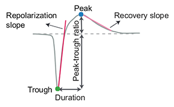

Postprocessing module
=====================

.. _extensions:

After spike sorting, we can use the :py:mod:`~spikeinterface.postprocessing` module to further post-process
the spike sorting output. Most of the post-processing functions require a
:py:class:`~spikeinterface.core.SortingAnalyzer` as input.

.. _waveform_extensions:

Extensions as AnalyzerExtensions
--------------------------------

There are several postprocessing tools available, and all of them are implemented as a
:py:class:`~spikeinterface.core.ResultExtension`. If the :code:`SortingAnalyzer` is saved to disk, all computations on
top of it will be saved alongside the :code:`SortingAnalyzer` itself (sub folder, zarr path or sub dict).
This workflow is convenient for retrieval of time-consuming computations (such as pca or spike amplitudes) when reloading a
:code:`SortingAnalyzer`.

:py:class:`~spikeinterface.core.ResultExtension` objects are tightly connected to the
parent :code:`SortingAnalyzer` object, so that operations done on the :code:`SortingAnalyzer`, such as saving,
loading, or selecting units, will be automatically applied to all extensions.

To check what extensions have already been calculated for a :code:`SortingAnalyzer` named :code:`sorting_analyzer`, you can use:

.. code-block:: python

    import spikeinterface as si

    available_extension_names = sorting_analyzer.get_loaded_extension_names()
    print(available_extension_names)

.. code-block:: bash

    >>> ["principal_components", "spike_amplitudes"]

In this case, for example, principal components and spike amplitudes have already been computed.
To load the extension object you can run:

.. code-block:: python

    ext = sorting_analyzer.get_extension("spike_amplitudes")
    ext_data = ext.get_data()

Here :code:`ext` is the extension object (in this case the :code:`SpikeAmplitudeCalculator`), and :code:`ext_data` will
contain the actual amplitude data. Note that different extensions might have different ways to return the extension.
You can use :code:`ext.get_data?` for documentation.

To check what extensions spikeinterface can calculate, you can use the :code:`get_computable_extensions` method.

.. code-block:: python

    all_computable_extensions = sorting_analyzer.get_computable_extensions()
    print(all_computable_extensions)

.. code-block:: bash

    >>> ['random_spikes', 'waveforms', 'templates', 'noise_levels', 'amplitude_scalings', 'correlograms', 'isi_histograms', 'principal_components', 'spike_amplitudes', 'spike_locations', 'template_metrics', 'template_similarity', 'unit_locations', 'quality_metrics']

There is detailed documentation about each extension :ref:`below<modules/postprocessing:Available postprocessing extensions>`.
Each extension comes from a different module. To use the :code:`postprocessing` extensions, you'll need to have the `postprocessing`
module loaded.

Some extensions depend on another extension. For instance, you can only calculate `principal_components` if you've already calculated
both `random_spikes` and `waveforms`. We say that `principal_components` is a child of the other two or that is *depends* on the other
two. Other extensions, like `isi_histograms`, don't depend on anything. It has no children and no parents. The parent/child
relationships of all the extensions currently defined in spikeinterface can be found in this diagram:

If you try to calculate a child before calculating a parent, an error will be thrown. Further, when a parent is recalculated we delete
its children. Why? Consider calculating :code:`principal_components`. This depends on random selection of spikes chosen
during the computation of :code:`random_spikes`. If you recalculate the random spikes, a different selection will be chosen and your
:code:`principal_components` will change (a little bit). Hence your principal components are inconsistent with the random spikes. To
avoid this inconsistency, we delete the children.

We can also delete an extension ourselves:

.. code-block:: python

    sorting_analyzer.delete_extension("spike_amplitudes")

This does *not* delete the children of the extension, since there are some cases where you might want to delete e.g. the (large)
waveforms but keep the (smaller) postprocessing outputs.

Computing extensions
--------------------

To compute extensions we can use the :code:`compute` method. There are several ways to pass parameters so we'll go through them here,
focusing on the :code:`principal_components` extension. Here's one way to compute
the principal components of a :code:`SortingAnalyzer` object called :code:`sorting_analyzer` with default parameters:

.. code-block:: python

    sorting_analyzer.compute("principal_components")

In this simple case you can alternatively use :code:`compute_principal_components(sorting_analyzer)`, which matches legacy syntax.
You can also compute several extensions at the same time by passing a list:

.. code-block:: python

    sorting_analyzer.compute(["principal_components", "templates"])

You might want to change the parameters. Two parameters of principal_components are :code:`n_components` and :code:`mode`.
We can choose these as follows:

.. code-block:: python

    sorting_analyzer.compute("principal_components", n_components=3, mode="by_channel_local")

As your code gets more complicated it might be easier to store your calculation in a dictionary, especially if you're calculating more
than one thing:

.. code-block:: python

    compute_dict = {
        'principal_components': {'n_components': 3, 'mode': 'by_channel_local'},
        'templates': {'operators': ["average"]}
    }
    sorting_analyzer.compute(compute_dict)

There are also hybrid options, which can be helpful if you're mostly using default parameters:

.. code-block:: python

    # here `templates` will be calculated using default parameters.
    extension_params = {
        'principal_components': {'n_components': 3, 'mode': 'by_channel_local'},
    }
    sorting_analyzer.compute(
        ["principal_components", "templates"],
        extension_params=extension_params
    )

Extensions are generally saved in two ways, suitable for two workflows:

1. When the sorting analyzer is stored in memory, the extensions are only saved when the :code:`.save_as` method is called.
   This saves the sorting analyzer and all it's extensions in their current state. This is useful when trying out different
   parameters and initially setting up your pipeline.
2. When the sorting analyzer is stored on disk the extensions are, by default, saved when they are calculated. You calculate
   extensions without saving them by specifying :code:`save=False` as a :code:`compute` argument. (e.g.
   :code:`sorting_analyzer.compute('waveforms', save=False)`).

**NOTE**: We recommend choosing a workflow and sticking with it. Either keep everything on disk or keep everything in memory until
you'd like to save. A mixture can lead to unexpected behavior. For example, consider the following code

.. code::

    sorting_analyzer = create_sorting_analyzer(
        sorting=sorting,
        recording=recording,
        format="memory",
    )

    sorting_analyzer.save_as(folder="my_sorting_analyzer")
    sorting_analyzer.compute("random_spikes", save=True)

Here the random_spikes extension is **not** saved. The :code:`sorting_analyzer` is **still** saved in memory. The :code:`save_as` method only made a snapshot
of the sorting analyzer which is saved in a folder. Hence :code:`compute` doesn't know about the folder
and doesn't save anything. If we wanted to save the extension we should have started with a non-memory sorting analyzer:

.. code::

    sorting_analyzer = create_sorting_analyzer(
        sorting=sorting,
        recording=recording,
        format="binary_folder",
        folder="my_sorting_analyzer"
    )

    sorting_analyzer.compute("random_spikes", save=True)

Available postprocessing extensions
-----------------------------------

noise_levels
^^^^^^^^^^^^

This extension computes the noise level of each channel using the median absolute deviation.
As an extension, this expects the :code:`Recording` as input and the computed values are persistent on disk.

.. code-block:: python

    noise = compute_noise_level(recording=recording)

principal_components
^^^^^^^^^^^^^^^^^^^^

This extension computes the principal components of the waveforms. There are several modes available:

* "by_channel_local" (default): fits one PCA model for each by_channel
* "by_channel_global": fits the same PCA model to all channels (also termed temporal PCA)
* "concatenated": concatenates all channels and fits a PCA model on the concatenated data

If the input :code:`SortingAnalyzer` is sparse, the sparsity is used when computing the PCA.
For dense waveforms, sparsity can also be passed as an argument.

.. code-block:: python

    pc = sorting_analyzer.compute(input="principal_components",
                             n_components=3,
                             mode="by_channel_local")

For more information, see :py:func:`~spikeinterface.postprocessing.compute_principal_components`

template_similarity
^^^^^^^^^^^^^^^^^^^

This extension computes the similarity of the templates to each other. This information could be used for automatic
merging. Currently, the only available similarity method is the cosine similarity, which is the angle between the
high-dimensional flattened template arrays. Note that cosine similarity does not take into account amplitude differences
and is not well suited for high-density probes.

.. code-block:: python

    similarity = sorting_analyzer.compute(input="template_similarity", method='cosine_similarity')

For more information, see :py:func:`~spikeinterface.postprocessing.compute_template_similarity`

spike_amplitudes
^^^^^^^^^^^^^^^^

This extension computes the amplitude of each spike as the value of the traces on the extremum channel at the times of
each spike.

**NOTE:** computing spike amplitudes is highly recommended before calculating amplitude-based quality metrics, such as
:ref:`amp_cutoff` and :ref:`amp_median`.

.. code-block:: python

    amplitudes = sorting_analyzer.compute(input="spike_amplitudes",
                             peak_sign="neg",
                             outputs="concatenated")

For more information, see :py:func:`~spikeinterface.postprocessing.compute_spike_amplitudes`

spike_locations
^^^^^^^^^^^^^^^

This extension estimates the location of each spike in the sorting output. Spike location estimates can be done
with center of mass (:code:`method="center_of_mass"` - fast, but less accurate), a monopolar triangulation
(:code:`method="monopolar_triangulation"` - slow, but more accurate), or with the method of grid convolution
(:code:`method="grid_convolution"`)

**NOTE:** computing spike locations is required to compute :ref:`drift_metrics`.

.. code-block:: python

    spike_locations = sorting_analyzer.compute(input="spike_locations",
                             ms_before=0.5,
                             ms_after=0.5,
                             spike_retriever_kwargs=dict(
                                channel_from_template=True,
                                radius_um=50,
                                peak_sign="neg"
                                              ),
                             method="center_of_mass")

For more information, see :py:func:`~spikeinterface.postprocessing.compute_spike_locations`

unit_locations
^^^^^^^^^^^^^^

This extension is similar to the :code:`spike_locations`, but instead of estimating a location for each spike
based on individual waveforms, it calculates at the unit level using templates. The same localization methods
(:code:`method="center_of_mass" | "monopolar_triangulation" | "grid_convolution"`) are available.

.. code-block:: python

    unit_locations = sorting_analyzer.compute(input="unit_locations", method="monopolar_triangulation")

For more information, see :py:func:`~spikeinterface.postprocessing.compute_unit_locations`

template_metrics
^^^^^^^^^^^^^^^^

This extension computes commonly used waveform/template metrics.
By default, the following metrics are computed:

* "peak_to_valley": duration in :math:`s` between negative and positive peaks
* "halfwidth": duration in :math:`s` at 50% of the amplitude
* "peak_to_trough_ratio": ratio between negative and positive peaks
* "recovery_slope": speed to recover from the negative peak to 0
* "repolarization_slope": speed to repolarize from the positive peak to 0
* "num_positive_peaks": the number of positive peaks
* "num_negative_peaks": the number of negative peaks

The units of :code:`recovery_slope` and :code:`repolarization_slope` depend on the
input. Voltages are based on the units of the template. By default this is :math:`\mu V`
but can be the raw output from the recording device (this depends on the
:code:`return_scaled` parameter, read more here: :ref:`modules/core:SortingAnalyzer`).
Distances are in :math:`\mu m` and times are in seconds. So, for example, if the
templates are in units of :math:`\mu V` then: :code:`repolarization_slope` is in
:math:`mV / s`; :code:`peak_to_trough_ratio` is in :math:`\mu m` and the
:code:`halfwidth` is in :math:`s`.

Optionally, the following multi-channel metrics can be computed by setting:
:code:`include_multi_channel_metrics=True`

* "velocity_above": the velocity in :math:`\mu m/s` above the max channel of the template
* "velocity_below": the velocity in :math:`\mu m/s` below the max channel of the template
* "exp_decay": the exponential decay in :math:`\mu m` of the template amplitude over distance
* "spread": the spread in :math:`\mu m` of the template amplitude over distance

    Visualization of template metrics. Image from `ecephys_spike_sorting <https://github.com/AllenInstitute/ecephys_spike_sorting/tree/v0.2/ecephys_spike_sorting/modules/mean_waveforms>`_
    from the Allen Institute.

For more information, see :py:func:`~spikeinterface.postprocessing.compute_template_metrics`

correlograms
^^^^^^^^^^^^

This extension computes correlograms (both auto- and cross-) for spike trains. The computed output is a 3d array
with shape (num_units, num_units, num_bins) with all correlograms for each pair of units (diagonals are auto-correlograms).

.. code-block:: python

    ccg = sorting_analyzer.compute(input="correlograms",
                            window_ms=50.0,
                            bin_ms=1.0,
                            method="auto")

For more information, see :py:func:`~spikeinterface.postprocessing.compute_correlograms`

isi_histograms
^^^^^^^^^^^^^^

This extension computes the histograms of inter-spike-intervals. The computed output is a 2d array with shape
(num_units, num_bins), with the isi histogram of each unit.

.. code-block:: python

   isi =  sorting_analyer.compute(input="isi_histograms"
                            window_ms=50.0,
                            bin_ms=1.0,
                            method="auto")

For more information, see :py:func:`~spikeinterface.postprocessing.compute_isi_histograms`

Other postprocessing tools
--------------------------

align_sorting
^^^^^^^^^^^^^

This function aligns the spike trains :code:`BaseSorting` object using pre-computed shifts of misaligned templates.
To compute shifts, one can use the :py:func:`~spikeinterface.core.get_template_extremum_channel_peak_shift` function.

For more information, see :py:func:`~spikeinterface.postprocessing.align_sorting`
