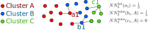

Nearest Neighbor Metrics (:code:`nn_hit_rate`, :code:`nn_miss_rate`, :code:`nn_isolation`, :code:`nn_noise_overlap`)
====================================================================================================================

Calculation
-----------

There are several implementations of nearest neighbor metrics which can be used to evaluate unit quality.

When calling the :code:`compute_quality_metrics()` function, the following options are available to calculate NN metrics:

- The :code:`nearest_neighbor` option will return :code:`nn_hit_rate` and :code:`nn_miss_rate` (based on [Siegle]_ inspired by [Chung]_).
- The :code:`nn_isolation` option will return the nearest neighbor isolation metric (adapted from [Chung]_).
- The :code:`nn_noise_overlap` option will return the nearest neighbor isolation metric (adapted from [Chung]_).

All options involve non-parametric calculations in PCA space.

:code:`nearest_neighbor`
------------------------

Consider the set of all spikes :math:`S` and a unit :math:`A,` (where :math:`A` is a subset of :math:`S`) with
spikes :math:`a_i \in A`. Each spike has a principal component project, which is a vector.
We can use these vectors to compute the Euclidean distance on :math:`S`. The :math:`k` nearest
neighbors to a spike :math:`a_i` are the :math:`k` spikes closest to it with respect to this distance.

We can define a hit rate and miss rate of a spike based on the notion of nearest neighbors. The hit rate tells us
how many of :math:`a_i` s nearby neighbors are also in :math:`A`, rather than :math:`\neg A`. It is defined as

.. math::
    NN^{\textrm{hit}}_k(a_i) = \frac{1}{k}(\text{number of } k^{\text{th} } \text{ nearest neighbors of } a_i \text{ in } A )

Then the hit rate of a unit is then

.. math::
    NN^{\textrm{hit}}_k(A) = \sum_{a_i \in A} NN^{\textrm{hit}}_k(a_i)

To compute the miss rate of :math:`A`, consider the spikes :math:`b_j` which are *not* in :math:`A`. The miss rate
measure the number of these whose nearby neighbors *are* in :math:`A`. It is defined as

.. math::
    NN^{\textrm{miss}}_k(b_j,A) = \frac{1}{k}(\text{number of } k^{\text{th} } \text{ nearest neighbors of } b_j \text{ in } A )

This can be written in terms of all the other units :math:`B, C, ...` as

.. math::
    &NN^{\textrm{miss}}_k(A) = \sum_{b \in \neg A} NN^{\textrm{miss}}_k(b,A) \\
    &= \sum_{b_j \in B} NN^{\textrm{miss}}_k(b_j, A) + \sum_{c_l \in C} NN^{\textrm{miss}}_k(c_l, A) + \ldots

A visualisation of the hit and miss rates for individual spikes is shown below

:code:`nn_isolation`
--------------------

The pairwise isolation score between two units :math:`A` and :math:`B` is a measurement of how well
separated they are. It can be written in terms of the hit rates, although here we only consider
:math:`A\cup B` rather than the space of all spikes. It is then defined as

.. math::
    NN^\textrm{isolation}_k(A,B) = \sum_{x \in A\cup B} NN^{\textrm{hit}}_k(x)

The isolation of a unit :math:`A` is then given by the worst (minimum) pairwise isolation score:

.. math::
    NN^\textrm{isolation}_k(A) = \min_{B \in \text{all other units}} NN^\textrm{isolation}_k(A,B)

If the number of spikes in each unit are uneven, the metric can give misleading results. Hence we randomly
sample the spikes in each unit so that :math:`|A| = |B| = \text{min}(|A|,|B|, \text{max_spikes})`.

:code:`nn_noise_overlap`
------------------------

A noise cluster :math:`C` is generated by randomly sampling voltage snippets from the recording.
Following a similar procedure to that of the nn_isolation method, compute isolation between the
cluster of interest :math:`A` and the generated noise cluster.
noise overlap is then :math:`1 - NN^{\textrm{isolation}}_k(A,C)`.

This metric gives an indication of the contamination present in the unit cluster.

References
----------

.. autofunction:: spikeinterface.qualitymetrics.pca_metrics.nearest_neighbors_metrics

.. autofunction:: spikeinterface.qualitymetrics.pca_metrics.nearest_neighbors_isolation

.. autofunction:: spikeinterface.qualitymetrics.pca_metrics.nearest_neighbors_noise_overlap

Literature
----------

Introduced by [Chung]_ and adapted by [Siegle]_ and Kyu Hyun Lee.
