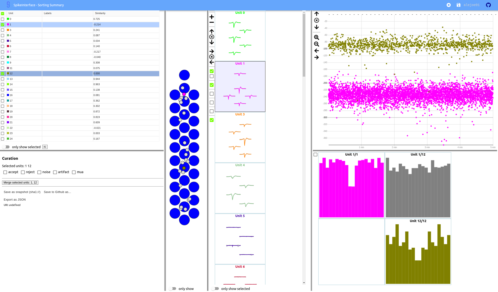

.. _modulewidgets:

Widgets module
==============

The :py:mod:`spikeinterface.widgets` module includes plotting function to visualize recordings,
sortings, waveforms, and more.

Since version 0.95.0, the :py:mod:`spikeinterface.widgets` module supports multiple backends:

* | :code:`matplotlib`: static rendering using the `matplotlib <https://matplotlib.org/>`_ package
* | :code:`ipywidgets`: interactive rendering within a jupyter notebook using the
  | `ipywidgets <https://ipywidgets.readthedocs.io/en/stable/>`_ package
* | :code:`sortingview`: web-based and interactive rendering using the `sortingview <https://github.com/magland/sortingview>`_
  | and `FIGURL <https://github.com/flatironinstitute/figurl>`_ packages.

Version 0.99.0 also comes with this new backend:

* :code:`ephyviewer`: interactive Qt based using the `ephyviewer <https://ephyviewer.readthedocs.io/en/latest/>`_ package

Installing backends
-------------------

The backends are loaded at run-time and can be installed separately. Alternatively, all dependencies from all
backends can be installed with:

.. code-block:: bash

   pip install spikeinterface[widgets]

Install matplotlib
^^^^^^^^^^^^^^^^^^

The :code:`matplotlib` backend (default) uses the :code:`matplotlib` package to generate static figures.

To install it, run:

.. code-block:: bash

   pip install matplotlib

Install ipywidgets
^^^^^^^^^^^^^^^^^^

The :code:`ipywidgets` backend allows users to interact with the plot, for example, by selecting units or
scrolling through a time series.

To install it, run:

.. code-block:: bash

    pip install matplotlib ipympl ipywidgets

To enable interactive widgets in your notebook, add and run a cell with:

.. code-block:: python

    %matplotlib widget

.. _sorting_view:

Install sortingview
^^^^^^^^^^^^^^^^^^^

The :code:`sortingview` backend generates web-based and shareable links that can be viewed in the browser.

To install it, run:

.. code-block:: bash

    pip install sortingview

Internally, the processed data to be rendered are uploaded to a public bucket in the cloud, so that they
can be visualized via the web (if :code:`generate_url=True`).
When running in a Jupyter notebook or JupyterLab, the sortingview widget will also be rendered in the
notebook!

To set up the backend, you need to authenticate to `kachery-cloud` using your GitHub account by running
the following command (you will be prompted with a link):

.. code-block:: bash

    kachery-cloud-init

Finally, if you wish to set up another cloud provider, follow the instruction from the
`kachery-cloud <https://github.com/flatironinstitute/kachery-cloud>`_ package ("Using your own storage bucket").

Install ephyviewer
^^^^^^^^^^^^^^^^^^

This backend is Qt based with PyQt5, PyQt6 or PySide6 support. Qt is sometimes tedious to install.

For a pip-based installation, run:

.. code-block:: bash

    pip install PySide6 ephyviewer

Anaconda users will have a better experience with this:

.. code-block:: bash

    conda install pyqt=5
    pip install ephyviewer

Usage
-----

You can specify which backend to use with the :code:`backend` argument. In addition, each backend
comes with specific arguments that can be set when calling the plotting function.

A default backend for a SpikeInterface session can be set with the
:py:func:`~spikeinterface.widgets.set_default_plotter_backend` function:

.. code-block:: python

    # matplotlib backend
    set_default_plotter_backend(backend="ipywidgets")
    print(get_default_plotter_backend())
    # >>> "ipywidgets"

All :code:`plot_*` functions return a :code:`BackendPlotter` instance.
Different backend-specific plotters can expose different attributes. For example, the :code:`matplotlib`
plotter has the :code:`figure`, :code:`ax`, and :code:`axes` (for multi-axes plots) attributes to enable further
customization.

matplotlib
^^^^^^^^^^

The :code:`plot_*(..., backend="matplotlib")` functions come with the following additional (and optional) arguments:

* :code:`figure`: Matplotlib figure. When None, it is created. Default None
* :code:`ax`: Single matplotlib axis. When None, it is created. Default None
* :code:`axes`: Multiple matplotlib axes. When None, they are created. Default None
* :code:`ncols`: Number of columns to create in subplots.  Default 5
* :code:`figsize`: Size of matplotlib figure. Default None
* :code:`figtitle`: The figure title. Default None

.. code-block:: python

    # matplotlib backend
    w = plot_traces(recording=recording, backend="matplotlib")

**Output:**

ipywidgets
^^^^^^^^^^

The :code:`plot_*(..., backend="ipywidgets")` functions are only available in Jupyter notebooks or JupyterLab after
calling the :code:`%matplotlib widget` magic line.
Each function has the following additional arguments:

  * :code:`width_cm`: Width of the figure in cm (default 10)
  * :code:`height_cm`: Height of the figure in cm (default 6)
  * :code:`display`: If True, widgets are immediately displayed

.. code-block:: python

    from spikeinterface.preprocessing import common_reference

    # ipywidgets backend also supports multiple "layers" for plot_traces
    rec_dict = dict(filt=recording, cmr=common_reference(recording))
    w = sw.plot_traces(recording=rec_dict, backend="ipywidgets")

**Output:**

sortingview
^^^^^^^^^^^

The :code:`plot_*(..., backend="sortingview")` generate web-based GUIs, which are also shareable with a link (provided
that :code:`kachery-cloud` is correctly setup, see :ref:`sorting_view`).
The functions have the following additional arguments:

  * :code:`generate_url`: If True, the figurl URL is generated and printed. Default True
  * :code:`display`: If True and in jupyter notebook/lab, the widget is displayed in the cell. Default True
  * :code:`figlabel`: The figurl figure label. Default None
  * :code:`height`: The height of the sortingview View in jupyter. Default None

.. code-block:: python

    # sortingview backend
    w_ts = sw.plot_traces(recording=recording, backend="sortingview")
    w_ss = sw.plot_sorting_summary(sorting_analyzer=sorting_analyzer, curation=True, backend="sortingview")

**Output:**

* `plot_traces link <https://figurl.org/f?v=gs://figurl/spikesortingview-10&d=sha1://6016ab466ee53facc5eb62de080c57f9b547ba92&label=SpikeInterface%20-%20Timeseries>`_

* `Sorting summary link <https://figurl.org/f?v=gs://figurl/spikesortingview-10&d=sha1://458bffa5e4e1cf68faee84e34eb7752d2785df2d&label=SpikeInterface%20-%20Sorting%20Summary>`_

The :code:`sortingview` plotter allows one to combine multiple :code:`View`s using the :code:`sortingview` API.
For example, here is how to combine the timeseries and sorting summary generated above in multiple tabs:

.. code-block:: python

    import sortingview.views as vv

    v_ts = w_ts.view
    v_ss = w_ss.ciew

    v_summary = vv.TabLayout(
                    items=[
                        vv.TabLayoutItem(
                            label='Timeseries',
                            view=v_ts
                        ),
                        vv.TabLayoutItem(
                            label='Sorting Summary',
                            view=v_ss
                        )
                    ]
                )
    # generate URL
    url = v_summary.url(label="Example multiple tabs")
    print(url)

ephyviewer
^^^^^^^^^^

The :code:`ephyviewer` backend is currently only available for the :py:func:`~spikeinterface.widgets.plot_traces()` function.

.. code-block:: python

    plot_traces(recording=recording, backend="ephyviewer", mode="line", show_channel_ids=True)

Available plotting functions
----------------------------

* :py:func:`~spikeinterface.widgets.plot_agreement_matrix` (backends: :code:`matplotlib`)
* :py:func:`~spikeinterface.widgets.plot_all_amplitudes_distributions` (backends: :code:`matplotlib`)
* :py:func:`~spikeinterface.widgets.plot_amplitudes` (backends: :code:`matplotlib`, :code:`ipywidgets`, :code:`sortingview`)
* :py:func:`~spikeinterface.widgets.plot_autocorrelograms` (backends: :code:`matplotlib`, :code:`sortingview`)
* :py:func:`~spikeinterface.widgets.plot_confusion_matrix` (backends: :code:`matplotlib`)
* :py:func:`~spikeinterface.widgets.plot_comparison_collision_by_similarity` (backends: :code:`matplotlib`)
* :py:func:`~spikeinterface.widgets.plot_crosscorrelograms` (backends: :code:`matplotlib`, :code:`sortingview`)
* :py:func:`~spikeinterface.widgets.plot_isi_distribution` (backends: :code:`matplotlib`)
* :py:func:`~spikeinterface.widgets.plot_motion` (backends: :code:`matplotlib`)
* :py:func:`~spikeinterface.widgets.plot_multicomparison_agreement` (backends: :code:`matplotlib`)
* :py:func:`~spikeinterface.widgets.plot_multicomparison_agreement_by_sorter` (backends: :code:`matplotlib`)
* :py:func:`~spikeinterface.widgets.plot_multicomparison_graph` (backends: :code:`matplotlib`)
* :py:func:`~spikeinterface.widgets.plot_peak_activity` (backends: :code:`matplotlib`)
* :py:func:`~spikeinterface.widgets.plot_probe_map` (backends: :code:`matplotlib`)
* :py:func:`~spikeinterface.widgets.plot_quality_metrics` (backends: :code:`matplotlib`, :code:`ipywidgets`, :code:`sortingview`)
* :py:func:`~spikeinterface.widgets.plot_rasters` (backends: :code:`matplotlib`)
* :py:func:`~spikeinterface.widgets.plot_sorting_summary` (backends: :code:`sortingview`)
* :py:func:`~spikeinterface.widgets.plot_spike_locations` (backends: :code:`matplotlib`, :code:`ipywidgets`)
* :py:func:`~spikeinterface.widgets.plot_spikes_on_traces` (backends: :code:`matplotlib`, :code:`ipywidgets`)
* :py:func:`~spikeinterface.widgets.plot_template_metrics` (backends: :code:`matplotlib`, :code:`ipywidgets`, :code:`sortingview`)
* :py:func:`~spikeinterface.widgets.plot_template_similarity` (backends: ::code:`matplotlib`, :code:`sortingview`)
* :py:func:`~spikeinterface.widgets.plot_traces` (backends: :code:`matplotlib`, :code:`ipywidgets`, :code:`sortingview`, :code:`ephyviewer`)
* :py:func:`~spikeinterface.widgets.plot_unit_depths` (backends: :code:`matplotlib`)
* :py:func:`~spikeinterface.widgets.plot_unit_locations` (backends: :code:`matplotlib`, :code:`ipywidgets`, :code:`sortingview`)
* :py:func:`~spikeinterface.widgets.plot_unit_presence` (backends: :code:`matplotlib`)
* :py:func:`~spikeinterface.widgets.plot_unit_probe_map` (backends: :code:`matplotlib`)
* :py:func:`~spikeinterface.widgets.plot_unit_summary` (backends: :code:`matplotlib`)
* :py:func:`~spikeinterface.widgets.plot_unit_templates` (backends: :code:`matplotlib`, :code:`ipywidgets`, :code:`sortingview`)
* :py:func:`~spikeinterface.widgets.plot_unit_waveforms_density_map` (backends: :code:`matplotlib`)
* :py:func:`~spikeinterface.widgets.plot_unit_waveforms` (backends: :code:`matplotlib`, :code:`ipywidgets`)
* :py:func:`~spikeinterface.widgets.plot_study_run_times` (backends: :code:`matplotlib`)
* :py:func:`~spikeinterface.widgets.plot_study_unit_counts` (backends: :code:`matplotlib`)
* :py:func:`~spikeinterface.widgets.plot_study_agreement_matrix` (backends: :code:`matplotlib`)
* :py:func:`~spikeinterface.widgets.plot_study_summary` (backends: :code:`matplotlib`)
* :py:func:`~spikeinterface.widgets.plot_study_comparison_collision_by_similarity` (backends: :code:`matplotlib`)
