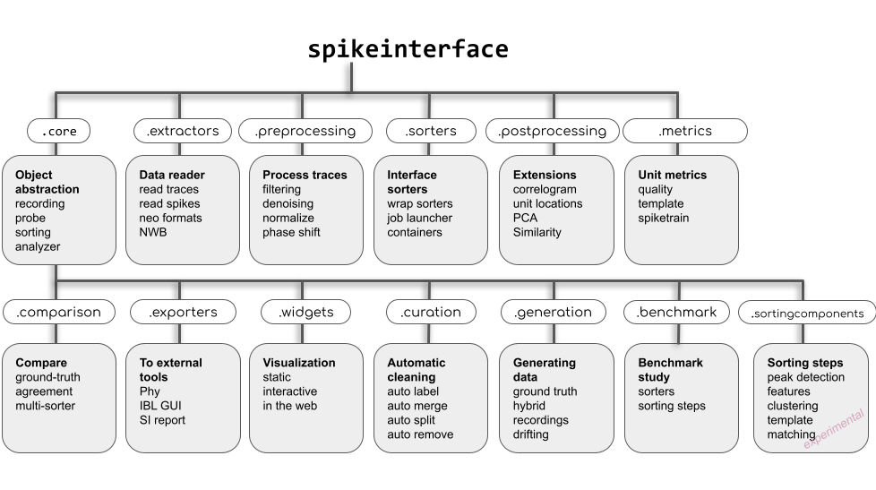

Overview
========

Extracellular recordings are an essential source of data in experimental and clinical neuroscience. 
Of particular interest in these recordings is the activity of single neurons which must be inferred 
using a blind source separation procedure called spike sorting. 

Given the importance of spike sorting, much attention has been directed towards the development of tools 
and algorithms that can increase its performance and automation. These developments, however, introduce new challenges 
in software and file format incompatibility which reduce interoperability, hinder benchmarking, and preclude reproducible analysis.

To address these limitations, we developed **SpikeInterface**, a Python framework designed to unify preexisting spike sorting technologies 
into a single code base and to standardize extracellular data file handling. 

With a few lines of code, users can run, compare, and benchmark most modern spike sorting algorithms; 
pre-process, post-process, and visualize extracellular datasets; validate, curate, and export sorted results; 
and more, regardless of the underlying data format. 

In the following documentation, we provide an overview of SpikeInterface.

Organization
------------

SpikeInterface consists of 5 main packages which encapsulate all steps in a typical spike sorting pipeline:

- `spikeextractors <https://github.com/SpikeInterface/spikeextractors/>`_
- `spiketoolkit <https://github.com/SpikeInterface/spiketoolkit/>`_
- `spikesorters <https://github.com/SpikeInterface/spikesorters/>`_
- `spikecomparison <https://github.com/SpikeInterface/spikecomparison/>`_
- `spikewidgets <https://github.com/SpikeInterface/spikewidgets/>`_

Along with these packages, the :code:`spikeinterface` meta-package allows users to install and
use all 5 packages as shown in the figure.

Related projects
-----------------

- `spikeforest <https://spikeforest.flatironinstitute.org>`_ is a reproducible, continuously updating platform which
  benchmarks the performance of some spike sorting software (kilosort, herdingspike, ironcliust, jrclust, klusta,
  moutainsort4, spykingcircus, tridesclous, waveclus) using many ground-truth datasets. Its processing is based on
  SpikeInterface.
- `spikely <https://github.com/SpikeInterface/spikely>`_ is a graphical user interface (GUI) that allows users to build
  and run SpikeInterface spike sorting pipelines on extracellular datasets.
